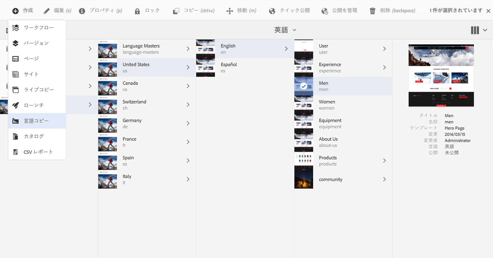
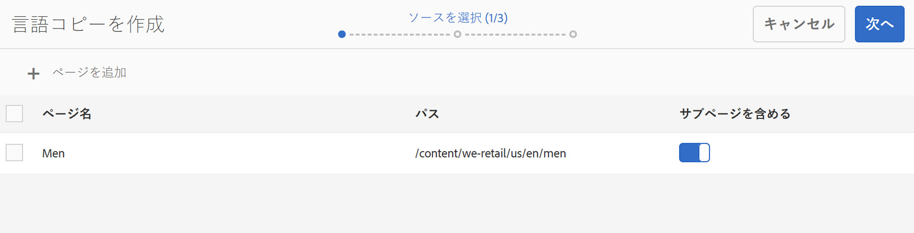
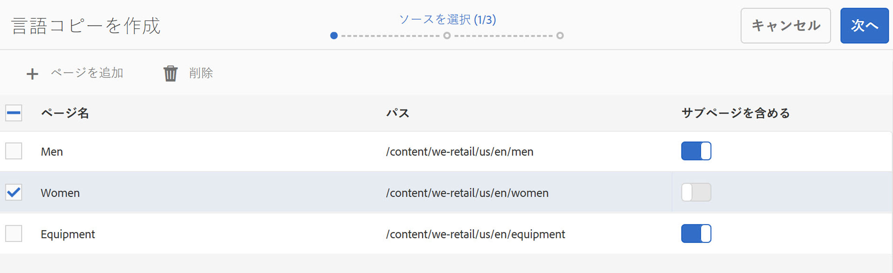
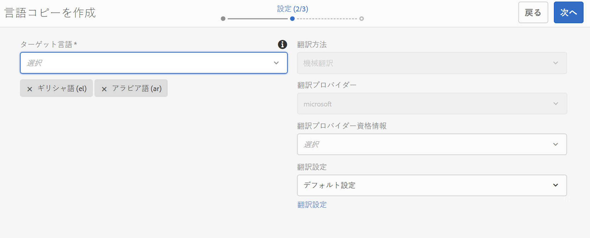
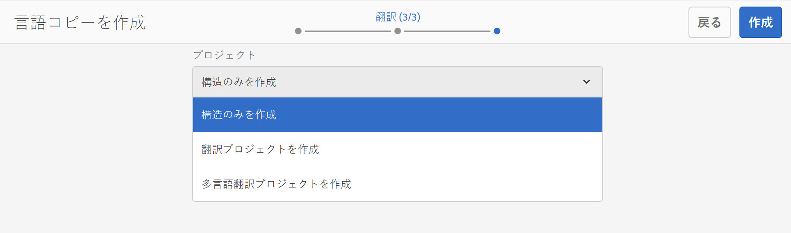
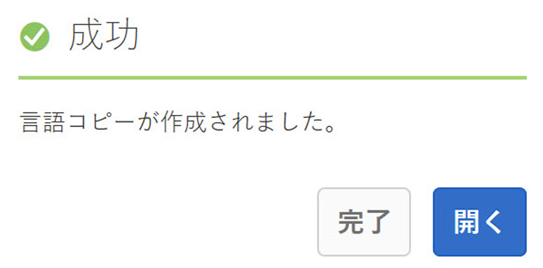

# 言語コピーウィザード{#language-copy-wizard}

>[!CAUTION]
>
>AEM 6.4 の拡張サポートは終了し、このドキュメントは更新されなくなりました。 詳細は、 [技術サポート期間](https://helpx.adobe.com/jp/support/programs/eol-matrix.html). サポートされているバージョンを見つける [ここ](https://experienceleague.adobe.com/docs/?lang=ja).

言語コピーウィザードは、多言語コンテンツ構造を作成および実装するためのガイド付きエクスペリエンスです。 言語コピーを作成する方が、より簡単で迅速になりました。

>[!NOTE]
>
>サイトの言語コピーを作成するには、ユーザーはプロジェクト管理者グループのメンバーである必要があります。

このウィザードにアクセスするには：

1. Sites で、ページを選択し、「作成」をタップまたはクリックします。

   

1. 「言語コピー」を選択すると、ウィザードが開きます。

   

1. この **ソースを選択** ウィザードの手順では、ページを追加または削除できます。 サブページを含めるか除外するオプションもあります。

   

1. 「**次へ**」ボタンをクリックすると、ウィザードの&#x200B;**設定**&#x200B;手順に進みます。ここでは、言語を追加または削除し、翻訳方法を選択できます。

   

   >[!NOTE]
   >
   >デフォルトでは、翻訳設定は 1 つだけです。 他の設定を選択できるようにするには、まずクラウド設定を指定する必要があります。 詳しくは、 [翻訳統合フレームワークの設定](/help/sites-administering/tc-tic.md).

1. 「**次へ**」ボタンをクリックすると、ウィザードの&#x200B;**翻訳**&#x200B;手順に進みます。ここでは、構造のみを作成するか、新しい翻訳プロジェクトを作成するか、既存の翻訳プロジェクトに追加するかを選択できます。

   >[!NOTE]
   >
   >前の手順で複数言語を選択した場合は、複数の翻訳プロジェクトが作成されます。

   

1. **作成**&#x200B;ボタンをクリックすると、ウィザードは終了します。

   
