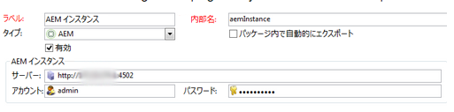

# Adobe Campaign 統合に関するトラブルシューティング{#troubleshooting-your-adobe-campaign-integration}

>[!NOTE]
>
>このページはCampaign Classicに適用されます。

次のトラブルシューティングのヒントは、AEMとAdobe Campaignを統合する際に発生する最も一般的な問題の解決に役立ちます。

## トラブルシューティングに関する一般的なヒント {#general-troubleshooting-tips}

両方の統合で、HTTP 呼び出しが送信されたかどうかを確認できます (AEM/Adobe Campaign/Adobe Campaign/AEM)。

* 統合に失敗する場合は、（ファイアウォール/SSL の問題を回避するために）これらの呼び出しがもう一方に届くことを確認します。
* AEM機能の場合、JSON 呼び出しがAEMオーサーインターフェイスからリクエストされます。これらのエラーは、HTTP-500 エラーの原因になりません。 HTTP 500 のエラーが発生した場合は、`error.log` で詳細を確認してください。
* AEMでキャンペーンクラスのデバッグレベルを上げることも、問題のトラブルシューティングに役立ちます。

## 接続に失敗した場合 {#if-the-connection-fails}

Adobe Campaign で **aemserver** 演算子が設定されていることをチェックします。

## 画像がAdobe Campaignコンソールに表示されない場合 {#if-images-do-not-appear-in-the-adobe-campaign-console}

HTMLソースを確認し、クライアントマシンから URL を開けることを検証します。 URL に localhost:4503 が含まれている場合、オーサーインスタンスの Day CQ Link Externalizer の設定を、Adobe Campaign コンソールマシンから到達できるパブリッシュインスタンスを指すように変更します。

[Externalizer の設定](/help/sites-administering/campaignstandard.md#configuring-the-externalizer) を参照してください。

## AEMからAdobe Campaignに接続できない場合 {#if-you-cannot-connect-from-aem-to-adobe-campaign}

Adobe Campaignで次のエラーメッセージを探します。

`No datasource defined in the instance 'default'.`

`Make sure the DNS alias used to access the server is correct (for example, avoid hard-coded IP addresses). (iRc=16384)`

この問題を修正するには、**$CAMPAIGN_HOME/conf/config-&lt;instance-name>.xml** で次を変更します。

`<dataStore hosts="*" lang="en_GB">`

## Adobe Campaign ダイアログにデータが表示されない場合 {#if-no-data-displays-in-the-adobe-campaign-dialog}

Adobe Campaign で、ポート番号の末尾がスラッシュ（/）で終わらないようにします。



## setlocale について警告が表示される場合 {#if-you-get-a-warning-about-your-setlocale}

Apache HTTPD サービスを開始しており、「`"Warning: setlocale: LC_CTYPE cannot change locale"`」というエラーが表示される場合は、システムに **en_CA.ISO-8859-15 locale** がインストールされていることを確認してください。

`local -a` を使用することで、インストールされているかどうかをチェックできます。インストールされていない場合は、 **/usr/local/neolane/nl6/env.sh** スクリプトを作成し、ロケールをインストール済みのロケールに変更します。

## スクリプト「get_nms_amcGetSeedMetaData_jssp」のコンパイル中にエラーが発生した場合 {#if-you-get-an-error-while-compiling-script-get-nms-amcgetseedmetadata-jssp}

AEMログファイルに次のエラーメッセージが表示される場合：

`com.day.cq.mcm.campaign.impl.CampaignConnectorImpl Internal Adobe Campaign error: response body is Error while compiling script 'get_nms_amcGetSeedMetaData_jssp' line 45: String.prototype.toJSON called on incompatible XML.`

次の回避策を使用します。

1. ファイルを開く **$CAMPAIGN_HOME/datakit/nms/fra/js/amcIntegration.js**
1. メソッド amcGetSeedMetaData の 467 行目を変更します。
1. `label : [inclView.@label](mailto:inclView.@label)` を `label : String([inclView.@label](mailto:inclView.@label))` に変更します。

1. 保存.
1. サーバーを再起動します。

## 「同期」ボタンをクリックしたときにAdobe Campaignでエラーが表示された場合 {#if-adobe-campaign-displays-an-error-when-clicking-the-synchronize-button}

Adobe Campaign Classic で「**同期**」ボタンをクリックすると、次のエラーが表示される場合：

`Error while executing the method ‘aemListContent' of service [nms:delivery](https://nmsdelivery/)`

この問題を修正するには、外部アカウントで設定されたAEM connection-url がマシンから到達可能であることを確認します。

スイッチ **localhost** を IP アドレスに送信することで、この問題が解決しました。

## 「Cannot parse XTK Date+Time &#39;undefined&#39;」エラーが発生した場合 {#if-you-get-a-cannot-parse-xtk-date-time-undefined-error}

「同期」をクリックした後、ページ上のスクリプトが発生したというエラーが表示されます。XTK Date+Time &#39;undefined&#39;を解析できません：有効な XTK 値ではありません。

AEMインスタンス上に古いAdobe Campaign情報が残っている場合に発生します。 AEM上にあるすべての campaign 統合設定を削除して再構築することで、この問題を解決します。 次に、新しいテンプレートを作成します。

## SSL への接続で、Cloud Service の設定時にエラーが表示される場合 {#if-a-connection-to-ssl-displays-an-error-when-setting-up-the-cloud-service}

AEMの error.log で、次の情報が表示されます。

```xml
javax.net.ssl.SSLProtocolException: handshake alert:  unrecognized_name
at sun.security.ssl.ClientHandshaker.handshakeAlert(Unknown Source)
at sun.security.ssl.SSLSocketImpl.recvAlert(Unknown Source)
at sun.security.ssl.SSLSocketImpl.readRecord(Unknown Source)
at sun.security.ssl.SSLSocketImpl.performInitialHandshake(Unknown Source)
at sun.security.ssl.SSLSocketImpl.writeRecord(Unknown Source)
at sun.security.ssl.AppOutputStream.write(Unknown Source)
```

チケットをAdobe Campaignのサポートチームと共に発券してください。

## 同期ダイアログに、予期した https リンクではなく http リンクが表示される場合 {#if-you-see-http-instead-of-an-expected-https-links-in-the-synchronization-dialog}

次の設定を使用します。

* AEM オーサーとの通信に https を使用してホストされたAdobe Campaign
* リバースプロキシが SSL を終了しています
* オンプレミスの AEM オーサーインスタンス

AEMは、Adobe Campaign配信でコンテンツを同期しようとすると、ニュースレターのリストを返します。 ただし、リスト内のニュースレターへの URL は http アドレスです。 リスト内の項目の 1 つを選択すると、エラーが発生します。

この問題を解決するには：

* 元のプロトコルをヘッダーとして渡すように Dispatcher またはリバースプロキシを設定する必要があります。
* OSGi 設定（[https://&lt;host>:&lt;port>/system/console/configMgr](http://localhost:4502/system/console/configMgr)）の *Apache Felix Http Service SSL Filter* をそれぞれのヘッダー設定に合わせて設定する必要があります。[https://felix.apache.org/documentation/subprojects/apache-felix-http-service.html#using-the-ssl-filter](https://felix.apache.org/documentation/subprojects/apache-felix-http-service.html#using-the-ssl-filter) を参照

## 自身で作成したカスタムテンプレートをページのプロパティで選択できない場合 {#if-the-custom-template-i-created-cannot-be-selected-in-page-properties}

Adobe Campaign のメールテンプレートを作成する際には、テンプレートの **jcr:content** ノードにプロパティ **acMapping** と値 **mapRecipient** を指定する必要があります。指定しない場合、AEM の「**ページのプロパティ**」フィールドで Adobe Campaign のテンプレートを選択できなくなります（フィールドが無効化されています）。

## ログに「com.day.cq.mcm.campaign.servlets.util.ParameterMapper」というエラーが発生する場合 {#if-you-get-the-error-com-day-cq-mcm-campaign-servlets-util-parametermapper-in-your-logs}

カスタムテンプレートを使用しているときに、ログに「com.day.cq.mcm.campaign.servlets.util.ParameterMapper」というエラーが発生します。この場合は、[パッケージ共有](/help/sites-administering/package-manager.md#package-share)からフィーチャーパック 6576 をインストールしてください。これは、acMapping プロパティの値が recipient.firstName 以外に設定されている場合に、Adobe Campaign Manager 側で空の値が作成される問題です。
