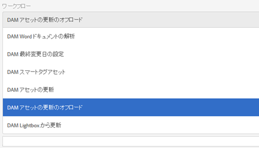

# アセットのワークフローオフローダー{#assets-workflow-offloader}

Assets ワークフローオフローダーを使用すると、Adobe Experience Manager（AEM）Assets の複数のインスタンスを有効にして、プライマリ（リーダー）インスタンスでの処理の負荷を軽減できます。処理の負荷は、リーダーインスタンスとそれに追加する各種オフローダー（ワーカー）インスタンスの間で分散されます。アセットの処理の負荷を分散すると、AEM Assets でのアセット処理の効率と速度が上がります。さらに、特定の MIME タイプのアセットの処理に専用リソースを割り当てやすくなります。例えば、トポロジの特定のノードを InDesign アセットの処理専用として割り当てることができます。

## オフローダートポロジの設定  {#configure-offloader-topology}

設定マネージャーを使用して、リーダーインスタンスのURLと、リーダーインスタンス上の接続要求のオフローダーインスタンスのホスト名を追加します。

1. AEMのロゴをタップまたはクリックし、**ツール** / **操作** / **Webコンソール**&#x200B;を選択してConfiguration Managerを開きます。
1. Webコンソールから、**Sling** / **Topology Management**&#x200B;を選択します。

   

1. トポロジ管理ページで、「**Configure Discovery.Oak Service**」リンクをタップまたはクリックします。

   

1. Discovery Serviceの設定ページの「**Topology Connector URLs**」フィールドで、リーダーインスタンスのコネクタURLを指定します。

   

1. 「**Topology Connector Whitelist**」フィールドで、リーダーインスタンスとの接続が許可されるオフローダーインスタンスのIPアドレスまたはホスト名を指定します。 「**Save**」をタップまたはクリックします。

   

1. リーダーインスタンスに接続されているオフローダーインスタンスを確認するには、**ツール**／**導入**／**トポロジ**&#x200B;で、クラスタービューをタップまたはクリックします。

## オフロードの無効化  {#disable-offloading}

1. AEMのロゴをタップまたはクリックし、**ツール** / **デプロイ** / **オフロード**&#x200B;を選択します。 **オフロードするブラウザー**&#x200B;ページには、トピックと、トピックを使用できるサーバーインスタンスが表示されます。

   

1. AEMアセットをアップロードまたは変更するためにユーザーがやり取りするリーダーインスタンスで、 *com/adobe/granite/workflow/offloading*&#x200B;トピックを無効にします。

   

## リーダーインスタンスでのワークフローランチャーの設定 {#configure-workflow-launchers-on-the-leader-instance}

**Damアセットの更新**&#x200B;ワークフローの代わりに、リーダーインスタンスで&#x200B;**DAMアセットの更新のオフロード**&#x200B;ワークフローを使用するように、ワークフローランチャーを設定します。

1. AEMのロゴをタップまたはクリックし、**ツール** / **ワークフロー** / **ランチャー**&#x200B;を選択して、**ワークフローランチャー**&#x200B;コンソールを開きます。

   

1. イベントタイプ&#x200B;**Node Created**&#x200B;と&#x200B;**Node Modified**&#x200B;の2つのランチャー設定を見つけます。これらはそれぞれ、**DAM Update Asset**&#x200B;ワークフローを実行します。
1. 各設定で、前のチェックボックスを選択し、ツールバーの「**プロパティを表示**」アイコンをタップまたはクリックして、**ランチャーのプロパティ**&#x200B;ダイアログを表示します。

   

1. **ワークフロー**&#x200B;リストから「**DAMアセットの更新のオフロード**」を選択し、「**保存**」をタップまたはクリックします。

   

1. AEMのロゴをタップまたはクリックし、**ツール** / **ワークフロー** / **モデル**&#x200B;を選択して、**ワークフローモデル**&#x200B;ページを開きます。
1. **DAMアセットの更新のオフロード**&#x200B;ワークフローを選択し、ツールバーの「**編集**」をタップまたはクリックして詳細を表示します。

   

1. **DAMワークフローオフロード**&#x200B;ステップのコンテキストメニューを表示し、「**編集**」を選択します。 設定ダイアログの「**汎用引数**」タブで「**ジョブトピック**」フィールドのエントリを確認します。

   

## オフローダーインスタンスのワークフローランチャーを無効にします。 {#disable-the-workflow-launchers-on-the-offloader-instances}

リーダーインスタンスで&#x200B;**DAMアセットの更新**&#x200B;ワークフローを実行するワークフローランチャーを無効にします。

1. AEMのロゴをタップまたはクリックし、**ツール** / **ワークフロー** / **ランチャー**&#x200B;を選択して、**ワークフローランチャー**&#x200B;コンソールを開きます。

   

1. イベントタイプ&#x200B;**Node Created**&#x200B;と&#x200B;**Node Modified**&#x200B;の2つのランチャー設定を見つけます。これらはそれぞれ、**DAM Update Asset**&#x200B;ワークフローを実行します。
1. 各設定で、前のチェックボックスを選択し、ツールバーの「**プロパティを表示**」アイコンをタップまたはクリックして、**ランチャーのプロパティ**&#x200B;ダイアログを表示します。

   

1. 「**アクティブ化**」セクションで、スライダーをドラッグしてワークフローランチャーを無効にし、「**保存**」をタップまたはクリックして無効にします。

   

1. 画像タイプのアセットをリーダーインスタンスにアップロードします。 オフロードされたインスタンスによってアセットに対して生成され、移植されたサムネールを確認します。
