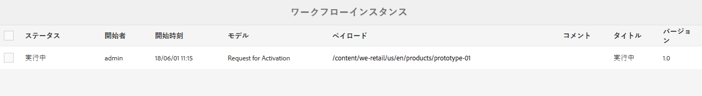
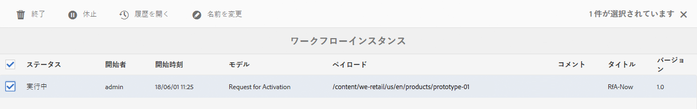
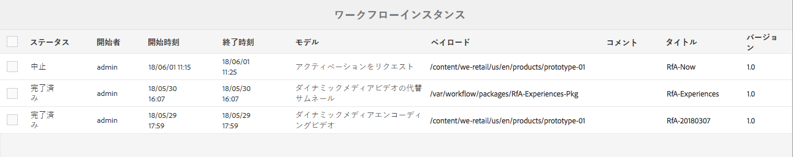
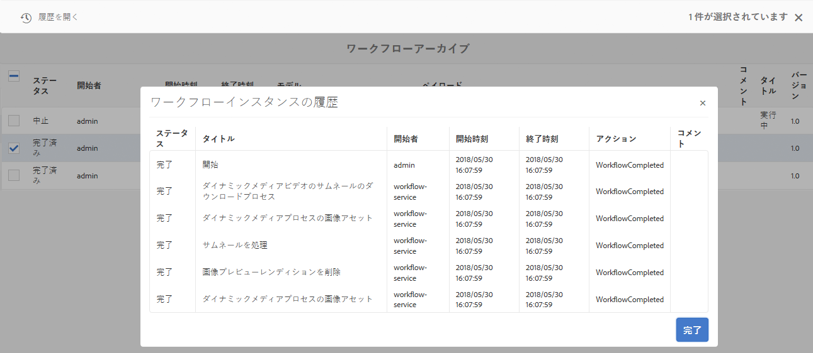
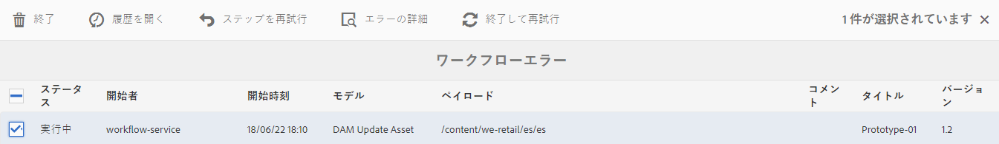

# ワークフローインスタンスの管理{#administering-workflow-instances}

>[!CAUTION]
>
>AEM 6.4 の拡張サポートは終了し、このドキュメントは更新されなくなりました。 詳細は、 [技術サポート期間](https://helpx.adobe.com/jp/support/programs/eol-matrix.html). サポートされているバージョンを見つける [ここ](https://experienceleague.adobe.com/docs/?lang=ja).

ワークフローコンソールには、ワークフローインスタンスを管理し、それらが想定どおりに実行されていることを確認するための複数のツールが用意されています。

>[!NOTE]
>
>[JMX コンソール](/help/sites-administering/jmx-console.md#workflow-maintenance)を使用すると、追加のワークフローメンテナンス操作を行うことができます。

ワークフローの管理用に、次の各種コンソールが用意されています。[グローバルナビゲーション](/help/sites-authoring/basic-handling.md#global-navigation)を使用して&#x200B;**ツール**&#x200B;パネルを開き、その後「**ワークフロー**」を選択します。

* **モデル**:ワークフロー定義の管理
* **インスタンス**：実行中のワークフローインスタンスを表示および管理します
* **ランチャー**:ワークフローの起動方法の管理
* **アーカイブ**:正常に完了したワークフローの履歴を表示
* **失敗**:エラーで完了したワークフローの履歴を表示

## ワークフローインスタンスのステータスの監視 {#monitoring-the-status-of-workflow-instances}

1. ナビゲーションを使用して、**ツール**／**ワークフロー**&#x200B;を選択します。
1. 「**インスタンス**」を選択して現在進行中のワークフローインスタンスのリストを表示します。

   

1. 特定の項目を選択し、「**履歴を開く**」で詳細を確認します。

   

## ワークフローインスタンスの休止、再開および終了 {#suspending-resuming-and-terminating-a-workflow-instance}

1. ナビゲーションを使用して、**ツール**／**ワークフロー**&#x200B;を選択します。
1. 「**インスタンス**」を選択して現在進行中のワークフローインスタンスのリストを表示します。

   

1. 特定の項目を選択してから、適宜「**終了**」、「**休止**」、または「**再開**」を使用します。この際、確認または詳細（あるいはその両方）を求められます。

   

## アーカイブされたワークフローの表示 {#viewing-archived-workflows}

1. ナビゲーションを使用して、**ツール**／**ワークフロー**&#x200B;を選択します。
1. 「**アーカイブ**」を選択して正常に完了したワークフローインスタンスのリストを表示します。

   

   >[!NOTE]
   >
   >abort ステータスは、ユーザーの操作の結果として発生するので、正常終了と見なされます。例：
   >
   >* 使用 **終了** アクション
   >* ワークフローの対象となるページが（強制的に）削除されたことによって、ワークフローが終了した場合

1. 特定の項目を選択し、「**履歴を開く**」で詳細を確認します。

   

## ワークフローインスタンスのエラーの修正 {#fixing-workflow-instance-failures}

ワークフローが失敗した場合、AEM の&#x200B;**エラー**&#x200B;コンソールを使用してエラーの原因を調べ、特定された原因に応じて適切なアクションを取ることができます。

* **失敗の詳細**：ウィンドウを開き、 
**失敗メッセージ**、 **ステップ**、 **失敗スタック**&#x200B;を表示します。

* **履歴を開く**&#x200B;ワークフローの履歴の詳細を表示します。

* **ステップを再試行**&#x200B;スクリプトステップコンポーネントのインスタンスをもう一度実行します。元のエラーの原因を修正した後に、「ステップを再試行」コマンドを使用します。 例えば、プロセスステップが実行するスクリプトのバグを修正した後にステップを再試行します。
* **終了** エラーが原因で解決できない問題がワークフローに発生した場合にワークフローを終了します。例えば、ワークフローインスタンスで無効になった環境条件（リポジトリ内の情報など）にワークフローが依存している可能性がある場合などです。
* **終了して再試行**&#x200B;元のペイロード、タイトルおよび説明を使用して新しいワークフローインスタンスが開始される点を除き、**終了**&#x200B;と同様です。

エラーを調査し、その後ワークフローを再開または停止するには、次のステップに従います。

1. ナビゲーションを使用して、**ツール**／**ワークフロー**&#x200B;を選択します。
1. 選択 **失敗** ：正常に完了しなかったワークフローインスタンスのリストを表示します。
1. 特定の項目を選択し、適切なアクションを選択します。

   

## ワークフローインスタンスの定期的なパージ {#regular-purging-of-workflow-instances}

ワークフローインスタンスの数を最小限に抑えるとワークフローエンジンのパフォーマンスが向上します。このため、完了したまたは実行中のワークフローインスタンスをリポジトリーから定期的に削除できます。

設定 **AdobeGranite のワークフローのパージ設定** 」をクリックして、年齢とステータスに従ってワークフローインスタンスをパージします。 また、すべてのモデルまたは特定のモデルのワークフローインスタンスをパージすることもできます。

また、サービスの複数の設定を作成して、異なる条件を満たすワークフローインスタンスをパージすることもできます。 例えば、特定のワークフローモデルが予想より長く実行されている場合に、そのインスタンスをパージする設定を作成します。 さらに、リポジトリーのサイズを最小限に抑えるために、特定の日数が経過した後に完了したワークフローをすべてパージするもう 1 つの設定を作成します。

 サービスを設定するには、[Web コンソール](/help/sites-deploying/configuring-osgi.md#osgi-configuration-with-the-web-console)を使用するか、[リポジトリに OSGi 設定を追加](/help/sites-deploying/configuring-osgi.md#osgi-configuration-in-the-repository)します。次の表では、どちらの方法でも必要になるプロパティについて説明しています。

>[!NOTE]
>
>リポジトリーに設定を追加する場合のサービス PID は次のとおりです。
>
>`com.adobe.granite.workflow.purge.Scheduler`
>
>このサービスはファクトリサービスなので、`sling:OsgiConfig` ノードの名前には次のような ID サフィックスが必要です。
>
>`com.adobe.granite.workflow.purge.Scheduler-myidentifier`

<table> 
 <tbody> 
  <tr> 
   <th>プロパティ名（Web コンソール）</th> 
   <th>OSGi プロパティ名</th> 
   <th>説明</th> 
  </tr> 
  <tr> 
   <td>ジョブ名</td> 
   <td>scheduledpurge.name</td> 
   <td>スケジュールされたパージのわかりやすい名前。</td> 
  </tr> 
  <tr> 
   <td>ワークフローのステータス</td> 
   <td>scheduledpurge.workflowStatus</td> 
   <td>
パージするワークフローインスタンスのステータス。 有効な値は次のとおりです。
 
    <ul> 
     <li>完了：完了したワークフローインスタンスはパージされます。</li> 
     <li>実行中：実行中のワークフローインスタンスはパージされます。</li> 
    </ul> </td> 
  </tr> 
  <tr> 
   <td>パージするモデル</td> 
   <td>scheduledpurge.modelIds</td> 
   <td>
パージするワークフローモデルの ID。この ID はモデルノードのパスです（例：  /conf/global/settings/workflow/models/dam/update_asset/jcr:content/model ）。すべてのワークフローモデルのインスタンスをパージする場合は、値を指定しません。
 
複数のモデルを指定するには、Web コンソールの + ボタンをクリックします。 
 </td> 
  </tr> 
  <tr> 
   <td>ワークフローの期間</td> 
   <td>scheduledpurge.daysold</td> 
   <td>パージするワークフローインスタンスの経過期間（日数）。</td> 
  </tr> 
 </tbody> 
</table>

## インボックスの最大サイズの設定 {#setting-the-maximum-size-of-the-inbox}

インボックスの最大サイズは、[Web コンソール](/help/sites-deploying/configuring-osgi.md#osgi-configuration-with-the-web-console)を使用して **Adobe Granite Workflow Service** を設定する、または[リポジトリに OSGi 設定を追加](/help/sites-deploying/configuring-osgi.md#osgi-configuration-in-the-repository)することで設定できます。次の表では、どちらの方法でも設定するプロパティについて説明しています。

>[!NOTE]
>
>リポジトリーに設定を追加する場合のサービス PID は次のとおりです。
>
>`com.adobe.granite.workflow.core.WorkflowSessionFactory`。

| プロパティ名（Web コンソール） | OSGi プロパティ名 |
|---|---|
| インボックスクエリの最大サイズ | granite.workflow.inboxQuerySize |
