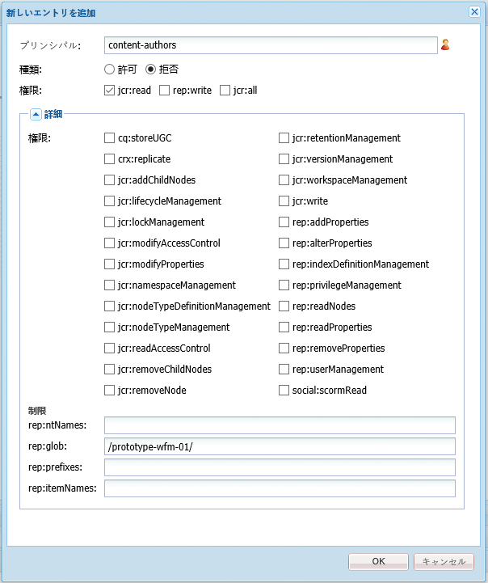
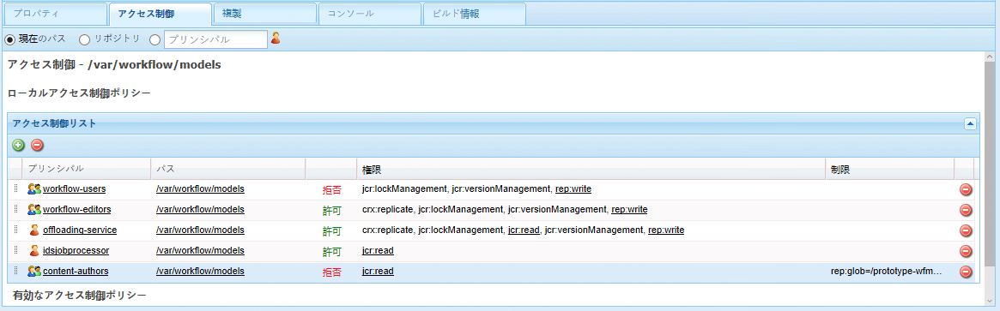
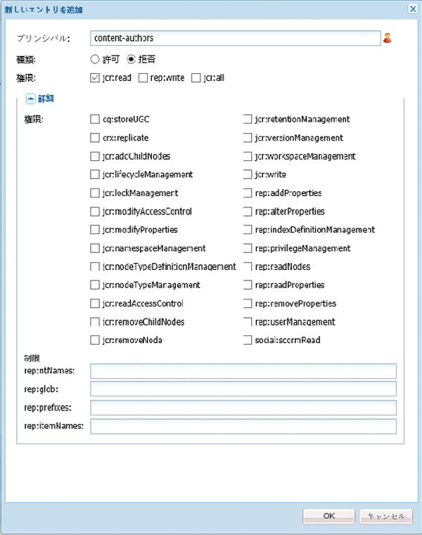
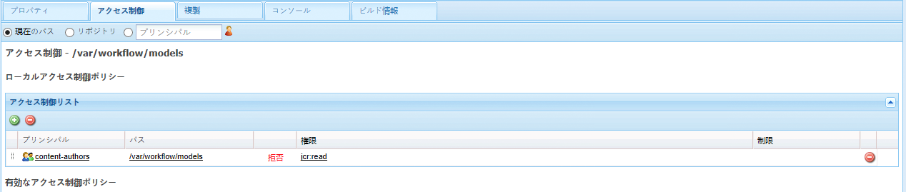

# ワークフローへのアクセスの管理{#managing-access-to-workflows}

>[!CAUTION]
>
>AEM 6.4 の拡張サポートは終了し、このドキュメントは更新されなくなりました。 詳細は、 [技術サポート期間](https://helpx.adobe.com/jp/support/programs/eol-matrix.html). サポートされているバージョンを見つける [ここ](https://experienceleague.adobe.com/docs/?lang=ja).

ユーザーアカウントに従って ACL を設定し、ワークフローの開始および参加を許可（または無効化）します。

## ワークフローに必須のユーザー権限 {#required-user-permissions-for-workflows}

ワークフローに対するアクションは、次の場合に実行できます。

* `admin` アカウントを使用している。
* アカウントがデフォルトグループ `workflow-users` に割り当てられている。

   * このグループには、ユーザーがワークフローアクションを実行するのに必要なすべての権限が含まれます。
   * このグループに属するアカウントは、自分が開始したワークフローにのみアクセスできます。

* アカウントがデフォルトグループ `workflow-administrators` に割り当てられている。

   * このグループには、権限を持つユーザーがワークフローを監視および管理するために必要なすべての権限が保持されます。
   * アカウントがこのグループに属する場合、すべてのワークフローにアクセスできます。

>[!NOTE]
>
>最小要件を次に示します。 また、特定の手順を実行するには、割り当てられた参加者または割り当てられたグループのメンバーのアカウントを使用する必要があります。

## ワークフローへのアクセスの設定 {#configuring-access-to-workflows}

ワークフローモデルは、ユーザーがワークフローを操作する方法を制御するためのデフォルトのアクセス制御リスト (ACL) を継承します。 ワークフローのユーザーアクセスをカスタマイズするには、リポジトリ内のワークフローモデルノードを含むフォルダーのアクセス制御リスト (ACL) を変更します。

* [特定のワークフローモデル用の ACL の /var/workflow/models への適用](/help/sites-administering/workflows-managing.md#apply-an-acl-for-the-specific-workflow-model-to-var-workflow-models)
* [/var/workflow/models へのサブフォルダーの作成と、それに対する ACL の適用](/help/sites-administering/workflows-managing.md#create-a-subfolder-in-var-workflow-models-and-apply-the-acl-to-that)

>[!NOTE]
>
>ACL の設定にCRXDE Liteを使用する方法については、 [アクセス権の管理](/help/sites-administering/user-group-ac-admin.md#access-right-management).

### 特定のワークフローモデル用の ACL の /var/workflow/models への適用 {#apply-an-acl-for-the-specific-workflow-model-to-var-workflow-models}

ワークフローモデルが `/var/workflow/models` 内に保存されている場合、（そのワークフローにのみ関連する）特定の ACL をフォルダーに割り当てることができます。

1. Web ブラウザーで CRXDE Lite を開きます（例：[http://localhost:4502/crx/de](http://localhost:4502/crx/de)）。
1. ノードツリーで、ワークフローモデルフォルダーのノードを選択します。

   `/var/workflow/models`

1. 「**アクセス制御**」タブをクリックします。
1. 内 **ローカルアクセス制御ポリシー** (**アクセス制御リスト**)」テーブルで、プラスアイコンをクリックして、 **エントリを追加**.
1. 内 **新しいエントリの追加** ダイアログ次のプロパティを持つ新しい ACE を追加します。

   * **プリンシパル**：`content-authors`
   * **型**：`Deny`
   * **権限**：`jcr:read`
   * **rep:glob**： 特定のワークフローへの参照

   

   **アクセス制御リスト**&#x200B;テーブルには、`content-authors` ワークフローモデルに対する `prototype-wfm-01` の制限が含まれるようになりました。

   

1. 「**すべて保存**」をクリックします。

   `prototype-wfm-01` グループのメンバーが `content-authors` ワークフローを使用できなくなります。

### /var/workflow/models へのサブフォルダーの作成と、それに対する ACL の適用 {#create-a-subfolder-in-var-workflow-models-and-apply-the-acl-to-that}

お使いの [開発チームは、サブフォルダー内にワークフローを作成できます](/help/sites-developing/workflows-models.md#creating-a-new-workflow) /

`/var/workflow/models`

次に保存された DAM ワークフローに相当します。

`/var/workflow/models/dam/`

その後、ACL をフォルダー自体に追加できます。

1. Web ブラウザーで CRXDE Lite を開きます（例：[http://localhost:4502/crx/de](http://localhost:4502/crx/de)）。
1. ノードツリーで、ワークフローモデルフォルダー内の個々のフォルダーのノードを選択します。例：

   `/var/workflow/models/prototypes`

1. 「**アクセス制御**」タブをクリックします。
1. 「**ローカルアクセス制御ポリシー**」のテーブルで、プラスアイコンをクリックしてエントリを&#x200B;**追加**&#x200B;します。
1. 内 **ローカルアクセス制御ポリシー** (**アクセス制御リスト**)」テーブルで、プラスアイコンをクリックして、 **エントリを追加**.
1. 内 **新しいエントリの追加** ダイアログ次のプロパティを持つ新しい ACE を追加します。

   * **プリンシパル**：`content-authors`
   * **型**：`Deny`
   * **権限**：`jcr:read`

   >[!NOTE]
   >
   >[特定のワークフローモデル用の ACL の /var/workflow/models への適用](/help/sites-administering/workflows-managing.md#apply-an-acl-for-the-specific-workflow-model-to-var-workflow-models)にあるように、rep:glob を指定して、特定のワークフローに対するアクセスを制限できます。

   

   **アクセス制御リスト**&#x200B;テーブルに、`prototypes` フォルダーに対する `content-authors` の制限が含まれるようになりました。

   

1. 「**すべて保存**」をクリックします。

   `content-authors` グループのメンバーが `prototypes` フォルダーのモデルを使用できなくなります。
