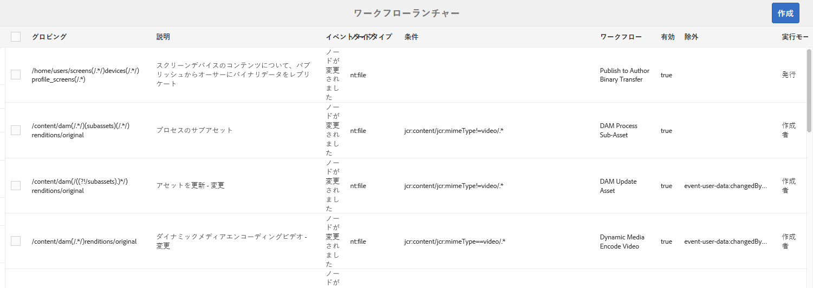
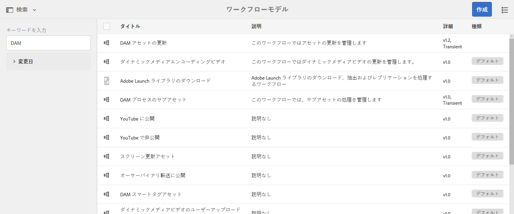
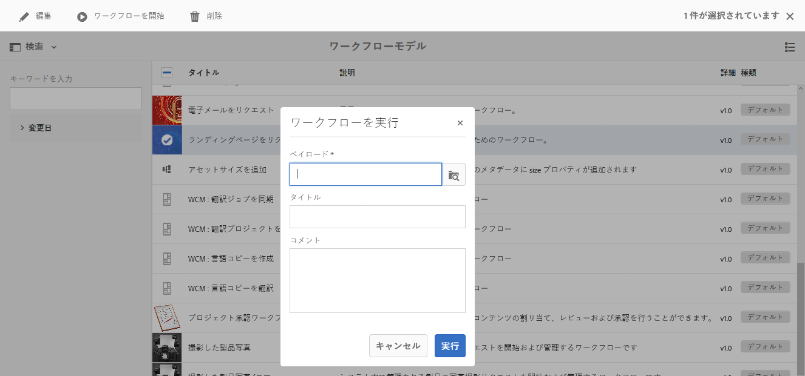
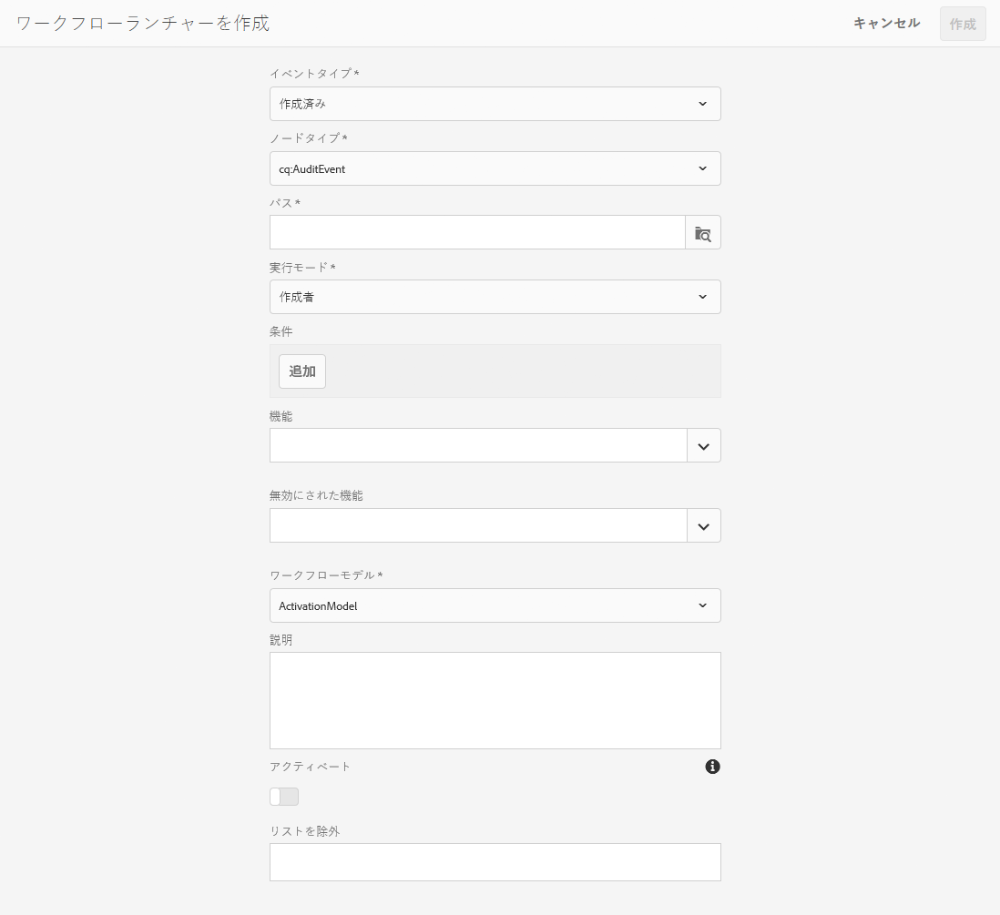

# ワークフローの開始{#starting-workflows}

ワークフローを管理しているとき、ワークフローは様々な方法で開始できます。

* 手動：

   * [ワークフローモデル](#workflow-models)から。
   * [バッチ処理](#workflow-packages-for-batch-processing)用のワークフローパッケージを使用して。

* 自動：

   * [ランチャーを使用](#workflows-launchers)してノードの変更に応答して。

>[!NOTE]
>
>作成者はその他の方法も使用できます。詳しくは、次を参照してください。
>
>* [ページへのワークフローの適用](/help/sites-authoring/workflows-applying.md)
>* [DAM アセットにワークフローを適用する方法](/help/assets/assets-workflow.md)
>* [AEM Forms](https://helpx.adobe.com/jp/aem-forms/6-2/aem-workflows-submit-process-form.html)
>* [翻訳プロジェクト](/help/sites-administering/tc-manage.md)

>

## ワークフローモデル {#workflow-models}

ワークフローモデルコンソールにリストされている[モデルの 1 つに基づいて](/help/sites-administering/workflows.md#workflow-models-and-instances)ワークフローを開始できます。必須の情報はペイロードのみですが、タイトルやコメントも同様に追加できます。

## ワークフローランチャー {#workflows-launchers}

ワークフローランチャーはコンテンツリポジトリ内の変更を監視し、変更されたノードの場所とリソースの種類に応じて、ワークフローを起動します。

の使用 **ランチャー** 次の操作を実行できます。

* 特定のノードに対して既に起動されているワークフローを確認する。
* 特定のノードまたはノードの種類が変更されたときに起動するワークフローを選択する。
* 既存のワークフローとノード間の関係を削除する。

ランチャーは任意のノードに対して作成できます。ただし、特定のノードに変更した場合、ワークフローは起動されません。次のパス以下のノードに変更した場合、ワークフローは起動されません。

* `/var/workflow/instances`
* ワークフローインボックスノードは、 `/home/users` 分岐
* `/tmp`
* `/var/audit`
* `/var/classes`
* `/var/eventing`
* `/var/linkchecker`
* `/var/mobile`
* `/var/statistics`

   * 例外：以下のノードの変更 `/var/statistics/tracking` *do* ワークフローが起動する原因となります。

標準インストールには、様々な定義が含まれています。それらの定義は、デジタル資産管理およびソーシャルコラボレーションのタスクに対して使用されます。

## バッチ処理用のワークフローパッケージ {#workflow-packages-for-batch-processing}

ワークフローパッケージは、処理のペイロードとしてワークフローに渡すことができるパッケージで、複数のリソースを処理できます。

ワークフローパッケージの特徴は次のとおりです。

* 一連のリソース（ページ、アセットなど）へのリンクが含まれます。
* 作成日、パッケージの作成者、簡単な説明など、パッケージの情報が保持されます。
* 特別なページテンプレートを使用して定義されます。このようなページでは、ユーザーがパッケージのリソースを指定できます。
* 複数回使用できます。
* ワークフローインスタンスの実行中にユーザーが変更できます（リソースを追加または削除できます）。

## モデルコンソールからのワークフローの開始 {#starting-a-workflow-from-the-models-console}

1. 次に移動： **モデル** コンソールを使用 **ツール**, **ワークフロー**&#x200B;を、 **モデル**.
1. （コンソールの表示に従って）ワークフローを選択します。必要に応じて、検索機能（左上）を使用することもできます。

   

   >[!NOTE]
   >
   >この **[一時的](/help/sites-developing/workflows.md#transient-workflows)** インジケーターは、ワークフロー履歴が保持されないワークフローを示します。

1. 選択 **ワークフローを開始** をクリックします。
1. ワークフローを実行ダイアログが開き、次の内容を指定できます。

   * **ペイロード**

      これには、ページ、ノード、アセット、パッケージなどのリソースを指定できます。

   * **タイトル**

      このインスタンスを識別するのに役立つオプションのタイトル。

   * **コメント**

      このインスタンスの詳細を示すのに役立つオプションのコメント。
   

## ランチャー設定の作成 {#creating-a-launcher-configuration}

1. 次に移動： **ワークフローランチャー** コンソールを使用 **ツール**, **ワークフロー**&#x200B;を、 **ランチャー**.
1. 選択 **作成**&#x200B;を、 **ランチャーを追加** ダイアログを開くには：

   

   * **イベントタイプ**

      ワークフローを起動するイベントタイプ：

      * 作成日
      * 変更済み
      * 削除
   * **Notetype**

      ワークフローランチャーが適用されるノードのタイプ。

   * **パス**

      ワークフローランチャーを適用するパス。

   * **実行モード**

      ワークフローランチャーが適用されるサーバーの種類。 選択 **作成者**, **公開**&#x200B;または **オーサーとパブリッシュ**.

   * **条件**

      ノード値の条件のリスト。評価の際に、ワークフローが起動するかどうかを決定します。 例えば、次の条件では、ノードの 1 つのプロパティ名に「ユーザー」という値が含まれる場合、ワークフローが起動されます。

      name==User

   * **機能**

      有効にする機能のリスト。 ドロップダウンセレクターを使用して、必要な機能を選択します。

   * **無効にされた機能**

   無効にする機能のリスト。 ドロップダウンセレクターを使用して、必要な機能を選択します。

   * **ワークフローモデル**

      Event Type が、定義された Condition の Nodetype または Path で発生したときに開始するワークフロー。

   * **説明**

      ランチャー設定を説明し、識別するための独自のテキスト。

   * **アクティベート**

      ワークフローランチャーをアクティブにするかどうかを制御します。

      * 設定プロパティが満たされた場合にワークフローを起動するには、「**有効にする**」を選択します。
      * （設定プロパティが満たされた場合でも）ワークフローを実行しないときは、「**無効にする**」を選択します。
   * **リストを除外**

      ワークフローをトリガーするかどうかを決定する際に除外する（無視する）JCR イベントを指定します。

      このランチャープロパティは、項目のコンマ区切りリストです。&quot;

      * `property-name` 次を無視 `jcr` 指定したプロパティ名でトリガーされたイベント。&quot;
      * `event-user-data:<*someValue*>` は、 `*<someValue*`> `user-data` ～を通る [`ObservationManager` API](https://www.adobe.io/experience-manager/reference-materials/spec/jsr170/javadocs/jcr-2.0/javax/jcr/observation/ObservationManager.html#setUserData(java.lang.String.

      次に例を示します。

      `jcr:lastModified,dc:modified,dc:format,jcr:lastModifiedBy,imageMap,event-user-data:changedByWorkflowProcess`

      この機能を使用して、除外項目を追加することで、別のワークフロープロセスによってトリガーされた変更を無視することができます。

      `event-user-data:changedByWorkflowProcess`

1. 選択 **作成**&#x200B;をクリックし、ランチャーを作成してコンソールに戻ります。

   該当するイベントが発生すると、ランチャーが実行されてワークフローが開始します。

## ランチャー設定の管理 {#managing-a-launcher-configuration}

ランチャー設定を作成したら、同じコンソールを使用してインスタンスを選択し、次に、 **プロパティを表示** （および編集）または **削除**.
