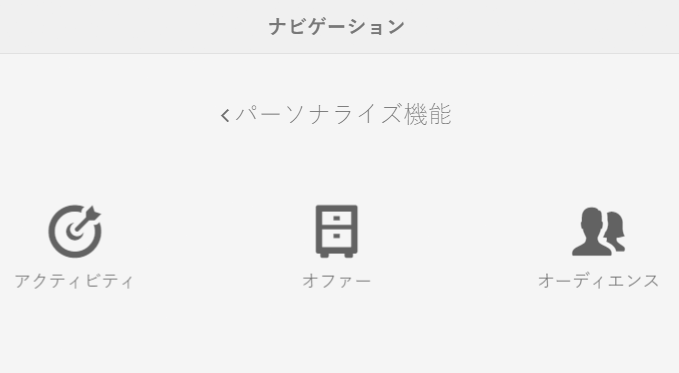
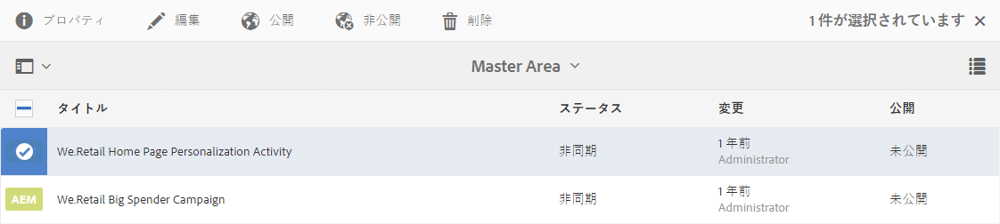
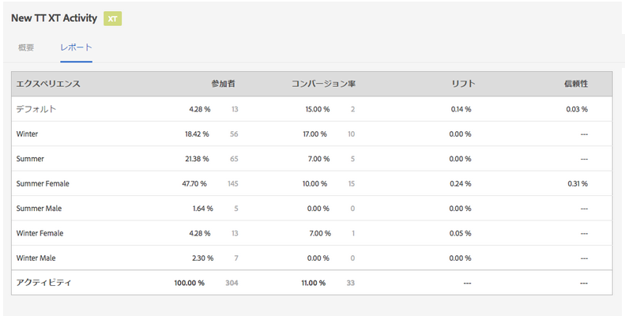
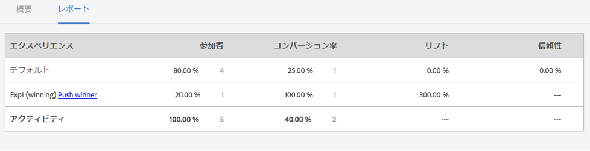
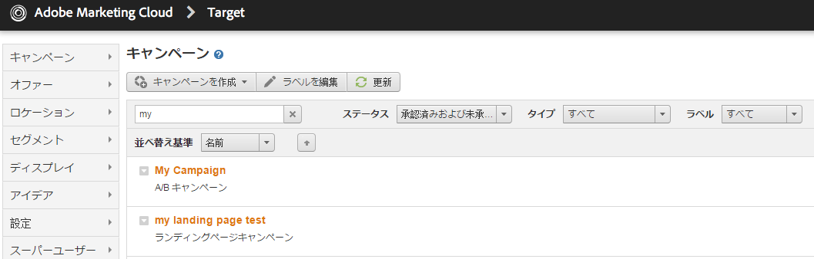

# アクティビティの管理 {#managing-activities}

>[!CAUTION]
>
>AEM 6.4 の拡張サポートは終了し、このドキュメントは更新されなくなりました。 詳細は、 [技術サポート期間](https://helpx.adobe.com/jp/support/programs/eol-matrix.html). サポートされているバージョンを見つける [ここ](https://experienceleague.adobe.com/docs/?lang=ja).

アクティビティコンソールでは、ブランドのマーケティング[アクティビティ](/help/sites-authoring/personalization.md#activities)を作成、整理、管理できます。次のことができます。

* ブランドの追加。
* ブランドごとのアクティビティの追加と設定
* アクティビティの管理 

>[!NOTE]
>
>Adobe Targetをターゲティングエンジンとして使用している場合は、 [アクティビティのパフォーマンスデータの表示](#viewing-performance-and-converting-winning-experiences-a-b-test). A/B テストを使用している場合は、 [勝者を採用する](#viewing-performance-and-converting-winning-experiences-a-b-test).

アクティビティコンソールでは、アクティビティはブランド別に整理されます。 ブランドとフォルダーを使用して、アクティビティの組織を構築できます。 アクティビティコンソールに移動するには、 **パーソナライズ** をタップまたはクリック **アクティビティ**.

アクティビティはターゲット設定モードで[ターゲットコンテンツのオーサリング](/help/sites-authoring/content-targeting-touch.md)に使用できます。その際には、アクティビティを作成することもできます。ターゲット設定モードで作成したアクティビティは、アクティビティコンソールに表示されます。

アクティビティは、定義されているアクティビティの種類を示すラベルと共に表示されます。

* XT - Adobe Targetエクスペリエンスのターゲット設定
* A/B - Adobe Target A/B テスト
* AEM - Adobe Experience Managerのターゲット設定（contexthub または clientcontext に基づく）

>[!NOTE]
>
>使用可能なアクティビティの種類は、次のオプションによって決まります。
>
>* この **xt_only** オプションが、Adobe Targetへの接続にAEM側で使用されるAdobe Targetテナント (clientcode) で有効になっている場合、 **のみ** AEMの XT アクティビティ。
>
>* この **xt_only** オプション： **not** Adobe Targetテナント (clientcode) で有効にした場合、 **両方** AEMの XT および A/B アクティビティ。
>
>**追加の注意：** **xt_only** オプションは、特定の Target テナント (clientcode) に適用される設定で、Adobe Targetでのみ直接変更できます。 このオプションは AEM で有効および無効にすることはできません。

>[!CAUTION]
>
>アクティビティ設定ノードを保護する必要があります **cq:ActivitySettings** 通常のユーザーがアクセスできないように、パブリッシュインスタンス上で実行します。 アクティビティ設定ノードには、Adobe Target へのアクティビティの同期を処理するサービスのみがアクセスできるようにしてください。
>
>詳しくは、 [Adobe Targetとの統合の前提条件](/help/sites-administering/target-requirements.md) を参照してください。

## アクティビティコンソールを使用したブランドの作成 {#creating-a-brand-using-the-activities-console}

マーケティングアクティビティを管理するブランドを作成します。

アクティビティコンソールを使用してブランドを作成すると、そのブランドが[オファーコンソール](/help/sites-authoring/offerlib.md)にも表示されます。オファーコンソールでは、アクティビティのエクスペリエンス用のオファーを作成できます。

1. ナビゲーションコンソールで、「**パーソナライズ機能**」をクリックまたはタップします。クリックまたはタップ **アクティビティ**.

   

1. アクティビティコンソールで、「 」をクリックまたはタップします。 **作成**&#x200B;その後&#x200B;**ブランドを作成**.
1. ブランドテンプレートを選択し、「 」をクリックまたはタップします **次へ**.
1. アクティビティコンソールとオファーコンソールに表示するブランドのタイトルを入力します。 必要に応じて、ブランドに関連付ける 1 つ以上のタグを入力または選択します。
1. 「**作成**」をクリックまたはタップします。ブランドがアクティビティコンソールに表示されます。

## アクティビティコンソールを使用したアクティビティの追加/編集 {#adding-editing-an-activity-using-the-activities-console}

アクティビティを追加するか、既存のアクティビティを編集して、マーケティング活動を特定のオーディエンスに焦点を当てます。 アクティビティを作成または編集する際に、次の情報を指定します。

* **名前：**&#x200B;アクティビティ名。
* **ターゲティングエンジン：**&#x200B;ターゲットコンテンツのエンジンとして、「[AEM](/help/sites-authoring/personalization.md#aem)」または「[Adobe Target](/help/sites-authoring/personalization.md#adobe-target)」。

* **Target 設定を選択：**（Adobe Target のみ）このアクティビティが Adobe Target に接続するために使用するクラウド設定。このオプションは、Adobe Target が「ターゲティングエンジン」として選択されている場合にのみ表示されます。
* **アクティビティタイプ：** アクティビティのタイプ（A/B テストまたはエクスペリエンスのターゲット設定）
* **目的：**（オプション）アクティビティの説明。
* **エクスペリエンス：**&#x200B;オーディエンス名と、ターゲットを設定するマーケティングセグメントのマッピング。
* **トラフィックの割合：** A/B テストを選択した場合、各エクスペリエンスに割り当てるトラフィック量を（パーセント単位で）変更できます。
* **期間：**&#x200B;アクティビティが適用される期間。
* **優先度：**&#x200B;アクティビティの相対的優先度。複数のアクティビティが同じユーザーセグメントにコンテンツを提供する場合、優先度が高いアクティビティが優先されます。
* **目標指標：** Adobe Target をターゲティングエンジンとして選択した場合、成功指標をアクティビティに追加できます。成功指標が 1 つ必要です。

>[!NOTE]
>
>Adobe Target への同期が失敗するので、新しい Adobe Target アクティビティは、**アクティビティ**&#x200B;コンソールではなく、ターゲットコンテンツエディターで&#x200B;**作成**&#x200B;する必要があります。
>
>ただし、コンソールで既存のAdobe Targetアクティビティを編集することはできます。

「 」アクティビティを追加するには：

1. アクティビティを作成するブランドをクリックまたはタップして、「**作成**」、「**アクティビティを作成**」の順にクリックまたはタップします。編集する場合は、アクティビティを選択し、「**編集**」をクリックまたはタップします。
1. 次の情報を入力し、クリックまたはタップします **次へ**:

   * アクティビティの名前。
   * 使用するターゲティングエンジン。 ContextHub(AEM) はデフォルトで選択されています。 Adobe Targetを使用する必要がある場合は、ターゲットコンテンツエディターでアクティビティを作成します。
   * ターゲティングエンジンとしてAdobe Targetを選択した場合は、Adobe Targetへの接続に使用するクラウド設定を選択または編集します。 （クラウド設定用に作成したフレームワークを選択しないように注意してください）。
   * （オプション）アクティビティの目的または説明。
   * 「アクティビティタイプ」を選択します。

1. 1 つ以上のエクスペリエンスをアクティビティに追加します。「**エクスペリエンスを追加**」をクリックまたはタップします。
1. AEMのターゲット設定またはAdobe Targetのエクスペリエンスのターゲット設定を使用している場合：

   1. 「**オーディエンスを選択**」をクリックまたはタップし、エクスペリエンスのターゲットになるセグメントを選択します。
   1. 「**エクスペリエンスを追加**」をクリックまたはタップし、名前を入力し、「**OK**」をクリックまたはタップします。
   1. 「**次へ**」をクリックまたはタップします。

   Adobe Target A/B テストを使用している場合：

   1. オーディエンスボックスの鉛筆アイコンをクリックまたはタップして、オーディエンスを選択します。
   1. 「**エクスペリエンスを追加**」をクリックまたはタップし、名前を入力し、「**OK**」をクリックまたはタップします。
   1. 各エクスペリエンスを表示するトラフィックの割合を入力します。
   1. 「**次へ**」をクリックまたはタップします。

1. アクティビティを開始するタイミングを指定するには、 **開始** ドロップダウンメニューで、次のいずれかの値を選択します。

   * **有効化時：** アクティビティは、ターゲットコンテンツを含むページがアクティベートされたときに開始します。
   * **指定された日時：** 特定の時間。 このオプションを選択した場合は、カレンダーアイコンをクリックまたはタップし、日付を選択して、アクティビティを開始する時刻を指定します。

1. アクティビティが終了するタイミングを指定するには、終了ドロップダウンメニューを使用して、次のいずれかの値を選択します。

   * **無効化時**:ターゲットコンテンツを含むページが非アクティブ化されると、アクティビティは終了します。
   * **指定された日時**:特定の時間。 このオプションを選択した場合は、カレンダーアイコンをクリックまたはタップし、日付を選択して、アクティビティを終了する時間を指定します。

1. アクティビティの優先度を指定するには、スライダーを使用して次のいずれかを選択します。 **低**, **標準**&#x200B;または **高**.
1. Adobe Target をターゲティングエンジンとして使用する場合は、このアクティビティを使用して何を測定するかを選択します。使用可能な成功指標について詳しくは、[アクティビティの設定と目標の設定](/help/sites-authoring/content-targeting-touch.md)を参照してください。1 つ以上の目標を選択する必要があります。
1. クリックまたはタップ **保存**.

   >[!NOTE]
   >
   >アクティビティを作成したら、使用できるように公開する必要があります。

## アクティビティの公開と非公開 {#publishing-and-unpublishing-activities}

アクティビティを使用可能にするには、公開する必要があります。 逆に、アクティビティを非公開にすることで、アクティビティを使用できなくすることができます。

>[!NOTE]
>
>アクティビティを非公開にする場合、ページを更新しない限り、アクティビティのステータスは変更されません。

アクティビティを公開または非公開にするには：

1. ブランドをクリックまたはタップし、公開または非公開にするアクティビティが含まれる領域をクリックまたはタップします。
1. 公開または非公開にするアクティビティの横にあるアイコンをタップまたはクリックします。

   

1. 公開するには、をタップまたはクリックします。 **公開**. 非公開にするには、をタップまたはクリックします **非公開**. アクティビティが公開または非公開になり、アクティビティコンソールでステータスが変更されます（更新が必要な場合があります）。

## オーサーインスタンスとパブリッシュインスタンス上のアクティビティ {#activities-on-author-and-publish-instances}

Adobe Targetのターゲットエンジンを使用するアクティビティがアクティブ化されると、パブリッシュインスタンスに 2 つ目のアクティビティが作成されます。

* オーサーインスタンス上のアクティビティは、オーサーインスタンス上のアクティビティを追跡し、訪問者エクスペリエンスのシミュレーションに役立ちます。 このアクティビティで記録される分析は、オーサーインスタンスで発生した処理のみを反映します。
* パブリッシュインスタンス上のアクティビティは、パブリッシュサーバー上のアクティビティを反映し、応答します。 これは、公開 Web サイト上で実行されるアクティビティです。 実際の公開サイトの使用状況の追跡と分析に関連するのは、公開アクティビティのみです。

## パフォーマンスの表示と勝者エクスペリエンスの採用（A/B テスト） {#viewing-performance-and-converting-winning-experiences-a-b-test}

任意のAdobe Targetアクティビティ（XT または A/B）のパフォーマンスを確認できます。 A/B テストを使用している場合は、勝者エクスペリエンスを変換して、デフォルトエクスペリエンスにすることもできます。

アクティビティのパフォーマンスを表示して成功エクスペリエンスを採用するには：

1. 「**パーソナライズ機能**」で、「**アクティビティ**」をクリックまたはタップして、**アクティビティ**&#x200B;コンソールに移動します。
1. アクティビティを表示するブランドをクリックまたはタップします。
1. アクティビティを選択し、「**プロパティを表示**」をクリックまたはタップして、 **レポート** 「 」タブをクリックし、パフォーマンスを表示または成功エクスペリエンスを採用するアクティビティを選択します。 パフォーマンスデータが表示されます。

   

1. 「****&#x200B;勝者を採用」リンクをクリックまたはタップして、そのエクスペリエンスをデフォルトエクスペリエンスとして採用します。

   勝者を採用すると、次のことが行われます。

   * 現在のアクティビティが無効になります。
   * すべてのページが変更され、ターゲットコンテンツが成功エクスペリエンスの実際のコンテンツで置き換えられます。ターゲット設定を&#x200B;**しなくても**、成功エクスペリエンスのコンテンツが標準ページの一部になります。

   

   勝者エクスペリエンスとは、コンバージョン率に基づいて、レポートでより多くの上昇率を生み出すエクスペリエンスです。

1. クリックまたはタップ **はい** 勝者を採用することを確認するには、現在のエクスペリエンスを無効にして、勝者エクスペリエンスの内容に置き換えます。

## Adobe Targetとのアクティビティの同期 {#synchronizing-activities-with-adobe-target}

Adobe Targetのターゲティングエンジンを使用するアクティビティは、Adobe Targetキャンペーンと同期されます。 次の条件を満たすと、アクティビティはAdobe Targetに自動的に同期されます。

* アクティビティには、少なくとも 1 つのエクスペリエンスが含まれています。
* 1 つ以上のエクスペリエンスに、マッピングされたセグメントと 1 つのオファーが含まれています。
* アクティビティの各エクスペリエンスに同じ数のオファーが必要です。

これらの条件は、オーサーインスタンスとパブリッシュインスタンスのアクティビティに適用されます。

アクティビティを同期すると、対応するキャンペーンがAdobe Targetに作成されます。

* パブリッシュインスタンス上のアクティビティは、対応するAdobe Targetキャンペーンと同じ名前を持ちます。
* オーサーインスタンス上のアクティビティは、対応する Target キャンペーンと同じ名前で `_author` というサフィックスが付く。

_author アクティビティは、アクティビティが変更されるとすぐに同期されます。 即時同期を使用すると、ClientContext または ContextHub を使用したアクティビティのシミュレーションが可能になります。

パブリッシュアクティビティは、アクティビティがAEMパブリッシュインスタンスに公開されると同期されます。

## アクティビティ同期のトラブルシューティング {#troubleshooting-activity-synchronization}

AEM では、アクティビティを Adobe Target と同期するときに、`thirdPartyId` というアクティビティのプロパティを含めます。このプロパティの値は、AEM リポジトリー内のアクティビティのパスに基づいています。Adobe Target 内で、2 つのキャンペーンが `thirdPartyId` プロパティに同じ値を持つことはできません。したがって、Adobe Target 内の（AB、XT という異なるタイプの）既存キャンペーンが `thirdPartyId` に同じ値を使用している場合は、アクティビティの同期が失敗します。

この状況は、次の状況で発生する可能性があります。

1. アクティビティが作成され、Adobe Targetと同期されます。
1. 別のAEMインスタンス上で、同じブランドの下に、同じ名前のアクティビティが作成されます。 試行すると、このアクティビティの同期が失敗します。

この状況は、次の場合にも発生する可能性があります。

1. アクティビティが作成され、Adobe Targetと同期されます。 その後、AEMでアクティビティが削除されます。
1. 同じブランドの下に、削除されたアクティビティと同じ名前を使用して、アクティビティが作成されます。 試行すると、このアクティビティの同期が失敗します。

同期の問題を回避するには、アクティビティに一意の名前を常に使用します。 アクティビティの同期が失敗した場合は、同じ名前を使用しているキャンペーンを Adobe Target で削除できます（そのキャンペーンが使用中でない場合）。

>[!NOTE]
>
>Adobe Target でキャンペーンを作成すると、`thirdPartyId t` というプロパティが各キャンペーンに割り当てられます。Adobe Target でキャンペーンを削除しても、`thirdPartyId` は削除されません。`thirdPartyId` を異なるタイプ（AB、XT）のキャンペーンに再利用することはできません。また、手動で削除することはできません。この問題を回避するには、各キャンペーンに一意の名前を付けてください。そうすれば、キャンペーン名を異なるキャンペーンタイプで再利用できなくなります。
>
>同じキャンペーンタイプで同じ名前を使用する場合は、既存のキャンペーンが上書きされます。
>
>同期中に、「リクエストは失敗しました。`thirdPartyId` は既に存在します」というエラーが表示された場合は、キャンペーン名を変更して再度同期してください。
