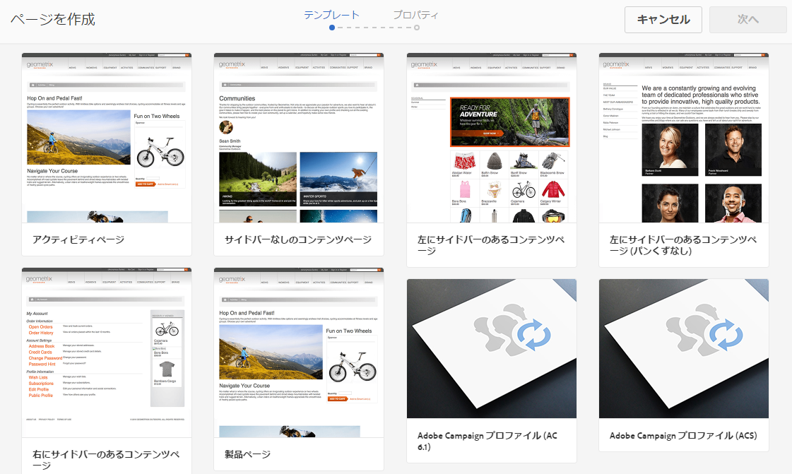
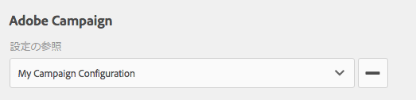
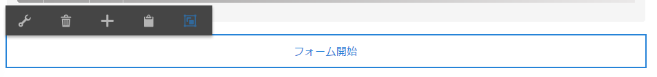
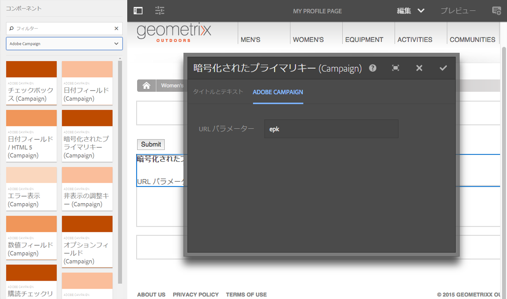
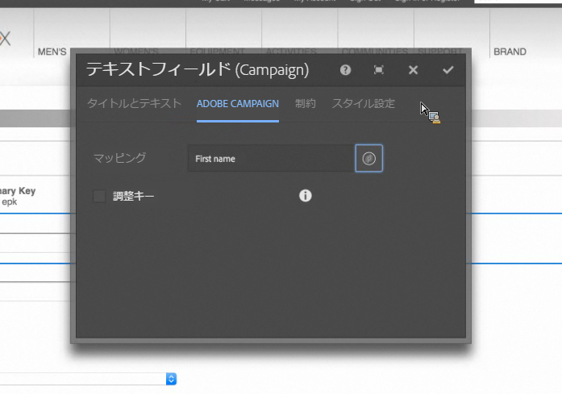

# AEM での Adobe Campaign フォームの作成 {#creating-adobe-campaign-forms-in-aem}

AEM では、Web サイト上で Adobe Campaign と連携するフォームを作成できます。特定のフィールドをフォームに挿入して、Adobe Campaign データベースにマップできます。

新しい連絡先の購読、購読解除、ユーザープロファイルデータを管理しつつ、そのデータを Adobe Campaign データベースに統合できます。

Adobe Campaign フォームを AEM で使用するには、このドキュメントで説明する以下のステップを実行する必要があります。

1. テンプレートを使用可能にします。
1. フォームを作成します。
1. フォームコンテンツを編集します。

デフォルトでは、Adobe Campaign 固有の次の 3 種類のフォームを使用できます。

* プロファイルを保存
* サービスを購読
* サービスの購読を解除

これらのフォームは、Adobe Campaign プロファイルの暗号化されたプライマリキー（EPK）を受け入れる URL パラメーターを定義します。フォームはこの URL パラメーターに基づいて、関連付けられている Adobe Campaign プロファイルのデータを更新します。

一般的な使用事例では、これらのフォームを別々に作成しますが、ニュースレターのコンテンツ内にフォームページへのパーソナライズされたリンクを組み込み、受信者がそのリンクを開いて自分のプロファイルデータを調整（購読解除、購読またはプロファイル更新）できるようにします。

フォームは、ユーザーに基づいて自動的に更新されます。詳しくは、[フォームコンテンツの編集](#editing-form-content)を参照してください。

## テンプレートを使用可能にする {#making-a-template-available}

Adobe Campaign 固有のフォームを作成するには、まず、様々なテンプレートを AEM アプリケーションで使用可能にする必要があります。

これをおこなうには、 [テンプレートドキュメント](/help/sites-developing/templates.md#template-availability).

## フォームの作成 {#creating-a-form}

まず、オーサーインスタンスおよびパブリッシュインスタンスと Adobe Campaign の間の接続が有効なことを確認します。[Adobe Campaign Standard との統合](/help/sites-administering/campaignstandard.md)または [Adobe Campaign Classic との統合](/help/sites-administering/campaignonpremise.md)を参照してください。

>[!NOTE]
>
>Adobe Campaign Classic または Adobe Campaign Standard を使用する場合は、ページの **jcr:content** ノードの **acMapping** プロパティがそれぞれ **mapRecipient** または **profile** に設定されていることを確認してください。

1. AEM の「サイト」で、新しいページを作成する場所に移動します。
1. ページを作成し、「 」を選択します。 **Adobe Campaign Classic Profile**&#x200B;または&#x200B;**Adobe Campaign Standard Profile** をクリックし、 **次へ**.

   

   >[!NOTE]
   >
   >目的のテンプレートが使用できない場合は、 [Template Availability](/help/sites-developing/templates.md#template-availability).

1. 「**名前**」フィールドにページ名を追加します。ページ名は有効な JCR 名である必要があります。
1. 「**タイトル**」フィールドにタイトルを入力し、「**作成**」をクリックします。
1. ページを開き、「**プロパティを開く**」を選択し、「クラウドサービス」で Adobe Campaign 設定を追加し、チェックマークを選択して変更内容を保存します。

   

1. ページ上の&#x200B;**フォーム開始**&#x200B;コンポーネントで、フォームのタイプ（**購読、購読解除**&#x200B;または&#x200B;**プロファイルを保存**）を選択します。選択できるタイプはフォームごとに 1 つだけです。次の操作を実行できます。 [フォームのコンテンツを編集する](#editing-form-content).

## フォームコンテンツの編集 {#editing-form-content}

Adobe Campaign 専用のフォームには、固有のコンポーネントがあります。これらのコンポーネントでは、フォームの各フィールドを Adobe Campaign データベースのフィールドにリンクすることができます。

>[!NOTE]
>
>目的のテンプレートが使用できない場合は、 [テンプレートを使用可能にする](/help/sites-authoring/adobe-campaign.md).

このセクションでは、Adobe Campaign へのリンクのみを取り上げます。Adobe Experience Managerでのフォームの使用方法の概要について詳しくは、 [編集モードコンポーネント](/help/sites-authoring/default-components-foundation.md).

1. 「**プロパティを開く**」を選択し、「クラウドサービス」で Adobe Campaign 設定を追加し、チェックマークを選択して変更内容を保存します。

   

1. ページの **フォーム開始** コンポーネントで、設定アイコンをクリックします。

   

1. 次をクリック： **詳細** タブをクリックし、次の形式のタイプを選択します。 **購読、購読解除、** または **プロファイルを保存** をクリックし、 **はい。**&#x200B;選択できるタイプはフォームごとに 1 つだけです。

   * **Adobe Campaign：プロファイルを保存**：Adobe Campaign で受信者を作成または更新できます（デフォルト値）。
   * **Adobe Campaign：サービスを購読**：Adobe Campaign で受信者の購読を管理できます。
   * **Adobe Campaign：サービスの購読を解除**：Adobe Campaign で受信者の購読をキャンセルできます。

1. 各フォームには 1 つの&#x200B;**暗号化されたプライマリキー**&#x200B;が必要です。このコンポーネントは、Adobe Campaign プロファイルの暗号化されたプライマリキーを受け入れるために使用する URL パラメーターを定義します。「コンポーネント」で、「 Adobe Campaign 」を選択すると、それらのコンポーネントのみが表示されます。
1. コンポーネントをドラッグします **暗号化されたプライマリキー** フォーム（任意の場所）に移動し、 **設定** アイコン 「**Adobe Campaign**」タブで、URL パラメーターの名前を指定します。チェックマークをクリックまたはタップして、変更内容を保存します。

   このフォームへのリンクを生成するときは、この URL パラメーターを使用し、Adobe Campaign プロファイルの暗号化されたプライマリキーを割り当てる必要があります。暗号化されたプライマリキーは、適切に URL（パーセント）エンコードする必要があります。

   

1. 必要に応じて、このフォームにテキストフィールド、日付フィールド、チェックボックスフィールド、オプションフィールドなどのコンポーネントを追加します。各コンポーネントの詳細については、[Adobe Campaign フォームコンポーネント](/help/sites-authoring/adobe-campaign-components.md)を参照してください。
1. 設定アイコンをクリックして、コンポーネントを開きます。例： **テキストフィールド (Campaign)** コンポーネント、タイトルとテキストを変更します。

   「**Adobe Campaign**」をクリックして、フォームフィールドを Adobe Campaign のメタデータ変数にマップします。フォームを送信すると、マップされているフィールドが Adobe Campaign で更新されます。変数ピッカーには、タイプが一致するフィールドのみが表示されます（例：テキストフィールドの場合は文字列変数）。

   

   >[!NOTE]
   >
   >次の手順に従って、受信者テーブルに表示されるフィールドの追加や削除をおこなうことができます。 [https://blogs.adobe.com/experiencedelivers/experience-management/aem-campaign-integration/](https://blogs.adobe.com/experiencedelivers/experience-management/aem-campaign-integration/)

1. 「**ページを公開**」をクリックします。ページがサイト上でアクティベートされます。AEM のパブリッシュインスタンスに移動すると、ページを見ることができます。[フォームをテスト](#testing-a-form)することもできます。

   >[!CAUTION]
   >
   >クラウドサービスの匿名ユーザーにパブリッシュインスタンス上でフォームを使用させるには、読み取り権限を付与する必要があります。ただし、匿名ユーザーに読み取り権限を付与するとセキュリティリスクが生じるので、このリスクを低減するために、Dispatcher を設定するなどの対策を必ず講じてください。

## フォームのテスト {#testing-a-form}

フォームを作成してフォームのコンテンツを編集したら、そのフォームが想定どおりに機能することを手動でテストできます。

>[!NOTE]
>
>次が必要です： **暗号化されたプライマリキー** 各フォームのコンポーネント 「コンポーネント」で、「 Adobe Campaign 」を選択すると、それらのコンポーネントのみが表示されます。
>
>この手順では暗号化されたプライマリキー（EPK）の番号を手動で入力しますが、実際には、ニュースレター内にこのページへの（購読解除、購読またはプロファイル更新をおこなうための）リンクが表示されます。EPK はユーザーに基づいて自動的に更新されます。
>
>そのリンクを作成するには、変数を使用します。 **メインリソース識別子**(Adobe Campaign Standard) または **暗号化された識別子** (Adobe Campaign Classic)( 例： **テキストおよびパーソナライゼーション (Campaign)** コンポーネント ) で、Adobe Campaignの epk にリンクします。

そのためには、Adobe Campaign プロファイルの EPK を手動で取得して、URL に付加する必要があります。

1. Adobe Campaign プロファイルの暗号化されたプライマリキー（EPK）を取得するには：

   * Adobe Campaign Standard — に移動します。 **プロファイルとオーディエンス** > **プロファイル**：既存のプロファイルのリストを表示します。 テーブルに **メインリソース識別子** 列の「 」フィールド (「 **リストを設定**) をクリックします。 目的のプロファイルのメインリソース識別子をコピーします。
   * Adobe Campaign Classicで、に移動します。 **プロファイルとターゲット** >  **受信者**：既存のプロファイルのリストを表示します。 テーブルに **暗号化された識別子** 列のフィールド ( エントリを右クリックし、「 **リストを設定…**) をクリックします。 目的のプロファイルの暗号化された識別子をコピーします。

1. AEMで、パブリッシュインスタンス上のフォームページを開き、URL パラメーターとして手順 1 の EPK を追加します。フォームのオーサリング時に、EPK コンポーネントで以前に定義したのと同じ名前を使用します ( 例： `?epk=...`)
1. これで、フォームを使用して、リンクされている Adobe Campaign プロファイルに関連付けられたデータと購読を変更できるようになりました。一部のフィールドを変更してフォームを送信したら、Adobe Campaign で適切なデータが更新されていることを確認できます。

フォームが検証されると、Adobe Campaign データベースのデータが更新されます。
