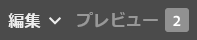

# ページ編集時の注釈 {#annotations-when-editing-a-page}

>[!CAUTION]
>
>AEM 6.4 の拡張サポートは終了し、このドキュメントは更新されなくなりました。 詳細は、 [技術サポート期間](https://helpx.adobe.com/jp/support/programs/eol-matrix.html). サポートされているバージョンを見つける [ここ](https://experienceleague.adobe.com/docs/?lang=ja).

Web サイトのページにコンテンツを追加する場合、多くの場合、実際にコンテンツを公開する前にディスカッションの対象となります。 これを支援するために、（レイアウトなどに対して）コンテンツに直接関連する多くのコンポーネントでは注釈を追加できます。

注釈を付けると、ページ上に色付きのマーカー/付箋紙が配置されます。 注釈を使用すれば、ユーザー（または他のユーザー）はコメントや質問を他の作成者またはレビュー担当者に残すことができます。

>[!NOTE]
>
>個々のコンポーネントの種類の定義によって、そのコンポーネントのインスタンスに注釈を追加できるかどうかが決まります。

>[!NOTE]
>
>クラシック UI で作成された注釈は、タッチ操作対応 UI に表示されます。 ただし、スケッチは UI 固有で、作成した UI にのみ表示されます。

>[!CAUTION]
>
>リソース（段落など）を削除すると、そのリソースに添付されていた注釈およびスケッチが、ページ全体での位置に関係なく、すべて削除されます。

>[!NOTE]
>
>必要に応じて、注釈が追加、更新または削除されたときに通知を送信するワークフローを作成することもできます。

## 注釈 {#annotations}

注釈の作成と表示には、特別な[モード](/help/sites-authoring/author-environment-tools.md#page-modes)が使用されます。

>[!NOTE]
>
>ページでフィードバックを提供するために、[コメント](/help/sites-authoring/basic-handling.md#timeline)も使用できます。

>[!NOTE]
>
>次のような、様々なリソースに注釈を付けることができます。
>
>* [アセットへの注釈の追加](/help/assets/managing-assets-touch-ui.md#annotating)
>* [ビデオアセットへの注釈の追加](/help/assets/managing-video-assets.md#annotating-video-assets)
>

### コンポーネントへの注釈の追加 {#annotating-a-component}

注釈モードでは、コンテンツ上で注釈を作成、編集、移動または削除できます。

1. ページの編集時に、ツールバー（右上）のアイコンを使用して注釈モードに入ることができます。

   

   既に注釈が付けられていれば、それらを表示できるようになりました。

   >[!NOTE]
   >
   >注釈モードを終了するには、上部のツールバーの右側にある注釈アイコン（x 記号）をタップまたはクリックします。

1. 注釈の追加を開始するには、注釈を追加アイコン（ツールバーの左側にあるプラス記号）をクリックまたはタップします。

   >[!NOTE]
   >
   >注釈の追加を停止（そして表示に戻る）するには、上部のツールバーの左側にあるキャンセルアイコン（白い円に囲まれた x 記号）をタップまたはクリックします。

1. 必要なコンポーネント（注釈を付けることのできるコンポーネントは、青い境界線でハイライト表示されます）をクリックまたはタップして注釈を追加し、ダイアログを開きます。

   

   ここで、適切なフィールドやアイコンを使用して、次の操作を実行できます。

   * 注釈テキストを入力します。
   * スケッチ（線と図形）を作成して、コンポーネントの特定の領域を強調表示します。

      スケッチの作成中は、カーソルが十字型に変わります。複数の異なる線を描くことができます。スケッチ線は注釈と同じ色で、矢印、円、楕円のいずれかにすることができます。
   

   * 色を選択または変更します。

   

   * 注釈を削除します。

   

1. ダイアログの外側をクリックまたはタップして、注釈ダイアログを閉じることができます。 注釈の切り捨てられたビュー（最初の単語）とスケッチが表示されます。

   

1. 目的の注釈の編集が完了したら、次の操作を実行できます。

   * テキストマーカーをクリックまたはタップしてその注釈を開くことができます。開いたら、テキスト全体を表示し、変更を加えたり、注釈を削除したりできます。

      * スケッチは、注釈とは別に削除できません。
   * テキストマーカーの位置を変更します。
   * スケッチの線をクリックまたはタップしてそのスケッチを選択し、必要な位置までドラッグします。
   * コンポーネントを移動またはコピーする

      * 関連する注釈とそのスケッチも移動またはコピーされ、段落に対する位置は変わりません。

1. 注釈モードを終了して以前に使用したモードに戻るには、上部のツールバーの右側にある注釈アイコン（x 記号）をタップまたはクリックします。

>[!NOTE]
>別のユーザーによってロックされているページには、注釈を追加できません。

### 注釈インジケーター {#annotation-indicator}

注釈は編集モードでは表示されませんが、ツールバーの右上にあるバッジに、現在のページに存在する注釈の数が示されます。このバッジは、デフォルトの注釈アイコンに代わるものですが、注釈モードと切り替えるクイックリンクとしても動作します。

