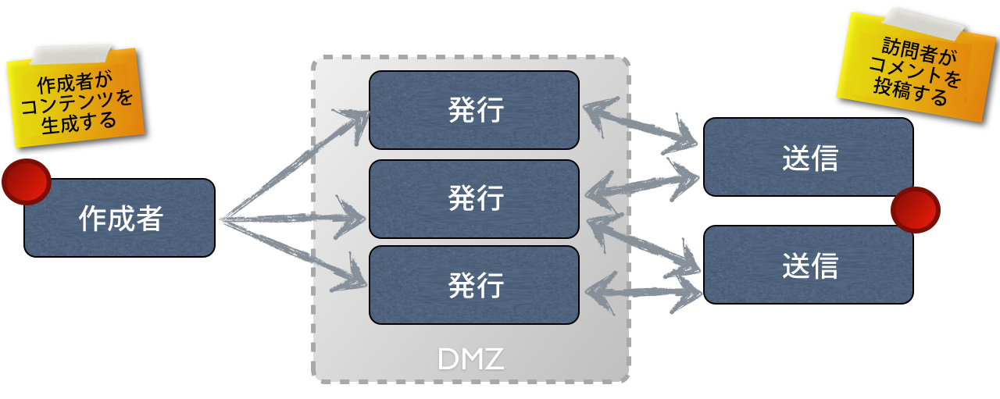

# オーサリングと公開の概念{#authoring}

>[!CAUTION]
>
>AEM 6.4 の拡張サポートは終了し、このドキュメントは更新されなくなりました。 詳細は、 [技術サポート期間](https://helpx.adobe.com/jp/support/programs/eol-matrix.html). サポートされているバージョンを見つける [ここ](https://experienceleague.adobe.com/docs/?lang=ja).

AEMでは、次の 2 つの環境を提供します。

* 作成者
* 公開

これらが相互に作用するので、コンテンツを Web サイト上で利用でき、訪問者がコンテンツを読むことができるようになります。

オーサー環境は、コンテンツを作成、更新し、実際に公開する前にレビューするためのメカニズムを提供します。

* 作成者は、コンテンツ（ページ、アセット、パブリケーションなどの様々な種類のコンテンツ）を作成およびレビューします。
* このコンテンツが、ある時点で web サイトに公開されます。

オーサー環境では、AEMの機能は 2 つの UI を通じて使用できます。 パブリッシュ環境では、ユーザーに公開するインターフェイスの全体的なルックアンドフィールをデザインします。

## オーサー環境 {#author-environment}

作成者は、**[オーサー環境](/help/sites-authoring/home.md)**&#x200B;と呼ばれる環境で作業します。この環境では、便利なグラフィカルユーザーインターフェイス（GUI または UI）を使用して、コンテンツを作成できます。この環境は通常、完全に保護された企業のファイアウォールの内側に配備されるので、作成者は、適切なアクセス権限が割り当てられたアカウントを使用してログインする必要があります。

>[!NOTE]
>
>コンテンツの作成、編集または公開をおこなうための適切なアクセス権がアカウントに必要です。

インスタンスと個人のアクセス権の設定に応じて、次のような様々なタスクをコンテンツに対して実行できます。

* ページ上で新しいコンテンツを生成するか、既存のコンテンツを編集します
* 事前に定義されたテンプレートを使用して、新しいコンテンツページを作成します。
* アセットやコレクションを作成、編集および管理します。
* パブリケーションを作成、編集および管理します。
* キャンペーンや関連リソースを開発します。
* コミュニティサイトを開発および管理します。
* コンテンツページ、アセットなどを移動、コピーまたは削除します。
* ページ、アセットなどの公開（または非公開）

さらに、コンテンツの管理に役立つ次のような管理タスクがあります。

* 変更の管理方法を制御するワークフロー例： 公開前にレビューを強制する
* 個々のタスクを調整するプロジェクト

>[!NOTE]
>
>AEMも [投与される](/help/sites-administering/home.md) （ほとんどのタスクに対して）オーサー環境から取得します。

## パブリッシュ環境 {#publish-environment}

準備が完了した AEM サイトのコンテンツは、**パブリッシュ環境**&#x200B;に公開されます。対象となるオーディエンスは、デザインされたインターフェイスのルックアンドフィールに従って web サイトのページを利用できます。

通常、パブリッシュ環境は非武装化ゾーン内に配置されます。つまり、インターネットで使用できますが、内部ネットワークの完全な保護を受けることはなくなります。

AEMサイトが [コミュニティサイト](/help/communities/overview.md)またはを含む [コミュニティコンポーネント](/help/communities/author-communities.md)、サインインしたサイトの訪問者（メンバー）は、コミュニティの機能とやり取りすることができます。 例えば、フォーラムに投稿、コメントを投稿、または他のメンバーをフォローできます。新しいページ（コミュニティグループ）の作成、ブログ記事、他のメンバーの投稿の管理など、通常はオーサー環境に制限されるアクティビティの実行権限を、メンバーに付与できます。

>[!NOTE]
>
>残念ながら、使用する用語に重複が生じる場合があります。 これは、次の場合に発生する可能性があります。
>
>* **公開／非公開**
   >  環境でコンテンツを公開する（または非公開にする）アクションに対して主に使用される用語です。
>
>* **アクティブ化／非アクティブ化**
   >  公開／非公開と同義です。クラシック UI では、これらの方が一般的です。
>
>* **レプリケート／レプリケーション**
   >  ユーザーコメントの公開やリバースレプリケーションの際などに、ある環境から別の環境へのデータ（ページコンテンツ、ファイル、コード、ユーザーコメントなど）の移動を表すために使用する技術用語です。
>

## Dispatcher {#dispatcher}

Web サイトの訪問者に対するパフォーマンスを最適化するには、**[Dispatcher](https://helpx.adobe.com/jp/experience-manager/brand-portal/user-guide.html)** を使用してロードバランシングとキャッシングを実装します。
