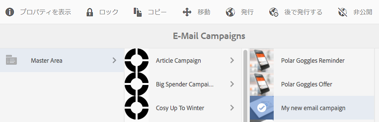
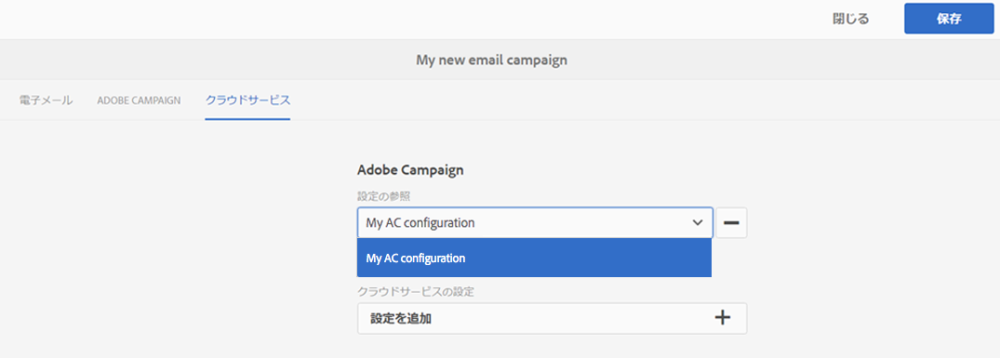
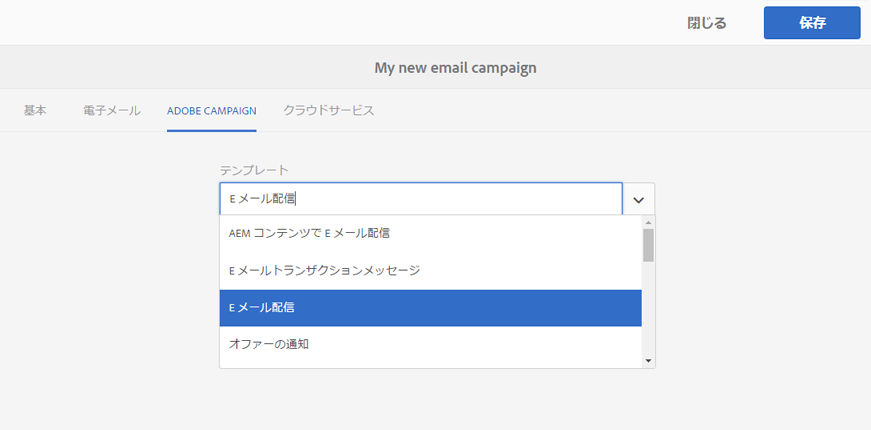
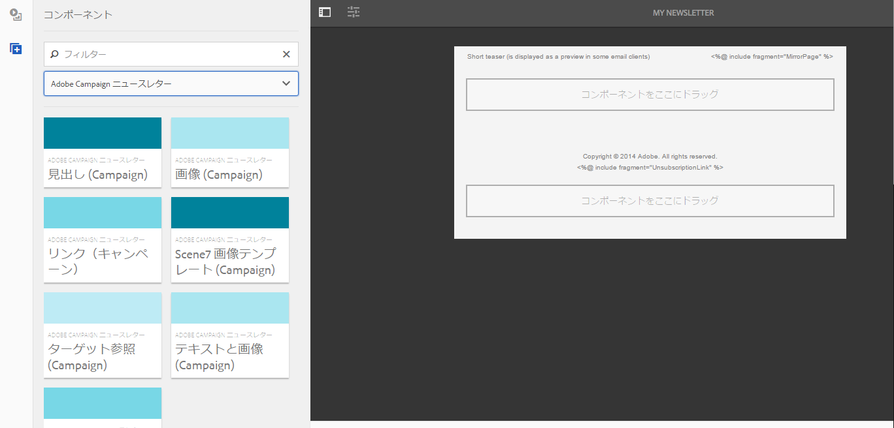
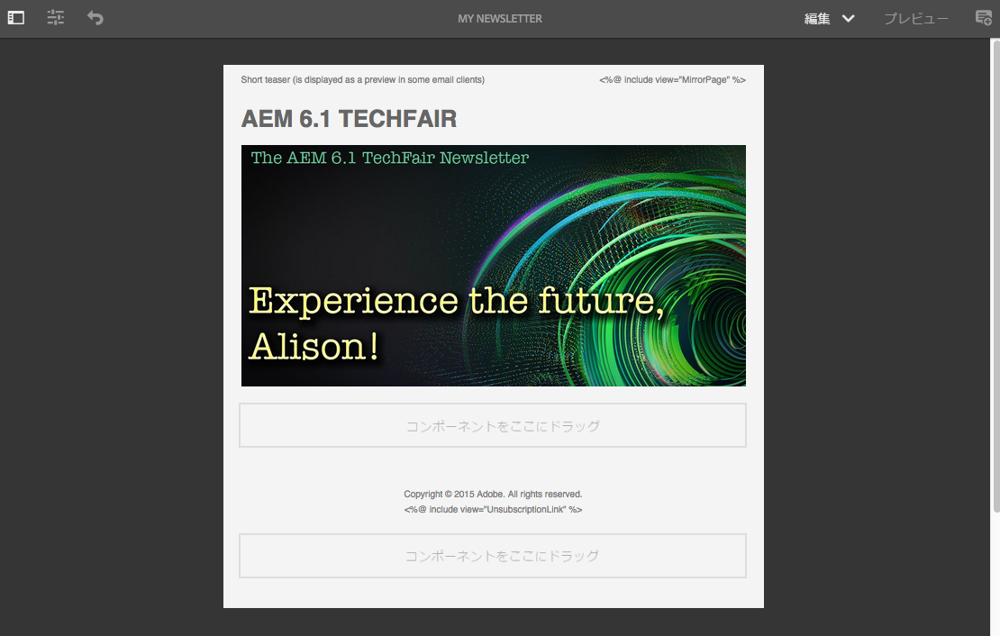
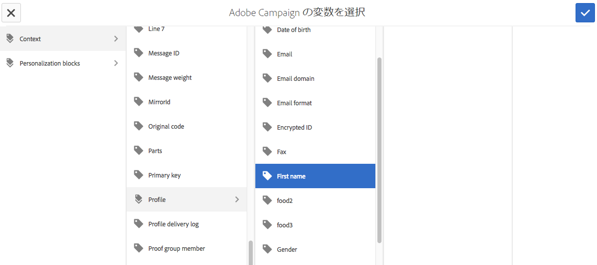
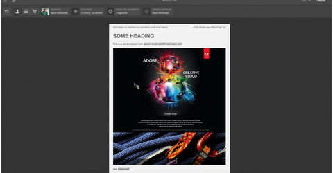
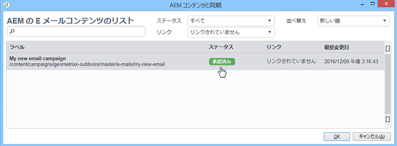
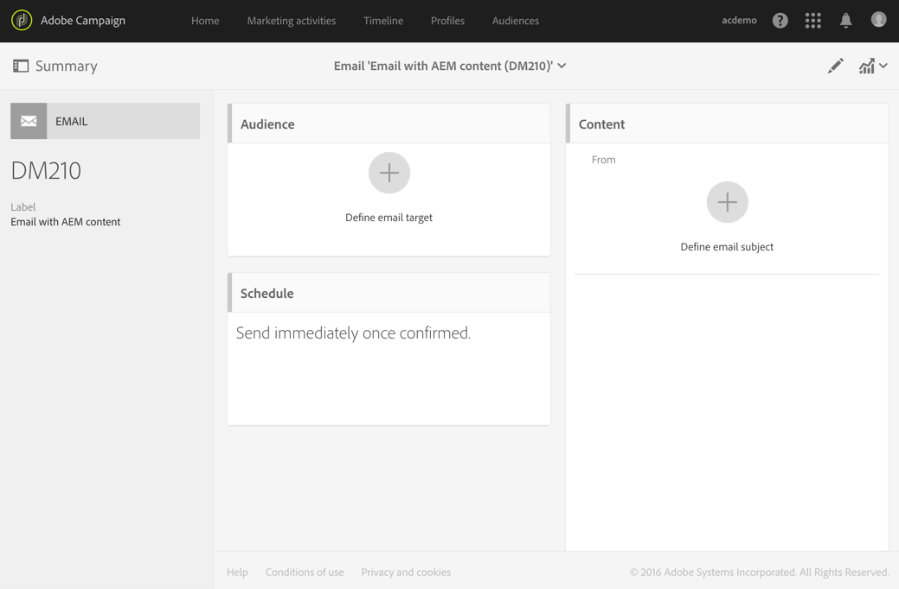
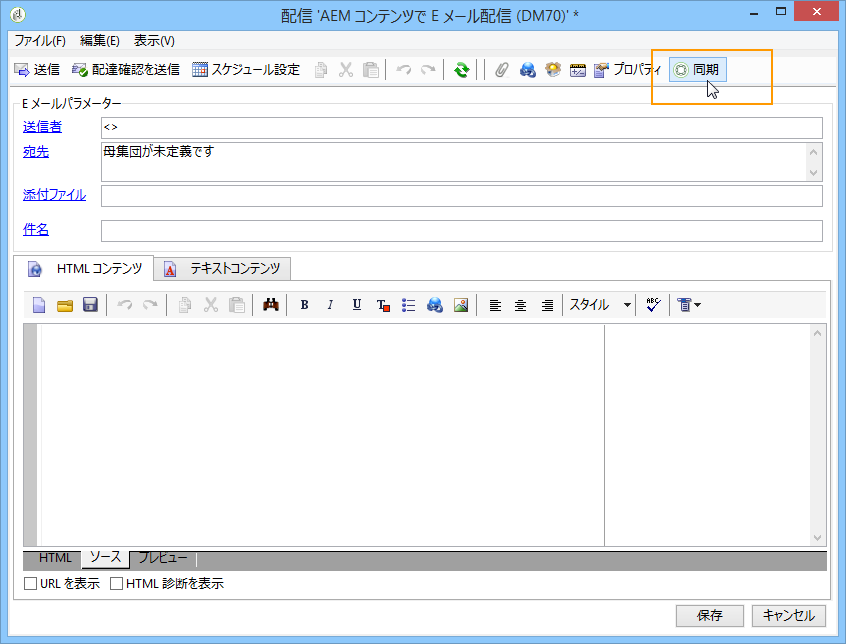

# Adobe Campaign Classic および Adobe Campaign Standard の使用{#working-with-adobe-campaign-classic-and-adobe-campaign-standard}

AEM で電子メールコンテンツを作成して、Adobe Campaign の電子メールで処理することができます。これを実行するには、次の手順に従う必要があります。

1. AEM で、Adobe Campaign 固有のテンプレートから新しいニュースレターを作成します。
1. コンテンツを編集する前に、すべての機能にアクセスするために [Adobe Campaign サービス](#selecting-the-adobe-campaign-cloud-service-and-template)を選択します。
1. コンテンツを編集します。
1. コンテンツを検証します。

これで、コンテンツを Adobe Campaign での配信と同期できるようになります。詳細な手順についてはこのドキュメントで説明します。

[AEM での Adobe Campaign フォームの作成](/help/sites-authoring/adobe-campaign-forms.md)も参照してください。

>[!NOTE]
>
>この機能を使用するには、AEM を [Adobe Campaign](/help/sites-administering/campaignonpremise.md) または [Adobe Campaign Standard](/help/sites-administering/campaignstandard.md) と連携するように設定する必要があります。

## Adobe Campaign を使用した電子メールコンテンツの送信 {#sending-email-content-via-adobe-campaign}

AEM と Adobe Campaign を設定すると、電子メール配信コンテンツを AEM 内で直接作成した後に、それを Adobe Campaign 内で処理できます。

AEMでAdobe Campaignコンテンツを作成する場合は、コンテンツを編集する前にAdobe Campaignサービスにリンクして、すべての機能にアクセスする必要があります。

次の 2 つのケースが考えられます。

* コンテンツを Adobe Campaign からの配信と同期する場合。この場合は、AEM コンテンツを配信に使用できます。
* （Adobe Campaign Classic のみ）コンテンツを Adobe Campaign に直接送信する場合。この場合は、Adobe Campaign が新しい電子メール配信を自動的に生成します。このモードには制限事項があります。

詳細な手順についてはこのドキュメントで説明します。

### 新しい電子メールコンテンツの作成 {#creating-new-email-content}

>[!NOTE]
>
>電子メールテンプレートを追加する場合は、必ず以下に追加してください。 **/content/campaigns** を使用できるようにします。

#### 新しい電子メールコンテンツの作成 {#creating-new-email-content-1}

1. AEMで、 **サイト** その後 **キャンペーン**&#x200B;をクリックし、e メールキャンペーンを管理する場所を参照します。 次の例では、パスは **サイト** > **キャンペーン** > **Geometrixx Outdoors** > **メールキャンペーン**.

   >[!NOTE]
   >
   >[電子メールのサンプルは、Geometrixx でのみ使用できます](/help/sites-developing/we-retail.md)。サンプルGeometrixxコンテンツをパッケージ共有からダウンロードしてください。

   

1. 「**作成**」、「**ページを作成**」の順に選択します。
1. 接続している Adobe Campaign に固有の使用可能なテンプレートのいずれかを選択して、「**次へ**」をクリックします。デフォルトでは、次の 3 つのテンプレートが使用可能です。

   * **Adobe Campaign Classic Email**:コンテンツを配信用にAdobe Campaign Classicに送信する前に、事前定義済みのテンプレート（2 列）に追加できます。
   * **Adobe Campaign Standard Email**:コンテンツを配信用にAdobe Campaign Standardに送信する前に、事前定義済みのテンプレート（2 列）に追加できます。

1. 次の項目に入力： **タイトル** オプションで **説明** をクリックし、 **作成**. 電子メールの編集中に上書きしない限り、タイトルはニュースレターまたは電子メールの件名として使用されます。

### Adobe Campaign クラウドサービスおよびテンプレートの選択 {#selecting-the-adobe-campaign-cloud-service-and-template}

Adobe Campaign と統合するには、Adobe Campaign クラウドサービスをページに追加する必要があります。これにより、パーソナライズ機能や他の Adobe Campaign 情報にアクセスできるようになります。

さらに、Adobe Campaign テンプレートを選択し、件名を変更したり、HTML 表示を使用しない受信者向けのプレーンテキストのコンテンツを追加したりすることが必要な場合もあります。

クラウドサービスは、「**サイト**」タブから選択することも、電子メール／ニュースレターの作成後にその中から選択することもできます。

通常は、「**サイト**」タブからクラウドサービスを選択することを推奨します。電子メールまたはニュースレターからクラウドサービスを選択するには、ちょっとした回避策が必要になります。

**サイト**&#x200B;ページから：

1. AEM で、電子メールページを選択し、「**プロパティを表示**」をクリックします。

   

1. 選択 **編集** そして **クラウドサービス** タブをクリックし、下までスクロールし、 +記号をクリックして設定を追加し、「 」を選択します。 **Adobe Campaign**.

   

1. 使用している Adobe Campaign インスタンスに一致する設定をドロップダウンリストから選択し、「**保存**」をクリックして確認します。
1. 「** Adobe Campaign**」タブをクリックすると、E メールが適用したテンプレートを表示できます。 別のテンプレートを選択したい場合は、編集時に電子メール内からテンプレートにアクセスできます。

   (Adobe Campaignの ) 特定の E メール配信テンプレート（デフォルトの E メールテンプレート以外）を適用する場合は、 **プロパティ**&#x200B;を選択し、 **Adobe Campaign** タブをクリックします。 関連する Adobe Campaign インスタンス内での電子メール配信テンプレートの内部名を入力します。

   どのテンプレートを選択するかによって、どのパーソナライゼーションフィールドを Adobe Campaign から利用できるかが決まります。

   

オーサリング時のニュースレター／電子メール内から選択する場合は、レイアウトの問題によって、「**ページのプロパティ**」で Adobe Campaign クラウドサービス設定を選択できないことがあります。その場合は、以下に説明する回避策を使用できます。

1. AEM で、電子メールページを選択し、「**編集**」をクリックします。「**プロパティを開く**」をクリックします。

   

1. 選択 **クラウドサービス** をクリックし、 **+** 設定を追加します。 表示される任意の設定を選択します（どれでもかまいません）。「**+**」記号をクリックまたはタップして、別の設定を追加してから、「**Adobe Campaign**」を選択します。

   >[!NOTE]
   >
   >または、「**サイト**」タブで「**プロパティを表示**」を選択して、クラウドサービスを選択することができます。

1. Adobe Campaignインスタンスに一致する設定をドロップダウンリストから選択し、作成した、Adobe Campaign用でなかった最初の設定を削除して、チェックマークをクリックして確定します。
1. 前述の手順のステップ 4 を続行して、テンプレートを選択し、プレーンテキストを追加します。

### 電子メールコンテンツの編集 {#editing-email-content}

電子メールコンテンツを編集するには：

1. 電子メールを開くと、デフォルトで編集モードに入ります。

   

1. 電子メールの件名を変更する場合や、電子メールをHTMLで表示しないユーザーに対してプレーンテキストを追加する場合は、 **電子メール** 件名とテキストを追加します。 ページアイコンを選択すると、プレーンテキストのバージョンが HTML から自動生成されます。終了したらチェックマークをクリックします。

   Adobe Campaign のパーソナライゼーションフィールドを使用して、ニュースレターをパーソナライズできます。パーソナライゼーションフィールドを追加するには、Adobe Campaign のロゴが表示されているボタンをクリックして、パーソナライゼーションフィールドピッカーを開きます。このニュースレターで使用可能なフィールドがすべて表示され、その中から選択することができます。

   >[!NOTE]
   >
   >エディター内で「プロパティ」のパーソナライゼーションフィールドがグレー表示になっている場合は、設定を見直してください。

   

1. 画面の左側でコンポーネントパネルを開き、「 」を選択します。 **Adobe Campaign** ドロップダウンメニューから、これらのコンポーネントを探します。

   

1. コンポーネントをページ上に直接ドラッグし、コンポーネントに応じて編集します。例えば、**テキストおよびパーソナライゼーション（Campaign）**&#x200B;コンポーネントをドラッグして、パーソナライズしたテキストを追加することができます。

   

   詳しくは、 [Adobe Campaign Components](/help/sites-authoring/adobe-campaign-components.md) を参照してください。

   

### パーソナライゼーションの挿入 {#inserting-personalization}

コンテンツを編集するとき、次のものを挿入できます。

* Adobe Campaign コンテキストフィールド。これらは、受信者のデータ（姓、名またはターゲットディメンションの任意のデータなど）に応じてテキスト内に挿入できるフィールドです。
* Adobe Campaign パーソナライゼーションブロック。これらは、ブランドロゴやミラーページへのリンクなど、受信者のデータとは関係のない定義済みコンテンツのブロックです。

Adobe Campaign コンテンツの詳細については、[Adobe Campaign コンポーネント](/help/sites-authoring/adobe-campaign-components.md)を参照してください。

>[!NOTE]
>
>* Adobe Campaign の「**プロファイル**」ターゲティングディメンションのフィールドのみが考慮されます。
>* からプロパティを表示する場合 **サイト**&#x200B;に設定されている場合、Adobe Campaignコンテキストフィールドへのアクセス権がありません。 これらのフィールドには編集時に電子メール内から直接アクセスできます。

>

パーソナライゼーションを挿入する方法

1. 新しい **ニュースレター** > **テキストおよびパーソナライゼーション (Campaign)** コンポーネントをドラッグします。

   

1. 鉛筆アイコンをクリックして、コンポーネントを開きます。インプレースエディターが開きます。

   

   >[!NOTE]
   >
   >**Adobe Campaign Standard の場合：**
   >
   >* 使用可能なコンテキストフィールドは、Adobe Campaign の「**プロファイル**」ターゲティングディメンションに対応しています。
   >* 詳しくは、 [AEMページとAdobe Campaign E メールのリンク](#linking-an-aem-page-to-an-adobe-campaign-email-adobe-campaign-standard).

   >
   >**Adobe Campaign Classic の場合：**
   >
   >* 使用可能なコンテキストフィールドは、Adobe Campaignから動的に復元されます **nms:seedMember** スキーマ。 ターゲット拡張データは、コンテンツと同期される配信を含むワークフローから動的に復元されます( [AEMで作成されたコンテンツとAdobe Campaignからの配信の同期](#synchronizing-content-created-in-aem-with-a-delivery-from-adobe-campaign-classic) を参照 )。
   >
   >* パーソナライゼーション要素を追加または非表示にするには、 [パーソナライゼーションフィールドとパーソナライゼーションブロックの管理](/help/sites-administering/campaignonpremise.md#managing-personalization-fields-and-blocks).
   >* **重要**：シードテーブルのフィールドはすべて、受信者テーブル（または対応する連絡先テーブル）にも存在する必要があります。

1. テキストを手入力して挿入します。Adobe Campaign コンポーネントをクリックして選択し、コンテキストフィールドまたはパーソナライゼーションブロックを挿入します。完了したら、チェックマークを選択します。

   

   コンテキストフィールドまたはパーソナライゼーションブロックを挿入したら、ニュースレターをプレビューして、フィールドをテストできます。詳しくは、 [ニュースレターのプレビュー](#previewing-a-newsletter).

### ニュースレターのプレビュー {#previewing-a-newsletter}

パーソナライゼーションと同様に、ニュースレターもプレビューすることができます。

1. ニュースレターを開いた状態で、AEM の右上隅の「**プレビュー**」をクリックします。AEMは、ユーザーがニュースレターを受け取ったときの外観を表示します。

   

   >[!NOTE]
   >
   >Adobe Campaign Standard でサンプルテンプレートを使用している場合は、配信時にコンテンツを読み込むと、初期コンテンツ（**&quot;&lt;%@ include view=&quot;MirrorPage&quot; %>&quot;** および **&quot;&lt;%@ include view=&quot;UnsubscriptionLink&quot; %>&quot;**）を表示する 2 つのパーソナライゼーションブロックがエラーをスローします。パーソナライゼーションブロックピッカーを使用して、対応するブロックを選択することによって、このエラーを解決できます。

1. パーソナライゼーションをプレビューするには、ツールバーの対応するアイコンをクリックまたはタップして、ContextHub を開きます。現在、パーソナライゼーションフィールドのタグは、選択したペルソナのシードデータで置き換えられています。ContextHub でペルソナを切り替えると変数がどのように変化するかを確認してください。

   

1. 現在選択しているペルソナに関連付けられた、Adobe Campaign のシードデータを表示できます。表示するには、ContextHub バーの Adobe Campaign モジュールをクリックまたはタップします。ダイアログボックスが開き、現在のプロファイルのシードデータがすべて表示されます。再度別のペルソナに切り替えると、データが変化します。

   

### AEM でのコンテンツの承認 {#approving-content-in-aem}

コンテンツの作成が完了したら、承認プロセスを開始できます。次に移動： **ワークフロー** ツールボックスのタブで、 **Adobe Campaignの承認** ワークフロー。

この既製のワークフローには、改訂して承認または改訂して拒否という 2 つのステップがあります。このワークフローを拡張して、より複雑なプロセスに適合させることができます。

Adobe Campaignのコンテンツを承認するには、「 **ワークフロー** および選択 **Adobe Campaignの承認** をクリックし、 **ワークフローを開始**. 手順を完了し、コンテンツを承認します。 ワークフローの最後のステップで、「**承認**」の代わりに「**拒否**」を選択して、コンテンツを拒否することもできます。

コンテンツを承認すると、承認済みとして Adobe Campaign に表示されます。すると、電子メールを送信できるようになります。

Adobe Campaign Standard の場合：

Adobe Campaign Classic の場合：

>[!NOTE]
未承認のコンテンツは、Adobe Campaign の配信と同期できますが、配信を実行することはできません。Adobe Campaign の配信を使用して送信できるのは、承認済みのコンテンツだけです。

## AEM と Adobe Campaign Standard および Adobe Campaign Classic のリンク {#linking-aem-with-adobe-campaign-standard-and-adobe-campaign-classic}

AEM と Adobe Campaign をどのようにリンクまたは同期させるかは、使用しているのがサブスクリプションベースの Adobe Campaign Standard か、オンプレミスベースの Adobe Campaign Classic かによって異なります。

使用している Adobe Campaign ソリューションに応じた手順は、以下のセクションを参照してください。

* [Adobe Campaign 電子メールへの AEM ページのリンク（Adobe Campaign Standard）](#linking-an-aem-page-to-an-adobe-campaign-email-adobe-campaign-standard)
* [AEM で作成されたコンテンツと Adobe Campaign Classic の配信の同期](#synchronizing-content-created-in-aem-with-a-delivery-from-adobe-campaign-classic)

### Adobe Campaign 電子メールへの AEM ページのリンク（Adobe Campaign Standard） {#linking-an-aem-page-to-an-adobe-campaign-email-adobe-campaign-standard}

Adobe Campaign Standard では、次のものを使用して、AEM で作成されたコンテンツを復元し、リンクできます。

* 電子メール
* 電子メールテンプレート

これにより、コンテンツを配信することができます。ページ上に表示されるコードによって、ニュースレターが単一の配信にリンクされているかどうかがわかります。

>[!NOTE]
ニュースレターが複数の配信にリンクされている場合、リンクされている配信の数になります（ただし、すべての ID が表示されるわけではありません）。

AEM で作成されたページと Adobe Campaign の電子メールをリンクするには：

1. AEM 固有の電子メールテンプレートをベースとして新しい電子メールを作成します。参照： [Adobe Campaign Standardでの E メールの作成](https://helpx.adobe.com/jp/campaign/standard/channels/using/creating-an-email.html) を参照してください。

   

1. 配信ダッシュボードから&#x200B;**コンテンツ**&#x200B;ブロックを開きます。

   

1. 選択 **Adobe Experience Managerコンテンツとのリンク** (AEMで使用可能なコンテンツのリストにアクセスする場合 )

   >[!NOTE]
   この **Adobe Experience Managerとのリンク** オプションがアクションバーに表示されない場合は、 **コンテンツ編集モード** が正しく設定されている **Adobe Experience Manager** 電子メールのプロパティに含まれます。

   

1. 電子メールで使用したいコンテンツを選択します。

   このリストでは、次のものを指定します。

   * AEM でのコンテンツのラベル。
   * AEM でのコンテンツの承認ステータス。コンテンツが承認されていない場合、コンテンツを同期することはできますが、配信を送信する前に承認する必要があります。ただし、プルーフの送信やプレビューテストなど、特定の操作は実行できます。
   * コンテンツの最終変更日。
   * 既に配信にリンクされているすべてのコンテンツ。

   >[!NOTE]
   デフォルトでは、既に配信と同期されているコンテンツは表示されません。ただし、表示および使用することはできます。例えば、コンテンツを複数の配信のテンプレートとして使用する場合などです。

   電子メールを AEM コンテンツにリンクすると、そのコンテンツを Adobe Campaign で編集することはできなくなります。

1. 電子メールのその他のパラメーター（オーディエンス、実行スケジュールなど）をダッシュボードから指定します。
1. 電子メールの配信を実行します。配信の分析時に、最新バージョンの AEM コンテンツが取得されます。

   >[!NOTE]
   電子メールにリンクされている間にコンテンツが AEM で更新されると、分析時に Adobe Campaign で自動的に更新されます。コンテンツアクションバーの「**Adobe Experience Manager コンテンツを更新**」を使用して、同期を手動で実行することもできます。
   コンテンツアクションバーの「**Adobe Experience Manager コンテンツとのリンクを削除**」を使用して、電子メールと AEM コンテンツのリンクをキャンセルできます。このボタンは、コンテンツが既に配信とリンクされている場合にのみ表示されます。別のコンテンツを配信とリンクするには、現在のコンテンツリンクを削除してからでなければ新しいリンクを確立できません。
   リンクを削除すると、ローカルコンテンツが保持され、Adobe Campaign で編集できるようになります。コンテンツを変更後に再度リンクする場合は、すべての変更が失われます。

### AEM で作成されたコンテンツと Adobe Campaign Classic の配信の同期 {#synchronizing-content-created-in-aem-with-a-delivery-from-adobe-campaign-classic}

Adobe Campaign では、次のものを使用して、AEM で作成されたコンテンツを復元し、同期できます。

* キャンペーン配信
* キャンペーンワークフローの配信アクティビティ
* 定期的配信
* 連続配信
* Message Center 配信
* 配信テンプレート

AEM では、ニュースレターが単一の配信にリンクされている場合は、配信コードがページ上に表示されます。

>[!NOTE]
ニュースレターが複数の配信にリンクされている場合、リンクされている配信の数が表示されます（ただし、すべての ID が表示されるわけではありません）。

>[!NOTE]
ワークフローステップ「**Adobe Campaign に公開**」は、AEM 6.1 で廃止されます。このステップは、Adobe Campaign との AEM 6.0 統合の一部でしたが、必要ではなくなりました。

AEM で作成されたコンテンツと Adobe Campaign の配信を同期するには：

1. 配信を作成するか、キャンペーンワークフローに配信アクティビティを追加します。その際、 **AEMコンテンツを含む E メール配信 (mailAEMContent)** 配信テンプレート。

   

1. 選択 **同期** (AEMで使用可能なコンテンツのリストにアクセスする場合 )

   >[!NOTE]
   この **同期** 」オプションが配信のツールバーに表示されない場合は、 **コンテンツ編集モード** フィールドが **AEM** 選択する **プロパティ** > **詳細**.

   

1. 配信と同期させたいコンテンツを選択します。

   このリストでは、次のものを指定します。

   * AEM でのコンテンツのラベル。
   * AEM でのコンテンツの承認ステータス。コンテンツが承認されていない場合、コンテンツを同期することはできますが、配信を送信する前に承認する必要があります。ただし、BAT の送信やプレビューテストなど、特定の操作は実行できます。
   * コンテンツの最終変更日。
   * 既に配信にリンクされているすべてのコンテンツ。

   >[!NOTE]
   デフォルトでは、既に配信と同期されているコンテンツは表示されません。ただし、表示および使用することはできます。例えば、コンテンツを複数の配信のテンプレートとして使用する場合などです。

   

1. 配信のその他のパラメーター（ターゲットなど）を指定します。
1. 必要に応じて、Adobe Campaign で配信承認プロセスを開始します。Adobe Campaign で設定された承認（予算、ターゲットなど）に加え、AEM でのコンテンツの承認が必要です。Adobe Campaign でのコンテンツの承認は、コンテンツが AEM で既に承認されている場合にのみ可能です。
1. 配信を実行します。配信の分析時に、最新バージョンの AEM コンテンツが復元されます。

   >[!NOTE]
   * 配信とコンテンツが同期されると、Adobe Campaign の配信コンテンツは読み取り専用になります。コンテンツだけでなく、電子メールの件名も変更できなくなります。
   * Adobe Campaign の配信にリンクされている間に AEM でコンテンツが更新された場合は、配信の分析時に配信内のコンテンツが自動的に更新されます。同期は、 **今すぐコンテンツを更新** 」ボタンをクリックします。
   * 配信とAEMコンテンツの同期は、 **同期解除** 」ボタンをクリックします。 このボタンは、コンテンツが既に配信と同期されている場合にのみ表示されます。別のコンテンツを配信と同期するには、現在のコンテンツ同期をキャンセルしてからでなければ新しいリンクを確立できません。
   * 同期解除された場合は、ローカルコンテンツが保持され、Adobe Campaign で編集できるようになります。コンテンツを変更後に再同期する場合は、すべての変更が失われます。
   * 定期的配信と連続配信の場合は、配信が実行されるたびに AEM コンテンツとの同期が停止されます。

