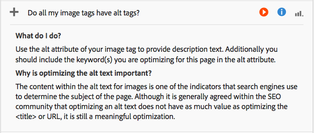

# ページパフォーマンスの分析 {#analyzing-page-performance}

>[!CAUTION]
>
>AEM 6.4 の拡張サポートは終了し、このドキュメントは更新されなくなりました。 詳細は、 [技術サポート期間](https://helpx.adobe.com/jp/support/programs/eol-matrix.html). サポートされているバージョンを見つける [ここ](https://experienceleague.adobe.com/docs/?lang=ja).

を開きます。 [コンテンツインサイト](/help/sites-authoring/content-insights.md) 作成中のページのパフォーマンスを分析するページ レポート期間を設定して、分析に焦点を当てます。

## ページ用に Analytics とRecommendationsを開く {#opening-analytics-and-recommendations-for-a-page}

次の手順を使用して、ページの Analytics とRecommendationsを表示します。

1. 分析するページに移動します。
1. ツールバーで、「**分析と推奨表示**」をクリックまたはタップします。

   >[!NOTE]
   >
   >ページの「分析と推奨表示」は、AEM で [Adobe Analytics との統合](/help/sites-administering/adobeanalytics-connect.md)を設定している場合にのみ表示されます。

   

## レポート期間の変更 {#changing-the-reporting-period}

次の分析レポートの時間に関する側面を変更します。

* レポートする期間。
* データの精度。

レポートの時間に関連する側面を変更するツールは、コンテンツインサイトページの上部に表示されます。

### レポート期間の変更 {#changing-the-reporting-period-1}

コンテンツインサイトページのレポート期間を変更して、ページアクティビティの分析を特定の期間に絞り込みます。 レポート期間を変更すると、レポートは自動的に更新されます。 期間の影付きの領域は、レポート期間を表します。 期間の日付は、左から右に増加します。

コンテンツインサイトページのレポート期間を変更するには：

1. ページの上部に期間が表示されない場合は、「期間を切り替え」アイコンをクリックまたはタップします。

   

1. レポート期間の開始日を変更するには、影付きの領域の左側に表示される円を目的の開始日までドラッグします。

   シェーディング領域の左側が表示されない場合は、スクロールバーを使用して表示します。

1. レポート期間の終了日を変更するには、影付きの領域の右側に表示される円を目的の終了日までドラッグします。

### レポート期間の精度の変更 {#changing-the-granularity-of-the-reporting-period}

各データポイントがレポート内で占める時間を変更します。 例えば、週の精度が選択されている場合、表示回数レポートの各データポイントは 1 週間の閲覧数を表します。

精度は、ビュー数レポートやページ平均関与時間（分）レポートなど、時間に対するデータのグラフを表示するレポートに影響します。 精度は期間のスケールにも影響します。

1. 精度コントロールが表示されない場合は、精度を切り替えアイコンをクリックまたはタップします。

   

1. 目的の精度をクリックまたはタップします。 選択すると、レポートが自動的に更新され、精度が反映されます。

## SEO Recommendationsのタスクの割り当て {#assigning-tasks-for-seo-recommendations}

SEO Recommendationsレポートを使用して、検索エンジンに対するページの表示を改善するタスクを作成します。 チェックマークの付いていないレポート内のレコメンデーションごとに、必要な作業を実行するためにユーザーに割り当てるタスクを作成できます。

SEO の推奨のステータスは、タスクが作成されたものの、まだ完了していないことを示します。

作成されると、タスクがユーザーのタスクリストに表示されます。タスクについては、[タスクの使用](/help/sites-authoring/task-content.md)を参照してください。

次の手順を使用して、SEO レコメンデーションのタスクを作成します。

1. SEO のレコメンデーションの情報アイコンをクリックまたはタップします。

   

1. 情報アイコンの横に表示される、囲まれた三角形のアイコンをクリックします。

   

1. 表示されるフォームフィールドに入力し、「作成」をタップします。

   * プロジェクト：タスクを作成するプロジェクトを選択します。
   * 名前：タスクを識別する名前。 デフォルト名は、SEO レコメンデーションのタイトルです。
   * 割り当て先：タスクを割り当てるユーザーを選択します。 リストをフィルタリングするには、ユーザーの名前を入力し始めます。
   * 説明：タスクの完了に必要なアクティビティの説明。 デフォルトの説明は、SEO の推奨に従って入力される情報です。
   * タスクの優先度：タスクの優先度です。
   * 期限：タスクを完了する日付です。

1. 「完了」をクリックまたはタップして、「タスクを作成しました」のメッセージを閉じます。

>[!NOTE]
>
>作成されるタスクには、SEO の推奨が適用されるページへのパスも含まれます。
