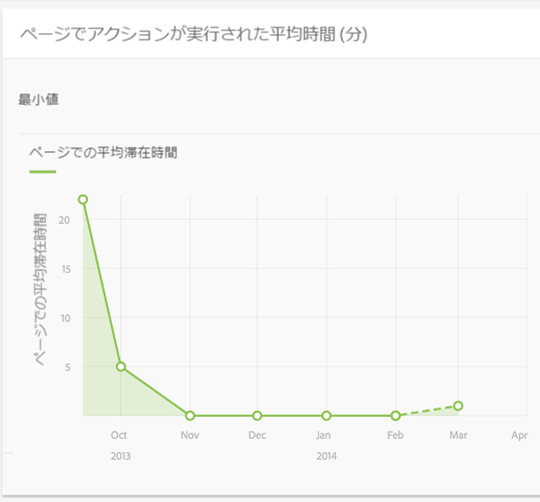
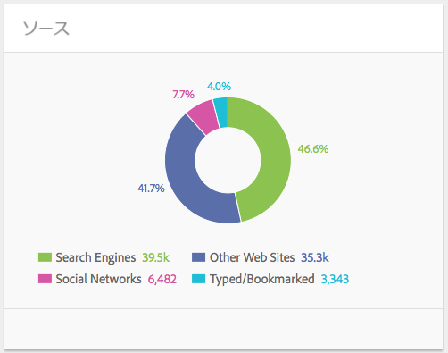
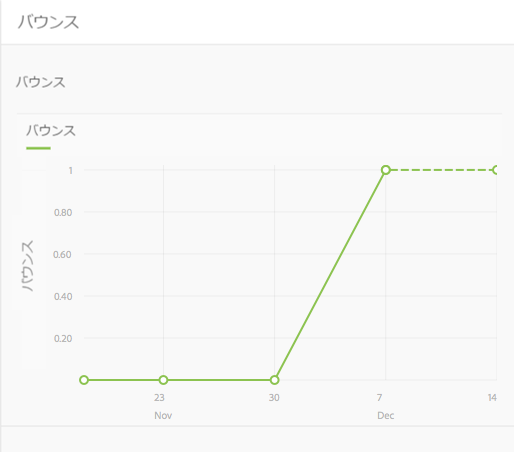

# コンテンツインサイト{#content-insight}

>[!CAUTION]
>
>AEM 6.4 の拡張サポートは終了し、このドキュメントは更新されなくなりました。 詳細は、 [技術サポート期間](https://helpx.adobe.com/jp/support/programs/eol-matrix.html). サポートされているバージョンを見つける [ここ](https://experienceleague.adobe.com/docs/?lang=ja).

コンテンツインサイトは、Web 分析および SEO の推奨事項を使用したページのパフォーマンスに関する情報を提供します。 コンテンツインサイトを使用して、ページの変更方法に関する決定を下したり、以前の変更によるパフォーマンスの変化を確認したりします。 作成するすべてのページで、コンテンツインサイトを開いてページを分析できます。

コンテンツインサイトページのレイアウトは、使用しているデバイスの画面サイズや向きに合わせて変化します。

## レポートデータ

コンテンツインサイトページには、Adobe SiteCatalyst、Adobe Target、Adobe Social、BrightEdge の各データを使用するレポートが含まれます。

* SiteCatalyst:次の指標に関するレポートを使用できます。

   * ページビュー数
   * ページでの平均滞在時間
   * ソース

* ターゲット：ページにオファーが含まれるキャンペーンアクティビティに関するレポート。
* BrightEdge:検索エンジンに対するページの表示を改善するページ機能に関するレポート。また、実装が必要な機能を推奨します。

[ページの「分析と推奨表示」を開く](/help/sites-authoring/ci-analyze.md#opening-analytics-and-recommendations-for-a-page)を参照してください。

## レポート期間

レポートには、制御した期間のデータが表示されます。 レポート期間を調整すると、レポートはその期間のデータで自動的に更新されます。 視覚的なキューは、ページのバージョンが変更された時間を示すので、各バージョンのパフォーマンスを比較できます。

また、レポートするデータの精度を指定することもできます。例えば、日別、週別、月別、年別のデータを確認できます。

詳しくは、 [レポート期間の変更](/help/sites-authoring/ci-analyze.md#changing-the-reporting-period).

>[!NOTE]
>
>コンテンツインサイトのレポートを使用するには、管理者が AEM と SiteCatalyst、Target および BrightEdge を統合する必要があります。[SightCatalyst との統合](/help/sites-administering/adobeanalytics.md)、[Adobe Target との統合](/help/sites-administering/target.md)および [BrightEdge との統合](/help/sites-administering/brightedge.md)を参照してください。

## ビューレポート {#the-views-report}

ビューレポートには、ページトラフィックを評価するための次の機能が含まれています。

* レポート期間中のページの合計表示数。
* レポート期間中のビュー数のグラフ：

   * 合計ビュー数。
   * 個別訪問者。

## ページの平均エンゲージ済みレポート {#the-page-average-engaged-report}

ページにアクションを実行した平均レポートには、ページの効果を評価するための次の機能が含まれています。

* レポート期間全体でページが開いたままの平均時間。
* レポート期間中のページビューの平均長さのグラフ。

## ソースレポート {#the-sources-report}

「ソース」レポートは、ユーザーが検索エンジンの結果から、または既知の URL を使用して、どのようにページに移動したかを示します。

## バウンスレポート {#the-bounces-report}

バウンス数レポートには、選択したレポート期間にページで発生したバウンス数を示すグラフが含まれます。

## キャンペーンアクティビティレポート {#the-campaign-activity-report}

ページがアクティブなキャンペーンごとに、 *キャンペーン名* アクティビティ。 このレポートは、オファーが提供されている各セグメントのページインプレッション数とコンバージョン数を示します。

## SEO Recommendationsレポート {#the-seo-recommendations-report}

SEO Recommendationsレポートには、ページの BrightEdge 分析の結果が含まれます。 このレポートは、検索エンジンを使用して検索性を最大限に高めるために、ページがどの機能を使用し、どの機能を含まないかを示すページ機能のチェックリストです。

このレポートでは、ページの検索性を向上させるためのタスクを作成できます。 Recommendationsは、レコメンデーションを実装するためのタスクが作成されたことを示します。 詳しくは、 [SEO Recommendationsのタスクの割り当て](/help/sites-authoring/ci-analyze.md#assigning-tasks-for-seo-recommendations).

