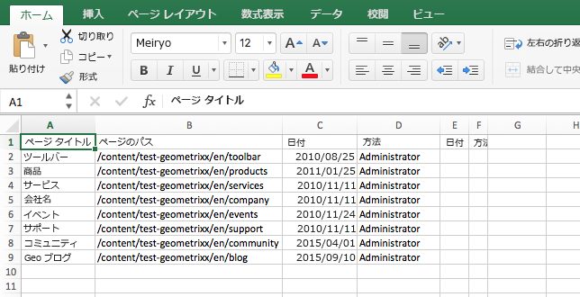
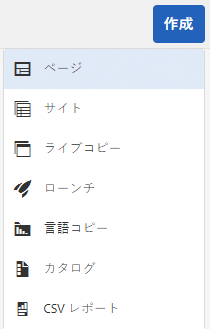
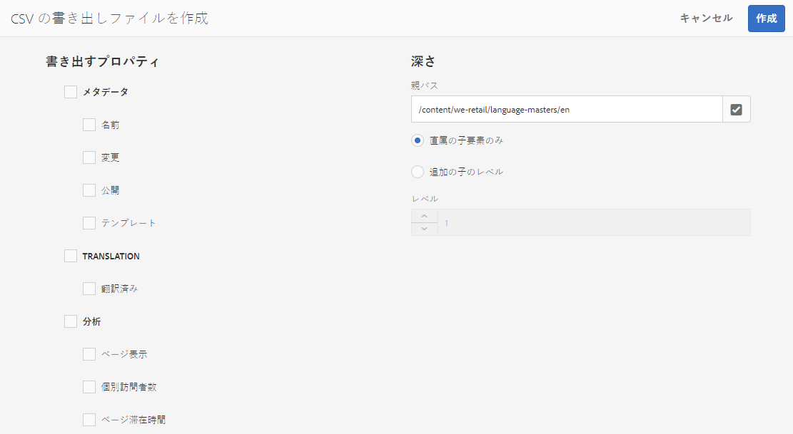

# CSV ファイルへの書き出し {#export-to-csv}

**CSV の書き出しファイルを作成** では、ページに関する情報をローカルシステムの CSV ファイルに書き出すことができます。

* ダウンロードしたファイルの名前は `export.csv` になります。
* コンテンツは、選択するプロパティによって異なります。
* 書き出しのパスと深さを定義できます。

>[!NOTE]
>
>ブラウザーのダウンロード機能（およびデフォルトのダウンロード先）が使用されます。

CSV の書き出しファイルを作成ウィザードでは、次の要素を選択できます。

* 書き出すプロパティ

   * メタデータ

      * 変更
      * 公開済み
   * 分析

      * ページ表示
      * 個別訪問者数
      * ページ滞在時間

* 深さ

   * 親パス
   * 直属の子要素のみ
   * 追加の子のレベル
   * レベル

生成された `export.csv` ファイルは、Excel（または互換性のあるその他のアプリケーション）で開くことができます。

作成 **CSV の書き出し** オプションは **サイト** コンソール（リスト表示）:これは、 **作成** ドロップダウンメニュー：

CSV の書き出しファイルを作成するには、次の手順を実行します。

1. **サイト**&#x200B;コンソールを開き、必要に応じて必要な場所まで移動します。
1. ツールバーで、「 」を選択します。 **作成** その後 **CSV の書き出し** ウィザードを開くには、次の手順に従います。

   

1. 書き出す必要のあるプロパティを選択します。
1. 「**作成**」を選択します。
