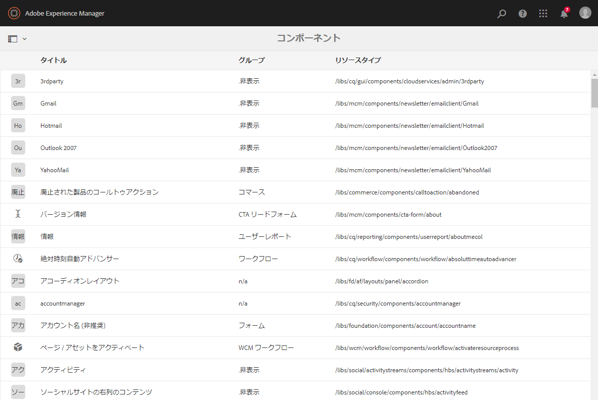
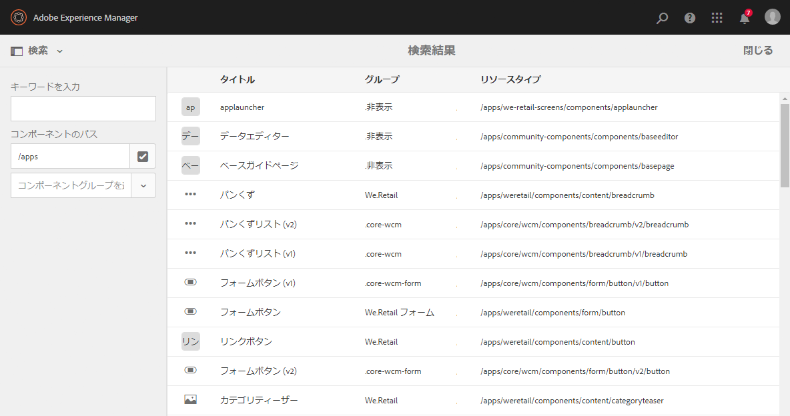
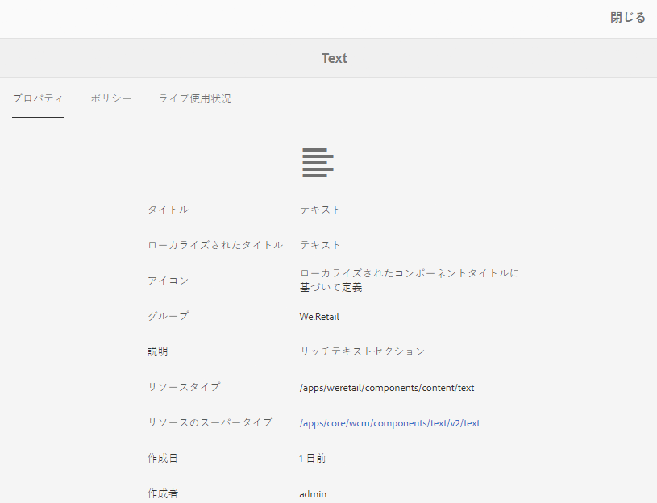
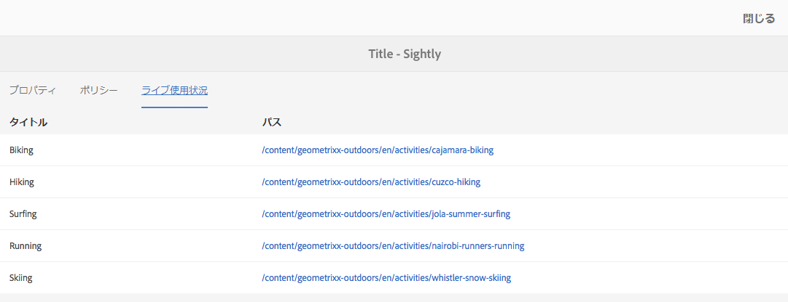

# コンポーネントコンソール {#components-console}

コンポーネントコンソールを使用すると、インスタンスに定義されたすべてのコンポーネントを参照し、各コンポーネントの主な情報を表示できます。

次の場所からアクセスできます。 **ツール** -> **一般** -> **コンポーネント**. コンソールでは、カード表示およびリスト表示を使用できます。コンポーネントのツリー構造がないので、列表示は使用できません。

>[!NOTE]
>
>コンポーネントコンソールには、システムのすべてのコンポーネントが表示されます。[コンポーネントブラウザー](/help/sites-authoring/author-environment-tools.md#components-browser)には、作成者が使用できるコンポーネントが表示され、ピリオド（`.`）で始まるすべてのコンポーネントグループは非表示になります。

## 検索 {#search-features}

「**コンテンツのみ**」アイコン（左上）を使用して「**検索**」パネルを開き、コンポーネントの検索やフィルタリングを行うことができます。

## コンポーネントの詳細 {#component-details}

特定のコンポーネントに関する詳細を表示するには、必要なリソースをタップまたはクリックします。 次の 3 つのタブが表示されます。

* **プロパティ**

   

   「プロパティ」タブでは、次のことができます。

   * コンポーネントの一般的なプロパティの表示。
   * 次の項目を表示： [アイコンまたは省略形が定義されています](/help/sites-developing/components-basics.md#component-icon-in-touch-ui) コンポーネント用。

      * アイコンのソースをクリックすると、そのコンポーネントに移動します。
   * 次を表示： **リソースタイプ** および **リソースのスーパータイプ** （定義されている場合）。

      * 「リソーススーパータイプ」をクリックすると、そのコンポーネントが表示されます。
   >[!NOTE]
   >
   >`/apps` は実行時には編集できないので、コンポーネントコンソールは読み取り専用です。

* **ポリシー**

   

* **ライブ使用状況**

   

   >[!CAUTION]
   >
   >この表示で収集される情報の性質から、照合および表示には時間がかかることがあります。

* **ドキュメント**

   開発者が [コンポーネントのドキュメント](/help/sites-developing/developing-components.md#documenting-your-component)を含めない場合、 **ドキュメント** タブをクリックします。 利用できるドキュメントがない場合は、「**ドキュメント**」タブは表示されません。

   
