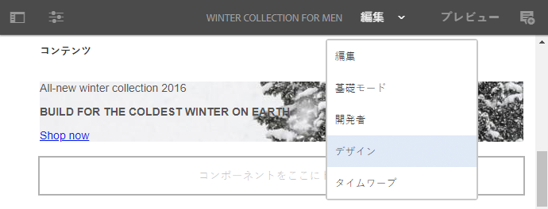

# デザインモードでのコンポーネントの設定 {#configuring-components-in-design-mode}

>[!CAUTION]
>
>AEM 6.4 の拡張サポートは終了し、このドキュメントは更新されなくなりました。 詳細は、 [技術サポート期間](https://helpx.adobe.com/jp/support/programs/eol-matrix.html). サポートされているバージョンを見つける [ここ](https://experienceleague.adobe.com/docs/?lang=ja).

標準でAEMインスタンスをインストールすると、コンポーネントブラウザーですぐに様々なコンポーネントを使用できます。

加えて、これら以外の様々なコンポーネントも使用できます。このような[コンポーネントを有効または無効にする](#enable-disable-components)には、デザインモードを使用します。コンポーネントを有効にしてページに配置したら、デザインモードを使用して属性パラメーターを編集することで[コンポーネントデザインの様々な要素を設定](#configuring-the-design-of-a-component)できます。

>[!NOTE]
>
>これらのコンポーネントを編集する際は注意が必要です。 デザイン設定は、多くの場合、Web サイト全体のデザインに不可欠な要素なので、適切な特権と経験を持つユーザー（多くの場合、管理者または開発者）のみが変更する必要があります。 詳しくは、[コンポーネントの開発](/help/sites-developing/components.md)を参照してください。

>[!NOTE]
>
>デザインモードは、静的テンプレートでのみ使用できます。 編集可能なテンプレートを使用して作成されたテンプレートは、 [テンプレートエディター](/help/sites-authoring/templates.md).

>[!NOTE]
>
>デザインモードは、（`/etc` の下に）コンテンツとして格納されたデザイン設定にのみ使用できます。
>
>継続的なデプロイメントシナリオをサポートするために、AEM 6.4 以降では、デザインを設定データとして `/apps` の下に格納することをお勧めします。`/apps` の下に格納されたデザインは実行時には編集できず、管理者でなければそうしたテンプレートのユーザーはデザインモードを使用できません。

これには、ページの段落システムで許可されたコンポーネントの追加または削除が含まれます。段落システム（`parsys`）は、他のすべての段落コンポーネントを含む複合コンポーネントです。段落システムを使用すると、作成者は異なるタイプのコンポーネントを、他のすべての段落コンポーネントを含むページに追加できます。 各段落タイプは、コンポーネントとして表されます。

例えば、製品ページのコンテンツには、次の情報を含む段落システムを含めることができます。

* 製品の画像（画像または textimage 段落の形式）
* 製品の説明（テキスト段落）
* 技術データを含むテーブル（表の段落として）
* フォームユーザーが入力する（フォームの開始、フォームの要素、フォームの終了段落として）

>[!NOTE]
>
>`parsys` について詳しくは、[コンポーネントの開発](/help/sites-developing/components.md)および[テンプレートとコンポーネントの使用に関するガイドライン](/help/sites-developing/dev-guidelines-bestpractices.md#guidelines-for-using-templates-and-components)を参照してください。

>[!CAUTION]
>
>静的テンプレートのデザインを定義する方法としては、ここで説明しているような、デザインモードを使用したデザイン編集をお勧めします。
>
>CRX DE でデザインを変更する例はベストプラクティスではなく、そのようなデザインのアプリケーションは、意図した動作とは異なることがあります。詳しくは、開発者向けドキュメントの[ページテンプレート - 静的](/help/sites-developing/page-templates-static.md#how-template-designs-are-applied)を参照してください。

## コンポーネントを有効/無効にする {#enable-disable-components}

コンポーネントを有効または無効にするには：

1. **デザイン**&#x200B;モードを選択します。

   

1. コンポーネントをタップまたはクリックします。 コンポーネントを選択すると、青い境界線が表示されます。

   

1. **親**&#x200B;アイコンをクリックまたはタップします。

   

   これにより、現在のコンポーネントを格納する段落システムを選択します。

1. 段落システムの&#x200B;**設定**&#x200B;アイコンが親のアクションバーに表示されます。

   

   このアイコンを選択してダイアログを表示します。

1. このダイアログを使用して、現在のページの編集時にコンポーネントブラウザーで利用できるコンポーネントを定義します。

   

   ダイアログには次の 2 つのタブがあります。

   * 許可されたコンポーネント
   * 設定

   **許可されたコンポーネント**

   「**許可されたコンポーネント**」タブで、parsys で使用できるコンポーネントを定義します。

   * コンポーネントは、コンポーネントグループ別にグループ化され、展開したり折りたたんだりできます。
   * グループ名をチェックしてグループ全体を選択し、チェックを外すことですべての選択を解除できます。
   * マイナス記号は、グループ内の項目が少なくとも 1 つ選択されているが、選択されていない項目を表します。
   * 検索を使用して、名前でコンポーネントをフィルタリングできます。
   * コンポーネントグループ名の右側に一覧表示されるカウントは、フィルターに関係なく、これらのグループ内で選択されたコンポーネントの合計数を表します。

   設定は、ページコンポーネントごとに定義します。 子ページが同じテンプレートやページコンポーネント（通常は整列）を使用している場合は、対応する段落システムにも同じ設定が適用されます。

   >[!NOTE]
   >
   >アダプティブフォームのコンポーネントは、アダプティブフォームコンテナ内で動作し、Formsエコシステムを活用するように設計されています。 したがって、これらのコンポーネントはアダプティブフォームエディターでのみ使用する必要があり、サイトページエディターでは機能しません。

   **設定**

   の **設定** 「 」タブでは、追加のオプションを定義できます。例えば、コンポーネントごとにアンカーを描画したり、各コンテナのセル内の余白を定義したりできます。

1. 「**完了**」を選択して設定を保存します。

## コンポーネントのデザインの設定 {#configuring-the-design-of-a-component}

1. **デザイン**&#x200B;モードを選択します。

   

1. 青い境界線のあるコンポーネントをタップまたはクリックします。この例では、ヒーロー画像コンポーネントが選択されています。

   

1. ダイアログを開くには、「**設定**」アイコンを使用します。

   

   デザインダイアログでは、使用可能なデザインパラメーターに従ってコンポーネントを設定できます。

   

   ダイアログには次の 3 つのタブがあります。

   * メイン
   * 機能
   * スタイル

   **プロパティ**

   この **プロパティ** 「 」タブでは、コンポーネントの重要なデザインパラメーターを設定できます。 例えば、画像コンポーネントの場合、許可される画像の最大サイズと最小サイズを定義できます。

   **機能**

   この **機能** 「 」タブでは、コンポーネントの追加機能を有効または無効にできます。 例えば、画像コンポーネントの場合は、画像の向きや切り抜きオプションを定義したり、画像をアップロードできるかどうかを定義したりできます。

   **スタイル**

   この **スタイル** 「 」タブでは、コンポーネントで使用する CSS クラスとスタイルを定義できます。

   

   「**追加**」ボタンを使用すると、追加のエントリを複数エントリのダイアログリストに追加できます。

   

   複数エントリのダイアログリストからエントリを削除するには、「削除」アイコンを使用します。

   

   以下を使用： **移動** 複数エントリのダイアログリストでエントリの順序を並べ替えるアイコン。

   

1. クリックまたはタップ **完了** アイコンをクリックして保存し、ダイアログを閉じます。
