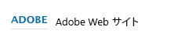
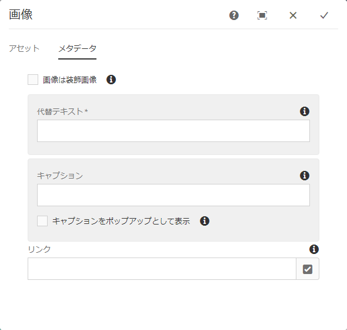

# 基盤コンポーネント{#foundation-components}

>[!NOTE]
>
>この節では、基盤コンポーネントについて説明します。基盤コンポーネントは、多くのバージョンでAEMで使用でき、標準のAEMインストールで標準で使用できます。 ただし、AEM 6.4 では、多くの基盤コンポーネントが非推奨（廃止予定）になっています。
>
>Adobeでは、より最新で拡張可能な [コアコンポーネント](https://helpx.adobe.com/experience-manager/core-components/using/authoring.html). これらは [We.Retail サンプルコンテンツ](/help/sites-developing/we-retail.md)の一部であり、管理者が[個別にインストールして開発に使用](https://helpx.adobe.com/experience-manager/core-components/using/using.html)することもできます。

基盤コンポーネントは、標準 Web ページ用のコンテンツをオーサリングする際に使用するように設計されています。 AEMの標準インストールですぐに使用できるコンポーネントのサブセットを形成します。

一部のコンポーネントはコンポーネントブラウザーからすぐに使用でき、様々な他のコンポーネントも[デザインモード](/help/sites-authoring/default-components-designmode.md)（ページが静的テンプレートに基づいている場合）または[テンプレートの編集](/help/sites-authoring/templates.md)（ページが編集可能テンプレートに基づいている場合）を使用して利用できます。

基盤コンポーネントの使用はサポートされていますが、より拡張性と柔軟性を提供するコアコンポーネントに置き換えられました。

>[!NOTE]
>
>このセクションでは、標準のAEMインストールで標準で使用できるコンポーネントについてのみ説明します。
>
>インスタンスによっては、要件に合わせて明示的に開発されたカスタマイズコンポーネントが存在する場合があります。これらは、ここで説明するいくつかのコンポーネントと同じ名前の場合があります。

コンポーネントは、 **コンポーネント** タブをクリックします。 [ページの編集](/help/sites-authoring/editing-content.md).

コンポーネントを選択し、ページ上の必要な場所にドラッグできます。 その後、次を使用して編集できます。

* [プロパティの設定](/help/sites-authoring/editing-page-properties.md)
* [コンテンツの編集](/help/sites-authoring/editing-content.md)
* [コンテンツの編集 - 全画面表示モード](/help/sites-authoring/editing-content.md#edit-content-full-screen-mode)

コンポーネントは、コンポーネントグループと呼ばれる、次のような様々なカテゴリに従って並べ替えられます。

* [一般](#general):テキスト、画像、テーブル、グラフなどの基本的なコンポーネントが含まれます。
* [列](#columns):コンテンツのレイアウトの構成に必要なコンポーネントが含まれます。
* [フォーム](#form):フォームの作成に必要なすべてのコンポーネントを含めます。

## 一般 {#general}

一般コンポーネントは、コンテンツの作成に使用する基本コンポーネントです。

### アカウント項目 {#account-item}

>[!CAUTION]
>この基盤コンポーネントは廃止されました。代わりに、[コアコンポーネント](https://experienceleague.adobe.com/docs/experience-manager-core-components/using/introduction.html?lang=ja)を利用することをお勧めします。

タイトルと説明を含むリンクを定義できます。



### アダプティブ画像 {#adaptive-image}

>[!CAUTION]
>この基盤コンポーネントは廃止されました。Adobeでは、 [コアコンポーネントの画像コンポーネント](https://experienceleague.adobe.com/docs/experience-manager-core-components/using/components/image.html?lang=ja) 代わりに、

アダプティブ画像の基盤コンポーネントは、Web ページが開かれているウィンドウに合わせてサイズが調整された画像を生成します。 このコンポーネントを使用するには、ファイルシステムまたは DAM から画像リソースを提供します。 Web ページを開くと、現在のウィンドウに適したサイズに変更された画像のコピーが Web ブラウザーによってダウンロードされます。

ウィンドウのサイズは、次の特性によって決まります。

* デバイス画面：モバイルデバイスは通常、web ページを画面全体に展開して表示します。
* Web ブラウザーウィンドウのサイズ：ノートパソコンとデスクトップコンピュータのユーザーは、Web ブラウザーのウィンドウのサイズを変更できます。

例えば、Web ページを携帯電話で開くときは小さい画像を生成し、タブレットで開くと中サイズの画像を生成します。 ノート PC では、最大化された Web ブラウザーでページを開くと、コンポーネントは大きな画像を作成して配信します。 Web ブラウザーが画面の一部に合わせてサイズ変更されると、コンポーネントは小さい画像を配信して調整し、ビューを更新します。

#### サポートされる画像形式 {#supported-image-formats}

アダプティブ画像コンポーネントでは、次のファイル名拡張子を持つ画像ファイルを使用できます。

* .jpg
* .jpeg
* .png
* .gif &amp;ast;&amp;ast;

>[!CAUTION]
>
>&amp;ast;&amp;ast;アダプティブレンディションのAEMでは、アニメーション.gif ファイルはサポートされていません。

#### 画像のサイズと画質 {#images-sizes-and-quality}

次の表に、指定したビューポート幅に対して生成される画像の幅を示します。 生成される画像の高さは、一定の縦横比を維持するように計算され、画像のエッジ内に空白は発生しません。 切り抜きを使用して、空白を防ぐことができます。

イメージがJPEGイメージの場合、ビューポートサイズもJPEG品質に影響します。 次のJPEG品質が可能です。

* 低 (0.42)
* 中 (0.82)
* 高 (1.00)

| ビューポートの幅の範囲（ピクセル） | 画像の幅（ピクセル） | JPEG 画質 | ターゲットデバイスタイプ |
|---|---|---|---|
| width &lt;= 319 | 320 | 低 |  |
| width = 320 | 320 | 中 | 携帯電話（縦長） |
| 320 &lt; 幅 &lt; 481 | 480 | 中 | 携帯電話（横向き） |
| 480 &lt; 幅 &lt; 769 | 476 | 高 | タブレット（縦置き） |
| 768 &lt; 幅 &lt; 1025 | 620 | 高 | タブレット（横置き） |
| width &lt;= 1025 | フル（元のサイズ） | 高 | デスクトップ |

#### プロパティ {#properties}

ダイアログを使用すると、アダプティブ画像コンポーネントのインスタンスのプロパティを編集できます。プロパティの多くは、基本となる画像コンポーネントと共通しています。プロパティは次の 2 つのタブに表示されます。

* **画像**

   * **画像**

      コンテンツファインダーから画像をドラッグするか、クリックして画像を読み込むための参照ウィンドウを開きます。 画像が読み込まれた後、画像を切り抜いたり、回転したり、削除したりできます。 画像のズームインおよびズームアウトを行うには、画像の下（「OK」および「キャンセル」ボタンの上）のスライドバーを使用します。

   * **切り抜き**

      画像を切り抜く。 境界線をドラッグして画像を切り抜きます。

   * **回転**

      「回転」を繰り返しクリックして、画像を必要に応じて回転させます。

   * **消去**
現在の画像を削除します。

* **詳細**

   * **タイトル**

      アダプティブ画像コンポーネントでは、このプロパティは使用されません。

   * **代替テキスト**

      画像に使用する代替テキスト。

   * **リンク先**

      アダプティブ画像コンポーネントでは、このプロパティは使用されません。

   * **説明**

      アダプティブ画像コンポーネントでは、このプロパティは使用されません。

#### アダプティブ画像コンポーネントの拡張 {#extending-the-adaptive-image-component}

アダプティブ画像コンポーネントのカスタマイズについて詳しくは、 [アダプティブ画像コンポーネントについて](/help/sites-developing/responsive.md#using-adaptive-images).

### カルーセル {#carousel}

カルーセルコンポーネントを使用すると、個々のページに関連付けられた画像を表示できます。

* 一度に 1 つ
* 短時間
* 指定した順序で
* 指定した時間遅延で

また、クリック可能なコントロールを使用すると、ユーザーは表示されたページをリアルタイムでオンデマンドで切り替えることができます。 現在表示されているページ画像をクリックすると、そのページに移動します。 つまり、カルーセルはナビゲーションコントロールとして機能します。

#### プロパティ {#properties-1}

これらは、次の 2 つのタブで使用できます。

* **カルーセル**

   ここでは、カルーセルの動作方法を指定します。

   * 再生速度

      次のスライドが表示されるまでの時間（ミリ秒）です。

   * 遷移時間

      2 つのスライド間の切り替えの時間（ミリ秒）。

   * コントロールのスタイル

      プルダウンメニューからは、様々なオプションを使用できます。例えば、前/次のボタン、右上スイッチなどです。

* **リスト**

   ページをカルーセルに含める方法を指定します。

   * **リストを選択**

      ページリストを作成する方法はいくつかあります。子ページ、固定リスト、検索、詳細検索（以下で説明します）。

      どの方法を選択しても、リストに含めるページには、それぞれ既にページに関連付けられた画像が存在するはずで、この画像がカルーセルに表示されます。 そのページのページプロパティの下に特定のページの画像がない場合、カルーセルには空白（またはほとんど空白）のページが表示されるので、画像を開始前にページに関連付ける必要があります。 詳しくは、 [ページプロパティの編集](/help/sites-authoring/editing-page-properties.md).

      選択した項目に応じて、新しいパネルが表示されます。

      * **子ページのオプション**

         * **親ページ**
手動で、またはセレクターを使用して、パスを指定します。現在のページを親として使用するには、空のままにします。
      * **固定リストのオプション**

         * **ページ**
ページのリストを選択します。 
エントリを追加するには `+` を、順序を調整するには上下のボタンを使用します。
      * **検索のオプション**

         * **開始**

            手動で、またはセレクターを使用して、開始パスを入力します。

         * **検索クエリー**

            プレーンテキストの検索クエリーを入力できます。
      * **詳細検索のオプション**

         * **Querybuilder 述語の表記**

            「QueryBuilder 述語の表記」を使用して検索クエリーを入力できます。例えば、「fulltext=Marketing」と入力すると、コンテンツに「Marketing」を含むすべてのページがカルーセルに表示されます。

            クエリー式とその他の例の詳細は、[QueryBuilder API](/help/sites-developing/querybuilder-api.md) を参照してください。
   * **並べ替え順**

      選択 `jcr:title`, `jcr:created`, `cq:lastModified`または `cq:template` をドロップダウンメニューから選択します。

   * **制限**

      カルーセルで使用する項目の最大数。これはオプションです。


>[!NOTE]
>
>AEM DAM にあるデジタルアセットを表示するAdobe Experience Manager用のカスタムカルーセルコンポーネントを作成できます。 詳しくは、 [Adobe Experience Manager用カスタムカルーセルコンポーネントの作成](https://experienceleague.adobe.com/docs/experience-manager-learn/getting-started-wknd-tutorial-develop/overview.html?lang=ja-JP&amp;CID=RedirectAEMCommunityKautuk).

### グラフ {#chart}

グラフコンポーネントを使用して、棒グラフ、折れ線グラフまたは円グラフを追加できます。 指定したデータからAEMがグラフを作成します。 「データ」タブに直接入力するか、スプレッドシートをコピー&amp;ペーストしてデータを指定します。

* **データ**

   * **チャートのデータ**

      CSV 形式でグラフデータを入力します。コンマ区切り値の形式では、フィールド区切り文字としてコンマ (&quot;,&quot;) が使用されます。

* **詳細**

   * **チャートのタイプ**

      「円グラフ」、「折れ線グラフ」、「棒グラフ」から選択します。

   * **代替テキスト**

      グラフの代わりに表示される代替テキスト。

   * **幅**

      グラフの幅（ピクセル単位）。

   * **高さ**

      グラフの高さ（ピクセル単位）。

グラフデータと結果の棒グラフの例は次のとおりです。

 

>[!NOTE]
>
>AEM JCR にあるデータを表示するカスタムAEMチャートコントロールを作成できます。 詳しくは、 [グラフでのAdobe Experience Managerデータの表示](https://experienceleague.adobe.com/docs/experience-manager-learn/getting-started-wknd-tutorial-develop/overview.html?lang=ja-JP&amp;CID=RedirectAEMCommunityKautuk).

### コンテンツフラグメント {#content-fragment}

[コンテンツフラグメント](/help/sites-authoring/content-fragments.md) は、ページに依存しないアセットとして作成および管理されます。 その後、コンテンツページをオーサリングする際に、これらのフラグメントとそれらのバリエーションを使用できます。

### デザインインポーター {#design-importer}

これにより、デザインパッケージを含む zip ファイルをアップロードできます。

### ダウンロード {#download}

ダウンロードコンポーネントは、選択した Web ページに、特定のファイルをダウンロードするためのリンクを作成します。 コンテンツファインダーからアセットをドラッグするか、ファイルをアップロードできます。

* **ダウンロード**

   * **説明**

      ダウンロードリンクと共に表示される短い説明。

   * **ファイル**

      生成される Web ページでダウンロード可能なファイル。 コンテンツファインダーからアセットをドラッグするか、領域をクリックして、ダウンロード可能なファイルをアップロードします。

Geometrixx でのダウンロードコンポーネントの例は次のとおりです。


### 外部 web アプリケーション {#external}

外部アプリケーション統合コンポーネント（**External**）を使用すると、iframe を使用して外部アプリケーションを AEM ページに埋め込むことができます。

* **外部 web アプリケーション**

   * **対象アプリケーション**

      統合する Web アプリケーションの URL を指定します。例：

      ```
      https://en.wikipedia.org/wiki/Main_Page
      ```

   * **パスパラメーター**

      必要に応じて、「 」チェックボックスをオンにして、アプリケーションに渡すパラメーターを選択します。

   * **幅と高さ**

      iframe のサイズを定義します。

外部アプリケーションは AEM ページの段落システムに統合されます。例えば、`https://en.wikipedia.org/wiki/Main_Page` の対象アプリケーションを使用している場合は、次のようになります。


>[!NOTE]
>
>ユースケースに応じて、その他のオプション（例：外部アプリケーションの統合）を使用できます。 の [ポートレットの統合](/help/sites-administering/aem-as-portal.md).

### Flash {#flash}

>[!CAUTION]
>この基盤コンポーネントは廃止されました。代わりに、[コアコンポーネント](https://experienceleague.adobe.com/docs/experience-manager-core-components/using/introduction.html?lang=ja)を利用することをお勧めします。

>[!CAUTION]
>
>このコンポーネントは、プロジェクトレベルのカスタマイズが必要ない限り、すぐに使用できる状態では機能しなくなりました。

Flashコンポーネントを使用すると、ムービーを読み込むことがFlashできます。 Flash アセットをコンテンツファインダーからコンポーネントにドラッグするか、ダイアログを使用します。

* **Flash**

   * **Flash ムービー**

      Flash ムービーファイル。 コンテンツファインダーからアセットをドラッグするか、クリックして参照ウィンドウを開きます。

   * **サイズ**

      ムービーを保持する表示領域の寸法（ピクセル単位）。

* **代替イメージ**

   表示する代替画像。

* **詳細**

   * **コンテキストメニュー**

      コンテキストメニューを表示するか非表示にするかを示します。

   * **ウィンドウモード**

      不透明、透明、枠付きウィンドウなど、ウィンドウの表示方法。

   * **背景色**

      提示される色見本から選択した背景色。

   * **最低バージョン**

      ムービーの実行に必要なAdobeFlash Playerの最小バージョン。 デフォルトは 9.0.0 です。

   * **属性**

      その他の属性が必要です。

### 画像 {#image}

画像コンポーネントによって、指定したパラメーターに従って、画像とそれに付随するテキストが表示されます。

画像をアップロードした後、編集および操作できます（切り抜き、回転、リンク/タイトル/テキストの追加など）。

画像は、 [アセットブラウザー](/help/sites-authoring/author-environment-tools.md#assets-browser) コンポーネントまたはその上に直接 [設定ダイアログ](/help/sites-authoring/editing-content.md#component-edit-dialog). 設定ダイアログから画像をアップロードすることもできます。また、このダイアログボックスでは、画像のすべての定義と操作も制御します。



画像がアップロードされて初めて、[インプレース編集](/help/sites-authoring/editing-content.md#edit-content)を使用して、必要に応じて画像の切り抜きや回転が可能になります。


>[!NOTE]
>
>インプレースエディターでは、編集時に、画像の元のサイズと縦横比を使用します。高さと幅のプロパティも指定できます。プロパティで定義したサイズや縦横比の制限は、編集の変更内容を保存するときに適用されます。
>
>インスタンスによっては、[ページのデザイン](/help/sites-developing/designer.md)によって最小および最大の制限が課される場合もあります。これらは、プロジェクト実装時に開発されます。

フルスクリーン編集モードで使用できる追加オプションがいくつか用意されています（マップ、ズームなど）。


>[!NOTE]
>
>Internet Explorer では、アップロードの進行状況を監視できません。
>
>Internet Explorer を使用する場合、アップロードした画像ファイルをプレビューに表示して変更（トリミングなど）を実行できるようにするには、画像をアップロードし「**OK**」をクリックしてから画像を再度開く必要があります。
>
>詳しくは、 [サポートされるプラットフォーム](/help/release-notes/release-notes.md#supported-platforms) AEMで使用されるHTML5 機能について詳しくは、こちらを参照してください。

画像を読み込む際は、次の設定が可能です。

* **マップ**

   画像をマップするには、「マップ」を選択します。画像マップの作成方法（長方形、多角形など）を指定し、領域が指す位置を指定します。

* **切り抜き**

   「切り抜き」をクリックして画像を切り抜きます。マウスを使用して画像を切り抜きます。

* **回転**

   画像を回転するには、「回転」を選択します。画像が目的の向きになるまで繰り返し使用します。

* **消去**

   現在の画像を削除します。

* **タイトル**

   画像のタイトル。

* **代替テキスト**

   アクセシブルなコンテンツを作成する際に使用する代替テキスト。

* **リンク先**

   web サイト内のアセットまたはその他のページへのリンクを作成します。

* **説明**

   画像の説明。

* **サイズ**

   画像の高さと幅を設定します。

>[!NOTE]
>
>一部のオプションは、全画面表示エディターでのみ使用できます。

最終的な画像（**タイトル**&#x200B;と&#x200B;**説明**&#x200B;を含む）は、次のように表示されます。


### レイアウトコンテナ {#layout-container}

このコンポーネントは、[レスポンシブグリッド](/help/sites-authoring/responsive-layout.md)内にコンポーネントを追加および配置できるグリッド段落システムを提供します。これにより、電話、タブレット、デスクトップを含むターゲットデバイスの幅に基づいて、様々なコンテンツレイアウトを定義できます。


>[!NOTE]
>
>このコンポーネントは [HTML テンプレート言語（HTL）](https://helpx.adobe.com/jp/experience-manager/htl/user-guide.html)を使用して実装されています。

### リスト {#list}

リストコンポーネントを使用すると、リストを表示するための検索条件を設定できます。

* **リスト**

   * **リストを選択**

      ここで、リストがコンテンツを取得する場所を指定します。 次の方法があります。

   * 選択した項目に応じて、新しいパネルが表示されます。

      * **子ページのオプション**

         * （親ページ）**の子**

            手動で、またはセレクターを使用して、パスを指定します。現在のページを親として使用するには、空のままにします。
      * **固定リストのオプション**

         * **ページ**

            ページのリストを選択します。エントリを追加するには + を、順序を調整するには上下ボタンを使用します。
      * **検索のオプション**

         * **開始**

            手動で、またはセレクターを使用して、開始パスを入力します。

         * **検索クエリー**

            プレーンテキストの検索クエリーを入力できます。
      * **詳細検索のオプション**

         * **Querybuilder 述語の表記**

            「QueryBuilder 述語の表記」を使用して検索クエリーを入力できます。例えば、「fulltext=Marketing」と入力すると、コンテンツに「Marketing」を含むすべてのページがカルーセルに表示されます。

            クエリー式とその他の例の詳細は、[QueryBuilder API](/help/sites-developing/querybuilder-api.md) を参照してください。
      * **タグ**

         「**親ページ**」、「**タグ／キーワード**」および必要な一致条件を指定します。
   * **表示方法**

      リンク、ティーザー、ニュースなどの項目のリストを表示する方法。

   * **並べ替え順**

      リストを並べ替えるかどうか。並べ替える場合は、並べ替えに使用する条件も指定します。 条件を入力するか、表示されるドロップダウンリストから条件を選択できます。

   * **制限**

      リストに表示する項目の最大数を指定します。

   * **フィードを有効にする**

      そのリストで RSS フィードを有効化するかどうかを示します。

   * **1 ページに表示する数**

      ここでは、一度に表示するリスト項目の数を指定できます。 指定した数より多い項目を含むリストは、ページネーションを使用して複数の部分にリストを表示します。


次の例は、 **リスト** コンポーネント子ページのリストを表示する方法（デザインは、サイトデザインのカスタム CSS 定義によって制御されます）。


### ログイン {#login}

>[!CAUTION]
>この基盤コンポーネントは廃止されました。代わりに、[コアコンポーネント](https://experienceleague.adobe.com/docs/experience-manager-core-components/using/introduction.html?lang=ja)を利用することをお勧めします。

>[!CAUTION]
>
>このコンポーネントは、プロジェクトレベルで大規模にカスタマイズしない限り、すぐに使用できる状態では機能しなくなりました。

「ユーザー名」フィールドと「パスワード」フィールドを提供します。


次の項目を設定できます。

* ログイン

   * セクションラベル

      入力フィールドの導入部テキスト。

   * ユーザー名ラベル

      ユーザー名フィールドにラベルを付けるテキスト。

   * パスワードラベル

      パスワードフィールドにラベルを付けるテキスト。

   * ログインボタンのラベル

      ログインボタンのテキスト。

   * リダイレクト先

      ユーザーがログインしたときに開く Web サイト上のページを指定できます。

* ログイン済み

   * 続行ボタンのラベル

      ユーザーが既にログインしていることを示すテキスト。

### 注文ステータス {#order-status}

>[!CAUTION]
>
>このコンポーネントは、プロジェクトレベルで大規模にカスタマイズしない限り、すぐに使用できる状態では機能しなくなりました。

* **タイトル**

   * **タイトル**

      表示するタイトルテキストを指定します。

   * **リンク**

      どのページ（製品）の注文ステータスを表示するかを指定します。

   * **種類／サイズ**

      用意された選択肢からを選択します。


### 参照 {#reference}

この **参照** コンポーネントを使用すると、（現在のインスタンス内の）AEM Web サイトの別のページからテキストを参照できます。 参照先の段落の内容は、現在のページ上にあるかのように表示されます。 ソース段落が変更されると、コンテンツが更新されます（ページの更新が必要になる場合があります）。

* **段落参照**

   * **参照**

      参照するページと段落のパスを指定します（コンテンツを含む）。

段落のパスを指定するには、ページのパスに次のようなサフィックスを付ける必要があります。

`.../jcr:content/par/<paragraph-ID>`

次に例を示します。

`/content/geometrixx-outdoors/en/equipment/biking/cajamara/jcr:content/par/similar-products`

特定の段落を参照するだけでなく、パスを変更して par-system 全体を指定することもできます。 これをおこなうには、パスの末尾に次のサフィックスを付けます。

`/jcr:content/par`

次に例を示します。

`/content/geometrixx-outdoors/en/equipment/biking/cajamara/jcr:content/par`

設定が完了すると、ソースページと同様にコンテンツが表示されます。参照であるということは、コンポーネントを編集用に開いた場合にのみ確認できます。


### 検索 {#search-features}

>[!CAUTION]
>この基盤コンポーネントは廃止されました。代わりに、[クイック検索コアコンポーネント](https://experienceleague.adobe.com/docs/experience-manager-core-components/using/components/quick-search.html?lang=ja)を利用することをお勧めします。

検索コンポーネントで、ページに検索機能を追加します。

次の項目を設定できます。

* 検索

   * **ノードタイプ**

      検索を特定のノードタイプに制限する場合は、ここにリストします（例：`cq:Page`）。

   * **検索場所のパス**

      検索するブランチのルートページを指定します。

   * **「検索」ボタンのテキスト**

      実際の検索ボタンに表示する名前。

   * **統計テキスト**

      検索結果の上に表示するテキスト。

   * **結果テキストがありません**

      結果がない場合、ここに入力したテキストが表示されます。

   * **テキストをスペルチェック**

      誰かが類似の用語を入力すると、その用語の前にこのテキストが表示されます。


      例えば、geometrixxe と入力すると、「もしかして : geometrixx」と表示されます。

   * **同様のページテキスト**

      類似のページの結果の横に表示されるテキスト。 このリンクをクリックすると、類似のコンテンツを持つページが表示されます。

   * **関連する検索テキスト**

      検索の横に表示される、関連する用語とトピックのためのテキスト。

   * **検索トレンドのテキスト**

      ユーザーが入力する検索用語の上のタイトル。

   * **結果ページラベル**

      このリストの下部に表示するテキスト。他の結果ページへのリンクが設定されます。

   * **前のラベル**

      前の検索ページへのリンクに表示される名前。

   * **次のラベル**

      次の検索ページへのリンクに表示される名前。

次の例は、検索コンポーネントで標準インストールのルートディレクトリから *geometrixx* という単語を検索した後の状態を示しています。結果のページネーションも示しています。


次に、スペルミスがあり使用できない検索用語の例を示します。


### サイトマップ {#sitemap}

>[!CAUTION]
>この基盤コンポーネントは廃止されました。代わりに、[ナビゲーション](https://experienceleague.adobe.com/docs/experience-manager-core-components/using/components/navigation.html?lang=ja)、[言語ナビゲーション](https://experienceleague.adobe.com/docs/experience-manager-core-components/using/components/language-navigation.html?lang=ja)、[パンくずコアコンポーネント](https://experienceleague.adobe.com/docs/experience-manager-core-components/using/components/breadcrumb.html?lang=ja)を利用することをお勧めします。

自動サイトマップリスト。（デフォルト設定で）現在の Web サイトのすべてのページが（アクティブなリンクとして）一覧表示されます。 例えば、次のような抽出があります。


必要に応じて、次の項目を設定できます。

* **サイトマップ**

   * **ルートパス**

      リストを開始するパス。

### Slideshow {#slideshow}

>[!CAUTION]
>この基盤コンポーネントは廃止されました。代わりに、[カルーセルコアコンポーネント](https://experienceleague.adobe.com/docs/experience-manager-core-components/using/components/carousel.html?lang=ja)を利用することをお勧めします。

>[!CAUTION]
>
>このコンポーネントは、プロジェクトレベルで大規模にカスタマイズしない限り、すぐに使用できる状態では機能しなくなりました。

このコンポーネントを使用すると、ページにスライドショーとして表示する一連の画像を読み込むことができます。画像を追加または削除し、各画像にタイトルを割り当てることができます。 「詳細」では、表示領域のサイズも指定できます。

次の項目を設定できます。

* **スライド**

   * **新しいスライド**

      「**追加**」（および「**削除**」）ボタンを使用して、スライドを選択して指定できます。

   * **タイトル**

      必要に応じてタイトルを指定します。これは、該当するスライドに重ねて表示されます。

* **詳細**

   * **サイズ**

      幅と高さをピクセル単位で指定します。

その後、スライドショーコンポーネントによって、各画像が短時間、順に表示された後に次のスライドにフェードするという処理が繰り返されます。


### テーブル {#table}

>[!CAUTION]
>この基盤コンポーネントは廃止されました。代わりに、[テキストコアコンポーネント](https://experienceleague.adobe.com/docs/experience-manager-core-components/using/components/text.html?lang=ja)を利用することをお勧めします。

>[!NOTE]
>
>この **テーブル** コンポーネントは [リッチテキストエディター](/help/sites-authoring/rich-text-editor.md)、 **[テキスト](#text)** コンポーネント。
>
>次を使用することをお勧めします。 **テーブル** テーブルのコンポーネント ( ただし、 **テキスト** コンポーネント。

この **テーブル** コンポーネントは、テーブルの作成、塗りつぶし、書式設定を行うために事前に設定されています。 ダイアログを使用する場合は、次のいずれかの方法でテーブルを設定し、コンテンツを作成できます。

* ゼロから
* 外部エディター（Excel、OpenOffice、メモ帳など）からスプレッドシートまたはテーブルをコピーして貼り付け

インラインエディターを使用してコンテンツに対して基本的な変更を加えることができます。


フルスクリーンモードでテーブルレイアウトを設定できます。


次の画面ショットは、テーブルコンポーネントの例を示します。サイト専用の CSS でデザインを決定しています。


### タグクラウド {#tag-cloud}

タグクラウドは、Web サイト内のコンテンツに適用されたタグのグラフィカルな選択範囲を表示します。


タグクラウドコンポーネントを設定する場合、次の情報を指定できます。

* **表示するタグ**

   表示するタグを収集する場所。ページ（すべての子またはすべてのタグを含むページ）から選択します。

* **ページ**

   参照するページを選択します。

* **タグにリンクがありません**

   表示するタグがリンクとして機能するかどうか。

タグの適用について詳しくは、 [タグの使用](/help/sites-authoring/tags.md).

### テキスト {#text}

>[!NOTE]
>
>この **テキスト** コンポーネントは [リッチテキストエディター](/help/sites-authoring/rich-text-editor.md)、 **[テーブル](#table)** コンポーネント。
>
>次を使用することをお勧めします。 **テーブル** テーブルのコンポーネント ( ただし、 **テキスト** コンポーネント。

テキストコンポーネントでは、[リッチテキストエディター](/help/sites-authoring/rich-text-editor.md)で提供されている機能により、WYSIWYG エディターを使用してテキストブロックを入力できます。各種アイコンを使用して、テキストを書式設定できます（フォント特性、整列、リンク、リストおよびインデントなど）。


**設定**&#x200B;ダイアログを開いて、次の項目を設定することもできます。

* **スペーサー**
* **テキストスタイル**

書式設定されたテキストがページに表示されます。実際のデザインは、サイトの CSS に応じて異なります。


テキストコンポーネントおよびリッチテキストエディターの機能について詳しくは、[リッチテキストエディター](/help/sites-authoring/rich-text-editor.md)のページを参照してください。

#### インプレース編集 {#inplace-editing}

ダイアログベースのリッチテキスト編集モードに加えて、AEM には、ページのレイアウトどおりに表示されたテキストを直接編集できる、[インプレース編集](/help/sites-authoring/editing-content.md)も用意されています。

### テキストと画像 {#text-image}

テキストと画像コンポーネントは、テキストブロックと画像を追加します。 また、テキストと画像を個別に追加および編集することもできます。 詳しくは、 [テキスト](#text) および [画像](#image) コンポーネントを参照してください。


次の項目を設定できます。

* **コンポーネントスタイル**（**スタイル**）

   ここで画像を左揃えまたは右揃えにすることができます。デフォルトは、画像を左に配置する「**左**」です。

* **画像のプロパティ**（**詳細画像プロパティ**）

   以下を指定できます。

   * **画像アセット**

      必要な画像をアップロードします。

   * **タイトル**

      ブロックのタイトル。マウスオーバーで表示されます。

   * **代替テキスト**

      画像を表示できない場合に表示する代替テキスト。 空白のままにした場合、タイトルが使用されます。

   * **リンク先**

      ターゲットパスを指定します。

   * **説明**

      画像の説明。

   * **サイズ**

      画像の高さと幅を設定します。

次に、画像を左揃えに表示するテキスト画像コンポーネントの例を示します。


### タイトル {#title}

タイトルコンポーネントは、次のいずれかを実行できます。

* 現在のページの名前を表示する。「タイトル」フィールドを空白のままにしておくと、この処理が行われます
* 「タイトル」フィールドに指定したテキストを表示します。

次の項目を設定できます。

* **タイトル**
ページタイトル以外の名前を使用する場合は、ここに入力します。

* **リンク**
タイトルがリンクとして機能する場合の URI。

* **種類/サイズ**
ドロップダウンリストから「小」または「大」を選択します。 小は画像として生成されます。 「大」はテキストとして生成されます。

次の例は、 **タイトル** 表示されるコンポーネント。デザインはサイト固有の CSS で決まります。


### ビデオ {#video}

>[!CAUTION]
>
>このコンポーネントは、プロジェクトレベルで大規模にカスタマイズしない限り、すぐに使用できる状態では機能しなくなりました。

この **ビデオ** コンポーネントを使用すると、事前に定義された標準提供ビデオ要素をページに配置できます。

関連トピック [ビデオコンポーネントの設定](/help/sites-administering/config-video.md) HTML5 要素で使用

ページにコンポーネントのインスタンスを配置した後、次の設定をおこなうことができます。

* ビデオ

   * **ビデオアセット**

   ビデオアセットをアップロードまたはドロップします。

   * **サイズ**

      ビデオのネイティブサイズ（ピクセル単位の幅 × 高さ）が「サイズ」の横のボックスに表示されます（上の図を参照してください）。ビデオのネイティブ寸法を上書きする場合は、幅と高さの寸法を手動で入力します。「**OK**」をクリックしてダイアログを閉じます。


>[!NOTE]
>
>サポートされている形式は次のとおりです。
>
>* `.mp4`
>* `Ogg`
>* `FLV` （Flash ビデオ）
>


## 列 {#columns}

列は、AEMのコンテンツのレイアウトを制御するメカニズムです。 2 列または 3 列を作成するための標準のインストールコンポーネントが用意されています。

次の例は、使用中の 2 列コンポーネントを示しています。 新しいコンポーネントのプレースホルダーを使用できます。


### 2 列 {#columns-1}

2 つの等しい列をデフォルトに設定する列制御コンポーネント。

### 3 列 {#columns-2}

デフォルトで 3 つの同じ列に設定される列制御コンポーネント。

### 列の制御 {#column-control}

列の制御コンポーネントを使用すると、Web ページのメインパネルのコンテンツを複数の列に分割する方法を選択できます。 ユーザーは、必要な列数（事前定義済みのリストから）を選択し、各列内でコンテンツを作成、削除または移動できます。

* **列の制御**

   * **列のレイアウト**

      レンダリングする列数を選択します。作成した各列には、コンテンツの追加時にコンポーネントやアセットをドラッグするための独自のリンクがあります。

## フォーム {#form}

フォームコンポーネントは、訪問者が入力を送信するためのフォームを作成するために使用します。 Formsおよびフォームコンポーネントを使用して、ユーザーのフィードバック（例えば、顧客満足度アンケート）やユーザー情報（例えば、ユーザー登録）などの情報を収集できます。

>[!NOTE]
>
>詳しくは、 [AEM Forms Help](/help/forms/home.md) AEM Formsの詳細

Formsは、次の複数の異なるコンポーネントから構築されています。

* **フォーム**

   フォームコンポーネントは、ページ上の新しいフォームの開始と終了を定義します。 その後、テーブルやダウンロードなど、他のコンポーネントをこれらの要素の間に配置できます。

* **フォームのフィールドと要素**

   フォームのフィールドと要素には、テキストボックス、ラジオボタン、画像などを含めることができます。 多くの場合、ユーザーは、テキストの入力など、フォームフィールド内のアクションを完了します。 詳しくは、個々のフォームエレメントを参照してください。

* **プロファイルコンポーネント**

   プロファイルコンポーネントは、訪問者のパーソナライゼーションが必要なソーシャルコラボレーションやその他の領域に使用される訪問者プロファイルに関連しています。

以下にフォームの例を示します。これは&#x200B;**フォーム**&#x200B;コンポーネント（開始および終了）からなり、入力に使用する 2 つの&#x200B;**フォームテキスト**&#x200B;フィールド、導入部のテキストに使用する 1 つの&#x200B;**一般テキスト**&#x200B;フィールド、および「**送信**」ボタンで構成されています。


>[!NOTE]
>
>フォームのさらなる開発およびカスタマイズについて詳しくは、[フォームの開発のページ](/help/sites-developing/developing-forms.md)を参照してください。これには、アクションや制約の追加、フィールドのプリロード、スクリプトを使用したサービスのアクション実施の呼び出しなどが含まれます。

### （多数の）フォームコンポーネントに共通の設定 {#settings-common-to-many-form-components}

各フォームコンポーネントの目的は異なりますが、多くのコンポーネントは同様のオプションとパラメーターで構成されています。

いずれかのフォームコンポーネントを設定する際に、ダイアログで次のタブを使用できます。

* **タイトルとテキスト**

   ここでは、フォームのタイトルや付随するテキストなど、基本情報を指定する必要があります。 また、必要に応じて、フィールドが複数選択可能かどうかや、選択可能な項目など、他の重要な情報を定義できます。

* **初期値**

   デフォルト値を指定できます。

* **制約**

   ここでは、フィールドを必須にするかどうかを指定し、そのフィールドに制約を設定できます（例えば、は数値である必要があります）。

* **スタイル設定**

   フィールドのサイズとスタイルを示します。

>[!NOTE]
>
>表示されるフィールドは、個々のコンポーネントによって大きく異なります。

これらのタブには、必要なパラメーターが表示されます。コンポーネントは、個々のコンポーネントタイプに応じて異なりますが、次のものを含めることができます。

* **タイトルとテキスト**

   * **要素名**

      フォーム要素の名前。 リポジトリー内でデータが格納される場所を示します。

      これは必須のフィールドで、次の文字のみを含める必要があります。

      * 英数字
      * `_ . / : -`
   * **タイトル**

      フィールドと共に表示されるタイトル。 空白の場合、デフォルトのタイトルが表示されます。

   * **説明**

      必要に応じて、ユーザーに追加情報を提供できます。 フォームでは、これはフィールドの下に、タイトルよりも小さいフォントで表示されます。

   * **表示／非表示**

      フィールドを表示するタイミングを指定します。


* **初期値**

   * **デフォルト値**

      フォームが開かれたときにフィールドに表示される値。ユーザーが入力を行う前に

* **制約**

   * **必須**

      フォームコンポーネントの種類によって異なりますが、このフィールドまたはこのフィールドの特定の部分が必須かどうかを示す 1 つ以上のクリックボックスが表示されます。

   * **必須メッセージ**

      このフィールドが必須であることをユーザーに通知するメッセージ。必須フィールドには、アスタリスクのフラグも付けられます。

   * **制約**

      選択可能な制約は、フォームコンポーネントの種類によって異なります。

   * **制約メッセージ**

      どの入力が必須かをユーザーに知らせるメッセージ。

* **スタイル設定**

   * **サイズ**

      行数と列数。

   * **幅**

      ピクセル数。

   * **CSS**

### フォーム（コンポーネント） {#form-component}

フォームコンポーネントは、 **フォーム開始** および **フォーム終了** 要素。 フォームが正しく定義されるように、これらは常にペアになります。


フォームの開始と終了の間に、ユーザーが実際に入力するフィールドを定義するフォームコンポーネントを追加できます。

>[!NOTE]
>
>基盤コンポーネントのフォームコンポーネントでは、他の基盤コンポーネントのフォームコンポーネント（ボタン、テキスト、非表示など）のみを使用できます。 [コアコンポーネント](https://experienceleague.adobe.com/docs/experience-manager-core-components/using/introduction.html?lang=ja)のフォームコンポーネントを基盤コンポーネントフォーム内で使用すること（およびその逆の使用）はサポートされていません。

#### フォームの最初 {#start-of-form}

このコンポーネントは、ページ上の新しいフォームの開始を定義するために必要です。 次の項目を設定できます。

* **フォーム**

   * **Thank You ページ**

      訪問者に入力を求める際に、感謝の意を表すために参照されるページ。 空白の場合、フォームは送信後に再表示されます。

   * **ワークフローを開始**
フォームの送信後にトリガーされるワークフローを指定します。

* **詳細**

   * **アクションタイプ**
フォームにはアクションが必要です。 アクションは、ユーザーから送信されたデータによってトリガーされ実行される処理を定義します（HTML の action= に似ています）。対応する 
**アクションの設定**.

      標準の AEM インストールには、次のアクションタイプが含まれます。

      * **アカウントリクエスト**
      * **コンテンツを作成**
      * **リードを作成**
      * **アカウントを作成および更新**
      * **メールサービス : 購読者を作成してリストに追加**
      * **メールサービス : 自動応答のメールを送信**
      * **メールサービス : リストのユーザーの購読を解除**
      * **コミュニティを編集**
      * **リソースを編集**
      * **ワークフロー制御リソースを編集**
      * **メール**
      * **注文の詳細**
      * **プロファイルの更新**
      * **パスワードをリセット**
      * **パスワードを設定**
      * **コンテンツを格納**

         これはデフォルトのアクションタイプです。

      * **コンテンツをアップロードで保存**
      * **注文を送信**
      * **購読者の登録を解除**
      * **注文を更新**
   * **フォーム識別子**

      フォーム識別子は、フォームを一意に識別します。1 つのページに複数のフォームがある場合、フォーム識別子を使用します。フォームごとに異なる識別子が使用されていることを確認します。

   * **読み込み元パス**

      事前に定義された値をフォームフィールドに読み込むために使用されるノードプロパティのパス。

      これは、リポジトリ内のノードへのパスを指定するオプションのフィールドです。 このノードにフィールド名と一致するプロパティがある場合、フォーム上の適切なフィールドには、これらのプロパティの値がプリロードされます。 一致が存在しない場合、フィールドにはデフォルト値が使用されます。


      **読み込み元パス**&#x200B;を使用して、フォームの必須フィールドに値をプリロードすることができます。[フォーム値のプリロード](/help/sites-developing/developing-forms.md#preloading-form-values)を参照してください。

   * **クライアントの検証**

      このフォームでクライアントの検証が必須かどうかを示します（サーバーの検証は常に行われます）*。*&#x200B;これは、 **Forms Captcha** コンポーネント。

   * **検証リソースタイプ**

      （それぞれのフィールドではなく）フォーム全体を検証する場合、フォームの検証リソースのタイプを定義します。フォーム全体を検証する場合は、次のいずれかも含めます。

      * クライアントの検証用スクリプト：

         `/apps/<myApp>/form/<myValidation>/formclientvalidation.jsp`

      * サーバー側の検証用スクリプト：

         `/apps/<myApp>/form/<myValidation>/formservervalidation.jsp`
   * **アクションの設定**

      「**アクションの設定**」で選択できるオプションは、選択した「**アクションタイプ**」によって異なります。

      * **アカウントリクエスト**

         * **アカウントページを作成**

            新しいアカウントの作成時に使用するページ。
      * **コンテンツを作成**

         * コンテンツのパス

            フォームがダンプするコンテンツのコンテンツパス。スラッシュ（`/`）で終了するパスを入力します。スラッシュは、各フォームポートに対し、特定の場所に新しいノードが作成されることを意味します。次に例を示します。

            `/forms/feedback/`

         * **種類**

            必要な種類を選択します。

         * **フォーム**

            フォームを指定します。

         * **次を使用してレンダリング**

            リストから必要なオプションを選択します。

         * **リソースタイプ**

            設定した場合、`sling:resourceType` として各コメントに追加されます

         * **表示セレクター**
      * **リードを作成**

         * **このリストにリードが追加されます**

            必要なリードリストを指定します。
      * **アカウントを作成および更新**

         * **初期グループ**

            新しいユーザーを割り当てるグループ。

         * **ホーム**

            ログイン成功後に表示するページ。

         * **パス**

            新しいアカウントが作成され、保存される場所の相対パス。

         * **データを表示...**

            このボタンをクリックして、バルクエディターのフォーム結果に関する情報にアクセスします。 ここから情報を `.tsv`（タブ区切り）ファイルに書き出すことができます（このファイルは Excel スプレッドシートなどで使用することができます）。
      * **メール**

         * **送信元**

            電子メールの送信元の電子メールアドレスを入力します。

         * **宛先**

            フォームの送信先の電子メールアドレスを入力します。

         * **CC**

            CC の電子メールアドレスを入力します。

         * **BCC**

            BCC 電子メールアドレスを入力します。

         * **件名**

            電子メールの件名を入力します。
      * **パスワードのリセット**

         * **パスワード変更ページ**

            パスワードの変更時に使用するページ。
      * **コンテンツの格納**

         * **コンテンツのパス**

            フォームがダンプするコンテンツのコンテンツパス。スラッシュ（`/`）で終了するパスを入力します。スラッシュは、フォームのポートごとに、特定の場所に新しいノードが作成されることを意味します。例は次のとおりです。

            `/forms/feedback/`

         * **データを表示...**

            このボタンをクリックして、バルクエディターのフォーム結果に関する情報にアクセスします。 ここから情報を .tsv（タブ区切り）ファイルに書き出すことができます（Excel スプレッドシートなどで使用するため）。
      * **コンテンツをアップロードデータと共に保存**

         これには、**コンテンツを保存**&#x200B;と同じオプションがあります。

      * **購読者の登録を解除**

         * **このリストからリードが削除されます**

            必要なリードリストを指定します。


#### フォームの終わり {#end-of-form}

フォームの終わりを示します。 次の項目を設定できます。

* **フォーム終了**

   * **「送信」ボタンを表示**

      [ 送信 ] ボタンを表示するかどうかを示します。

   * **送信名**

      フォームで複数の送信ボタンを使用する場合の識別子。

   * **送信タイトル**

      「送信」や「送信」など、ボタンに表示される名前です。

   * **「リセット」ボタンを表示**

      「リセット」ボタンを表示するには、チェックボックスを選択します。

   * **リセットタイトル**

      [ リセット ] ボタンに表示される名前です。

   * **説明**

      ボタンの下に表示される情報。

### アカウント名 {#account-name}

ユーザーがアカウント名を入力できます。


### アドレス {#address}

次の形式の国際化対応アドレスフィールドを追加できます。


コンポーネントはすぐに使用できるように設定されていますが、必要に応じて設定を変更できます。 例えば、アドレスの個々の要素に対して制約を追加できます。 フィールドを空のままにすると、デフォルト設定が使用されます。

### Captcha {#captcha}

>[!CAUTION]
>この基盤コンポーネントは廃止されました。代わりに、[コアコンポーネント](https://experienceleague.adobe.com/docs/experience-manager-core-components/using/introduction.html?lang=ja)を利用することをお勧めします。

>[!CAUTION]
>
>このコンポーネントは、プロジェクトレベルで大規模にカスタマイズしない限り、すぐに使用できる状態では機能しなくなりました。

Captcha コンポーネントでは、画面に表示される英数字の文字列を入力する必要があります。 文字列は、更新するたびに変更されます。


このコンポーネントの様々なパラメーターを設定できます。例えば、Captcha 文字列が無効な場合に表示するメッセージを設定できます。

### チェックボックスグループ {#checkbox-group}

チェックボックスを使用すると、1 つ以上のチェックボックスのリストを構築できます。チェックボックスでは同時に複数の項目を選択できます。


タイトル、説明、要素名など、様々なパラメーターを指定できます。 「+」ボタンと「 — 」ボタンを使用して、項目の追加や削除を行い、上下の矢印で配置します。

>[!NOTE]
>
>使用 **項目読み込みパス** チェックボックスグループのリストに値をプリロードできます。
>
>[フォームフィールドへの複数値のプリロード](/help/sites-developing/developing-forms.md#preloading-form-fields-with-multiple-values)を参照してください。

### クレジットカードの詳細 {#credit-card-details}

>[!CAUTION]
>この基盤コンポーネントは廃止されました。代わりに、[コアコンポーネント](https://experienceleague.adobe.com/docs/experience-manager-core-components/using/introduction.html?lang=ja)を利用することをお勧めします。

クレジットカードの詳細を入力するために必要なフィールドを提供できます。使用可能なカードの種類や、必要な情報（セキュリティコードなど）を指定するように設定できます。


### ドロップダウンリスト {#dropdown-list}

ドロップダウンリストを設定して、選択肢の値を提供できます。


リストに表示するタイトルと項目を指定できます。 「+」ボタンと「 — 」ボタンを使用して、リスト項目の追加や削除を行い、上下のボタンを使用して配置します。 ユーザーがリストから複数の項目を選択できるかどうか、およびリストを初めて開いたときに自動的に選択される項目（初期値）を指定できます。

>[!NOTE]
>
>使用 **項目読み込みパス** ドロップダウンリストに値をプリロードできます。
>
>[フォームフィールドへの複数値のプリロード](/help/sites-developing/developing-forms.md#preloading-form-fields-with-multiple-values)を参照してください。

### ファイルのアップロード {#file-upload}

ファイルのアップロードコンポーネントを使用すると、ユーザーがファイルを選択してアップロードできるようになります。


>[!NOTE]
>
>カスタムアップロードコンポーネントを作成して、Sling サーブレットにファイルをアップロードできます。 詳しくは、 [Adobe Experience Managerへのファイルのアップロード](https://helpx.adobe.com/experience-manager/using/uploading-files-aem1.html).

### 非表示のフィールド {#hidden-field}

このコンポーネントでは、非表示のフィールドを作成できます。非表示のフィールドは様々な用途で使用できます。例えば、フォームの送信後にアクションの実行が必要な場合や、後処理で非表示のデータが必要な場合などです。


>[!NOTE]
>
>また、フォーム内の他のフィールドの値に応じて、特定のフォームコンポーネントの表示と非表示を切り替えるようにフォームをカスタマイズすることもできます。 フォームフィールドの表示/非表示を変更すると、特定の条件でのみフィールドが必要な場合に便利です。
>
>詳しくは、 [フォームコンポーネントの表示と非表示](/help/sites-developing/developing-forms.md#showing-and-hiding-form-components).

### 画像ボタン {#image-button}

画像ボタンを使用すると、独自の画像やテキストのボタンを作成できます。


### 画像のアップロード {#image-upload}

画像のアップロードコンポーネントを使用すると、ユーザーが画像ファイルを選択してアップロードできるようになります。


### リンクフィールド {#link-field}

リンクフィールドを使用すると、ユーザーが URL を指定できます。


最も一般的に使用されるのはカレンダーイベントフォームです。このフォームはイベントの URL/リンクフィールドに使用されます。

### パスワードフィールド {#password-field}

ユーザーが自分のパスワードを入力できるようにします。


### パスワードリセット {#password-reset}

このコンポーネントは、次の 2 つのフィールドをユーザーに提供します。

* パスワードの入力
* 入力が正しいことを確認するために、パスワードを繰り返し入力しました。

デフォルト設定では、コンポーネントは次のように表示されます。


### ラジオグループ {#radio-group}

ラジオグループは、1 つ以上のラジオチェックボックスのリストを提供します。特定の時点で選択できるのは、そのうち 1 つのみです。

要素名とタイトルおよび説明を指定できます。 +および — ボタンを使用して、項目を追加または削除し、上下の矢印で配置して、必要に応じてデフォルト値を指定できます。


>[!NOTE]
>
>**項目読み込みパス**&#x200B;を使用して、ラジオグループと値をプリロードすることができます。
>
>[フォームフィールドへの複数値のプリロード](/help/sites-developing/developing-forms.md#preloading-form-fields-with-multiple-values)を参照してください。

### 送信ボタン {#submit-button}

このコンポーネントを使用すると、デフォルトのテキストを指定した送信ボタンを作成できます。


または、独自のテキストも指定できます。


### タグフィールド {#tags-field}

このフィールドでは、タグを選択できます。


特殊なタブを使用して、名前空間を含む様々なパラメーターを指定できます。

* **タグフィールド**

   * **許可された名前空間**

      * **Geometrixx Outdoors**
      * **ワークフロー**
      * **フォーラム**
      * **フォトグラフィー**
      * **Geometrixx Media**
      * **標準タグ**
      * **マーケティング**
      * **アセットのプロパティ**
   * **ピクセル単位の幅**
   * **ポップアップのサイズ**


### テキストフィールド {#text-field}

標準テキストフィールドは、必要なサイズに設定し、独自の導入メッセージを付けることができます。


### ワークフロー送信ボタン {#workflow-submit-button-s}

このコンポーネントを使用すると、ワークフロー内で使用する送信ボタンを作成できます。


