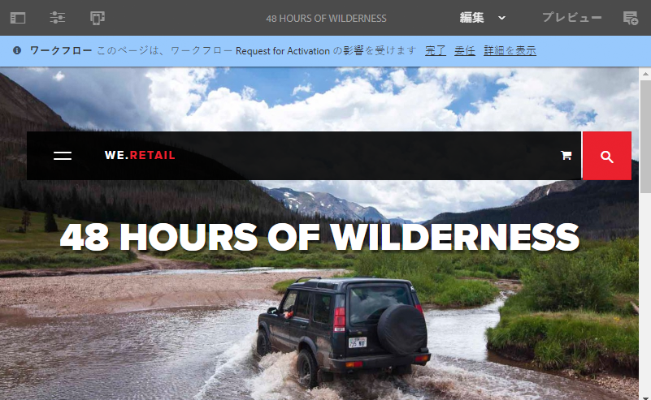
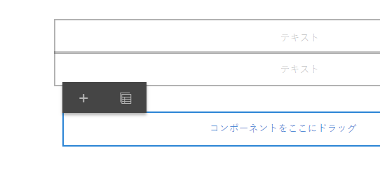

# ページのコンテンツの編集 {#editing-page-content}

ページが作成されたら（新規作成、またはローンチやライブコピーの一部として作成）、コンテンツを編集して、必要な更新をおこなうことができます。

コンテンツは、ページにドラッグ可能な[コンポーネント](/help/sites-authoring/default-components-console.md)（コンテンツのタイプに適したもの）を使用して追加されます。コンポーネントはその後、そのまま編集したり、移動や削除をおこなったりすることができます。

>[!NOTE]
>
>ページを編集するための[適切なアクセス権](/help/sites-administering/security.md)と[権限](/help/sites-administering/security.md#permissions)がアカウントにある必要があります。
>
>問題が発生した場合は、システム管理者にお問い合わせください。

>[!NOTE]
>
>ページやテンプレートが適切に設定されていると、編集中に[レスポンシブレイアウト](/help/sites-authoring/responsive-layout.md)を使用できます。

>[!NOTE]
>
>**編集**&#x200B;モードでは、コンテンツのリンクは表示されますが、**アクセスできません**。コンテンツのリンクを使用して移動する場合は、[プレビューモード](#previewing-pages)を使用します。

## ページツールバー {#page-toolbar}

ページツールバーを使用すると、ページ設定に応じた適切な機能にアクセスできます。

ツールバーを使用すると、様々なオプションにアクセスできます。現在のコンテキストと設定によっては、一部のオプションを使用できないことがあります。

* **サイドパネルを切り替え**

   サイドパネルが開きます（または閉じます）。このパネルには、[アセットブラウザー](/help/sites-authoring/author-environment-tools.md#assets-browser)、[コンポーネントブラウザー](/help/sites-authoring/author-environment-tools.md#components-browser)および[コンテンツツリー](/help/sites-authoring/author-environment-tools.md#content-tree)が含まれています。

   

* **ページ情報**

   ページの詳細およびページに対して実行できるアクション（ページ情報の表示と編集、ページのプロパティの表示、およびページの公開／非公開など）を含む[ページ情報](/help/sites-authoring/author-environment-tools.md#page-information)メニューにアクセスできます。

   

* **エミュレーター**

   別のデバイスでのページのルックアンドフィールをエミュレートするために使用する[エミュレーターツールバー](/help/sites-authoring/responsive-layout.md#selecting-a-device-to-emulate)を切り替えます。レイアウトモードでは自動的に切り替わります。

   

* **ContextHub**

   [ContextHub](/help/sites-authoring/ch-previewing.md) を開きます。プレビューモードでのみ使用できます。

   

* **ページタイトル**

   情報のためにのみ表示されます。

   

* **モードセレクター**

   現在の[モード](/help/sites-authoring/author-environment-tools.md#page-modes)が表示され、別のモード（編集、レイアウト、タイムワープ、ターゲット設定など）を選択できます。

   

* **プレビュー**

   [プレビューモード](/help/sites-authoring/editing-content.md#preview-mode)を有効にします。公開時に表示されるとおりにページを表示します。

   

* **注釈**

   ページをレビューするときに、ページに[注釈](/help/sites-authoring/annotations.md)を追加できます。最初の注釈を追加後、アイコンは、ページ上の注釈の数を示す数字に切り替わります。

   

### ステータスの通知 {#status-notification}

ページが 1 つまたは複数の[ワークフロー](/help/sites-authoring/workflows.md)の一部である場合、この情報はページの編集時に画面の上部にある通知バーに表示されます。

>[!NOTE]
>
>ステータスバーは、適切な特権を持つユーザーアカウントにのみ表示されます。

通知には、ページに対して実行されているワークフローが一覧表示されます。ユーザーが現在のワークフローステップに関係している場合は、[ワークフローのステータスに影響する](/help/sites-authoring/workflows-participating.md)オプションや、ワークフローの詳細を取得するオプションを使用できます。例えば、次のようなものがあります。

* **完了**  — 作業項目を完了ダイアログ **を** 開きます

* **委任**  — 作業項目を完了ダイアログ **を** 開きます

* **詳細を表示** - ワークフローの&#x200B;**詳細**&#x200B;ウィンドウを開きます

通知バーからのワークフローステップの完了および委任は、通知インボックスから[ワークフローに参加](/help/sites-authoring/workflows-participating.md)している場合に動作します。

ページが複数のワークフローの対象である場合は、ワークフローの数がワークフローをスクロールできる矢印ボタンと共に通知の右端に表示されます。

## コンポーネントプレースホルダー {#component-placeholder}

コンポーネントプレースホルダーは、コンポーネントをドロップしたときのコンポーネントの配置場所（現在ポインターを置いているコンポーネントの上）を示します。

* ページに新しいコンポーネントを追加する場合（コンポーネントブラウザーからドラッグ）：

   

* 既存のコンポーネントを移動する場合：

   

## コンポーネントの挿入 {#inserting-a-component}

### コンポーネントブラウザーからのコンポーネントの挿入 {#inserting-a-component-from-the-components-browser}

[コンポーネントブラウザー](/help/sites-authoring/author-environment-tools.md#components-browser)を使用して、新しいコンポーネントを追加できます。[コンポーネントプレースホルダー](#component-placeholder)にコンポーネントの配置先が表示されます。

1. ページが&#x200B;[**編集**&#x200B;モード](/help/sites-authoring/author-environment-tools.md#page-modes)であることを確認します。
1. [コンポーネントブラウザー](/help/sites-authoring/author-environment-tools.md#components-browser)を開きます。
1. 必要なコンポーネントを[必要な位置](#component-placeholder)までドラッグします。

1. コンポーネントを[編集](#edit-configure-copy-cut-delete-paste)します。

>[!NOTE]
>
>モバイルデバイスでは、コンポーネントブラウザーは画面全体に表示されます。コンポーネントをドラッグすると、ブラウザーが閉じて、コンポーネントを配置できるようにページが再び表示されます。

### 段落システムからのコンポーネントの挿入 {#inserting-a-component-from-the-paragraph-system}

段落システムの「**コンポーネントをここにドラッグ**」ボックスを使用して、新しいコンポーネントを追加できます。

1. ページが&#x200B;[**編集**&#x200B;モード](/help/sites-authoring/author-environment-tools.md#page-modes)であることを確認します。
1. 段落システムから新しいコンポーネントを選択して追加する方法は 2 つあります。

   * 既存のコンポーネントのツールバーまたは「**コンポーネントをここにドラッグ**」ボックスから&#x200B;**コンポーネントを挿入**&#x200B;オプション（+）を選択します。

   

   * デスクトップデバイスを使用している場合は、「**コンポーネントをここにドラッグ**」ボックスをダブルクリックします。

   **新規コンポーネントを挿入**&#x200B;ダイアログが表示され、必要なコンポーネントを選択できるようになります。

   

1. 選択したコンポーネントがページの下部に追加されます。必要に応じてコンポーネントを[編集](#edit-content)します。

### アセットブラウザーを使用したコンポーネントの挿入  {#inserting-a-component-using-the-assets-browser}

[アセットブラウザー](/help/sites-authoring/author-environment-tools.md#assets-browser)からアセットをドラッグして、ページに新しいコンポーネントを追加することもできます。この操作により、適切なタイプの新しいコンポーネント（アセットが格納される）が自動的に作成されます。

これは次のアセットタイプに有効です（一部はページや段落システムに依存します）。

<table> 
 <tbody>
  <tr>
   <th>アセットタイプ</th> 
   <th>結果のコンポーネントの種類</th> 
  </tr>
  <tr>
   <td>画像</td> 
   <td>画像</td> 
  </tr>
  <tr>
   <td>ドキュメント</td> 
   <td>ダウンロード</td> 
  </tr>
  <tr>
   <td>製品</td> 
   <td>製品</td> 
  </tr>
  <tr>
   <td>ビデオ</td> 
   <td>Flash</td> 
  </tr>
  <tr>
   <td>コンテンツフラグメント</td> 
   <td>コンテンツフラグメント  </td> 
  </tr>
 </tbody>
</table>

>[!NOTE]
>
>この動作は使用しているインストール環境で設定できます。詳しくは、[アセットをドラッグするとコンポーネントインスタンスが作成されるように段落システムを設定](/help/sites-developing/developing-components.md#configuring-a-paragraph-system-so-that-dragging-an-asset-creates-a-component-instance)を参照してください。

前述のいずれかのアセットタイプをドラッグしてコンポーネントを作成するには：

1. ページが&#x200B;[**編集**&#x200B;モード](/help/sites-authoring/author-environment-tools.md#page-modes)であることを確認します。
1. [アセットブラウザー](/help/sites-authoring/author-environment-tools.md#assets-browser)を開きます。
1. 必要なアセットを必要な位置までドラッグします。[コンポーネントプレースホルダー](#component-placeholder)にコンポーネントの配置先が表示されます。

   アセットタイプに適したコンポーネントが、必要な場所に作成されます。これには選択したアセットが含まれます。

1. 必要に応じて、コンポーネントを[編集](#edit-content)します。

>[!NOTE]
>
>モバイルデバイスでは、アセットブラウザーは画面全体に表示されます。アセットをドラッグすると、ブラウザーが閉じて、アセットを配置できるようにページが再び表示されます。

アセットを参照したとき、アセットをすぐに変更する必要があることに気づいた場合は、アセット名の横にある編集アイコンをクリックすると、ブラウザーから直接[アセットエディター](/help/assets/managing-assets-touch-ui.md)を開始できます。

## 編集／設定／コピー／切り取り／削除／貼り付け {#edit-configure-copy-cut-delete-paste}

コンポーネントを選択すると、ツールバーが開きます。このツールバーからコンポーネントに対して様々なアクションを実行できます。

ユーザーが使用できる実際のアクションは、必要に応じて表示されます。ここではすべてのアクションについては説明していません。

* **編集**

   [コンポーネントの種類に応じて](/help/sites-authoring/default-components.md)[コンポーネントのコンテンツを編集](#edit-content)できます。多くの場合、ツールバーが提供されます。

   

* **設定**

   [コンポーネントの種類に応じて](/help/sites-authoring/default-components.md)、コンポーネントのプロパティを編集および設定できます。多くの場合、ダイアログが開きます。

   

* **コピー**

   コンポーネントをクリップボードにコピーします。貼り付け後も、元のコンポーネントは残ります。

   

* **切り取り**

   コンポーネントをクリップボードにコピーします。貼り付け後、元のコンポーネントは削除されます。

   

* **削除**

   確認後に、ページからコンポーネントを削除します。

   

* **コンポーネントの挿入**

   [新しいコンポーネントを追加](/help/sites-authoring/editing-content.md#inserting-a-component-from-the-paragraph-system)するためのダイアログが開きます。

   

* **貼り付け**

   クリップボードにコピーしたコンポーネントをページに貼り付けます。元のコンポーネントが残るかどうかは、コピーするか、切り取るかによって決まります。

   * 同じページ、または別のページに貼り付けることができます。
   * 項目は、貼り付けアクションを選択した項目の上に貼り付けられます。
   * 貼り付けアクションは、クリップボードにコンテンツがある場合にのみ表示されます。

   

   >[!NOTE]
   >
   >切り取り／コピー操作の前に既に開いていた別のページに貼り付ける場合は、ページを更新して、貼り付けたコンテンツを表示する必要があります。

* **グループ**

   複数のコンポーネントを一度に選択できます。デスクトップデバイスで同じ操作をおこなうには、**Ctrl キーを押しながらクリック**&#x200B;するか、または **Command キーを押しながらクリック**&#x200B;します。

   

* **親**

   選択したコンポーネントの親コンポーネントを選択できます。

   

* **レイアウト**

   選択したコンポーネントの[レイアウト](/help/sites-authoring/editing-content.md#edit-component-layout)を変更できます。選択したコンポーネントにのみ適用され、ページ全体の[レイアウトモード](/help/sites-authoring/author-environment-tools.md#page-modes)はアクティブ化されません。

   

* **エクスペリエンスフラグメントバリエーションに変換**

   これを使用すると、選択したコンポーネントから新しい[エクスペリエンスフラグメント](/help/sites-authoring/experience-fragments.md)を作成したり、既存のエクスペリエンスフラグメントに追加したりできます。

   

## 編集（コンテンツ）{#edit-content}

コンポーネント内のコンテンツを追加または編集するには、次の 2 つの方法があります。

* [編集用のコンポーネントのダイアログ](#component-edit-dialog)を開きます。
* アセットブラウザーから[アセットをドラッグ＆ドロップ](#inserting-a-component-using-the-assets-browser)して、コンテンツを直接追加します。

### コンポーネントの編集ダイアログ  {#component-edit-dialog}

[コンポーネントツールバーの編集（鉛筆）アイコン](#edit-configure-copy-cut-delete-paste)を使用して、コンポーネントを開いてコンテンツを編集できます。

正確な編集オプションは、コンポーネントによって異なります。一部のコンポーネントでは[全画面表示モードでのみすべてのアクションを使用できます](#edit-content-full-screen-mode)。次に例を示します。

* [テキストコンポーネント](/help/sites-authoring/rich-text-editor.md)

   

* 画像コンポーネント

   

   >[!NOTE]
   >
   >編集は、空の画像コンポーネントでは動作しません。
   >
   >
   >画像を編集する前に、[（設定を使用して）画像をドラッグまたはアップロードする](/help/sites-authoring/default-components-foundation.md#image)必要があります。

* 画像コンポーネント - 全画面

   画像コンポーネント[の全画面表示モードに入ると](/help/sites-authoring/editing-content.md#edit-content-full-screen-mode)、画像を編集する領域が広くなり、追加の編集オプション（「**マップを起動**」や「**ズームをリセット**」など）が表示されます。また、全画面表示では切り抜きプリセットを選択できます。

   

* [基盤コンポーネントのテキストと画像](/help/sites-authoring/default-components-foundation.md#text-image)など、複数の基本コンポーネントから構成されるコンポーネントでは、最初に編集オプションが確認されます。

   

### アセットのコンポーネントへのドラッグ＆ドロップ {#drag-and-drop-assets-into-component}

次の特定のコンポーネントタイプでは、アセットブラウザーから直接コンポーネントにアセットをドラッグ＆ドロップして、コンテンツを更新することができます。

| アセットタイプ | コンポーネントの種類 |
|---|---|
| 画像 | 画像 |
| ドキュメント | ダウンロード |
| 製品 | 製品 |
| ビデオ | Flash |
| コンテンツフラグメント | コンテンツフラグメント |

## フルスクリーンモードで（コンテンツを）編集  {#edit-content-full-screen-mode}

次のアイコンを使用して、すべてのコンポーネントで全画面表示モードにアクセス（または終了）できます。

例えば、**テキスト**&#x200B;コンポーネントの場合は、次のように表示されます。

>[!NOTE]
>
>一部のコンポーネントでは、全画面表示モードにすると、基本のインプレースエディターより多くのオプションが表示されます。

## コンポーネントの移動 {#moving-a-component}

段落コンポーネントを移動するには：

1. タップ＆ホールドまたはクリック＆ホールドによって移動する段落を選択します。
1. 段落を新しい場所にドラッグします。段落を配置できる場所が示されます。目的の場所にドロップします。

   

1. 段落が移動します。

>[!NOTE]
>
>[切り取りと貼り付け](/help/sites-authoring/editing-content.md#edit-configure-copy-cut-delete-paste)を使用して、コンポーネントを移動することもできます。

## コンポーネントのレイアウトの編集 {#edit-component-layout}

コンポーネントを調整するために編集モードから[レイアウトモード](/help/sites-authoring/responsive-layout.md)に繰り返し切り替える代わりに、コンポーネントの&#x200B;**レイアウト**&#x200B;アクションを選択してそのコンポーネントのレイアウトを変更すると、編集モードから切り替える必要がなくなり、時間を節約できます。

1. サイトコンソールの&#x200B;**編集**&#x200B;モードでコンポーネントを選択すると、コンポーネントのツールバーが表示されます。

   

   コンポーネントのレイアウトを調整するには、**レイアウト**&#x200B;アクションをクリックまたはタップします。

   

1. レイアウトアクションを選択すると、

   * コンポーネントのサイズ変更ハンドルが表示されます。
   * エミュレーターツールバーが画面の上部に表示されます。
   * 標準の編集アクションの代わりにレイアウトアクションが、コンポーネントツールバーに表示されます。

   

   [レイアウトモード](/help/sites-authoring/responsive-layout.md#defining-layouts-layout-mode)と同様に、コンポーネントのレイアウトを変更できるようになりました。

1. 必要なレイアウトの変更を加えて、コンポーネントのアクションメニューの「**閉じる**」ボタンをクリックすると、コンポーネントのレイアウトの変更が終わります。コンポーネントのツールバーは通常の編集状態に戻ります。

   

>[!NOTE]
>
>レイアウトアクションは、選択したコンポーネントの範囲に限定されます。例えば、あるコンポーネントのレイアウトを編集し、別のコンポーネントをクリックすると、新しく選択したコンポーネントの標準の編集ツールバー（レイアウトツールバーではなく）が表示され、エミュレーターツールバーも表示されなくなります。
>
>複数のコンポーネントに影響するページの全体のレイアウトを編集する必要がある場合は、[レイアウトモード](/help/sites-authoring/responsive-layout.md)に切り替えます。

## 継承されたコンポーネント {#inherited-components}

継承されたコンポーネントは、次のような様々なシナリオによって生成されます。

* [マルチサイト管理](/help/sites-administering/msm.md)
* [ローンチ](/help/sites-authoring/launches.md)（ライブコピーをベースとしている場合）
* 特定のコンポーネント（Geometrixx 内の継承された段落システムなど）

継承はキャンセル（その後再度有効化）できます。コンポーネントによって、次の場所から操作できます。

* **ライブコピー**

   ライブコピーまたは（ライブコピーに基づいた）ローンチの一部であるページにコンポーネントがある場合のコンポーネントツールバー。次に例を示します。

   

   「継承をキャンセル」オプションを使用できます。

   

   キャンセル済みの場合は継承を再度有効にできます。

   

   ブループリントまたはライブコピーのソースでは、ロールアウトアクションも使用できます。

   

* **継承された段落システム**

   設定ダイアログです。例えば、「継承された段落システム」と同様です。

   

## ページテンプレートの編集 {#editing-the-page-template}

ページが[編集可能なテンプレート](/help/sites-authoring/templates.md#editable-and-static-templates)に基づいている場合は、[ページ情報メニュー](/help/sites-authoring/author-environment-tools.md#page-information)の&#x200B;**編集テンプレート**&#x200B;を選択することによって、[テンプレートエディター](/help/sites-authoring/templates.md#editing-templates-template-authors)に簡単に切り替えることができます。

ページが[静的テンプレート](/help/sites-authoring/templates.md#editable-and-static-templates)に基づいている場合は、ツールバーの[ページモードセレクター](/help/sites-authoring/author-environment-tools.md#page-modes)を使用して[デザインモード](/help/sites-authoring/default-components-designmode.md)に切り替え、ページで使用するコンポーネントを有効/無効にできます。

[列表示](/help/sites-authoring/basic-handling.md#column-view)または[リスト表示](/help/sites-authoring/basic-handling.md#list-view)でページを選択するときに、ページが基にしているテンプレートを簡単に確認できます。

## ライブコピーステータス {#live-copy-status}

[ライブコピーステータスページモード](/help/sites-authoring/author-environment-tools.md#page-modes)では、ライブコピーのステータスの簡単な概要、および継承される（または継承されない）コンポーネントを示すことができます。

* 緑のボーダー：継承
* ピンクのボーダー：継承がキャンセルされている

次に例を示します。

## 注釈の追加 {#adding-annotations}

[注釈](/help/sites-authoring/annotations.md)を使用すると、レビュー担当者や他の作成者がコンテンツに関するフィードバックを提供できます。注釈は、レビューや検証の目的でよく使用されます。

## ページのプレビュー  {#previewing-pages}

ページをプレビューするには、以下の 2 つの方法があります。

* [プレビューモード](#preview-mode) - その場ですばやく確認できるプレビュー

* [公開済みとして表示](#view-as-published) - ページを新しいタブに開くフルプレビュー

>[!NOTE]
>
>* コンテンツ内のリンクは表示されますが、編集モードでアクセスすることはできません。
>* リンクを使用して移動する場合には、いずれかのプレビューオプションを使用してください。
>* プレビューと最後に選択したモードを切り替えるには、[キーボードショートカット](/help/sites-authoring/keyboard-shortcuts.md) `Ctrl-Shift-M` を使用します。

>

>[!NOTE]
>
>両方のオプションで WCM Mode Cookie が設定されています。

### プレビューモード {#preview-mode}

コンテンツの編集時に、プレビュー[モード](/help/sites-authoring/author-environment-tools.md#page-modes)を使用してページをプレビューすることができます。このモードでは、次の操作を実行できます。

* 各種編集メカニズムを非表示にして公開時にページがどのように表示されるかをすばやく確認できます。
* リンクを使用して移動できます。
* ページコンテンツは更新&#x200B;**されません**。

オーサリング時に、ページエディターの右上にある次のアイコンを使用して、プレビューモードに切り替えることができます。

### 公開済みとして表示 {#view-as-published}

「**公開済みとして表示**」オプションは、[ページ情報](/help/sites-authoring/author-environment-tools.md#page-information)メニューで使用できます。これによりページが新しいタブで開き、コンテンツが更新され、ページがパブリッシュ環境で表示されるとおりに表示されます。

## ページのロック {#locking-a-page}

AEM では、他のユーザーによるコンテンツの変更を防ぐためにページをロックすることができます。ページのロックは、1 つの特定のページで大量の編集作業をおこなう場合や、短期間ページを凍結する必要がある場合に便利です。

ページは次のいずれかの場所からロックできます。

* **サイト**&#x200B;コンソール

   1. [選択モード](/help/sites-authoring/basic-handling.md#viewing-and-selecting-resources)でページを選択します。
   1. ロックアイコンを選択します。

   

* **ページエディター**

   1. **ページ情報**&#x200B;アイコンを選択して、メニューを開きます。
   1. 「**ページをロック**」オプションを選択します。

ロックすると、コンソール表示の情報が更新され、編集時にロック記号がツールバーに表示されます。

>[!CAUTION]
>
>ページのロックは、[別のユーザーとして実行している](/help/sites-administering/security.md#impersonating-another-user)場合に実行できます。ただし、この方法でロックされたページをロック解除できるのは、別のユーザーとして実行したユーザーか、管理者ユーザーです。
>
>実際にページのロック作業をおこなったユーザーに成り代わっても、ページをロック解除できません。

## ページのロック解除 {#unlocking-a-page}

ページのロック解除は、[ページのロック](#locking-a-page)とよく似ています。ページがロックされると、ロックオプションはロック解除アクションに置き換えられます。

ページ情報メニューには「**ロック解除**」がオプションとして表示され、サイトコンソールのロックアイコンは「**ロック解除**」アイコンに置き換えられます。

>[!CAUTION]
>
>ページのロックは、[別のユーザーとして実行している](/help/sites-administering/security.md#impersonating-another-user)場合に実行できます。ただし、この方法でロックされたページをロック解除できるのは、別のユーザーとして実行したユーザーか、管理者ユーザーです。
>
>実際にページのロック作業をおこなったユーザーに成り代わっても、ページをロック解除できません。

## ページ編集の取り消しとやり直し {#undoing-and-redoing-page-edits}

次のアイコンを使用して、アクションの取り消しまたはやり直しをおこなうことができます。これらのアイコンは、ツールバーに適宜表示されます。

>[!NOTE]
>
>[キーボードショートカット](/help/sites-authoring/page-authoring-keyboard-shortcuts.md) `Ctrl-Z`を使用して、ページの編集操作を元に戻すこともできます。
>
>キーボードショートカット`Ctrl-Y`を使用して、ページの編集操作をやり直すこともできます。

>[!NOTE]
>
>ページ編集の取り消しとやり直しによって実行可能なことについて詳しくは、[ページ編集の取り消しとやり直し - 理論](#undoing-and-redoing-page-edits-the-theory)を参照してください。

## ページ編集の取り消しとやり直し - 理論 {#undoing-and-redoing-page-edits-the-theory}

>[!NOTE]
>
>システム管理者は、インスタンスの要件に従って[取り消しおよびやり直し機能の様々な面を設定できます](/help/sites-administering/config-undo.md)。

AEM では、ユーザーが実行するアクションの履歴と、それらのアクションを実行した順序が保存されます。そのため、複数のアクションの取り消しは、ユーザーが実行した順序でおこなうことができます。その後、必要に応じて、やり直しを使用して 1 つ以上のアクションを再適用することもできます。

コンテンツページで要素（テキストコンポーネントなど）が選択されている場合、取り消しコマンドとやり直しコマンドは選択した項目に適用されます。

取り消しおよびやり直しコマンドの動作は、他のソフトウェアプログラムの動作と類似しています。これらのコマンドを使用すると、コンテンツに関する決定をおこなう中で、Web ページの最新の状態に復元できます。例えば、テキスト段落をページ上の別の場所に移動した場合に、取り消しコマンドを使用して、その段落を元の場所に戻すことができます。前の場所のほうがいい場合は、やり直しコマンドを使用して「取り消しを取り消し」ます。

>[!NOTE]
>
>以下の操作を実行できます。
>
>* 取り消しを使用してからページの編集をおこなっていない限り、アクションをやり直すことができます。
>* 最大 20 回の編集アクションを取り消すことができます（デフォルト設定）。
>* 様々な[キーボードショートカット](/help/sites-authoring/page-authoring-keyboard-shortcuts.md)を利用して取り消しとやり直しをおこなうこともできます。

>

取り消しおよびやり直しは、次のようなページの変更に対して使用できます。

* 段落の追加、編集、削除および移動
* 段落コンテンツのインプレース編集
* ページ内部での項目のコピー、カットおよび貼り付け

フォームコンポーネントがレンダリングするフォームフィールドは、ページのオーサリング中に指定された値を持つことにはなりません。そのため、取り消しおよびやり直しコマンドは、それらのタイプのコンポーネントの値に対しておこなった変更には影響を与えません。例えば、ドロップダウンリスト内の値の選択を取り消すことはできません。

>[!NOTE]
>
>ファイルと画像に対する変更の取り消しおよびやり直しには、特別な権限が必要になります。

>[!NOTE]
>
>ファイルや画像への変更の履歴は、少なくとも 10 時間維持されます。この時間を経過すると、変更の取り消しは保証されません。管理者はデフォルトの 10 時間を変更できます。
