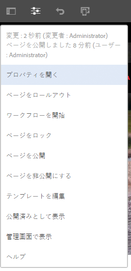
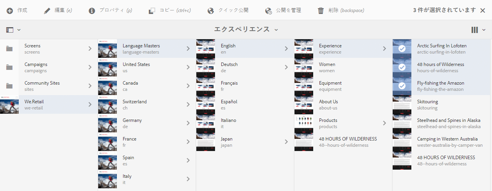
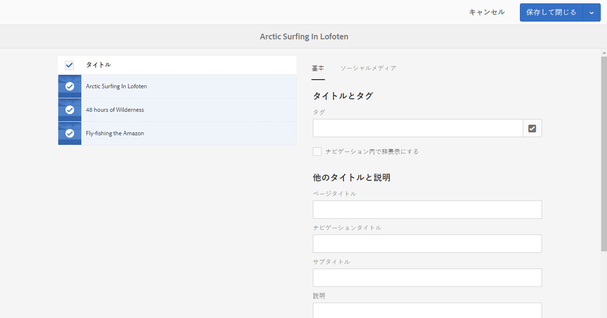

# ページプロパティの編集{#editing-page-properties}

ページに必要なプロパティを定義できます。これらはページの特性に応じて異なることがあります。例えば、ページによってはライブコピーに接続されていたり、接続されずにライブコピー情報が必要に応じて利用可能な場合があります。

## ページプロパティ {#page-properties}

プロパティは次のタブに分散しています。

### 基本 {#basic}

* **タイトル**

   ページのタイトルは様々な場所に表示されます。例えば、「**Web サイト**」タブリストや「**サイト**」カードビュー／リストビューに表示されます。

   このフィールドは必須です。

* **タグ**

   この場所で、選択ボックスのリストを更新して、ページのタグの追加や削除をおこなうことができます。

   * タグを選択すると、選択ボックスの下のリストに表示されます。このリストからタグを削除するには、x を使用します。
   * 空の選択ボックスに名前を入力して、新しいタグを入力できます。

      * Enter キーを押すと、新しいタグが作成されます。
      * 新しいタグが表示され、その右側にタグが新規であることを示す小さな星が表示されます。
   * ドロップダウン機能を使用して、既存のタグを選択できます。
   * 選択ボックスのタグエントリの上にマウスポインターを合わせると、x が表示されます。これをクリックすると、対象のタグをこのページから削除できます。

   タグについて詳しくは、[タグの使用](/help/sites-authoring/tags.md)を参照してください。

* **ナビゲーション内で非表示にする**

   使用されるサイトでページがページのナビゲーションに表示されるかどうかを示します。

* **ブランディング**

   各ページタイトルにブランド見出しを追加して、ページ間で一貫したブランドアイデンティティを適用します。この機能では、[コアコンポーネント](https://experienceleague.adobe.com/docs/experience-manager-core-components/using/introduction.html?lang=ja)のリリース 2.14.0 以降に含まれているページコンポーネントを使用する必要があります。

   * **オーバーライド** - このページにブランド見出しを定義する場合にオンにします。
      * 子ページにも&#x200B;**オーバーライド**&#x200B;値が設定されている場合を除き、値はすべての子ページに継承されます。
   * **値をオーバーライド** - ページタイトルに追加するブランド見出しのテキストです。
      * この値は、「Cycling Tuscany | Always ready for the WKND」のように、ページタイトルの末尾にパイプ文字に続けて追加されます。

* **ページタイトル**

   ページで使用されるタイトルです。通常はタイトルコンポーネントで使用されます。空にすると、「**タイトル**」が使用されます。

* **ナビゲーションタイトル**

   ナビゲーション内で使用するタイトルを別途指定できます（もっと簡潔にする場合など）。空にすると、「**タイトル**」が使用されます。

* **サブタイトル**

   ページで使用されるサブタイトルです。

* **説明**

   ページの説明です。ページの目的やその他の必要な追記事項を入力します。

* **オンタイム**

   公開されたページがアクティベートされる日付と時間です。公開されると、このページは指定された時間まで休止状態になります。

   ページを即座に公開する場合（通常のシナリオの場合）、これらのフィールドは空白のままにします。

* **オフタイム**

   公開されたページのアクティベートが解除される時間です。

   アクションがすぐに実行されるようにするには、これらのフィールドを空白のままにします。

* **バニティ URL**

   このページのバニティ URL を入力でき、短くより表現力のある URL にすることができます。

   例えば、Webサイトh `ttp://example.com,`のパス/ `v1.0/startpage`で識別されるページに対して、バニティURLがw `elcome`に設定されている場合、h `ttp://example.com/welcome`はh `ttp://example.com/content/v1.0/startpage`のバニティURLになります。

   >[!CAUTION]
   >
   >バニティ URL は次のような特性があります。
   >
   >* 一意である必要があるので、別のページで同じ値が使用されないように注意してください。
   >* regex パターンはサポートされていません。

* **バニティ URL をリダイレクト**

   ページにバニティ URL を使用するかどうかを示します。

### 詳細 {#advanced}

* **言語**

   ページの言語です。

* **リダイレクト**

   このページが自動的にリダイレクトするページを示します。

* **デザイン**

   このページで使用される[デザイン](/help/sites-developing/designer.md)を示します。

* **エイリアス**

   このページで使用されるエイリアスを指定します。

   >[!NOTE]
   >
   > 「エイリアス」は、リソースのエイリアス名を定義する `sling:alias` プロパティを設定します（これはリソースにのみ影響を及ぼし、パスには影響しません）。
   >
   >例えば、`/content/we-retail/spanish` ノードに `latin-lang` というエイリアスを定義した場合、このページは `/content/we-retail/latin-language` でアクセスできます。
   >
   >詳しくは、「SEOとURL管理のベストプラクティス」の「[ページ名のローカライズ](/help/managing/seo-and-url-management.md#localized-page-names)」を参照してください。

* **許可されたテンプレート**

   このサブブランチ内で[使用できるテンプレートのリストを定義](/help/sites-authoring/templates.md#enabling-and-allowing-a-template-template-author)します。

* **認証要件**

   ページにアクセスするための認証を有効（または無効）にします。

   認証されるための要件は、指定されたログオンページと共にここで設定できます。ページにアクセスできるユーザーグループは、「**[権限](/help/sites-authoring/editing-page-properties.md#permissions)**」タブで定義します。

   >[!CAUTION]
   >
   >「**[権限](/help/sites-authoring/editing-page-properties.md#permissions)**」タブでは、`granite:AuthenticationRequired` mixinの存在に基づいてCUG設定を編集できます。 cq:cugEnabledプロパティの存在に基づいて、非推奨のCUG設定を使用してページ権限が設定されている場合、警告メッセージが&#x200B;**認証要件**&#x200B;の下に表示され、オプションは編集できず、[権限](/help/sites-authoring/editing-page-properties.md#permissions)も編集できません。
   >
   >
   >そのような場合は、CUG 権限を[クラシック UI](/help/sites-classic-ui-authoring/classic-page-author-edit-page-properties.md) で編集する必要があります。

* **ログインページ**

   ログインに使用されるページです。

* **設定を書き出し**

   書き出し設定を指定します。

### サムネール {#thumbnail}

1. **ページサムネイル**

   ページサムネール画像が表示されます。以下の操作を実行できます。

   * **プレビューを生成**

      サムネールとして使用するページのプレビューを生成します。

   * **画像をアップロード**

      サムネールとして使用する画像をアップロードします。

### ソーシャルメディア {#social-media}

* **ソーシャルメディア共有**

   ページで使用可能な共有オプションを定義します。使用可能なオプションを[コアコンポーネントの共有](https://helpx.adobe.com/experience-manager/core-components/using/sharing.html)に公開します。

   * **Facebook に対してユーザー共有を有効にする**
   * **Pinterest に対してユーザー共有を有効にする**
   * **優先 XF バリエーション**
ページのメタデータの生成に使用されるエクスペリエンスフラグメントのバリエーションを定義します

### Cloud Services {#cloud-services}

* **Cloud Services**

   [クラウドサービス](/help/sites-developing/extending-cloud-config.md)用のプロパティを定義します。

### パーソナライズ機能 {#personalization}

* **パーソナライズ機能**

   [ブランドを選択してターゲット設定の範囲を指定](/help/sites-authoring/personalization.md)します。

### 権限 {#permissions}

* **権限**

   このタブでは、次のことができます。

   * [権限を追加](/help/sites-administering/user-group-ac-admin.md)
   * [閉じられたユーザーグループを編集](/help/sites-administering/cug.md#applying-your-closed-user-group-to-content-pages)
   * [有効な権限](/help/sites-administering/user-group-ac-admin.md)を表示

   >[!CAUTION]
   >
   >「**権限**」タブでは、`granite:AuthenticationRequired` mixinの存在に基づいてCUG設定を編集できます。 `cq:cugEnabled` プロパティが存在することにより、廃止された CUG 設定を使用してページの権限が設定された場合、警告メッセージが表示され、CUG 権限は編集できず、「[詳細](/help/sites-authoring/editing-page-properties.md#advanced)」タブの認証要件も編集できません。
   >
   >
   >そのような場合は、CUG 権限を[クラシック UI](/help/sites-classic-ui-authoring/classic-page-author-edit-page-properties.md) で編集する必要があります。

   >[!NOTE]
   >
   >「権限」タブでは、空の CUG グループの作成が許可されないので、すべてのユーザーによるアクセスを拒否する際に、簡単な方法として使用できます。これをおこなうには、CRX Explorer を使用する必要があります。詳しくは、[ユーザー、グループ、アクセス権の管理](/help/sites-administering/user-group-ac-admin.md)のドキュメントを参照してください。

### ブループリント {#blueprint}

* **ブループリント**

   [マルチサイト管理](/help/sites-administering/msm.md)でのブループリントページのプロパティを定義します。変更がライブコピーに適用される条件を制御します。

### ライブコピー {#live-copy}

* **ライブコピー**

   [マルチサイト管理](/help/sites-administering/msm.md)でのライブコピーページのプロパティを定義します。ブループリントからの変更が適用される条件を制御します。

### サイト構造 {#site-structure}

* **サインアップページ**、**オフラインページ**&#x200B;など、サイト全体にわたる機能を提供するページへのリンクを指定します。

## ページプロパティの編集 {#editing-page-properties-2}

次の方法でページプロパティを定義できます。

* **サイト**&#x200B;コンソールから：

   * [新しいページを作成](/help/sites-authoring/managing-pages.md#creating-a-new-page)します（プロパティのサブセット）
   * 「**プロパティ**」をクリックまたはタップします

      * 単一のページ
      * 複数のページ（まとめて編集する場合は、プロパティのサブセットのみを使用できます）

* ページエディターから、次の操作をおこないます。

   * 「**ページ情報**」（その後、「**プロパティを開く**」）を使用します

### サイトコンソールから - 単一のページ {#from-the-sites-console-single-page}

「**プロパティ**」をクリックまたはタップして、ページのプロパティを定義します。

1. **サイト**&#x200B;コンソールを使用して、プロパティを表示および編集するページの場所に移動します。

1. 次のいずれかを使用して、目的のページで「**プロパティ**」オプションを選択します。

   * [クイックアクション](/help/sites-authoring/basic-handling.md#quick-actions)
   * [選択モード](/help/sites-authoring/basic-handling.md#viewing-and-selecting-resources)

   ページのプロパティが該当するタブに表示されます。

1. 必要に応じてプロパティを表示または編集します。

1. その後、「**保存**」を使用して更新内容を保存し、「**閉じる**」を使用してコンソールに戻ります。

### ページの編集中 {#when-editing-a-page}

ページの編集中は、**ページ情報**&#x200B;を使用してページプロパティを定義できます。

1. プロパティを編集するページを開きます。

1. **ページ情報**&#x200B;アイコンを選択して選択メニューを開きます。

   

1. 「**プロパティを開く**」を選択すると、プロパティを編集するためのダイアログが開きます。プロパティは適切なタブに分類されています。 ツールバーの右側にある次のボタンも使用できます。

   * **キャンセル**
   * **保存して閉じる**

1. 「**保存して閉じる**」ボタンを使用して、変更を保存します。

### サイトコンソールから - 複数のページ {#from-the-sites-console-multiple-pages}

**Sites** コンソールから、複数のページを選択し、「**プロパティを表示**」を使用してページのプロパティを表示および編集することができます。これは、ページプロパティの一括編集と呼ばれます。

>[!NOTE]
>
>プロパティの一括編集はアセットに対しても使用できます。操作はよく似ていますが、次の点が異なります。詳しくは、[複数のアセットのプロパティの編集](/help/assets/managing-multiple-assets.md)を参照してください。
>
>また、[バルクエディター](/help/sites-administering/bulk-editor.md)も用意されています。このエディターでは、GQL（Google Query Language）を使用して、複数のページからコンテンツを検索できます。コンテンツをバルクエディターで直接編集してから、変更を元のページに保存できます。

次の方法を含む様々な方法で、複数のページを一括編集用に選択することができます。

* **サイト**&#x200B;コンソールの参照時
* **検索**&#x200B;によって複数のページを特定した後

ページを選択して「**プロパティ**」オプションをクリックまたはタップすると、一括プロパティが表示されます。

一括編集ができるのは、次のようなページに限られます。

* 同じリソースタイプを共有する
* ライブコピーの一部ではない

   * いずれかのページがライブコピー中である場合、プロパティを開くときにメッセージが表示されます。

一括編集を開始すると、次の操作をおこなうことができます。

* **表示**

   複数のページのページプロパティを編集する場合は、次の項目が表示されます。

   * 影響を受けるページのリスト

      * 必要に応じて、選択／選択解除できます。
   * タブ

      * 単一ページのプロパティを表示する場合と同様に、プロパティがタブの下で順に並べられます。
   * プロパティのサブセット

      * 選択したすべてのページで使用できるプロパティ（および一括編集で使用できると明示的に定義されたプロパティ）が表示されます。
      * 選択するページを 1 つに減らすと、すべてのプロパティが表示されます。
   * 共通の値を持つ共通のプロパティ

      * 表示モードで表示されるのは、共通の値を持つプロパティのみです。
      * フィールドが複数値（タグなど）の場合は、すべての値が共通の場合に限り、値が表示されます&#x200B;*。*&#x200B;一部の値のみが共通の場合は、それらの値は編集時にのみ表示されます。

   一般的な値を含むプロパティがない場合は、メッセージが表示されます。

* **編集**

   複数のページのページプロパティを編集する場合は、次の点に注意してください。

   * 利用可能なフィールドの値を更新できます。

      * 新しい値は、「**完了**」を選択したときに、選択したすべてのページに適用されます。
      * フィールドが複数値（タグなど）の場合は、新しい値を追加するか、共通の値を削除できます。
   * 共通のフィールドに、ページによって異なる値が設定されている場合、それらのフィールドは特別な値（「`<Mixed Entries>`」というテキストなど）で示されます。そのようなフィールドを編集する際は、データが失われないように、慎重におこなう必要があります。

>[!NOTE]
>
>ページコンポーネントを設定して、一括編集が可能なフィールドを指定できます。[ページプロパティの一括編集のためのページの設定](/help/sites-developing/bulk-editing.md)を参照してください。
