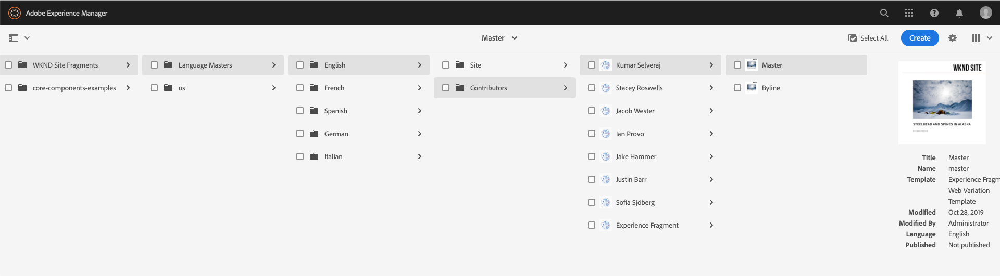

# エクスペリエンスフラグメント {#experience-fragments}

>[!CAUTION]
>
>AEM 6.4 の拡張サポートは終了し、このドキュメントは更新されなくなりました。 詳細は、 [技術サポート期間](https://helpx.adobe.com/jp/support/programs/eol-matrix.html). サポートされているバージョンを見つける [ここ](https://experienceleague.adobe.com/docs/?lang=ja).

エクスペリエンスフラグメントは、ページ内で参照できるコンテンツとレイアウトを含む 1 つまたは複数のコンポーネントからなるグループです。任意のコンポーネントを含めることができます。

エクスペリエンスフラグメントは、

* エクスペリエンス（ページ）の一部です。
* 複数のページで使用できます。
* 構造とコンポーネントを定義するテンプレートに基づいています（編集可能なみ）。
* 段落システム内の 1 つ以上のコンポーネント（レイアウト付き）で構成されます。
* 他のエクスペリエンスフラグメントを含めることができます。
* 他のコンポーネント（他のエクスペリエンスフラグメントを含む）と組み合わせて、完全なページ（エクスペリエンス）を形成できます。
* 様々なバリエーションを持つことができ、コンテンツやコンポーネントを共有できます。
* フラグメントの複数のバリエーションで使用できる構築ブロックに分類できます。

エクスペリエンスフラグメントを使用できるのは、次の場合です。

* 作成者がページの一部（エクスペリエンスのフラグメント）を再利用する場合は、そのフラグメントをコピーして貼り付ける必要があります。 これらのエクスペリエンスのコピー／貼り付けの作成と管理には時間がかかり、ユーザーエラーが発生しがちです。
エクスペリエンスフラグメントは、コピー／貼り付けを不要にします。
* ヘッドレス CMS のユースケースをサポートする場合。作成者は AEM をオーサリングにのみ使用し、顧客への配信には使用しないようにします。サードパーティシステム／タッチポイントは、そのエクスペリエンスを使用してエンドユーザーに配信します。

>[!NOTE]
>
>エクスペリエンスフラグメントの書き込みアクセス権には、次のグループに登録されたユーザーアカウントが必要です。
>
>`experience-fragments-editors`
>
>問題が発生している場合は、システム管理者にお問い合わせください。

## エクスペリエンスフラグメントを使用するタイミング {#when-should-you-use-experience-fragments}

エクスペリエンスフラグメントは以下の場合に使用します。

* エクスペリエンスを再利用する場合。

   * 同じコンテンツや類似のコンテンツで再利用されるエクスペリエンス

* AEMをサードパーティのコンテンツ配信プラットフォームとして使用する場合。

   * AEMをコンテンツ配信プラットフォームとして使用するソリューション
   * サードパーティのタッチポイントへのコンテンツの埋め込み

* 異なるバリエーションやレンディションを持つエクスペリエンスがある場合。

   * チャネル固有またはコンテキスト固有のバリエーション
   * グループに適したエクスペリエンス（チャネル間でエクスペリエンスが異なるキャンペーンなど）

* オムニチャネルコマースを使用する場合。

   * 規模に応じたソーシャルメディアチャネルでのコマース関連コンテンツの共有
   * タッチポイントのトランザクション化

## エクスペリエンスフラグメントの整理 {#organizing-your-experience-fragments}

以下をお勧めします。
* フォルダーを使用してエクスペリエンスフラグメントを整理する。

* [これらのフォルダーで使用可能なテンプレートを設定する](#configure-allowed-templates-folder)。

フォルダーを作成すると、次の操作を行うことができます。

* エクスペリエンスフラグメントにとって意味のある構造（例：分類に従った構造）を作成する。

   >[!NOTE]
   >
   >エクスペリエンスフラグメントの構造をサイトのページ構造に合わせる必要はありません。

* [許可されたテンプレートをフォルダーレベルで割り当てる。](#configure-allowed-templates-folder)

   >[!NOTE]
   >
   >[テンプレートエディター](/help/sites-authoring/templates.md)を使用すると、独自のテンプレートを作成できます。

次の例は、 `Contributors`. また、使用される構造は、マルチサイト管理（言語コピーを含む）などの他の機能の使用方法の例も示します。

>[!CAUTION]
>
>Adobe Experience Manager as a Cloud Serviceを使用した WKND サイトのスクリーンショットを次に示します。

## エクスペリエンスフラグメントのフォルダーの作成と設定 {#creating-and-configuring-a-folder-for-your-experience-fragments}

エクスペリエンスフラグメントのフォルダーを作成および設定するには、次の操作をお勧めします。

1. [フォルダーを作成](/help/sites-authoring/managing-pages.md#creating-a-new-folder) します。

1. [そのフォルダーに使用できるエクスペリエンスフラグメントテンプレートを設定](#configure-allowed-templates-folder)します。

>[!NOTE]
>
>また、 [お使いのインスタンスで使用できるテンプレート](#configure-allowed-templates-instance)を返しますが、このメソッドは **not** を推奨します。アップグレード時に値が上書きされる場合があるからです。

### フォルダーに使用できるテンプレートの設定 {#configure-allowed-templates-folder}

>[!NOTE]
>
>アップグレード時に値が上書きされないので、「**[!UICONTROL 許可されたテンプレート]**」を指定する場合は、この方法をお勧めします。

1. 必要な&#x200B;**[!UICONTROL エクスペリエンスフラグメント]**&#x200B;フォルダーに移動します。

1. フォルダーを選択してから、「**[!UICONTROL プロパティ]**」を選択します。

1. 必要なテンプレートを取得するための正規表現を「**[!UICONTROL 許可されたテンプレート]**」フィールドに指定します。

   次に例を示します。
   `/conf/(.*)/settings/wcm/templates/experience-fragment(.*)?`

   

1. 「**[!UICONTROL 保存して閉じる]**」を選択します。

### インスタンスに使用できるテンプレートの設定 {#configure-allowed-templates-instance}

>[!CAUTION]
>
>この **[!UICONTROL 許可されたテンプレート]** この方法では、指定したテンプレートがアップグレード時に上書きされる場合があるので、この方法を使用します。
>
>このダイアログは、情報を提供する目的でのみ使用してください。

1. 必要な&#x200B;**[!UICONTROL エクスペリエンスフラグメント]**&#x200B;コンソールに移動します。

1. 「**[!UICONTROL 設定オプション]**」を選択します。

   

1. **[!UICONTROL エクスペリエンスフラグメントを設定]**&#x200B;ダイアログで、必要なテンプレートを指定します。

   

1. 「**[!UICONTROL 保存]**」を選択します。

## エクスペリエンスフラグメントの作成 {#creating-an-experience-fragment}

エクスペリエンスフラグメントを作成するには、次の手順に従います。

1. グローバルナビゲーションから「**[!UICONTROL エクスペリエンスフラグメント]**」を選択します。

   

1. 目的のフォルダーに移動し、「**[!UICONTROL 作成]**」を選択します。

1. 「**[!UICONTROL エクスペリエンスフラグメント]**」を選択して、**[!UICONTROL エクスペリエンスフラグメントを作成]**&#x200B;ウィザードを開きます。

   適切な&#x200B;**[!UICONTROL テンプレート]**&#x200B;を選択して、「**[!UICONTROL 次へ]**」を選択します。

   

1. **[!UICONTROL エクスペリエンスフラグメント]**&#x200B;のプロパティを入力します。

   A **[!UICONTROL タイトル]** は必須です。 この **[!UICONTROL 名前]** が空白の場合は、 **[!UICONTROL タイトル]**.

   

1. 「**[!UICONTROL 作成]**」をクリックします。

   メッセージが表示されます。 選択:

   * 「**[!UICONTROL 完了]**」を選択すると、コンソールに戻ります。
   * 「**[!UICONTROL 開く]**」を選択すると、フラグメントエディターを開きます。

## エクスペリエンスフラグメントの編集 {#editing-your-experience-fragment}

エクスペリエンスフラグメントエディターには、通常のページエディターと同様の機能が用意されています。 詳しくは、 [ページのコンテンツの編集](/help/sites-authoring/editing-content.md) を参照してください。

次の手順の例は、製品のティーザーを作成する方法を示しています。

1. ドラッグ&amp;ドロップ **[!UICONTROL カテゴリティーザー]** から [コンポーネントブラウザー](/help/sites-authoring/author-environment-tools.md#components-browser).

   

1. 選択 **[[!UICONTROL 設定]](/help/sites-authoring/editing-content.md#edit-configure-copy-cut-delete-paste)** を選択します。
1. 必要に応じて&#x200B;**[!UICONTROL アセット]**&#x200B;を追加して&#x200B;**[!UICONTROL プロパティ]**&#x200B;を定義します。
1. で定義を確認します。 **[!UICONTROL 完了]** （チェックマークアイコン）。
1. 必要に応じてその他のコンポーネントを追加します。

## エクスペリエンスフラグメントのバリエーションの作成 {#creating-an-experience-fragment-variation}

必要に応じて、エクスペリエンスフラグメントのバリエーションを作成できます。

1. フラグメントを開く対象 [編集中](/help/sites-authoring/experience-fragments.md#editing-your-experience-fragment).
1. 「**[!UICONTROL バリエーション]**」タブを開きます。

   

1. **作成** では、以下を作成できます。

   * **[!UICONTROL バリエーション]**
   * **[!UICONTROL バリエーションをライブコピーとして]**。

1. 必要なプロパティを定義します。

   * **[!UICONTROL テンプレート]**
   * **[!UICONTROL タイトル]**
   * **[!UICONTROL 名前]**;空白のままにした場合、タイトルから派生されます
   * **[!UICONTROL 説明]**
   * **[!UICONTROL バリエーションのタグ]**

   

1. 「**[!UICONTROL 完了]**（チェックマークアイコン）」で確定すると、新しいバリエーションがパネルに表示されます。

   

## エクスペリエンスフラグメントの使用 {#using-your-experience-fragment}

これで、ページのオーサリング時にエクスペリエンスフラグメントを使用できます。

1. 任意のページを開いて編集します。

   例： [http://localhost:4502/editor.html/content/we-retail/language-masters/en/products/men.html](http://localhost:4502/editor.html/content/we-retail/language-masters/en/products/men.html)

1. コンポーネントブラウザーからページ段落システムにコンポーネントをドラッグして、エクスペリエンスフラグメントコンポーネントのインスタンスを作成します。

   

1. 次のいずれかの方法で、実際のエクスペリエンスフラグメントをコンポーネントインスタンスに追加します。

   * アセットブラウザーから必要なフラグメントをドラッグして、コンポーネントにドロップします。
   * コンポーネントツールバーから「**[!UICONTROL 設定]**」を選択し、使用するフラグメントを指定して「**完了**（チェックマーク）」で確定します。

   

   >[!NOTE]
   >
   >コンポーネントツールバーの「編集」は、フラグメントエディターでフラグメントを開くためのショートカットとして動作します。

## 構築ブロック {#building-blocks}

1 つ以上のコンポーネントを選択して、フラグメント内で再利用するための構築ブロックを作成できます。

### 構築ブロックの作成 {#creating-a-building-block}

新しい構築ブロックを作成するには：

1. エクスペリエンスフラグメントエディターで、再利用するコンポーネントを選択します。

   

1. コンポーネントツールバーから、「**[!UICONTROL 構築ブロックに変換]**」を選択します。

   

   次に例を示します。

   

1. **[!UICONTROL 構築ブロック]**&#x200B;の名前を入力して、「**[!UICONTROL 変換]**」で確定します。

   

1. **構築ブロック**&#x200B;がタブに表示され、段落システムで選択できます。

   

### 構築ブロックの管理 {#managing-a-building-block}

構築ブロックは、 **[!UICONTROL 構築ブロック]** タブをクリックします。 各ブロックでは、次の操作を行えます。

* マスターに移動（マスターバリエーションを新しいタブで開きます）
* 名前を変更
* 削除

### 構築ブロックの使用 {#using-a-building-block}

任意のコンポーネントと同様に、構築ブロックをフラグメントの段落システムにドラッグできます。

## プレーン HTML レンディション {#the-plain-html-rendition}

URL で `.plain.` セレクターを使用すると、プレーン HTML レンディションにアクセスできます。

これはブラウザーから使用できますが、主な目的は、他のアプリケーション（サードパーティの Web アプリ、カスタムモバイル実装など）が URL のみを使用してエクスペリエンスフラグメントのコンテンツに直接アクセスできるようにすることです。

プレーンHTMLレンディションは、次のパスにプロトコル、ホストおよびコンテキストパスを追加します。

* タイプが `src`、`href`、`action` のいずれか

* または、`-src` か `-href` で終わる

次に例を示します。

`.../brooklyn-coat/master.plain.html`

>[!NOTE]
>
>リンクは常にパブリッシュインスタンスを参照します。 これらはサードパーティによって使用されることを目的としているので、リンクは常にオーサーからではなくパブリッシュインスタンスから呼び出されます。

## エクスペリエンスフラグメントの書き出し {#exporting-experience-fragments}

デフォルトでは、エクスペリエンスフラグメントはHTML形式で配信されます。 AEM とサードパーティチャネルのどちらでも同じように使用できます。

Adobe Targetへの書き出しには、HTMLが使用されます。 詳しくは、[Adobe Target とエクスペリエンスフラグメントの統合](/help/sites-administering/experience-fragments-target.md)を参照してください。
