# インボックス {#your-inbox}

>[!CAUTION]
>
>AEM 6.4 の拡張サポートは終了し、このドキュメントは更新されなくなりました。 詳細は、 [技術サポート期間](https://helpx.adobe.com/jp/support/programs/eol-matrix.html). サポートされているバージョンを見つける [ここ](https://experienceleague.adobe.com/docs/?lang=ja).

ワークフローやプロジェクトを含む、AEMの様々な領域から通知を受け取ることができます。次に例を示します。

* タスク：

   * これらは、AEM UI 内の様々なポイント ( 例えば、 **プロジェクト**,
   * ワークフローの生成物にすることができます **タスクを作成** または **プロジェクトタスクを作成** 手順

* ワークフロー：

   * ページのコンテンツに対して実行する必要があるアクションを表す作業項目

      * これらはワークフローの産物です **参加者** 手順
   * 失敗した項目（管理者が失敗したステップを再試行できるようにするため）

これらの通知は、自分のインボックスで受け取り、それらを表示してアクションを実行できます。

>[!NOTE]
>
>標準のAEMは、管理者ユーザーグループに割り当てられた管理タスクで事前に読み込まれます。 詳しくは、 [標準の管理タスク](#out-of-the-box-administrative-tasks) 」を参照してください。

>[!NOTE]
>
>アイテムタイプの詳細については、次の項目も参照してください。
>
>* [プロジェクト](/help/sites-authoring/touch-ui-managing-projects.md)
>* [プロジェクト - タスクの操作](/help/sites-authoring/task-content.md)
>* [ワークフロー](/help/sites-authoring/workflows.md)
>* [フォーム](/help/forms/home.md)
>

## ヘッダー内のインボックス {#inbox-in-the-header}

どのコンソールからでも、インボックス内の現在の項目数がヘッダーに表示されます。 インジケーターを開いて、アクションが必要なページにすばやくアクセスしたり、インボックスにアクセスしたりすることもできます。

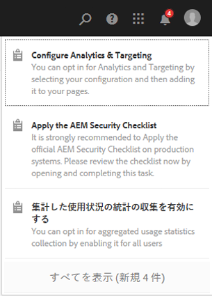

>[!NOTE]
>
>特定のアクションは、[適切なリソースのカード表示](/help/sites-authoring/basic-handling.md#card-view)にも表示されます。

## 標準の管理タスク  {#out-of-the-box-administrative-tasks}

標準のAEMは、管理者ユーザーグループに割り当てられた 4 つのタスクでプリロードされます。

* [分析とターゲティングを設定](/help/sites-administering/opt-in.md)
* [AEM セキュリティチェックリストを適用](/help/sites-administering/security-checklist.md)
* 集計した使用状況の統計の収集を有効にする
* [HTTPS を設定](/help/sites-administering/ssl-by-default.md)

## インボックスを開く {#opening-the-inbox}

AEM通知インボックスを開くには：

1. ツールバーのインジケーターをクリックまたはタップします。

1. 「**すべて表示**」を選択します。**AEM インボックス**&#x200B;が開きます。インボックスには、ワークフロー、プロジェクトおよびタスクからの項目が表示されます。
1. デフォルトの表示は[リスト表示](#inbox-list-view)ですが、[カレンダー表示](#inbox-calendar-view)に切り替えることもできます。これは、表示セレクター（ツールバーの右上部分）を使用しておこないます。

   両方のビューに対して、 [設定を表示](#inbox-view-settings);使用できるオプションは、現在のビューによって異なります。

   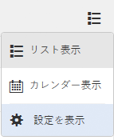

>[!NOTE]
>
>インボックスはコンソールとして機能するので、完了したら、[グローバルナビゲーション](/help/sites-authoring/basic-handling.md#global-navigation)または[検索](/help/sites-authoring/search.md)を使用して、別の場所に移動します。

### インボックス - リスト表示 {#inbox-list-view}

この表示では、すべての項目と主な関連情報が一覧表示されます。

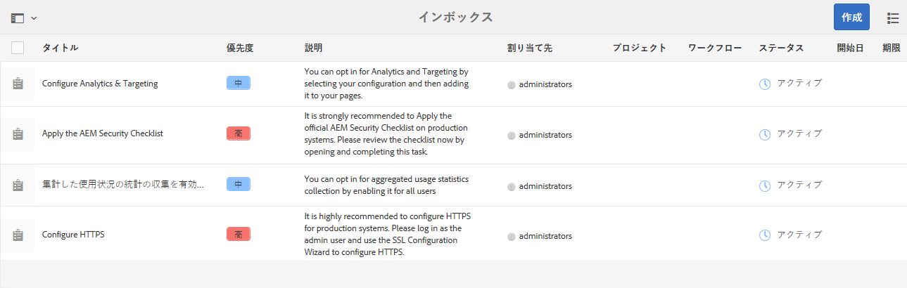

### インボックス - カレンダー表示 {#inbox-calendar-view}

このビューには、カレンダー内の位置と選択した正確なビューに従って項目が表示されます。

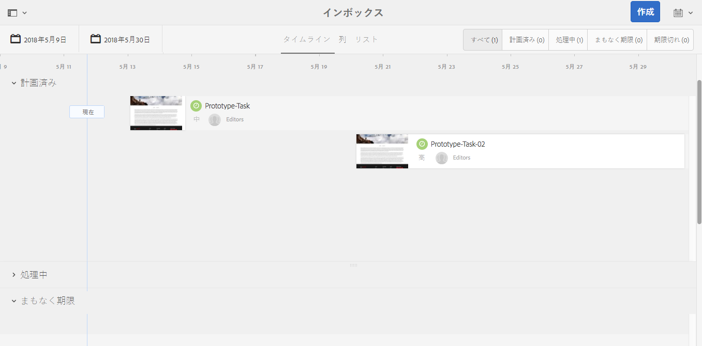

以下の操作を実行できます。

* 特定のビューを選択する。 **タイムライン**, **列**, **リスト**

* 次の条件に従って表示するタスクを指定 **スケジュール**; **すべて**, **計画済み**, **処理中**, **まもなく期限**, **期限切れ**

* 項目の詳細情報のドリルダウン
* ビューに焦点を当てる日付範囲を選択します。

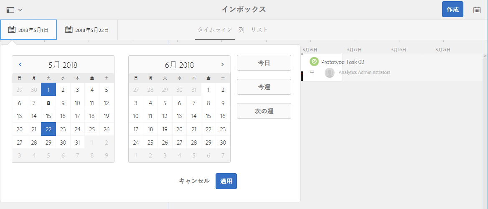

### インボックス - 表示設定 {#inbox-view-settings}

両方の表示（リストとカレンダー）に対して、次の設定を定義できます。

* **カレンダー表示**

   の場合 **カレンダー表示** 以下を設定できます。

   * **グループ化の基準**
   * **予定**&#x200B;または&#x200B;**なし**
   * **カードサイズ**

   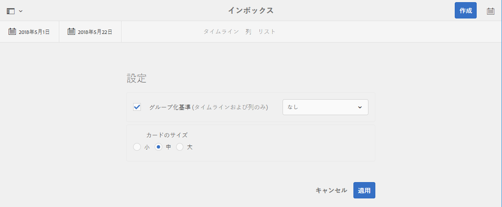

* **リスト表示**

   の場合 **リスト表示** 並べ替えメカニズムを設定できます。

   * **並べ替え基準**
   * **並べ替え順序**

   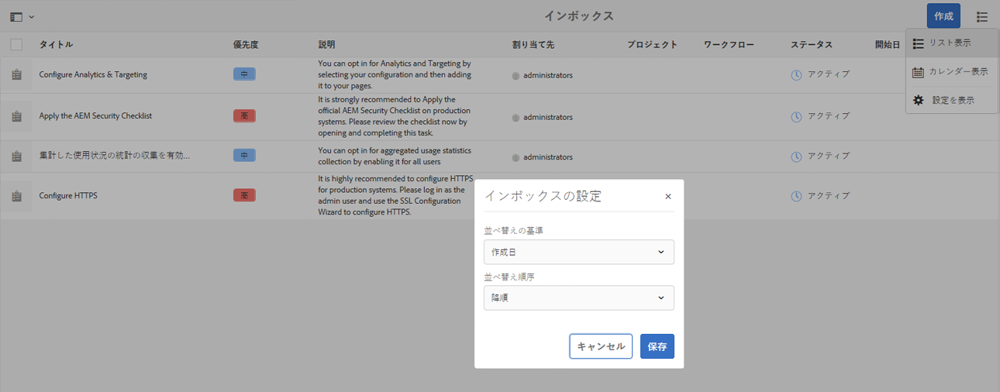

## 項目に対するアクションの実行 {#taking-action-on-an-item}

1. 項目に対してアクションを実行するには、該当する項目のサムネールを選択します。その項目に適用可能なアクションのアイコンがツールバーに表示されます。

   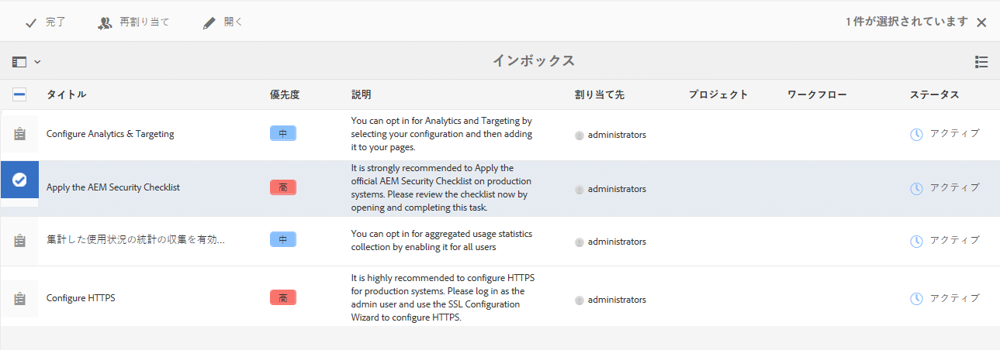

   アクションは項目に対応しており、次のアクションがあります。

   * アクションを&#x200B;**完了**&#x200B;する。例：タスクまたはワークフロー項目。
   * **再割り当て**/**委任** 項目。
   * **開く** 項目項目タイプに応じて、次の操作がおこなわれます。

      * 項目のプロパティを表示
      * 適切なダッシュボードまたはウィザードを開いてアクションを実行する
      * 関連ドキュメントを開く
   * 前のステップに&#x200B;**戻る**。
   * ワークフローのペイロードを表示する.
   * 項目からプロジェクトを作成する.

   >[!NOTE]
   >
   >詳しくは、次のセクションを参照してください。
   >
   >* ワークフロー項目 — [ワークフローへの参加](/help/sites-authoring/workflows-participating.md)

1. 選択した項目に応じて、アクションが開始されます。例：

   * アクションに適したダイアログが開きます。
   * アクションウィザードが起動します。
   * ドキュメントページが開きます。

   例： **再割り当て** ダイアログが開きます。

   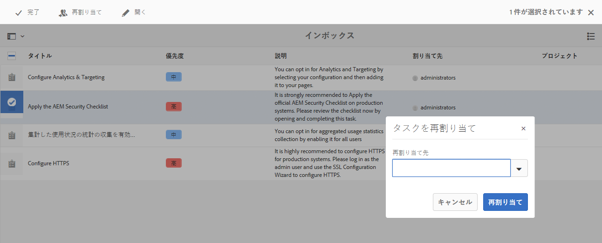

   ダイアログ、ウィザード、ドキュメントページが開いているかどうかに応じて、次の操作をおこなうことができます。

   * 適切なアクションを確認します。例：再割り当て
   * アクションをキャンセルする。
   * 戻る矢印；例えば、アクションウィザードまたはドキュメントページが開いている場合は、インボックスに戻ることができます。

## タスクの作成 {#creating-a-task}

インボックスから、次のタスクを作成できます。

1. 選択 **作成**&#x200B;を、 **タスク**.
1. 必要なフィールドを **基本** および **詳細** タブ；唯一の **タイトル** が必須の場合、それ以外の場合はすべてオプションです。

   * **基本**：

      * **タイトル**
      * **プロジェクト**
      * **割り当て先**
      * **コンテンツ**;ペイロードと同様、タスクからリポジトリ内の場所への参照です
      * **説明**
      * **タスクの優先度**
      * **開始日**
      * **期限**

   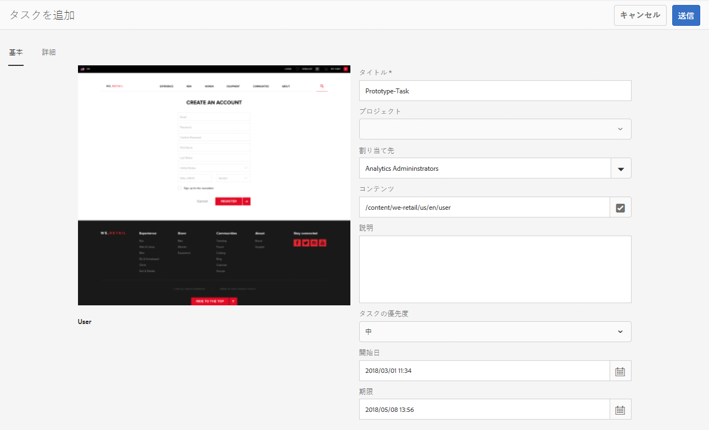

   * **詳細**

      * **名前**:これは URL の作成に使用されます。空白の場合は、 **タイトル**.

   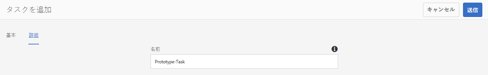

1. 「**送信**」を選択します。

## プロジェクトの作成 {#creating-a-project}

特定のタスクに対して、 [プロジェクト](/help/sites-authoring/projects.md) そのタスクに基づいて、

1. サムネールをタップまたはクリックして、適切なタスクを選択します。

   >[!NOTE]
   >
   >プロジェクトの作成に使用できるのは、**インボックス**&#x200B;の「**作成**」オプションを使用して作成されたタスクのみです。
   >
   >（ワークフローの）作業項目は、プロジェクトの作成に使用できません。

1. ツールバーの「**プロジェクトを作成**」を選択してウィザードを開きます。
1. 適切なテンプレートを選択して、 **次へ**.
1. 必要なプロパティを指定します。

   * **基本**

      * **タイトル**
      * **説明**
      * **開始日**
      * **期限**
      * **ユーザー** および役割
   * **アドバンス**

      * **名前**
   >[!NOTE]
   >
   >詳しくは、 [プロジェクトの作成](/help/sites-authoring/touch-ui-managing-projects.md#creating-a-project) を参照してください。

1. 選択 **作成** をクリックしてアクションを確定します。

## AEM インボックス内の項目のフィルター処理 {#filtering-items-in-the-aem-inbox}

リストされた項目をフィルタリングできます。

1. を開きます。 **AEM Inbox**.

1. フィルターセレクターを開きます。

   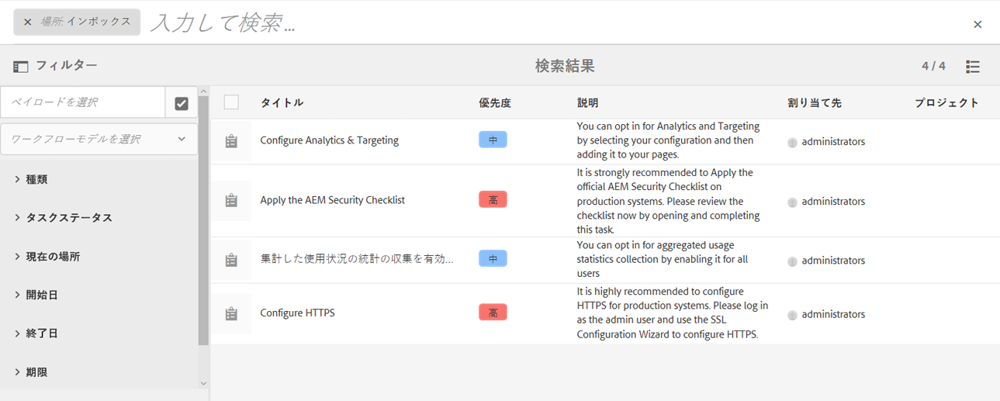

1. 条件の範囲に従ってリストされる項目をフィルターできます。その多くは次のように絞り込むことができます。

   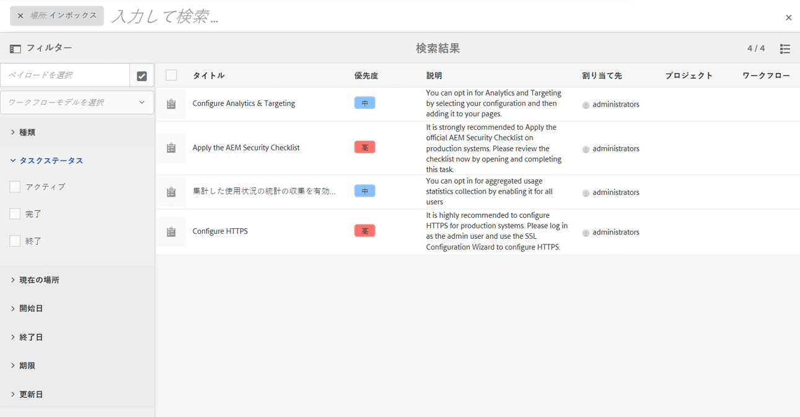

   >[!NOTE]
   >
   >「[設定を表示](#inbox-view-settings)」では、[リスト表示](#inbox-list-view)を使用するときの並べ替え順を設定することもできます。
