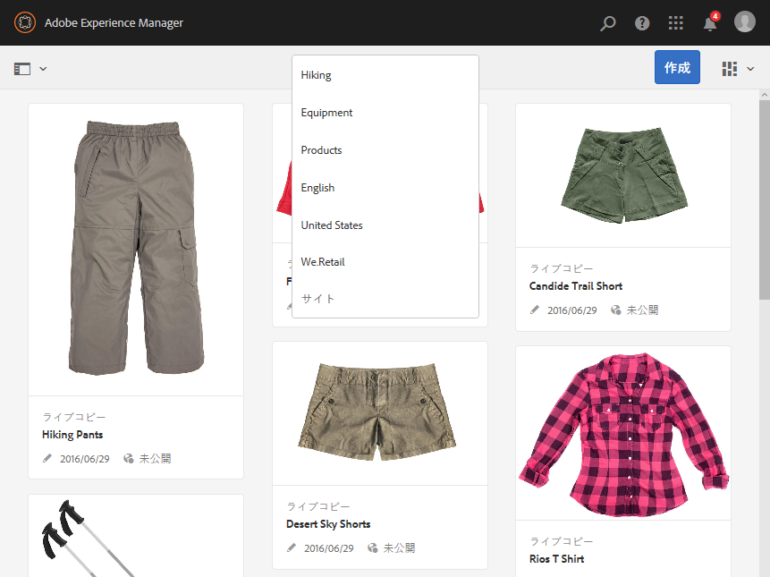
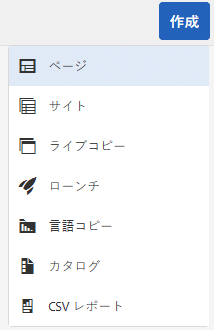
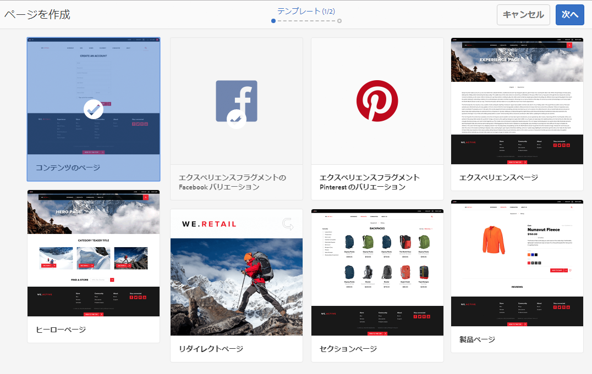
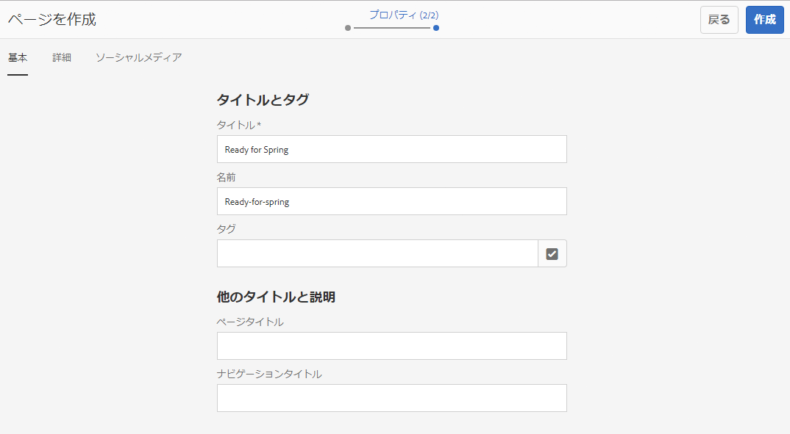
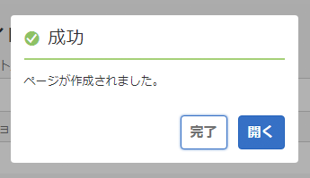
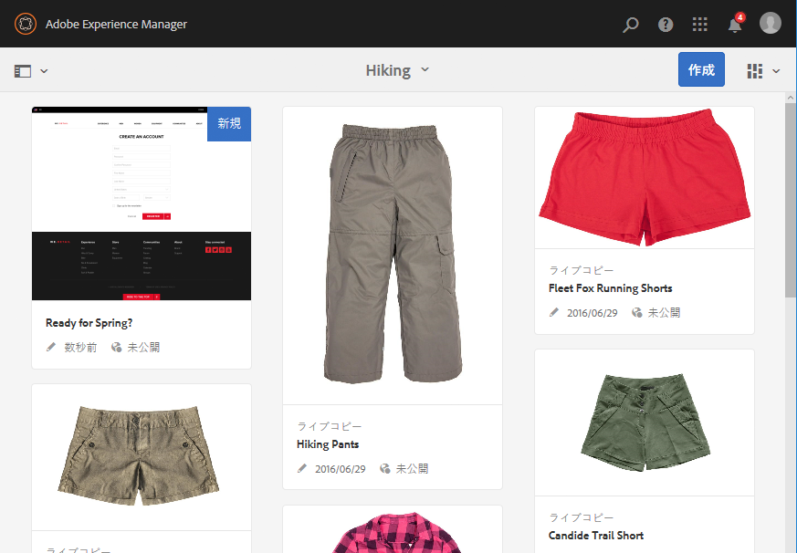
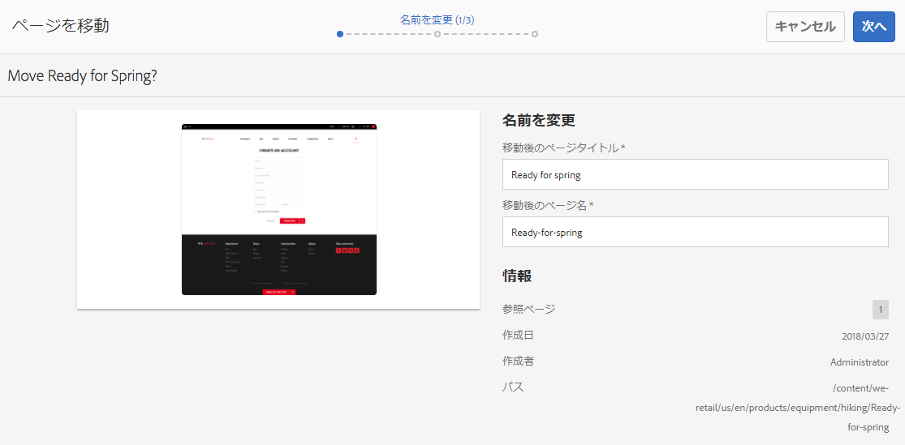
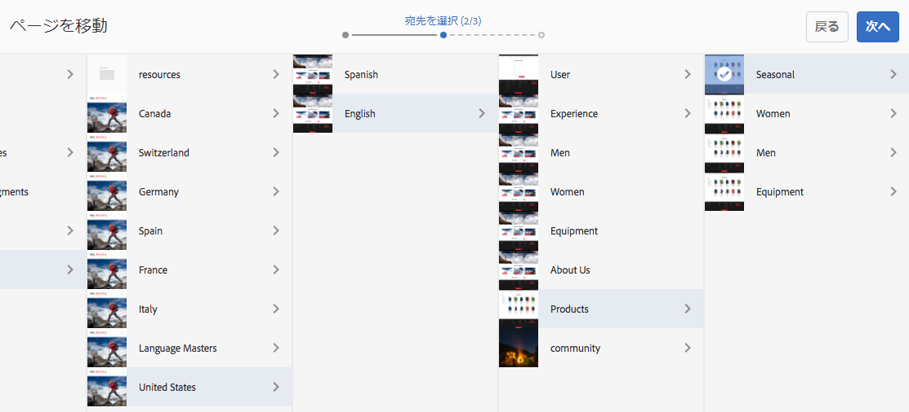

# ページの作成と整理 {#creating-and-organizing-pages}

ここでは、Adobe Experience Manager(AEM) でページを作成および管理し、次の操作を実行する方法について説明します。 [コンテンツを作成](/help/sites-authoring/editing-content.md) 」という名前を付けます。

>[!NOTE]
>
>アカウントに [適切なアクセス権](/help/sites-administering/security.md) および [権限](/help/sites-administering/security.md#permissions) ページに対するアクション（作成、コピー、移動、編集、削除など）
>
>問題が発生した場合は、システム管理者にお問い合わせください。

>[!NOTE]
>
>Web サイトコンソールから使用できる[キーボードショートカット](/help/sites-authoring/keyboard-shortcuts.md)が多数あり、ページをより効率的に整理できます。

## Web サイトの整理 {#organizing-your-website}

作成者は、AEM内で Web サイトを整理する必要があります。 これには、次の目的でコンテンツページを作成し、名前を付ける必要があります。

* 作成者がオーサー環境でコンテンツページを容易に検索できるようにする
* サイトへの訪問者がパブリッシュ環境でコンテンツページを容易に閲覧できるようにする

コンテンツの整理に役立つ[フォルダー](#creating-a-new-folder)を使用することもできます。

Web サイトの構造は、コンテンツページを保持する「ツリー構造」と見なすことができます。これらのコンテンツページの名前を使用して URL を生成します。一方でタイトルは、ページコンテンツを閲覧したときに表示されます。

We.Retail サイトの例を次に示します。ハイキングショーツのページ（`desert-sky-shorts`）にアクセスしています。

* オーサー環境：`http://localhost:4502/editor.html/content/we-retail/us/en/products/equipment/hiking/desert-sky-shorts.html`

* パブリッシュ環境: `http://localhost:4503/content/we-retail/us/en/products/equipment/hiking/desert-sky-shorts.html`

インスタンスの設定によっては、パブリッシュ環境での `/content` の利用は必須ではありません。

```xml
 /content
 /we-retail
  /us
   /en
    /products
     /equipment
      /hiking
       /desert-sky-shorts
       /hiking-poles
       /... 
      /running...
      /surfing...
      /...
     /seasonal...
     /...
    /about-us
    /experience
    /...
   /es...
  /de...
  /fr...
  /...
 /...
```

この構造は **Sites** コンソールから表示でき、[Web サイトのページ間を移動したり](/help/sites-authoring/basic-handling.md#product-navigation)、ページ上でアクションを実行したりできます。新しいサイトや[新しいページ](#creating-a-new-page)を作成することもできます。

どの地点からでも、ヘッダーバーのパンくず（経路表示）から上位のブランチを確認できます。



### ページ命名規則 {#page-naming-conventions}

新しいページを作成する際の主要なフィールドは 2 つあります。

* **[タイトル](#title)**：

   * これはコンソール内のユーザーに、編集中のページコンテンツの上部に表示されます。
   * このフィールドは必須です。

* **[名前](#name)**：

   * これは URI の生成に使用されます。
   * このフィールドへの入力はオプションです。指定しなかった場合、名前はタイトルから派生します。 詳しくは、次の節、[ページ名の制限事項とベストプラクティス](/help/sites-authoring/managing-pages.md#page-name-restrictions-and-best-practices)を参照してください。

#### ページ名の制限事項とベストプラクティス {#page-name-restrictions-and-best-practices}

ページの&#x200B;**タイトル**&#x200B;と&#x200B;**名前**&#x200B;は個別に作成できますが、次のように関連しています。

* ページを作成する場合、 **タイトル** フィールドは必須です。 指定しない場合 **名前** がページの作成時に提供されるので、AEMはタイトルの最初の 64 文字から名前を生成します（以下で設定する検証内容に従います）。 ページ名を短くするというベストプラクティスに対応するため、最初の 64 文字のみ使用されます。

* 作成者がページ名を手動で指定する場合は、64 文字の制限は適用されませんが、ページ名の長さに関するその他の技術的制限が適用されることがあります。

>[!NOTE]
>
>ページ名を定義するときは、ページ名をできるだけ簡潔にしつつ、読者がわかりやすいようにできるだけ表現力のある覚えやすいものにすることをお勧めします。詳しくは、[ 要素の ](https://www.w3.org/Provider/Style/TITLE.html)W3C スタイルガイド`title`を参照してください。
>
>また、一部のブラウザー（IE の旧バージョンなど）では、特定の長さまでの URL しか受け付けないので、ページ名を短くしておく技術的な理由もあります。

[新しいページを作成するとき、AEM では AEM と JCR によって課された規則に基づいてページ名が検証されます。](/help/sites-developing/naming-conventions.md)

使用できる最小限の文字は次のとおりです。

* &#39;a&#39; ～ &#39;z&#39;
* &#39;A&#39; ～ &#39;Z&#39;
* &#39;0&#39; ～ &#39;9&#39;
* _（アンダースコア）
* `-`（ハイフン／マイナス記号）

許可されるすべての文字について詳しくは、[命名規則](/help/sites-developing/naming-conventions.md)を参照してください。

>[!NOTE]
>
>AEM が [MongoMK 永続性マネージャーのデプロイメント](/help/sites-deploying/recommended-deploys.md)で実行されている場合、ページ名は 150 文字に制限されます。

#### タイトル {#title}

新しいページを作成するときにページの&#x200B;**タイトル**&#x200B;のみを指定した場合、AEM ではページの&#x200B;**名前**&#x200B;をこの文字列から導き出し、AEM と JCR によって課された[命名規則に基づいてページ名が検証](/help/sites-developing/naming-conventions.md)されます。「**タイトル**」フィールドに無効な文字が含まれていてもエラーにはなりませんが、派生された名前では、無効な文字が別の文字に置き換えられます。次に例を示します。

| タイトル | 派生名 |
|---|---|
| シェン | schoen.html |
| SC%&amp;&amp;ast;ç+ | sc---c-.html |

#### 名前 {#name}

新しいページを作成するときにページの&#x200B;**名前**&#x200B;を指定すると、AEM では AEM と JCR [によって課された規則に基づいてページ名が検証されます](/help/sites-developing/naming-conventions.md)。「**名前**」フィールドに無効な文字は指定できません。AEMで無効な文字が検出されると、フィールドが強調表示され、説明メッセージが表示されます。


>[!NOTE]
>
>ISO-639-1 で定義されている 2 文字コードをページ名として使用することは避けてください（言語ルートの場合を除く）。
>
>詳しくは、 [翻訳するコンテンツの準備](/help/sites-administering/tc-prep.md) を参照してください。

### テンプレート {#templates}

AEMでは、テンプレートはページの特殊なタイプを指定します。 テンプレートは、作成される新しいページの基礎として使用されます。

テンプレートによって、サムネール画像やその他のプロパティなど、ページの構造が定義されます。例えば、商品ページ、サイトマップおよび問い合わせ先に、それぞれ別のテンプレートを使用することができます。テンプレートは、[コンポーネント](#components)で構成されています。

AEMには、すぐに使用できる複数のテンプレートが用意されています。 使用できるテンプレートは、個々の Web サイトによって異なります。 主なフィールドは次のとおりです。

* **タイトル**：生成される Web ページに表示されるタイトルです。

* **名前**：ページに名前を付ける際に使用されます。

* **テンプレート**：新しいページを生成する際に使用できるテンプレートのリストです。

>[!NOTE]
>
>お使いのインスタンスで設定すると、[テンプレートの作成者はテンプレートエディターを使用してテンプレートを作成できます](/help/sites-authoring/templates.md)。

### コンポーネント {#components}

コンポーネントは、特定のタイプのコンテンツを追加できるように、AEM が提供する要素です。AEM には、包括的な機能を提供する[標準コンポーネント](/help/sites-authoring/default-components-console.md)が幅広く用意されています。これには次が含まれます。

* テキスト
* 画像
* Slideshow
* ビデオ
* その他多数

ページを作成して開いたら、次の操作を実行できます。 [コンポーネントを使用してコンテンツを追加](/help/sites-authoring/editing-content.md#inserting-a-component): [コンポーネントブラウザー](/help/sites-authoring/author-environment-tools.md#components-browser).

>[!NOTE]
>
>[コンポーネントコンソール](/help/sites-authoring/default-components-console.md)は、インスタンス上のコンポーネントの概要を示します。

## ページの管理 {#managing-pages}

### 新しいページの作成 {#creating-a-new-page}

コンテンツの作成を開始する前に、事前にすべてのページが作成されていない限り、ページを作成する必要があります。

1. サイトコンソール ( 例： [http://localhost:4502/sites.html/content](http://localhost:4502/sites.html/content)) をクリックします。
1. 新しいページを作成する場所に移動します。
1. ツールバーの「**作成**」を使用してドロップダウンセレクターを開き、リストから「**ページ**」を選択します。

   

1. ウィザードの最初の段階で、次のいずれかを実行できます。

   * 新しいページの作成に使用するテンプレートを選択し、「 」をクリックまたはタップします **次へ** をクリックして続行します。
   * **キャンセル** をクリックしてプロセスを中止します。

   

1. ウィザードの最後のステージで、次のいずれかを実行できます。

   * 3 つのタブを使用して、新しいページに割り当てる[ページプロパティ](/help/sites-authoring/editing-page-properties.md)を入力し、「**作成**」をクリックまたはタップしてページを実際に作成します。
   * 用途 **戻る** をクリックして、テンプレートの選択に戻ります。

   主なフィールドは次のとおりです。

   * **タイトル**：

      * これはユーザーに表示され、必須です。
   * **名前**：

      * これは URI の生成に使用されます。指定しなかった場合、名前はタイトルから派生します。
      * 新しいページを作成するときにページの&#x200B;**名前**&#x200B;を指定すると、AEM では AEM と JCR によって課された[規則に基づいてページ名が検証](/help/sites-developing/naming-conventions.md)されます。
      * あなた **無効な文字を送信できません** 内 **名前** フィールドに入力します。 AEM で無効な文字が検出されると、そのフィールドは強調表示され、対象の文字を削除または置換する必要があることを示す説明メッセージが表示されます。

   >[!NOTE]
   >
   >詳しくは、 [ページ命名規則](#page-naming-conventions).

   新しいページを作成するために必要な最小の情報は、 **タイトル**.

   

1. 「**作成**」を使用してプロセスを完了し、新しいページを作成します。ページをすぐに「**開く**」かコンソールに戻る（「**完了**」する）かを確認するダイアログが表示されます。

   

   >[!NOTE]
   >
   >ページの作成先に同名のページが既に存在する場合は、その名前のバリエーションが数字を付加して自動的に生成されます。例えば、`winter` が既に存在する場合、新しいページは `winter0` になります。

1. コンソールに戻ると、新しいページが表示されます。

   

>[!CAUTION]
>
>ページを作成したら、そのテンプレートは変更できません。ただし、[新しいテンプレートでローンチを作成](/help/sites-authoring/launches-creating.md#create-launch-with-new-template)する場合を除きます。その場合、既存のコンテンツはすべて失われます。

### ページを開いて編集 {#opening-a-page-for-editing}

ページを作成した後、または（コンソール内で）既存のページに移動した後、そのページを開いて編集できます。

1. **Sites** コンソールを開きます。
1. 編集するページが表示されるまで移動します。
1. 次のいずれかを使用して、ページを選択します。

   * [クイックアクション](/help/sites-authoring/basic-handling.md#quick-actions)
   * [選択モード](/help/sites-authoring/basic-handling.md#product-navigation)とツールバー

   その後、「**編集**」アイコンを選択します。

   

1. ページが開き、必要に応じて[編集](/help/sites-authoring/editing-content.md)できるようになります。

>[!NOTE]
>
>ページエディターから他のページに移動する操作は、編集モードではリンクがアクティブにならないので、プレビューモードでのみ可能です。

### ページのコピーと貼り付け {#copying-and-pasting-a-page}

ページとそのすべてのサブページを新しい場所にコピーできます。

1. **Sites** コンソールで、コピー対象のページが表示されるまで移動します。
1. 次のいずれかを使用してページを選択します。

   * [クイックアクション](/help/sites-authoring/basic-handling.md#quick-actions)
   * [選択モード](/help/sites-authoring/basic-handling.md#product-navigation)とツールバー

   そして、 **コピー** ページアイコン：

   

   >[!NOTE]
   >
   >選択モードの場合、ページがコピーされるとすぐに自動的に終了します。

1. ページの新しいコピーを配置する場所に移動します。
1. 以下を使用： **貼り付け** ページアイコン：

   

   元のページとサブページのコピーがこの場所に作成されます。

   >[!NOTE]
   >
   >ページのコピー先に同名のページが既に存在する場合は、その名前のバリエーションが数字を付加して自動的に生成されます。例えば、`winter` が既に存在する場合、`winter` は `winter1` になります。

### ページの移動または名前の変更 {#moving-or-renaming-a-page}

>[!NOTE]
>
>ページ名の変更は、 [ページ命名規則](#page-naming-conventions) 新しいページ名を指定する場合。

>[!NOTE]
>
>ページは、ページの基となるテンプレートが許可されている場所にのみ移動できます。 詳しくは、[使用可能なテンプレート](/help/sites-developing/templates.md#template-availability)を参照してください。

ページの移動や名前変更の手順は基本的に同じで、同じウィザードで処理されます。 このウィザードでは、次の操作を行うことができます。

* ページを移動せずにページの名前を変更します。
* ページを名前変更せずに移動する。
* 移動と名前の変更を同時に行います。

AEM では、名前変更または移動が行われるページへの内部リンクを更新する機能が用意されています。これは、ページごとに実行できるので、最大限の柔軟性を提供します。

1. 移動するページが表示されるまで移動します。
1. 次のいずれかを使用してページを選択します。

   * [クイックアクション](/help/sites-authoring/basic-handling.md#quick-actions)
   * [選択モード](/help/sites-authoring/basic-handling.md#product-navigation)とツールバー

   次に、 **移動** ページアイコン：

   

   これにより、ページの移動ウィザードが開きます。

1. 次の **名前を変更** ウィザードのステージでは、次のいずれかを実行できます。

   * 移動後にページに表示する名前を指定し、「 」をクリックまたはタップします **次へ** をクリックして続行します。
   * **キャンセル** をクリックしてプロセスを中止します。

   

   ページを移動するだけの場合、ページ名は変わらない場合があります。

   >[!NOTE]
   >
   >ページの移動先に同名のページが既に存在する場合は、その名前のバリエーションが数字を付加して自動的に生成されます。例えば、`winter` が既に存在する場合、`winter` は `winter1` になります。

1. 次の **宛先を選択** ウィザードのステージでは、次のいずれかを実行できます。

   * 以下を使用： [列表示](/help/sites-authoring/basic-handling.md#column-view) ページの新しい場所に移動するには、次の手順に従います。

      * 移動先のサムネールをクリックして、移動先を選択します。
      * 「**次へ**」をクリックして次に進みます。
   * 用途 **戻る** ページ名の指定に戻る

   

   >[!NOTE]
   >
   >ページの移動先に同名のページが既に存在する場合は、その名前のバリエーションが数字を付加して自動的に生成されます。例えば、`winter` が既に存在する場合、`winter` は `winter1` になります。

1. ページがリンクまたは参照されている場合、これらの参照は **調整/再公開** 手順 調整および再公開するページを適宜指定できます。

   

1. 選択 **移動** プロセスを完了し、必要に応じてページを移動または名前変更します。

>[!NOTE]
>
>ページを既に公開している場合、ページを移動すると自動的に非公開になります。デフォルトでは、移動が完了すると再公開されますが、これは、「 **再公開** フィールド **調整/再公開** 手順

>[!NOTE]
>
>ページが参照されていない場合は、**調整 / 再公開**&#x200B;手順がスキップされます。

### ページの削除 {#deleting-a-page}

1. 削除対象のページが表示されるまで移動します。
1. [選択モード](/help/sites-authoring/basic-handling.md#viewing-and-selecting-resources)を使用して必要なページを選択してから、ツールバーの「**削除**」を使用します。

   

   >[!NOTE]
   >
   >セキュリティ対策のため、「**削除**」ページアイコンはクイックアクションとしては使用できません。

1. 確認を求めるダイアログが表示されます。

   * **削除する前にページをアーカイブしますか？** - 選択すると、削除対象として選択したページのバージョンが削除時に作成されます。
      * [バージョンは、後日復元できます。](/help/sites-authoring/working-with-page-versions.md)
      * 以前のバージョンがない場合は、ページを復元できません。
      * このオプションは、AEMバージョン 6.4.7.0 からのみ使用できます。
   * **キャンセル**：アクションを停止します。
   * **削除**：アクションの実行を確定します。

      * ページに参照がない場合、ページは削除されます。
      * ページに参照がある場合は、メッセージボックスに「**1 つ以上のページが参照されています。**」と表示されます。「**削除を強制**」または「**キャンセル**」を選択できます。

>[!NOTE]
>
>ページが既に公開されている場合は、削除する前に自動的に非公開になります。

### ページのロック {#locking-a-page}

以下が可能です。 [ページのロック/ロック解除](/help/sites-authoring/editing-content.md#locking-a-page) コンソールから、または個々のページを編集する際に、 ページがロックされているかどうかに関する情報も、両方の場所に表示されます。

 

### 新しいフォルダーの作成 {#creating-a-new-folder}

ファイルやページの整理に役立つフォルダーを作成できます。

>[!NOTE]
>
>フォルダーは [ページ命名規則](#page-naming-conventions) 新しいフォルダ名を指定する場合。

>[!CAUTION]
>
>* フォルダーは、**Sites** 直下か、他のフォルダーの下にのみ作成できます。ページの下に作成することはできません。
>* 標準のアクション（移動、コピー、貼り付け、削除、公開、非公開、プロパティの表示／編集）は、フォルダーに対して実行できます。
>* ライブコピー内ではフォルダーを選択できません。
>


1. **Sites** コンソールを開いて、必要な場所まで移動します。
1. オプションリストを開くには、 **作成** ツールバーから
1. 選択 **フォルダー** をクリックしてダイアログを開きます。 ここで、「**名前**」と「**タイトル**」を入力できます。

   

1. 「**作成**」を選択してフォルダーを作成します。
