# クリエイティブプロジェクトと PIM 統合{#creative-project-and-pim-integration}

マーケターやクリエイティブ専門家の場合、Adobe Experience Manager（AEM）のクリエイティブプロジェクトツールを使用して、eコマース関連の製品写真および組織内の関連するクリエイティブプロセスを管理できます。

特に、クリエイティブプロジェクトを使用して、写真撮影ワークフローでの以下のタスクを合理化できます。

* 写真撮影リクエストの生成
* 撮影した写真のアップロード
* 撮影した写真の共同作業
* 承認済みアセットのパッケージ化

>[!NOTE]
>
>詳しくは、 [プロジェクトユーザーの役割を参照してください](/help/sites-authoring/projects.md#user-roles-in-a-project) 特定のタイプのユーザーにユーザーの役割とワークフローを割り当てる際に使用します。

## 撮影した製品写真ワークフローの調査  {#exploring-product-photo-shoot-workflows}

Creative Project は、様々なプロジェクト要件を満たす様々なプロジェクトテンプレートを提供します。 「**製品撮影プロジェクト**」テンプレートは、すぐに使用できます。 このテンプレートには、製品撮影リクエストを開始および管理できる写真撮影ワークフローが含まれます。 また、適切なレビューおよび承認プロセスを通じて製品のデジタル画像を取得できる一連のタスクも含まれています。

このテンプレートには、次のワークフローが含まれます。

* **撮影した製品写真（コマース統合）ワークフロー**:このワークフローでは、製品情報管理 (PIM) システムとのコマース統合を利用して、選択した製品（階層）の撮影リストを自動的に生成します。 ワークフローの完了後、製品データをアセットメタデータの一部として表示できます。
* **撮影した製品写真のワークフロー**:コマース統合に応じたリストではなく、撮影リストを指定できます。 これにより、アップロードされた画像がプロジェクトアセットフォルダー内の CSV ファイルにマッピングされます。

>[!NOTE]
>
>撮影した製品写真ワークフローの撮影リストのアップロードタスクにアップロードされる CSV ファイルには、shotlist.csv というファイル名が必要です。

## 製品撮影プロジェクトの作成 {#create-a-product-photo-shoot-project}

1. **プロジェクト**&#x200B;コンソールで「**作成**」をタップまたはクリックし、リストから「**プロジェクトを作成**」を選択します。

   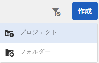

1. **プロジェクトを作成**&#x200B;ページで、写真撮影プロジェクトテンプレートを選択し、「**次へ**」をクリックします。

   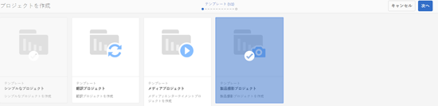

1. プロジェクトの詳細（タイトル、説明、期限など）を入力します。 ユーザーを追加し、様々な役割を割り当てます。 また、プロジェクトのサムネールを追加することもできます。

   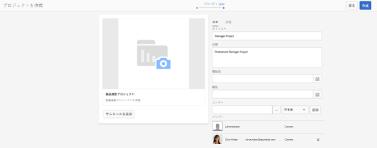

1. 「**作成**」をタップまたはクリックします。プロジェクトが作成されたことを示す確認メッセージが表示されます。
1. 「**完了**」をクリックして、**プロジェクト**&#x200B;コンソールに戻ります。または、「**開く**」をタップあるいはクリックして、写真撮影プロジェクト内のアセットを表示します。

## 製品撮影プロジェクトでの作業の開始 {#starting-work-in-a-product-photo-shoot-project}

写真撮影リクエストを開始するには、プロジェクトをタップまたはクリックしてから、をタップまたはクリックします **作業を追加** をクリックして、ワークフローを開始します。

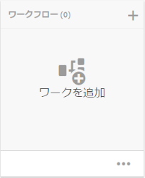

撮影した製品写真プロジェクトには、次の標準ワークフローが含まれています。

* 撮影した製品写真（コマース統合）ワークフロー
* 撮影した製品写真のワークフロー

撮影した製品写真撮影（コマース統合）ワークフローは、AEM の製品に画像アセットをマッピングするときに使用します。このワークフローでは、コマース統合を利用して、承認された画像を */etc/commerce* にある既存の製品データにリンクします。

撮影した製品写真撮影（コマース統合）ワークフローには、以下のタスクが含まれます。

* 撮影リストを作成
* 撮影した写真をアップロード
* 撮影した写真をリタッチ
* レビューと承認
* 実稼動に移動タスク

AEM で製品情報が利用できない場合は、撮影した製品写真撮影ワークフローを使用して、CSV ファイルでアップロードする詳細に基づいて、製品に画像アセットをマッピングします。CSV ファイルには、製品 ID、カテゴリ、説明など、基本的な製品情報が含まれている必要があります。 ワークフローは製品の承認済みアセットを取得します。

このワークフローには、次のタスクが含まれます。

* 撮影リストをアップロード
* 撮影した写真をアップロード
* 撮影した写真をリタッチ
* レビューと承認
* 実稼動に移動タスク

このワークフローは、「ワークフロー設定」オプションを使用してカスタマイズできます。

両方のワークフローに、製品を承認済みアセットにリンクする手順が含まれています。 各ワークフローには、次の手順が含まれます。

* ワークフロー設定：ワークフローをカスタマイズするオプションを説明します
* プロジェクトワークフローの開始：製品撮影の開始方法を説明します。
* ワークフロータスクの詳細：ワークフローで使用可能なタスクの詳細を提供します

## プロジェクトの進行状況の追跡 {#tracking-project-progress}

プロジェクト内のアクティブ/完了したタスクを監視することで、プロジェクトの進行状況を追跡できます。

プロジェクトの進行状況を監視するには、次の手順を使用します。

* **タスクカード**

* **タスクリスト**

タスクカードは、プロジェクト全体の進行状況を表示します。プロジェクトに関連タスクがある場合にのみ、プロジェクトの詳細ページに表示されます。 タスクカードには、完了したタスクの数に基づいて、プロジェクトの現在の完了ステータスが表示されます。 今後のタスクは含まれません。

タスクカードには次の詳細が表示されます。

* アクティブなタスクの割合
* 完了したタスクの割合

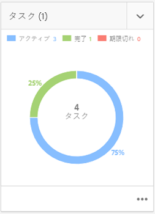

タスクリストには、プロジェクトで現在アクティブなワークフロータスクに関する詳細情報が表示されます。 リストを表示するには、タスクカードをタップまたはクリックします。 タスクリストには、開始日、期限、担当者、優先度、タスクのステータスなどのメタデータも表示されます。

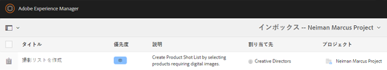

## ワークフロー設定 {#workflow-configuration}

このタスクでは、ユーザーの役割に基づいてユーザーにワークフローステップを割り当てます。

次の手順で **撮影した製品写真** ワークフロー：

1. **ツール**／**ワークフロー**&#x200B;に移動し、「**モデル**」タイルをタップして、**ワークフローモデル**&#x200B;ページを開きます。
1. **製品写真撮影**&#x200B;ワークフローを選択して、ツールバーの「**編集**」アイコンをタップして、編集モードで開きます。

   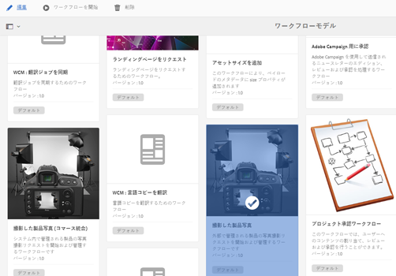

1. **製品写真撮影ワークフロー**&#x200B;ページで、プロジェクトタスクを開きます。例えば、**撮影リストをアップロード**&#x200B;タスクを開きます。

   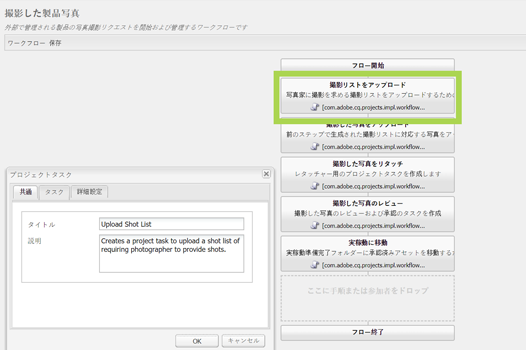

1. 次をクリック： **タスク** タブで以下を設定します。

   * タスクの名前
   * タスクを受け取るデフォルトのユーザー（役割）
   * ユーザーのタスクリストに表示されるタスクのデフォルトの優先度
   * 担当者がタスクを開いたときに表示されるタスクの説明
   * タスクの期限（タスクの開始日時に基づいて計算されます）

1. クリック **OK** 設定を保存します。

   同様に、次のタスクを **撮影した製品写真** ワークフロー：

   * 撮影した写真をアップロード
   * 撮影した製品写真をリタッチ
   * 撮影した写真のレビュー
   * 実稼動に移動

   同様の手順を実行して、**製品写真撮影（Commerce 統合）ワークフロー**&#x200B;でタスクを設定します。

この節では、製品情報管理をクリエイティブプロジェクトと統合する方法について説明します。

## プロジェクトワークフローの開始 {#starting-a-project-workflow}

1. 製品撮影プロジェクトに移動して、**ワークフロー**&#x200B;カードの&#x200B;**作業の追加**&#x200B;アイコンをタップまたはクリックします。
1. **製品写真撮影（Commerce 統合）**&#x200B;ワークフローカードを選択して、製品写真撮影（Commerce 統合）ワークフローを開始します。製品情報が /etc/commerce の下で利用できない場合は、**撮影した製品写真**&#x200B;ワークフローを選択して、撮影した製品写真ワークフローを開始します。

   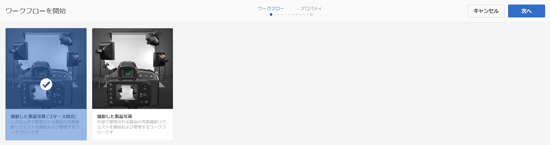

1. タップまたはクリック **次へ** をクリックして、プロジェクト内でワークフローを開始します。
1. 各ワークフローについては、次のページで詳しく説明します。

   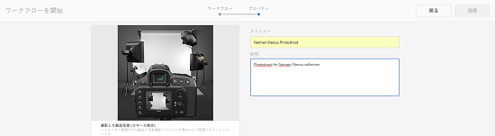

   クリック **送信** ：写真撮影ワークフローを開始します。 写真撮影プロジェクトのプロジェクト詳細ページが表示されます。

   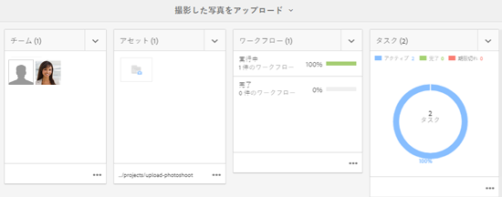

### ワークフロータスクの詳細 {#workflow-tasks-details}

撮影した写真のワークフローには、複数のタスクが含まれます。 各タスクは、タスクに対して定義された設定に基づいてユーザーグループに割り当てられます。

#### 撮影リストの作成タスク {#create-shot-list-task}

**撮影リストの作成**&#x200B;タスクを使用して、プロジェクト所有者が画像を必要とする製品を選択できます。ユーザーが選択したオプションに基づいて、製品の基本情報を含む CSV ファイルが生成されます。

1. プロジェクトフォルダーで、[タスクカード](#tracking-project-progress)の中の省略記号をタップまたはクリックして、ワークフローの中のタスク項目を表示します。

   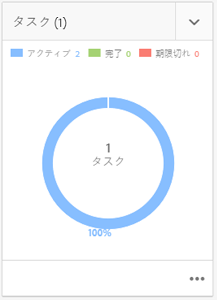

1. 「**撮影リストを作成**」タスクを選択して、ツールバーの「**開く**」アイコンをタップまたはクリックします。

   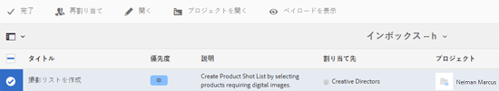

1. タスク詳細をプレビューしてから、「**撮影リストを作成**」ボタンをタップまたはクリックします。

   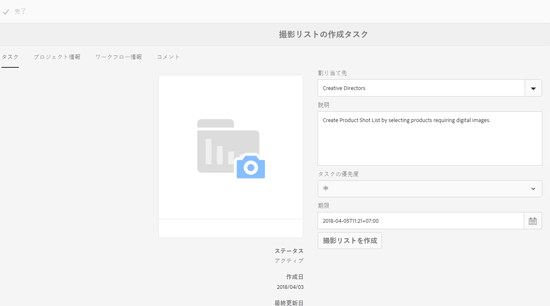

1. 製品データに画像が関連付けられていない製品を選択します。

   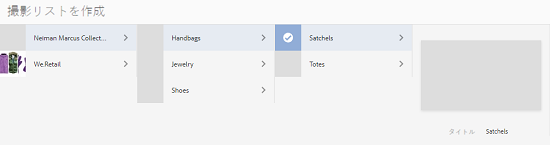

1. 「**撮影リストに追加**」アイコンをタップまたはクリックして、これらすべての製品のリストを含む CSV ファイルを作成します。選択した製品に対して撮影リストが作成されたことを確認するメッセージが表示されます。 クリック **閉じる** をクリックして、ワークフローを完了します。
1. 撮影リストを作成した後、 **撮影リストを表示** リンクが表示されます。 撮影リストにさらに商品を追加するには、「**撮影リストに追加**」をタップまたはクリックします。この場合、最初に作成された撮影リストにデータが追加されます。

   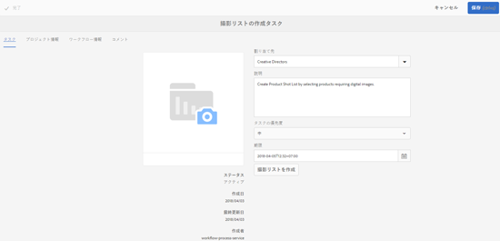

1. 「**撮影リストを表示**」をタップまたはクリックして、新しい撮影リストを表示します。

   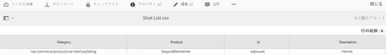

   既存のデータを編集または新しいデータを追加するには、ツールバーの「**編集**」をタップまたはクリックします。「製品」フィールドと「**説明**」フィールドのみ編集可能です。

   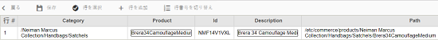

   ファイルを更新した後で、ツールバーの「**保存**」をタップまたはクリックしてファイルを保存します。

1. 製品を追加したら、「撮影リストの作成」タスクの詳細ページの「**完了**」アイコンをクリックして、タスクを「完了」としてマークします。オプションでコメントを追加できます。

   タスクが完了すると、プロジェクト内で次の変更がおこなわれます。

   * 製品階層に対応するアセットが、ワークフロータイトルと同じ名前のフォルダーに作成されます。
   * 写真家が画像を提供する前でも、アセットコンソールを使用してアセットのメタデータを編集できるようになります。
   * 撮影者が提供する画像を保存する撮影した写真フォルダーが作成されます。 撮影した写真フォルダには、撮影リストの各製品エントリのサブフォルダが含まれています。

   撮影した製品写真（コマース統合なし）ワークフローの場合、撮影リストのアップロードが最初のタスクです。 「**撮影リストをアップロード**」をタップまたはクリックして、**shotlist.csv** ファイルをアップロードします。CSV ファイルには、製品 ID が含まれている必要があります。 その他のフィールドはオプションです。これらを使用して、アセットを製品にマッピングできます。

### 撮影リストのアップロードタスク {#upload-shot-list-task}

このタスクは、撮影した製品写真ワークフローの一部です。 このタスクは、製品情報がAEMで使用できない場合に実行します。 この場合、画像アセットが必要な製品のリストを CSV ファイルにアップロードします。 CSV ファイルの詳細に基づいて、画像アセットを製品にマップします。

以下を使用： **撮影リストを表示** 前の手順のプロジェクトカードの下にあるリンクを使用して、サンプルの CSV ファイルをダウンロードできます。 サンプルファイルを確認して、CSV ファイルの通常の内容を確認します。

製品リストまたは CSV ファイルには、次のようなフィールドを含めることができます。 **カテゴリ、製品、ID、説明**、および **パス**. 「**ID**」フィールドは必須で、製品 ID が格納されます。その他のフィールドはオプションです。

製品は、特定のカテゴリに属することができます。製品カテゴリは、CSV ファイルの「**カテゴリ**」列に表示することができます。「**製品**」フィールドには製品名が格納されます。「**説明**」フィールドに、製品の説明またはフォトグラファーに対する指示を入力します。

>[!NOTE]
>
>アップロードする画像の名前は、「**&lt;ProductId>_」**&#x200B;で始める必要があります。製品 ID は、*shotlist.csv* ファイルの「**ID**」フィールドから参照されます。例えば、撮影リストの **ID が 397122** の製品に対しては、**397122_highcontrast.jpg** または **397122_lowlight.png** などの名前のファイルをアップロードできます。

1. プロジェクトフォルダーで、[タスクカード](#tracking-project-progress)の中の省略記号をタップまたはクリックし、ワークフロー内のタスクのリストを表示します。
1. 「**撮影リストをアップロード**」タスクを選択してから、ツールバーの「**開く**」アイコンをタップまたはクリックします。

   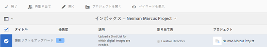

1. タスク詳細をレビューしてから「**撮影リストをアップロード**」ボタンをタップまたはクリックします。

   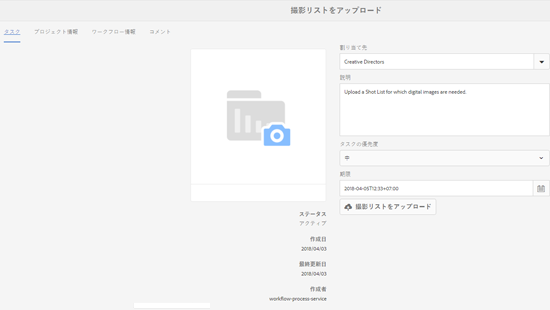

1. 「**撮影リストをアップロード**」ボタンをタップまたはクリックして、ファイル名が「shotlist.csv」の CSV ファイルをアップロードします。ワークフローは、このファイルを次のタスクの製品データの抽出に使用するソースとして認識します。
1. 適切な形式の製品情報を含む CSV ファイルをアップロードします。 CSV ファイルがアップロードされると、カードの下に「 **アップロードされたアセットを表示** 」リンクが表示されます。

   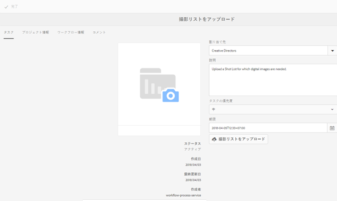

   「**完了**」アイコンをクリックして、タスクを完了します。

1. 「**完了**」アイコンをタップまたはクリックして、タスクを完了します。

### 撮影した写真のアップロードタスク {#upload-photo-shoot-task}

編集者の場合は、前のタスクで作成またはアップロードされた **shotlist.csv**&#x200B;ファイルにリストされている製品の写真をアップロードできます。

アップロードする画像の名前は、「**&lt;productId>_」**&#x200B;で始める必要があります。この製品 ID は、**shotlist.csv** ファイルの「**ID**」フィールドから参照されます。例えば、撮影リストに含まれている **ID 397122** の製品については、**397122_highcontrast.jpg** や **397122_lowlight.png** といった名前の画像ファイルをアップロードできます。

画像を直接アップロードすることも、画像を含む ZIP ファイルをアップロードすることもできます。画像はそれぞれの名前に基づいて、「**撮影した写真**」フォルダー内の製品フォルダーに配置されます。

1. プロジェクトフォルダーで[タスクカード](#tracking-project-progress)の中の省略記号をタップまたはクリックして、ワークフローの中のタスク項目を表示します。
1. 「**撮影した写真のアップロード**」タスクを選択し、ツールバーから「**開く**」アイコンをタップまたはクリックします。

   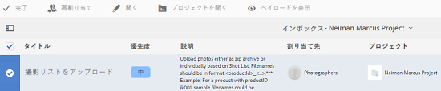

1. 「**撮影した写真をアップロード**」をタップまたはクリックし、撮影した写真の画像をアップロードします。
1. ツールバーの「**完了**」アイコンをタップまたはクリックして、タスクを完了します。

### 撮影した写真のリタッチタスク {#retouch-photo-shoot-task}

編集権限がある場合は、撮影した写真のリタッチタスクを実行して、撮影した写真フォルダーにアップロードされた画像を編集します。

1. プロジェクトフォルダーで[タスクカード](#tracking-project-progress)の中の省略記号をタップまたはクリックして、ワークフローの中のタスク項目を表示します。
1. 「**撮影した写真のリタッチ**」タスクを選択してから、ツールバーの「**開く**」アイコンをタップまたはクリックします。

   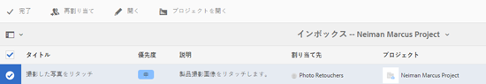

1. **撮影した写真のリタッチ**&#x200B;ページで「**アップロードされたアセットを表示**」リンクをタップまたはクリックして、アップロードされた画像を参照します。

   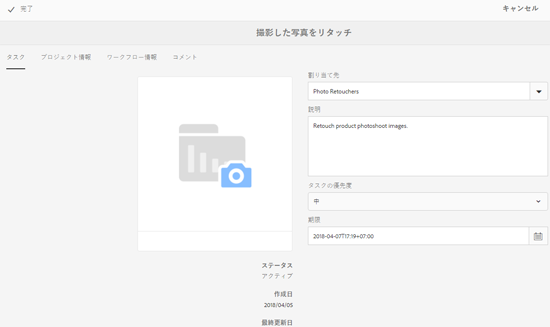

   必要に応じて、Adobe Creative Cloud アプリケーションを使用して画像を編集します。

   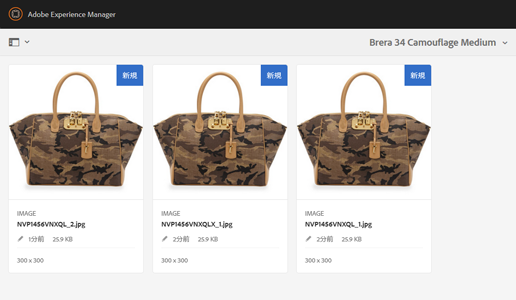

1. ツールバーの「**完了**」アイコンをタップまたはクリックして、タスクを完了します。

### タスクのレビューと承認 {#review-and-approve-task}

このタスクでは、写真家がアップロードした写真撮影画像をレビューし、画像を使用の承認を得たものとしてマークします。

1. プロジェクトフォルダーで[タスクカード](#tracking-project-progress)の中の省略記号をタップまたはクリックして、ワークフローの中のタスク項目を表示します。
1. 「**レビューおよび承認**」タスクを選択してから、ツールバーの「**開く**」アイコンをタップまたはクリックします。

   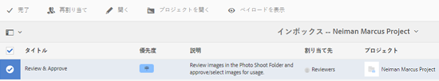

1. **レビューおよび承認**&#x200B;ページで、レビュアーなどの役割にレビュータスクを割り当ててから、「レビュー」をタップまたはクリックして、アップロードされた製品画像のレビューを開始します。

   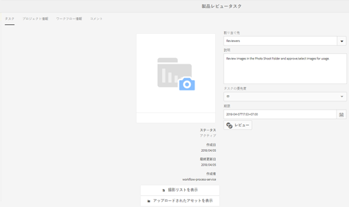

1. 製品画像を選択して、ツールバーの「承認」アイコンをタップまたはクリックして、それに承認済みマークを付けます。

   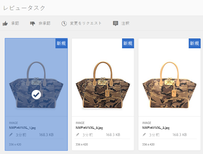

   画像を承認すると、承認済みのバナーが画像の上に表示されます。

   >[!NOTE]
   一部の製品を画像なしで除外することもできます。 後で、タスクに再度アクセスし、完了後にタスクを完了するようにマークできます。

1. タップまたはクリック **完了**. 承認済みの画像は、作成された空のアセットとリンクされます。

Assets UI を使用してプロジェクトアセットに移動し、承認された画像を確認できます。

次のレベルをタップまたはクリックして、製品データ階層に従って製品を表示します。

クリエイティブプロジェクトは、承認されたアセットと参照されている製品を関連付けます。アセットのメタデータは、「**製品データ**」タブの「AEMアセットのメタデータ」セクションに表示されるアセットプロパティで、製品の参照と基本情報で更新されます。

>[!NOTE]
撮影した製品写真ワークフロー（コマース統合なし）では、承認された画像は製品と関連付けられていません。

### 実稼動に移動タスク {#move-to-production-task}

このタスクにより、承認されたアセットが実稼動用フォルダーに移動し、使用できるようになります。

1. プロジェクトフォルダーで[タスクカード](#tracking-project-progress)の中の省略記号をタップまたはクリックして、ワークフローの中のタスク項目を表示します。
1. 「**実稼動に移動**」タスクを選択してから、ツールバーから「**開く**」アイコンをタップまたはクリックします。

   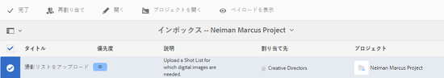

1. 実稼動用フォルダーに移動する前に、撮影した写真の承認されたアセットを表示するには、**実稼動に移動**&#x200B;タスクページのプロジェクトのサムネイルの下にある「**承認されたアセットを表示**」リンクをクリックします。

   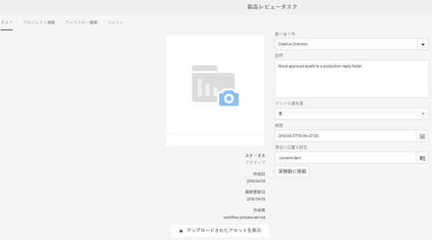

1. 実稼動用フォルダーのパスを「**移動先**」フィールドに入力します。

   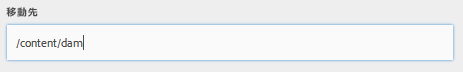

   「**実稼動に移動**」をタップまたはクリックします。確認メッセージを閉じます。アセットが前述のパスに移動し、フォルダー階層に基づいて、各製品の承認されたアセット用のスピンセットが自動的に作成されます。

1. ツールバーの「**完了**」アイコンをタップまたはクリックします。最後のステップが完了とマークされると、ワークフローは完了します。

## DAM アセットメタデータの表示 {#viewing-dam-asset-metadata}

アセットを承認すると、そのアセットが対応する製品にリンクされます。承認されたアセットの[プロパティページ](/help/assets/managing-assets-touch-ui.md#editing-properties)には、「**製品データ**」（リンクされた製品の情報）タブが追加されています。このタブには、製品の詳細、SKU 番号およびアセットにリンクしているその他の製品に関連する詳細が表示されます。次をタップまたはクリックします。 **編集** アイコンをクリックして、アセットのプロパティを更新します。 製品に関する情報は、読み取り専用のままです。

表示されるリンクをタップまたはクリックして、アセットが関連付けられている製品コンソール内の各製品の詳細ページに移動します。

## 撮影したプロジェクト写真ワークフローのカスタマイズ {#customizing-the-project-photo-shoot-workflows}

要件に基づいて、プロジェクト撮影ワークフローをカスタマイズできます。 これは、プロジェクト内の変数の値を設定するために実行する、役割に基づく任意のタスクです。 後で、設定された値を使用して判定をおこなうことができます。

1. AEM のロゴをクリックまたはタップし、**ツール**／**ワークフロー**／**モデル**&#x200B;に移動して、ワークフローのモデルページを開きます。
1. **製品写真撮影（Commerce 統合）**&#x200B;ワークフローまたは&#x200B;**製品写真撮影**&#x200B;ワークフローを選択し、ツールバーから「**編集**」をクリックまたはタップして、ワークフローを編集モードで開きます。
1. サイドキックで&#x200B;**プロジェクト**&#x200B;タスクを開き、**役割に基づくプロジェクトタスクを作成**&#x200B;ステップをワークフローにドラッグします。

   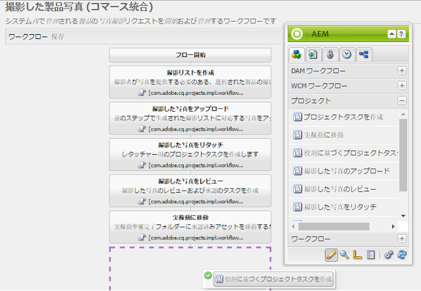

1. **役割に基づくタスク**&#x200B;ステップを開きます。
1. 「**タスク**」タブで、**タスク**&#x200B;リストに表示されるタスクの名前を指定します。タスクを役割に割り当て、デフォルトの優先度を設定し、説明を入力し、タスクが期限切れになる時間を指定することもできます。

   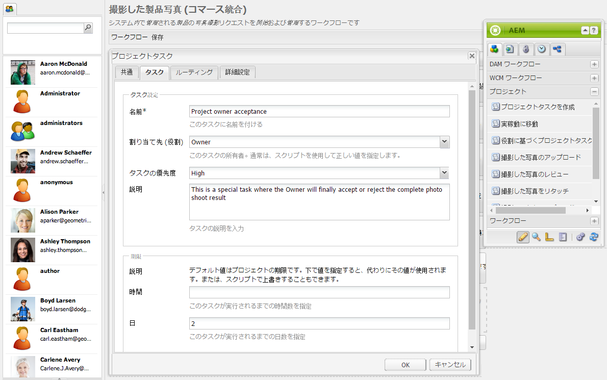

1. 「**ルーティング**」タブで、タスクのアクションを指定します。複数のアクションを追加するには、「項目を追加」リンクをタップまたはクリックします。

   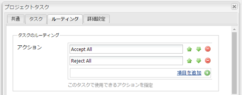

1. オプションを追加したら、「**OK**」をクリックして変更をステップに追加します。

   >[!NOTE]
   「**OK**」をタップまたはクリックしても、ワークフローの変更は保存されません。ワークフローの変更を保存するには、「**保存**」をタップまたはクリックします。

1. サイドキックから&#x200B;**ワークフロー**&#x200B;タスクを開き、**移動**&#x200B;タスクを追加します。
1. を開きます。 **移動** タスクをクリックし、 **プロセス** タブをクリックします。
1. 次のコードを **スクリプト** ボックス：

```
   function check() {

   if (workflowData.getMetaDataMap().get("lastTaskAction","") == "Reject All") {

   return true

   }

   // set copywriter user in metadata

   var previousId = workflowData.getMetaDataMap().get("lastTaskCompletedBy", "");

   workflowData.getMetaDataMap().put("copywriter", previousId);

   return false;

   }
```

>[!NOTE]
ワークフローステップのスクリプトの詳細については、[OR 分岐用のルールの定義](/help/sites-developing/workflows-models.md)を参照してください。

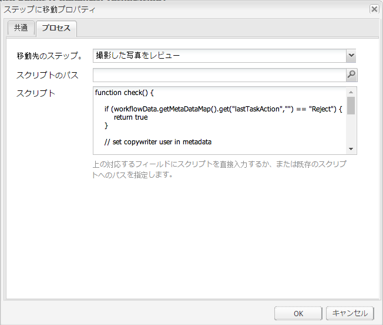

1. 「**OK**」をタップまたはクリックします。

1. 「**保存**」をタップまたはクリックしてワークフローを保存します。

   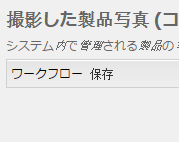

1. [実稼動への移動タスク](#move-to-production-task)が完了し、所有者に割り当てられたら、新しいプロジェクト所有者の同意タスクが表示されます。

   所有者の役割を持つユーザーは、タスクを完了し、コメントポップアップのリスト（ワークフローステップ設定で追加されたアクションのリスト）からアクションを選択できます。

   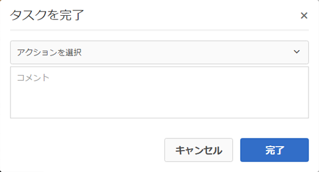

   適切なオプションを選択し、「**完了**」をクリックして、ワークフロー内の&#x200B;**移動ステップ**&#x200B;を実行します。

>[!NOTE]
サーバーを起動すると、プロジェクトタスクリストのサーブレットが、`/libs/cq/core/content/projects/tasktypes`で定義される、タスクタイプと URL のマッピングをキャッシュします。その後、通常のオーバーレイを実行し、`/apps/cq/core/content/projects/tasktypes` の下に配置することによって、カスタムタスクタイプを追加できます。
