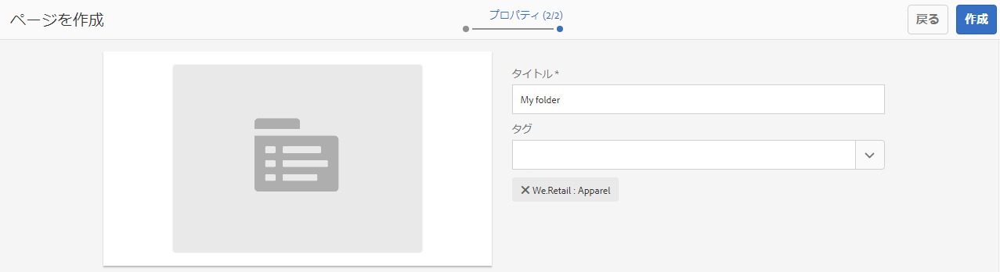

# オファーの作成と管理 {#creating-and-managing-offers}

オファーコンソールを使用して、次の操作を行えるオファーを作成します [アクティビティエクスペリエンスでの使用](/help/sites-authoring/content-targeting-touch.md). オファーコンソールでオファーを作成すると、複数のエクスペリエンスで同じオファーが必要となる場合の時間を節約できます。

* ライブラリ内で 1 回作成したオファーを、ブランドアクティビティの複数のエクスペリエンスで使用します。
* ライブラリ内のオファーを変更すると、そのオファーを使用するすべてのエクスペリエンスに影響が及びます。

オファーコンソールでは、オファーをブランド別に整理します。 各ブランドには、ブランドのエクスペリエンスで使用できるオファーのライブラリが含まれています。 フォルダーを使用して、各ライブラリ内のオファーを整理するための階層構造を定義します。 作成者は、論理フォルダー構造を使用して、参照でオファーを簡単に見つけることができます。 また、タグ付けや検索ツールを使用して、作成者はオファーを検索できます。

## オファーコンソールを使用したブランドの追加 {#add-a-brand-using-the-offers-console}

オファーを関連付けるブランドを作成します。オファーコンソールでブランドを開き、フォルダーとオファーを作成できるオファーライブラリにアクセスします。

オファーコンソールを使用してブランドを作成すると、そのブランドも [アクティビティコンソール](/help/sites-authoring/activitylib.md) ここで、ブランドのアクティビティを追加および管理できます。

1. ナビゲーションコンソールで、**パーソナライズ機能**／**オファー**&#x200B;をクリックまたはタップします。

   

1. 「**作成**」、「**ブランドを作成**」の順にクリックまたはタップします。
1. ブランドテンプレートを選択し、「 」をクリックまたはタップします **次へ**.
1. オファーコンソールとアクティビティコンソールに表示するブランドのタイトルを入力します。 必要に応じて、ブランドに関連付ける 1 つ以上のタグを入力または選択します。
1. 「**作成**」をクリックまたはタップします。

## オファーライブラリへのフォルダーの追加 {#add-a-folder-to-an-offer-library}

オファーを整理および保存するために、ブランドのオファーライブラリにフォルダーを追加します。 ブランドの下または他のフォルダーの下にフォルダーを作成できます。

1. オファーコンソールで、フォルダーを作成する場所を開きます。 例えば、ブランドを開いて最上位フォルダーを作成するか、ライブラリ内の別のフォルダーを開きます。
1. クリックまたはタップ **作成** > **フォルダーまたはオファーを作成**.

   

1. 「**フォルダー**」を選択し、「**次へ**」をクリックします。
1. オファーライブラリに表示するフォルダーのタイトルを入力し、タグを入力または選択します。

   

1. 「**作成**」をクリックまたはタップします。

## オファーをオファーライブラリに追加 {#add-an-offer-to-an-offer-library}

オファーをブランドのオファーライブラリに追加して、ブランドのエクスペリエンスに追加できるようにします。 オファーを追加する際に、タイトルを指定します。 また、オファーを 1 つ以上のタグに関連付けて、検索性を高めることもできます。

作成したオファーを開いて、コンテンツを作成できます。

1. オファーコンソールで、オファーを作成する場所を開きます。 例えば、ブランドを開いて最上位オファーを作成するか、ライブラリ内のフォルダーを開きます。
1. クリックまたはタップ **作成** > **フォルダーまたはオファーを作成**.

   

1. を選択します。 **オファーページ** テンプレートを選択し、クリックまたはタップします。 **次へ**.
1. オファーのタイトルを入力し、必要に応じて、オファーに関連付ける 1 つ以上のタグを選択または入力して、「 」をクリックまたはタップします **作成**.
1. このオファーを編集用に開くには、確認ダイアログボックスで「**ページを開く**」をクリックまたはタップします。

## オファーの編集 {#editing-an-offer}

オファーを開き、そのオファーを使用するエクスペリエンスに表示する内容を編集します。 任意のエクスペリエンスで使用されているオファーを編集すると、変更がエクスペリエンスに表示されます。

オファーは、オファーライブラリのフォルダーまたは検索結果から開くことができます。 また、オファーを使用するエクスペリエンスからオファーを開くこともできます。

1. オファーコンソールで、オファーの横のアイコンをタップまたはクリックし、「 」をクリックまたはタップします **編集**.
1. オファーにコンポーネントを追加し、通常どおりにコンポーネントのコンテンツを編集します。

## オファーの削除 {#deleting-an-offer}

不要になったオファーを削除します。 エクスペリエンスで使用されているオファーを削除しようとすると、削除を確認するメッセージが表示されます。 確認すると、オファーが削除され、エクスペリエンスから削除されます。

オファーライブラリ内のフォルダーコンテンツまたは検索結果を表示しているときに、オファーを削除できます。

1. オファーコンソールで、オファーの横のアイコンをタップまたはクリックし、「 」をクリックまたはタップします **削除**.

   オファーを選択し、「 」をクリックまたはタップします **削除**.

1. 表示されるダイアログボックスで、「 」をクリックまたはタップします。 **削除** 削除を確定します。
1. オファーが 1 つ以上のエクスペリエンスで使用されている場合は、そのオファーが参照されていることを示すダイアログボックスが表示されます。

   * オファーを削除してエクスペリエンスから削除するには、「 」または「 」をタップします **削除を強制**.
   * オファーを保持するには、をクリックまたはタップします **キャンセル**.

## オファーの検索 {#searching-for-offers}

タイトルの照合にキーワードを使用して、ブランドのオファーを検索します。

現在の検索条件が検索結果の横に表示されます。 また、列で結果を昇順または降順に並べ替えることもできます。 任意のオファーライブラリの任意のフォルダーから検索を実行できます。 検索結果は、現在のフォルダーに関係なく同じです。

オファーを検索するには：

1. オファーコンソールの上部で、虫眼鏡アイコンをクリックまたはタップします。デフォルトでは、検索対象はオファーに限定されます。
1. オファーを検索するには、キーワードを入力します。 結果からを選択します。
