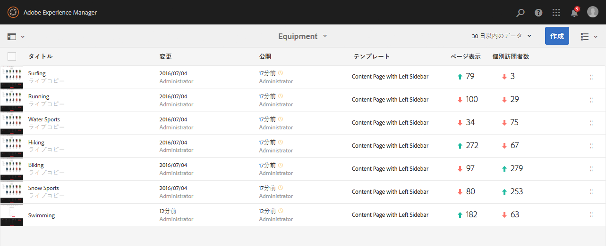
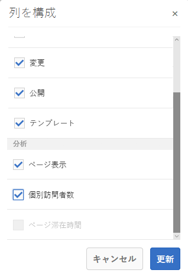
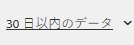

# ページ分析データの表示 {#seeing-page-analytics-data}

>[!CAUTION]
>
>AEM 6.4 の拡張サポートは終了し、このドキュメントは更新されなくなりました。 詳細は、 [技術サポート期間](https://helpx.adobe.com/jp/support/programs/eol-matrix.html). サポートされているバージョンを見つける [ここ](https://experienceleague.adobe.com/docs/?lang=ja).

ページ分析データを使用して、ページコンテンツの効果を測定します。

## Analytics はコンソールから表示 {#analytics-visible-from-the-console}

ページ分析データは、 [リスト表示](/help/sites-authoring/basic-handling.md#list-view) 」をクリックします。 ページがリスト形式で表示される場合、次の列がデフォルトで使用可能です。

* ページ表示
* 個別訪問者数
* ページ滞在時間

各列には、現在のレポート期間の値が表示され、値が前のレポート期間以降に増加または減少したかどうかも示されます。 表示されるデータは 12 時間ごとに更新されます。

>[!NOTE]
>
>更新期間を変更するには、次の手順に従います。 [インポート間隔の設定](/help/sites-administering/adobeanalytics-connect.md#configuring-the-import-interval).

1. **Sites** コンソールを開きます（例：[http://localhost:4502/sites.html/content](http://localhost:4502/sites.html/content)）。
1. ツールバーの右端（右上隅）で、アイコンをクリックまたはタップして、「**リスト表示**」（表示されるアイコンは、[現在の表示](/help/sites-authoring/basic-handling.md#viewing-and-selecting-resources)によって異なる）を選択します。

1. ツールバーの右端（右上隅）にあるアイコンをクリックまたはタップし、「 **設定を表示**. この **列の構成** ダイアログが開きます。 必要な変更を加えて、「**更新**」で確定します。

   

### レポート期間の選択 {#selecting-the-reporting-period}

Analytics データがサイトコンソールに表示されるレポート期間を選択します。

* 過去 30 日間のデータ
* 過去 90 日間のデータ
* 今年のデータ

現在のレポート期間が Sites コンソールのツールバー（上部のツールバーの右側）に表示されます。ドロップダウンを使用して、必要なレポート期間を選択します。\

### 使用可能なデータ列の設定 {#configuring-available-data-columns}

analytics-administrators ユーザーグループのメンバーは、サイトコンソールを設定して、作成者が追加の Analytics 列を表示できるようにします。

>[!NOTE]
>
>ページのツリーに様々なAdobe Analyticsクラウド設定に関連付けられている子が含まれている場合、そのページで使用可能なデータ列を設定することはできません。

1. リスト表示で、表示セレクター（ツールバーの右側）を使用し、「 」を選択します。 **設定を表示** そして A **カスタム分析データを追加**.

   

1. Sites コンソールで作成者に表示する指標を選択し、「**追加**」をクリックします。

   表示される列は Adobe Analytics から取得されます。

   

### Sites からコンテンツインサイトを開く {#opening-content-insights-from-sites}

Sites コンソールから「[コンテンツインサイト](/help/sites-authoring/content-insights.md)」を開き、ページの効果をさらに分析できます。

1. サイトコンソールで、コンテンツインサイトを表示するページを選択します。
1. ツールバーで、 Analytics とRecommendationsアイコンをクリックします。

   

## Analytics がページエディターから表示される (Activity Map) {#analytics-visible-from-the-page-editor-activity-map}

>[!CAUTION]
>
>Adobe Analytics API 内のセキュリティの変更により、AEM に含まれているバージョンの Activity Map は使用できなくなりました。
>
>[Adobe Analytics で提供される ActivityMap プラグイン](https://experienceleague.adobe.com/docs/analytics/analyze/activity-map/getting-started/get-started-users/activitymap-install.html?lang=ja)を今すぐ使用する必要があります。
