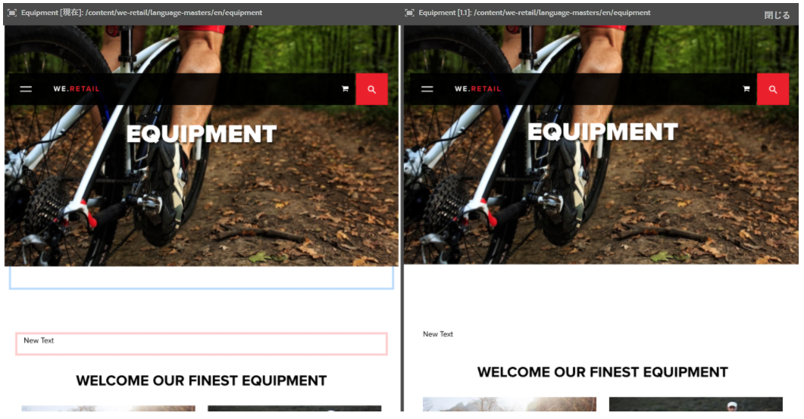
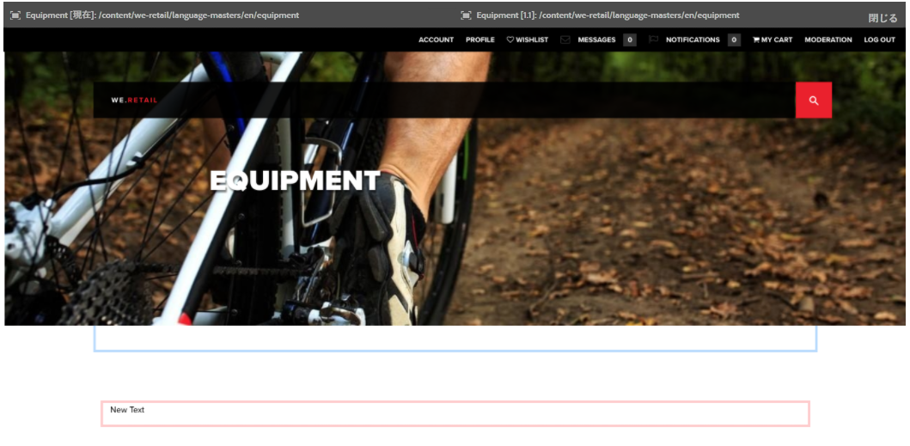

# ページの差分{#page-diff}

## はじめに {#introduction}

コンテンツ作成は反復的なプロセスです。効率的にオーサリングをおこなうには、反復するごとに何が変更されたかがわかるようにする必要があります。あるページバージョンを見てから別のページバージョンを見るのは非効率的であり、エラーが発生しやすくなります。作成者は、現在のページを他のバージョンと並べて簡単に比較したいと考えます。

ページの差分表示を使用すると、2 つのページを並べて比較し、差分を強調表示できます。

>[!CAUTION]
>
>AEM 6.4.3 より前のバージョンを実行している場合、ユーザーは **変更/作成/削除** ノードに対する権限 `/content/versionhistory` 機能を使用するために。
>
>この機能の技術的詳細については、[開発とページの差分](/help/sites-developing/pagediff.md#operation-details)を参照してください。

## 使用方法 {#use}

並列比較による差分表示では、次のものを比較できます。

* [バージョン](/help/sites-authoring/working-with-page-versions.md#comparing-a-version-with-current-page) - ページの以前のバージョンとその現在の状態
* [ライブコピー](/help/sites-administering/msm-livecopy.md#comparing-a-live-copy-page-with-a-blueprint-page) - ライブコピーとそのブループリント
* [ローンチ](/help/sites-authoring/launches-editing.md#comparing-a-launch-page-to-its-source-page) - ローンチとそのソース
* [言語コピー](/help/sites-administering/tc-manage.md#comparing-language-copies) - （再）翻訳前と（再）翻訳後のページ

それらのコンテキスト内で差分の確認を開始する方法については、それぞれのトピックを参照してください。

### 差分の表示 {#presentation-of-differences}

比較対象のコンテンツにかかわらず、差分の表示は同じです。

* 差分の確認を開始したときに選択されたコンテンツが左側に表示されます（差分のエントリポイント）。
* 比較対象のコンテンツが右側に表示されます（選択されたコンテンツの比較対象となるもの）。

例えば、バージョンを比較する場合、現在のバージョンが左側に表示され、以前のバージョンが右側に表示されます。

両方のページのソースは、ブラウザーウィンドウ上部のヘッダーバーにはっきりと表示されます。

差分によりコンポーネントおよび HTML レベルの変更が検出されます。変更された項目は、異なる色で強調表示されます。

**変更の比較**

* ライトグリーン - 追加されたコンポーネント
* ピンク - 削除されたコンポーネント
* 青 - 変更されたコンポーネント
* 青 - 移動されたコンポーネント

変更されたものの色と移動されたものの色は同じです。

**HTML の変更**

* ダークグリーン - 追加された HTML
* 赤 - 削除された HTML

>[!NOTE]
>
>言語コピーを比較する場合は、翻訳ですべてが変更され、強調表示をしても意味がないので、強調表示は無効になります。

### 全画面表示および終了 {#fullscreen-and-exiting}

特定のコンテンツに集中するために、並列比較による差分表示のいずれかの「側」の全画面表示アイコンをクリックして、それをフルブラウザーウィンドウに拡大することができます。

選択された側がウィンドウ全体に表示されますが、バーは上部に残るので、2 枚のページを切り替えることができます。

また全画面表示終了アイコンをクリックして、全画面表示を閉じることができます。

ヘッダーの「閉じる」ボタンをクリックすることで、並列比較による差分表示はいつでも終了することができます。

## 制限事項 {#limitations}

ページの差分表示で期待どおりに差分が検出されない場合があります。

* バージョンおよびローンチが異なるとき、差分は、パンくずリスト、メニュー、製品リスト、ロゴなどのダイナミックコンポーネント（コンテンツを表示する際にサイト構造に依存するコンポーネント）を考慮しません。
* バージョンの差分表示では、アクセスコントロールポリシーおよびライブコピー関係は再現されません。
* alt、title、src 属性の変更など、画像を変更する場合、差分は青色で強調表示されます。たとえ両方の画像が同じに見える場合でも、画像に src 属性の Base64 による表示があるときに src 属性が異なれば、それが差分としてマークされます。
* 差分表示では、画像の回転を検出できません。
* ページを移動すると、移動前に作成したバージョンとの差分を実行できなくなります。

   * 差分で問題が発生した場合は、ページの[タイムライン](/help/sites-authoring/basic-handling.md#timeline)を調べて、ページを移動したかどうかを確認します。

>[!NOTE]
>
>古いバージョン同士を比較することはできません。比較できるのは、現在のバージョンと古いバージョンの組み合わせだけです。変更の強調表示は、必ず現在のバージョンに対しておこなわれます。

>[!NOTE]
>
>ページの差分操作の仕組みおよびページの差分に影響を与える可能性のある制限事項について詳しくは、この機能の[開発者向けドキュメント](/help/sites-developing/pagediff.md)を参照してください。
