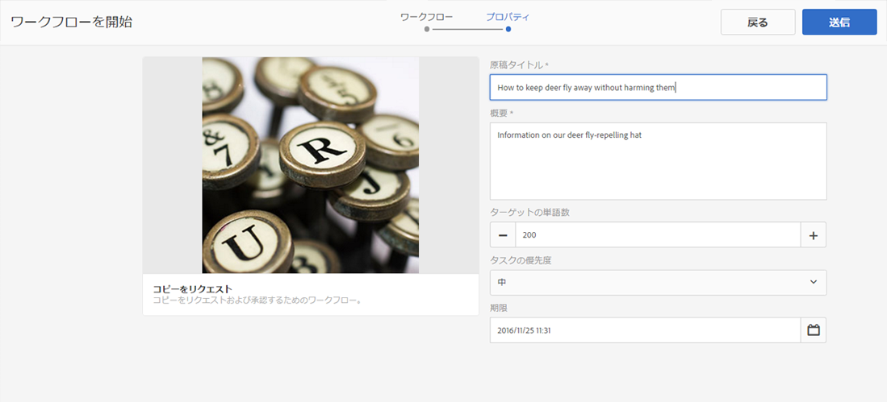
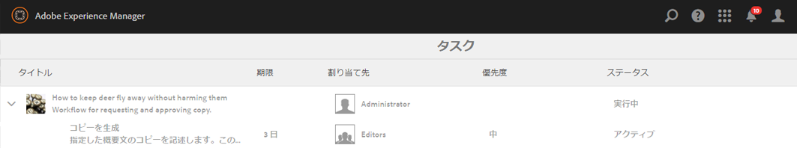
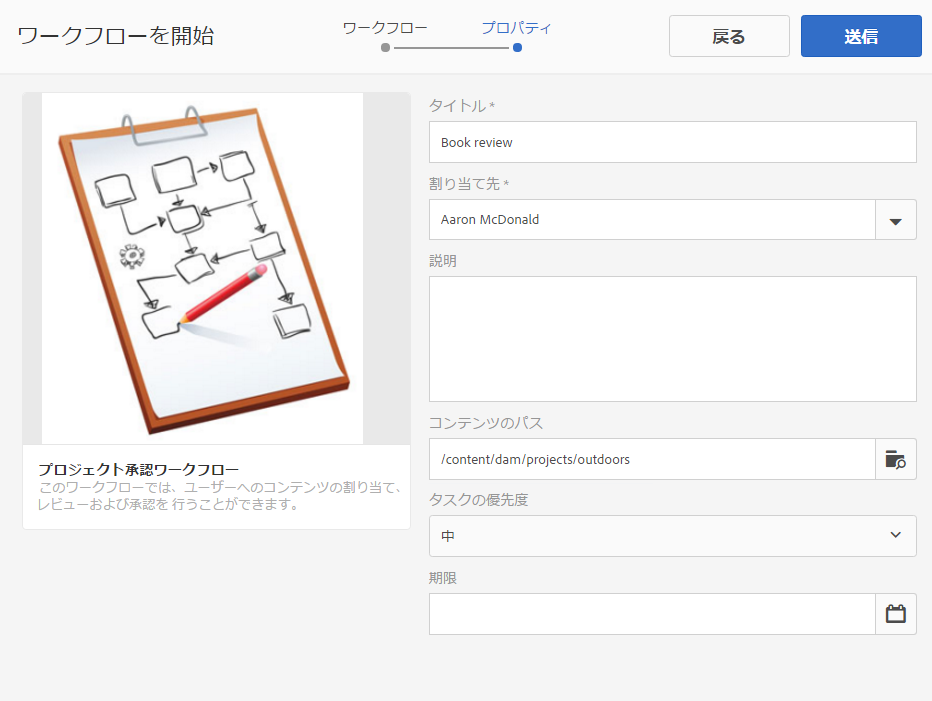
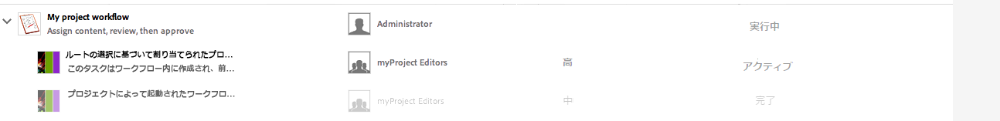
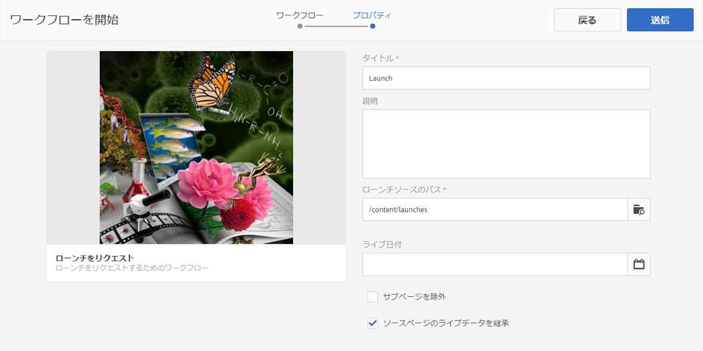
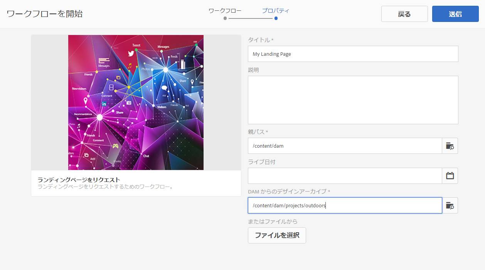
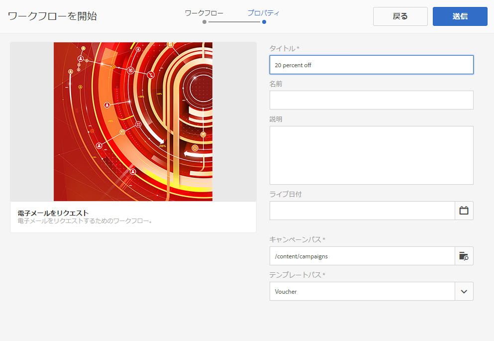
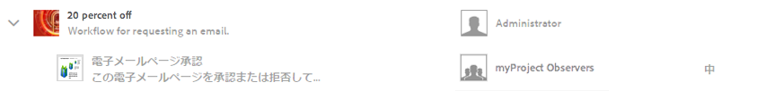

# プロジェクトワークフローの操作 {#working-with-project-workflows}

>[!CAUTION]
>
>AEM 6.4 の拡張サポートは終了し、このドキュメントは更新されなくなりました。 詳細は、 [技術サポート期間](https://helpx.adobe.com/jp/support/programs/eol-matrix.html). サポートされているバージョンを見つける [ここ](https://experienceleague.adobe.com/docs/?lang=ja).

すぐに使用可能なプロジェクトワークフローには、次のものがあります。

* **プロジェクト承認ワークフロー** - ユーザーへのコンテンツの割り当て、レビューおよび承認を行うことができます。
* **ローンチをリクエスト** - ローンチをリクエストするワークフローです。
* **ランディングページをリクエスト** - ランディングページをリクエストするワークフローです。
* **メールをリクエスト** - メールをリクエストするワークフローです。
* **撮影した製品写真および撮影した製品写真（コマース）** - アセットを製品にマップします。
* **DAM 言語コピー作成／翻訳および DAM 言語コピーを作成** - アセットおよびフォルダー用に翻訳されたバイナリ、メタデータ、タグを作成します。

選択するプロジェクトテンプレートに応じて、次の特定のワークフローを使用できます。

|  | **シンプルなプロジェクト** | **メディアプロジェクト** | **製品撮影プロジェクト** | **翻訳プロジェクト** |
|---|:-:|:-:|:-:|:-:|
| コピーをリクエスト |  | x |  |  |
| 撮影した製品写真 |  | x | x |  |
| 撮影した製品写真（コマース） |  |  | x |  |
| プロジェクトの承認 | x |  |  |  |
| ローンチをリクエスト | x |  |  |  |
| ランディングページをリクエスト | x |  |  |  |
| メールをリクエスト | x |  |  |  |
| DAM 言語コピーを作成&amp;ast; |  |  |  | x |
| DAM 言語コピー作成／翻訳&amp;ast; |  |  |  | x |

>[!NOTE]
>
>&amp;ast; これらのワークフローは、プロジェクトの&#x200B;**ワークフロー**&#x200B;タイルからは開始できません。詳しくは、 [アセットの言語コピーの作成](/help/sites-administering/tc-manage.md)

ワークフローを開始および完了する手順は、どのワークフローを選択しても同じです。 ステップのみが変更されます。

ワークフローは、プロジェクト内で直接開始します（「DAM 言語コピーを作成」または「DAM 言語コピー作成／翻訳」を除く）。プロジェクト内の未処理のタスクに関する情報は、 **タスク** タイル。 ユーザーアイコンの横に、完了する必要のあるタスクに関する通知が表示されます。

AEMでのワークフローの操作について詳しくは、次を参照してください。

* [ワークフローへの参加 ](/help/sites-authoring/workflows-participating.md)
* [ページへのワークフローの適用 ](/help/sites-authoring/workflows-applying.md)
* [ワークフローの設定](/help/sites-administering/workflows.md)

この節では、プロジェクトに使用可能なワークフローについて説明します。

## コピーをリクエストワークフロー {#request-copy-workflow}

ユーザーから原稿をリクエストし、承認できます。 コピーリクエストワークフローを開始するには：

1. メディアプロジェクトで&#x200B;**ワークフロー**&#x200B;タイルの「**+**」記号を選択し、「**コピーをリクエストワークフロー**」を選択します。
1. 原稿のタイトルと、要求内容の簡単な概要を入力します。 必要に応じて、ターゲットの単語数、タスクの優先順位および期限を入力します。

   

1. 「**作成**」をクリックします。ワークフローが開始されます。タスクが **タスク** タイル。

   

## 撮影した製品写真ワークフロー {#product-photo-shoot-workflow}

撮影した製品写真ワークフロー（コマースとコマースを除く両方）について詳しくは、 [Creative Project](/help/sites-authoring/managing-product-information.md).

## プロジェクト承認ワークフロー {#project-approval-workflow}

プロジェクト承認ワークフローでは、コンテンツをユーザーに割り当て、レビューし、コンテンツを承認します。

1. シンプルなプロジェクトで、****+** ログイン **ワークフロー** 並べて選択 **プロジェクト承認ワークフロー**.
1. タイトルを入力し、チームリストから割り当てるユーザーを選択します。 必要に応じて、説明、コンテンツのパス、タスクの優先度および期限を入力します。

   

1. 「**作成**」をクリックします。ワークフローが開始されます。タスクが **タスク** タイル。

   

## 「ローンチをリクエスト」ワークフロー  {#request-launch-workflow}

このワークフローでは、ローンチをリクエストできます。

1. シンプルなプロジェクトで&#x200B;**ワークフロー**&#x200B;タイルの「**+**」記号を選択し、「**ローンチをリクエストワークフロー**」を選択します。
1. ローンチのタイトルを入力し、ローンチのソースパスを指定します。 必要に応じて、説明とライブ日付を追加することもできます。 ローンチの動作に応じて、「ソースページのライブデータを継承」または「サブページを除外」を選択します。

   

1. 「**作成**」をクリックします。ワークフローが開始されます。ワークフローが&#x200B;**ワークフロー**&#x200B;リストに表示されます（このリストにアクセスするには、**ワークフロー**&#x200B;タイルの省略記号「**...**」をクリックします）。

## ランディングページのリクエストワークフロー {#request-landing-page-workflow}

このワークフローでは、ランディングページをリクエストできます。

1. シンプルなプロジェクトで&#x200B;**ワークフロー**&#x200B;タイルの「**+**」記号を選択し、「ランディングページをリクエストするワークフロー」を選択します。
1. ランディングページのタイトルと親パスを入力します。 必要に応じて、ライブ日付を入力するか、ランディングページのファイルを選択します。

   

1. 「**作成**」をクリックします。ワークフローが開始されます。タスクが **タスク** タイル。

## 電子メールをリクエストワークフロー {#request-email-workflow}

このワークフローでは、電子メールをリクエストできます。 これは、 **電子メール** タイル。

1. メディアプロジェクトまたはシンプルなプロジェクトで&#x200B;**ワークフロー**&#x200B;タイルの「**+**」記号を選択し、「**メールをリクエストするワークフロー**」を選択します。
1. E メールのタイトル、キャンペーンとテンプレートのパスを入力します。 また、名前、説明、ライブ日付を指定できます。

   

1. 「**作成**」をクリックします。ワークフローが開始されます。タスクが **タスク** タイル。

   

## Assets の言語コピーを作成（および翻訳）するワークフロー {#create-and-translate-language-copy-workflow-for-assets}

この **言語コピーを作成** そして **言語コピーの作成と翻訳** ワークフローについて詳しくは、 [アセットの言語コピーの作成](/help/assets/translation-projects.md)
