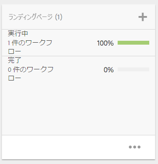
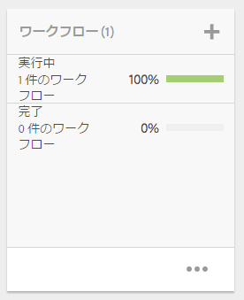

# プロジェクト{#projects}

>[!CAUTION]
>
>AEM 6.4 の拡張サポートは終了し、このドキュメントは更新されなくなりました。 詳細は、 [技術サポート期間](https://helpx.adobe.com/jp/support/programs/eol-matrix.html). サポートされているバージョンを見つける [ここ](https://experienceleague.adobe.com/docs/?lang=ja).

プロジェクトを使用すると、リソースを 1 つのエンティティにグループ化できます。 共通の共有環境を使用すると、プロジェクトを簡単に管理できます。 プロジェクトに関連付けることができるリソースのタイプは、AEMではタイルと呼ばれます。 タイルには、プロジェクトとチームの情報、アセット、ワークフローおよびその他のタイプの情報を含めることができます。詳しくは、[プロジェクトタイル](#project-tiles)を参照してください。

>[!CAUTION]
>
>プロジェクト内のユーザーが、プロジェクトの作成、タスクまたはワークフローの作成、チームの表示と管理などのプロジェクト機能を使用中に他のユーザーまたはグループを表示するには、**/home/users** および **/home/groups** に対する読み取りアクセス権が必要です。これを実現する最も簡単な方法は、**projects-users** グループに **/home/users** および **/home/groups** に対する読み取りアクセス権を付与することです。

次の操作を行うことができます。

* プロジェクトの作成
* プロジェクトへのコンテンツフォルダーおよびアセットフォルダーの関連付け
* プロジェクトを削除
* コンテンツリンクのプロジェクトからの削除

その他のトピックを参照してください。

* [プロジェクトの管理 ](/help/sites-authoring/touch-ui-managing-projects.md)
* [タスクの操作](/help/sites-authoring/task-content.md)
* [プロジェクトワークフローの操作 ](/help/sites-authoring/projects-with-workflows.md)
* [クリエイティブプロジェクトと PIM 統合](/help/sites-authoring/managing-product-information.md)

## プロジェクトコンソール {#projects-console}

プロジェクトコンソールで、AEM 内のプロジェクトにアクセスし、管理します。

* 選択 **タイムライン** その後、プロジェクトのタイムラインを表示します。
* クリックまたはタップ **選択** 選択モードに入ります。
* クリック **作成** プロジェクトを追加するには：
* **アクティブなプロジェクトを切り替え** では、すべてのプロジェクトとアクティブなプロジェクトのみを切り替えることができます。
* **統計ビューを表示** タスクの完了に関するプロジェクトの統計を表示できます。

## プロジェクトタイル {#project-tiles}

プロジェクトでは、様々なタイプの情報をプロジェクトに関連付けます。 これらは、 **タイル**. 各タイルと含まれる情報の種類について、この節で説明します。

以下のタイルをプロジェクトと関連付けることができます。それぞれについては、以降の節で説明します。

* アセットとアセットコレクション
* エクスペリエンス
* リンク
* プロジェクト情報
* チーム
* ランディングページ
* メール
* ワークフロー
* ローンチ
* タスク

### Assets {#assets}

**Assets** タイルでは、特定のプロジェクトに使用するすべてのアセットを集めることができます。

タイル内でアセットを直接アップロードします。さらに、Dynamic Media のアドオンがある場合は、画像セット、スピンセットまたは混在メディアセットを作成できます。

### アセットコレクション {#asset-collections}

アセットと同様に、 [アセットコレクション](/help/assets/managing-collections-touch-ui.md) を直接プロジェクトに追加します。 アセット内にコレクションを定義します。

コレクションを追加するには、「**コレクションを追加**」をクリックし、適切なコレクションをリストから選択します。

### エクスペリエンス {#experiences}

**エクスペリエンス**&#x200B;タイルでは、モバイルアプリ、web サイトまたはパブリケーションをプロジェクトに追加できます。

アイコンは、エクスペリエンスの種類（Web サイト、モバイルアプリケーションまたは公開物）を示します。エクスペリエンスを追加するには、「+」記号をクリックするか、「**エクスペリエンスを追加**」をクリックして、エクスペリエンスの種類を選択します。

サムネールのパスを選択し、必要に応じてエクスペリエンスのサムネールを変更します。エクスペリエンスは、**エクスペリエンス**&#x200B;タイル内にグループ化されます。

### リンク {#links}

リンクタイルでは、外部リンクとプロジェクトを関連付けることができます。

リンクにわかりやすい名前を付けたり、サムネールを変更したりできます。

### プロジェクト情報 {#project-info}

プロジェクト情報タイルには、説明、プロジェクトステータス（非アクティブまたはアクティブ）、期限、メンバーなどプロジェクトに関する一般的な情報が表示されます。さらに、メインのプロジェクトページに表示されるプロジェクトサムネールを追加できます。

チームタイルと同様に、このタイルからチームメンバーの割り当てや削除（または役割の変更）を行うことができます。

### 翻訳ジョブ {#translation-job}

翻訳ジョブタイルでは、翻訳を開始したり、翻訳のステータスを表示したりもできます。翻訳を設定するには、 [翻訳プロジェクトの作成](/help/assets/translation-projects.md).

翻訳ワークフロー内のアセットを表示するには、**翻訳ジョブ**&#x200B;カードの下部にある省略記号をクリックします。また、翻訳ジョブリストには、アセットのメタデータとタグのエントリも表示されます。 これらのエントリは、アセットのメタデータとタグも翻訳されていることを示します。

### チーム {#team}

このタイルでは、プロジェクトチームのメンバーを指定できます。 編集時に、チームメンバーの名前を入力し、ユーザーの役割を割り当てることができます。

チームメンバーをチームに追加したり、チームから削除したりできます。さらに、チームメンバーに割り当てられている[ユーザーの役割](#user-roles-in-a-project)を編集できます。

### ランディングページ {#landing-pages}

この **ランディング** ページタイルを使用すると、新しいランディングページをリクエストできます。

このワークフローについては、 [ランディングページワークフローの作成](/help/sites-authoring/projects-with-workflows.md#request-landing-page-workflow).

### メール {#emails}

この **電子メール** タイルは、電子メールのリクエストを管理するのに役立ちます。 このタイルで、メールをリクエストワークフローを開始します。

詳しくは、[メールをリクエストワークフロー](/help/sites-authoring/projects-with-workflows.md#request-email-workflow)で説明します。

### ワークフロー {#workflows}

プロジェクトを割り当てて、特定のワークフローに従うことができます。 実行中のワークフローがある場合は、そのステータスが **ワークフロー** プロジェクトのタイル。

プロジェクトを割り当てて、特定のワークフローに従うことができます。 選択したプロジェクトに応じて、使用可能なワークフローが異なります。

使用可能なワークフローについては、[プロジェクトワークフローの操作](/help/sites-authoring/projects-with-workflows.md)で説明します。

### ローンチ {#launches}

ローンチタイルには、[ローンチをリクエストワークフロー](/help/sites-authoring/projects-with-workflows.md)を使用してリクエストされたローンチがすべて表示されます。

### タスク {#tasks}

タスクを使用して、ワークフローを含む、すべてのプロジェクト関連タスクのステータスを監視できます。タスクについて詳しくは、[タスクの操作](/help/sites-authoring/task-content.md)を参照してください。

## プロジェクトテンプレート {#project-templates}

AEM には、次の 3 種類の既製のテンプレートが付属しています。

* シンプルなプロジェクト - 他のカテゴリに適合しない、あらゆるプロジェクト用のリファレンスサンプルです（キャッチオール）。3 つの基本的な役割（所有者、エディター、監視者）と 4 つのワークフロー（プロジェクト承認、ローンチをリクエスト、ランディングページをリクエスト、メールをリクエスト）が含まれます。
* メディアプロジェクト - メディア関連アクティビティ用のリファレンスサンプルプロジェクトです。いくつかのメディア関連プロジェクトの役割（フォトグラファー、エディター、コピーライター、デザイナー、所有者、監視者）が含まれます。メディアコンテンツに関連する 2 つのワークフロー（コピーをリクエスト（テキストのリクエストおよびレビュー用）と撮影した製品写真（製品に関連する写真の管理用））も含まれます。
* [製品写真撮影プロジェクト](/help/sites-authoring/managing-product-information.md) - eコマース関連製品写真を管理するためのリファレンスサンプルです。フォトグラファー、エディター、写真レタッチャー、所有者、クリエイティブディレクター、ソーシャルメディアマーケター、マーケティングマネージャー、レビュー担当者、監視者の役割が含まれます。
* [翻訳プロジェクト](/help/sites-administering/translation.md) - 翻訳関連アクティビティを管理するためのリファレンスサンプルです。3 つの基本的な役割（所有者、エディター、監視者）が含まれます。ワークフローユーザーインターフェイスでアクセスする 2 つのワークフローが含まれます。

選択したテンプレートに基づいて、特にユーザーの役割とワークフローに関して様々なオプションを使用できます。

## プロジェクト内のユーザーの役割 {#user-roles-in-a-project}

様々なユーザーの役割がプロジェクトテンプレートで設定され、次の 2 つの主な理由で使用されます。

1. 権限。ユーザーの役割は、次の 3 つのカテゴリのいずれかに分類されます。監視者、編集者、所有者。 例えば、フォトグラファーまたはコピーライターは、エディターと同じ特権を持ちます。権限によって、ユーザーがプロジェクト内のコンテンツに何を行えるかが決定されます。
1. ワークフロー。ワークフローは、プロジェクト内のタスクを割り当てるユーザーを決定します。 タスクは、プロジェクトの役割と関連付けることができます。例えば、フォトグラファーにタスクを割り当てて、フォトグラファーの役割を持つすべてのチームメンバーがタスクを受け取るようにできます。

セキュリティの管理と権限の制御を行うために、すべてのプロジェクトで次のデフォルトの役割がサポートされています。

<table> 
 <tbody> 
  <tr> 
   <td>
<strong>役割</strong>
 </td> 
   <td>
<strong>説明</strong>
 </td> 
   <td>
<strong>権限</strong>
 </td> 
   <td>
<strong>グループのメンバーシップ</strong>
 </td> 
  </tr> 
  <tr> 
   <td>
オブザーバー
 </td> 
   <td>
この役割のユーザーは、プロジェクトのステータスなど、プロジェクトの詳細を表示できます。
 </td> 
   <td>
プロジェクトに対する読み取り専用の権限
 </td> 
   <td>
workflow-users グループ
 </td> 
  </tr> 
  <tr> 
   <td>
編集者
 </td> 
   <td>
この役割のユーザーは、プロジェクトのコンテンツをアップロードおよび編集できます。
 
 
 </td> 
   <td> 
    <ul> 
     <li>プロジェクト、関連するメタデータおよび関連アセットに対する読み取り/書き込みアクセス権。</li> 
     <li>撮影リスト、撮影した写真をアップロードし、アセットを確認および承認する権限</li> 
     <li>/etc/commerce に対する書き込み権限</li> 
     <li>特定のプロジェクトに対する変更権限がある</li> 
    </ul> </td> 
   <td>
workflow-users グループ
 </td> 
  </tr> 
  <tr> 
   <td>
所有者
 </td> 
   <td>
この役割のユーザーは、プロジェクトを開始できます。所有者は、プロジェクトを開始し、プロジェクト内で作業を開始し、承認済みのアセットを実稼動フォルダーに移動することもできます。所有者は、プロジェクト内のその他すべてのタスクも表示および実行できます。
 </td> 
   <td> 
    <ul> 
     <li>/etc/commerce に対する書き込み権限</li> 
    </ul> </td> 
   <td> 
    <ul> 
     <li>DAM-users グループ（プロジェクトを作成できる）</li> 
     <li>project-administrators グループ（アセットを移動可能）</li> 
    </ul> </td> 
  </tr> 
 </tbody> 
</table>

クリエイティブプロジェクトの場合は、フォトグラファーなどの追加の役割も提供されます。 これらの役割を使用して、特定のプロジェクト用のカスタム役割を派生させることができます。

>[!NOTE]
>
>プロジェクトを作成してユーザーを様々な役割に追加すると、関連する権限を管理するため、プロジェクトに関連付けられたグループが自動的に作成されます。例えば、「Myproject」というプロジェクトには **Myproject Owners**、**Myproject Editors**、**Myproject Observers** という 3 つのグループがあります。ただし、プロジェクトを削除しても、これらのグループは自動的には削除されません。管理者は、**ツール**／**セキュリティ**／**グループ**&#x200B;から、手動でグループを削除する必要があります。
