# ページの公開{#publishing-pages}

オーサー環境でコンテンツを作成およびレビューした後は、[公開 Web サイト（パブリッシュ環境）でコンテンツを利用できるようにする](/help/sites-authoring/author.md#concept-of-authoring-and-publishing)ことが目標となります。

この操作は、ページの公開と呼ばれます。パブリッシュ環境からページを削除する場合は、ページの非公開と呼ばれます。ページは、公開／非公開を切り替えても、削除するまでは、さらなる変更に備えてオーサー環境で使用できます。

また、ページの公開または非公開は、即座におこなうことも、後で事前定義済みの日時におこなうこともできます。

>[!NOTE]
>
>公開に関する用語には、紛らわしいものがあります。
>
>* **公開／非公開**
   >  環境でコンテンツを公開する（または非公開にする）アクションに対して主に使用される用語です。
   >
   >
* **アクティブ化／非アクティブ化**
   >  公開／非公開と同義です。
   >
   >
* **レプリケート／レプリケーション**
   >  これらは、ユーザーコメントの発行時や逆複製時など、ある環境から別のユーザーへのデータ（ページコンテンツ、ファイル、コード、ユーザーコメントなど）の移動を説明する技術用語です。
>

>[!NOTE]
>
>特定のページを公開するために必要な特権がない場合。
>
>* ワークフローがトリガーされ、公開リクエストの適切なユーザーに通知されます。
>* この[ワークフローは、開発チームによってカスタマイズされている](/help/sites-developing/workflows-models.md)ことがあります。
>* ワークフローがトリガーされたことを通知するメッセージが少しの間表示されます。

>

## ページの公開 {#publishing-pages-2}

場所に応じて、次から公開できます。

* [ページエディターから](/help/sites-authoring/publishing-pages.md#publishing-from-the-editor)
* [サイトコンソールから](/help/sites-authoring/publishing-pages.md#publishing-from-the-console)

### エディターからの公開 {#publishing-from-the-editor}

ページを編集している場合、エディターから直接公開できます。

1. **ページ情報**&#x200B;アイコンを選択してメニューを開き、「**ページを公開**」オプションを選択します。

   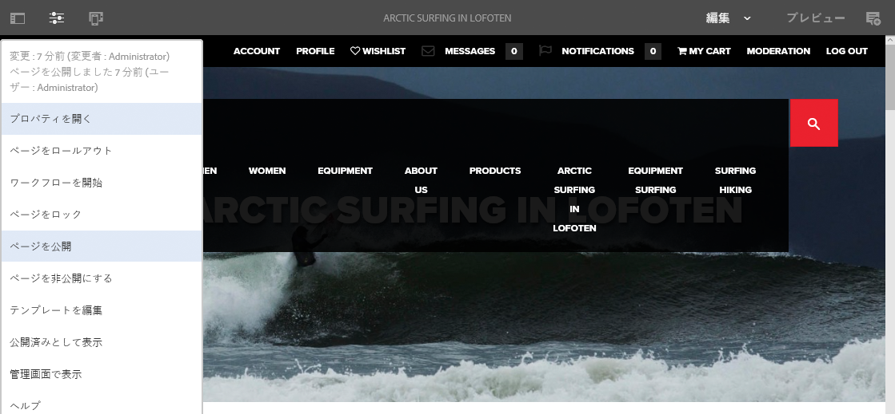

1. 公開が必要な参照がページに含まれているかどうかに応じて、次の操作をおこないます。

   * 公開する参照がない場合、ページが直接公開されます。
   * 公開が必要な参照がページに含まれている場合は、それらのリストが&#x200B;**公開**&#x200B;ウィザードに表示され、ウィザードで次のいずれかを実行できます。

      * ページと一緒に公開するアセットやタグなどを指定し、「**公開**」を使用してプロセスを完了します。
      * 「**キャンセル**」を使用してアクションを中止します。

   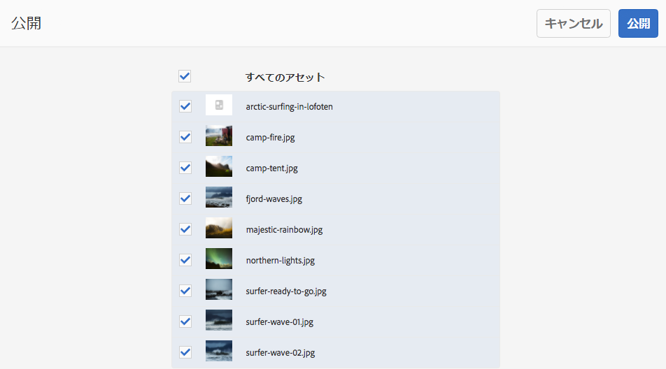

1. 「**公開**」を選択して、パブリッシュ環境にページをレプリケートします。ページエディターに、公開アクションを確認する情報バナーが表示されます。

   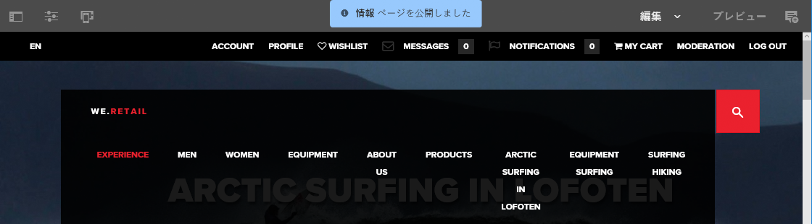

   コンソールで同じページを表示すると、更新された公開ステータスが表示されます。

   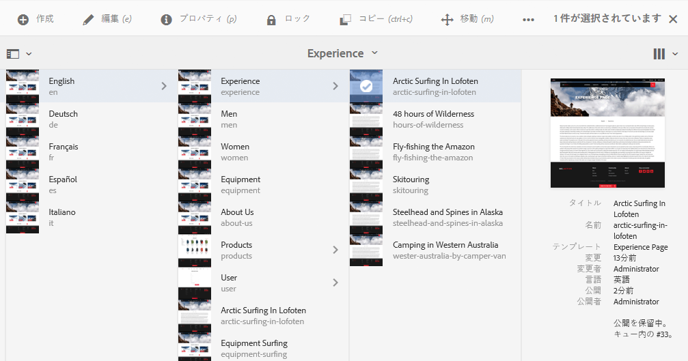

>[!NOTE]
>
>エディターからの公開は、浅い公開です。つまり、選択したページだけが公開され、子ページは公開されません。

### コンソールからの公開 {#publishing-from-the-console}

サイトコンソールには、2 つの公開オプションがあります。

* [クイック公開](/help/sites-authoring/publishing-pages.md#quick-publish)
* [公開を管理](/help/sites-authoring/publishing-pages.md#manage-publication)

#### クイック公開  {#quick-publish}

**クイック公開**&#x200B;は、単純な場合のためのもので、選択したページが即座に公開されます。他に何か操作する必要はありません。このため、すべての非公開の参照も自動的に公開されます。

クイック公開でページを公開するには、次の手順を実行します。

1. サイトコンソールで 1 つ以上のページを選択し、「**クイック公開**」ボタンをクリックします。

   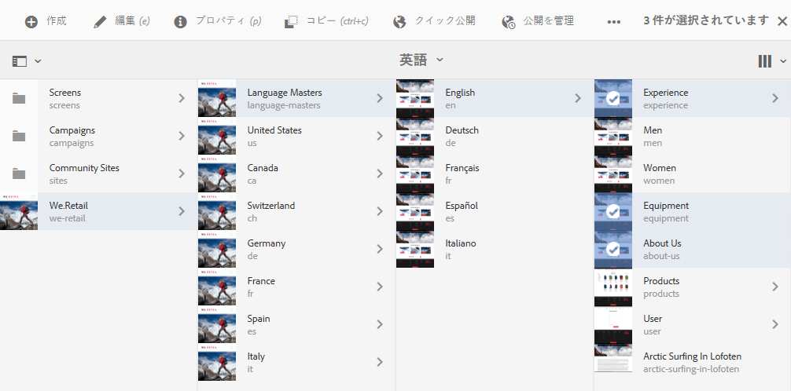

1. クイック公開ダイアログで、「**公開**」をクリックして公開を確認するか、「**キャンセル**」をクリックしてキャンセルします。すべての非公開の参照も自動的に公開されることに注意してください。

   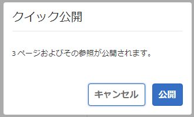

1. ページが公開される際に、公開を確認するアラートが表示されます。

>[!NOTE]
>
>クイック公開は、浅い公開です。つまり、選択したページだけが公開され、子ページは公開されません。

#### 公開を管理  {#manage-publication}

**公開を管理**&#x200B;には、クイック公開よりも多くのオプションがあります。子ページを含めたり、参照をカスタマイズしたり、使用可能なワークフローを開始したり、後日公開するためのオプションを提供したりします。

公開を管理を使用してページを公開または非公開にするには、次の手順を実行します。

1. サイトコンソールで 1 つまたは複数のページを選択し、「**公開を管理**」ボタンをクリックします。

   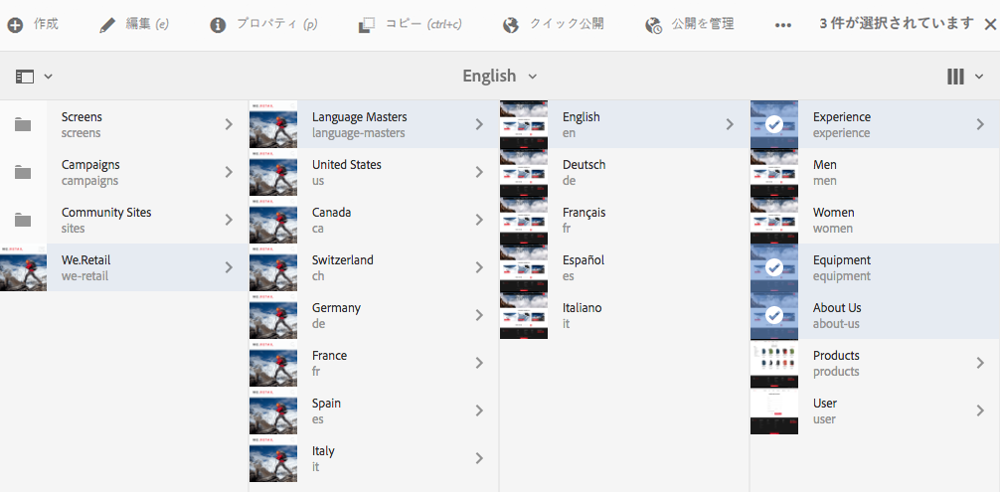

1. **公開を管理**&#x200B;ウィザードが起動します。最初の手順の&#x200B;**オプション**&#x200B;では、次のことができます。

   * 選択したページの公開または非公開を選択する。
   * そのアクションを今すぐ実行するか後日実行するかを選択する。

   後で公開することを選択すると、指定した時間に選択したページを公開するワークフローが開始されます。逆に、後で非公開にすることを選択すると、特定の時間に選択したページを非公開にするワークフローが開始されます。

   公開／非公開を後からキャンセルする場合は、[ワークフローコンソール](/help/sites-administering/workflows.md)に移動して、対応するワークフローを終了します。

   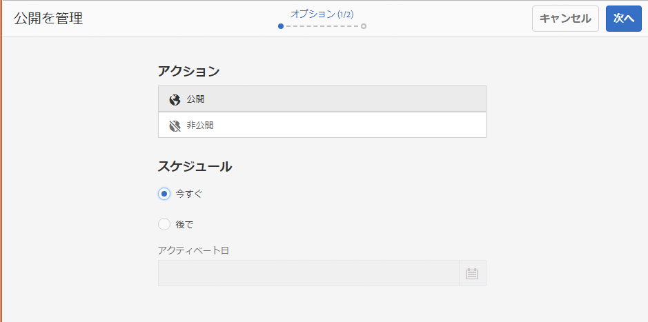

   「**次へ**」をクリックして次に進みます。

1. パブリケーションの管理ウィザード&#x200B;**スコープ**&#x200B;の次の手順では、子ページを含めたり、参照を含めたりするなど、パブリケーション/非パブリケーションの範囲を定義できます。

   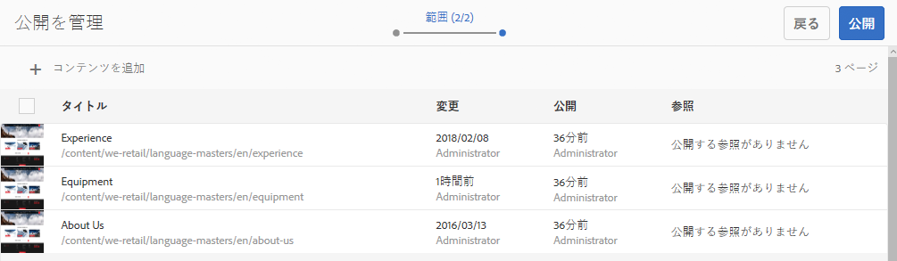

   公開を管理ウィザードを開始する前に選択し忘れた場合は、「**コンテンツを追加**」ボタンを使用して、公開するページのリストにページを追加できます。

   「コンテンツを追加」ボタンをクリックすると、[パスブラウザー](/help/sites-authoring/author-environment-tools.md#path-browser)が開き、コンテンツを選択できます。

   必要なページを選択し、「**選択**」をクリックしてコンテンツをウィザードに追加するか、「キャンセル」をクリックして選択をキャンセルして、ウィザードに戻ります。

   ウィザードに戻ると、リストの項目を選択して、次のような追加のオプションを設定できます。

   * その子を含める。
   * 選択から削除する。
   * その公開済みの参照を管理する。

   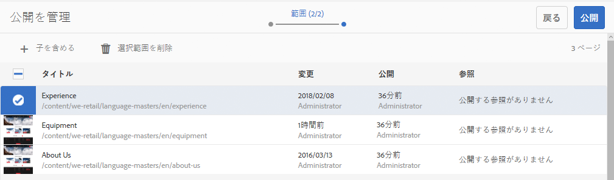

   「**子を含める**」をクリックすると、次のことができるダイアログが開きます。

   * 直近の子のみを含める。
   * 変更されたページのみを含める。
   * 既に公開済みのページのみを含める。

   「**追加**」をクリックして、選択オプションに基づいて公開または非公開にするページのリストに子ページを追加します。「**キャンセル**」をクリックして選択をキャンセルし、ウィザードに戻ります。

   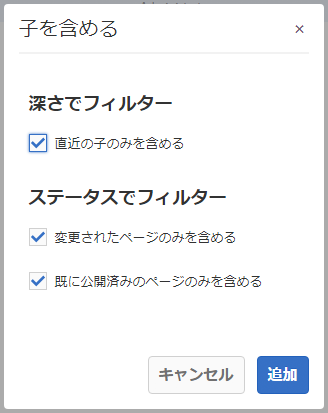

   ウィザードに戻ると、子を含めるダイアログでのオプションの選択に基づいて、ページが追加されていることを確認できます。

   ページを選択して「**公開済みの参照**」ボタンをクリックすると、ページに対して公開または非公開にする参照を表示および変更できます。

   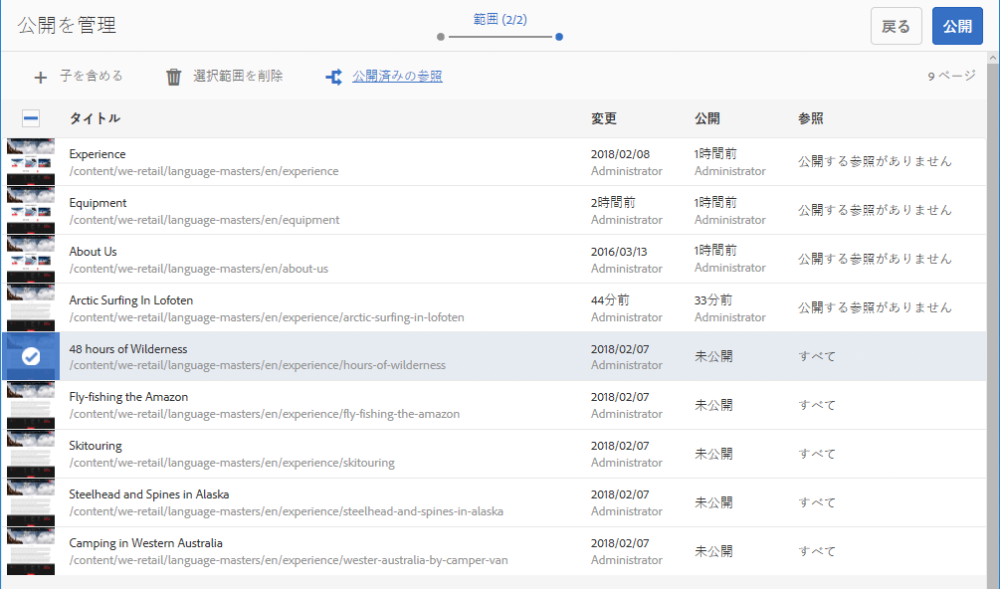

   **公開済みの参照**&#x200B;ダイアログに、選択したコンテンツの参照が表示されます。デフォルトでは、それらはすべて選択され、公開／非公開にされますが、チェックボックスをオフにすると、選択を解除してそれらをアクションに含めないようにすることができます。

   「**完了**」をクリックして変更を保存するか、「**キャンセル**」をクリックして選択をキャンセルし、ウィザードに戻ります。

   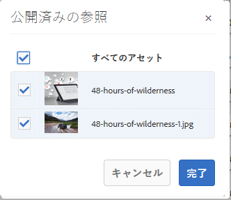

   ウィザードに戻ると、「**参照**」列が更新されて、公開または非公開にする参照の選択が反映されます。

   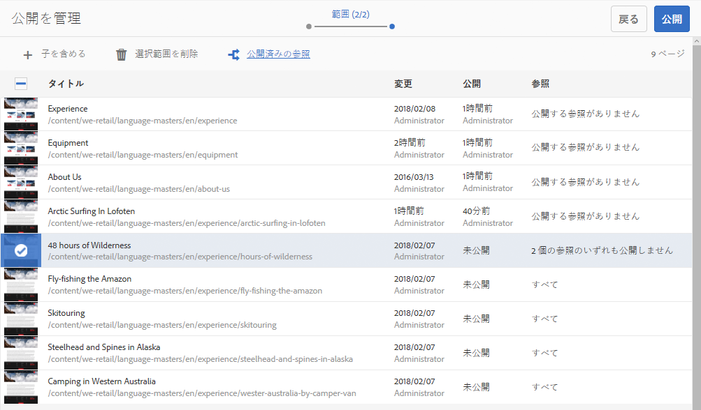

1. 「**公開**」をクリックして完了します。

   サイトコンソールに戻ると、公開を確認する通知メッセージが表示されます。

   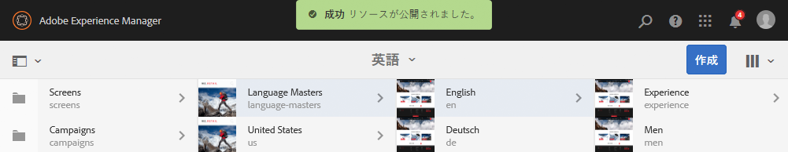

1. 公開したページがワークフローに関連付けられている場合、公開ウィザードの最後の&#x200B;**ワークフロー**&#x200B;ステップに表示されます。

   >[!NOTE]
   >
   >**ワークフロー**&#x200B;手順は、ユーザーの権限に基づいて表示されます。詳細については、このページ](/help/sites-authoring/publishing-pages.md)の[前の注意事項、[ワークフローへのアクセスの管理](/help/sites-administering/workflows-managing.md)および[ページ](/help/sites-authoring/workflows-applying.md)へのワークフローの適用を参照してください。

   リソースは、トリガーされたワークフローでグループ化され、それぞれに次のオプションがあります。

   * ワークフローのタイトルを定義する。
   * ワークフローが[複数のリソースをサポートする](/help/sites-developing/workflows-models.md#configuring-a-workflow-for-multi-resource-support)場合、ワークフローパッケージを維持する。
   * ワークフローパッケージを維持するオプションが選択されている場合、ワークフローパッケージのタイトルを定義する。

   「**発行**」または「**後で発行**」をクリックして、パブリケーションを完了します。

   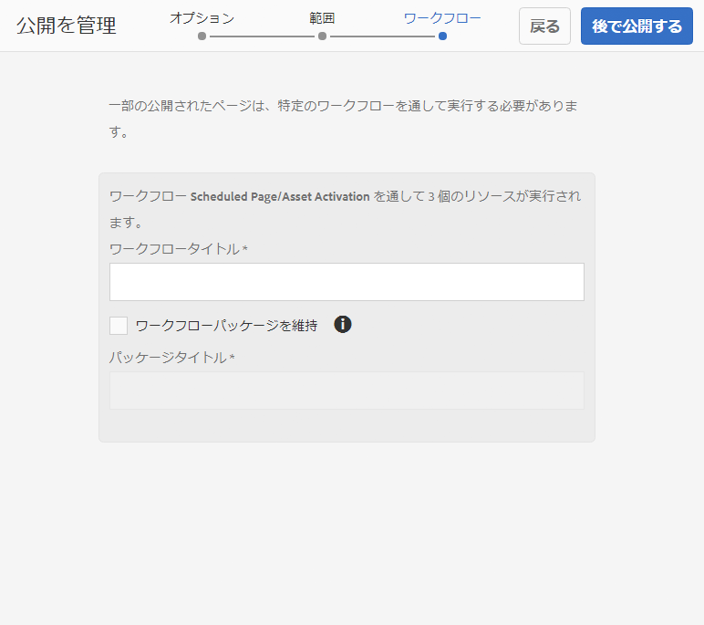

## ページを非公開にする {#unpublishing-pages}

ページを非公開にすると、そのページがパブリッシュ環境から削除され、読者に公開されなくなります。

[公開と同様の方法](/help/sites-authoring/publishing-pages.md#publishing-pages)で、1 つ以上のページを非公開にすることができます。

* [ページエディターから](/help/sites-authoring/publishing-pages.md#unpublishing-from-the-editor)
* [サイトコンソールから](/help/sites-authoring/publishing-pages.md#unpublishing-from-the-console)

### エディターから非公開にする  {#unpublishing-from-the-editor}

ページを編集する際に、そのページを非公開にする場合、[ページを公開](/help/sites-authoring/publishing-pages.md#publishing-from-the-editor)するときと同じように、**ページ情報**&#x200B;メニューで「**ページを非公開にする**」を選択します。

### コンソールから非公開にする  {#unpublishing-from-the-console}

[「公開を管理」オプションを使用して公開する](/help/sites-authoring/publishing-pages.md#manage-publication)場合と同様に、「公開を管理」オプションを使用して非公開にできます。

1. サイトコンソールで 1 つまたは複数のページを選択し、「**公開を管理**」ボタンをクリックします。
1. **公開を管理**&#x200B;ウィザードが起動します。最初の手順の&#x200B;**オプション**&#x200B;で、デフォルトオプションの&#x200B;**公開**&#x200B;の代わりに&#x200B;**非公開**&#x200B;を選択します。

   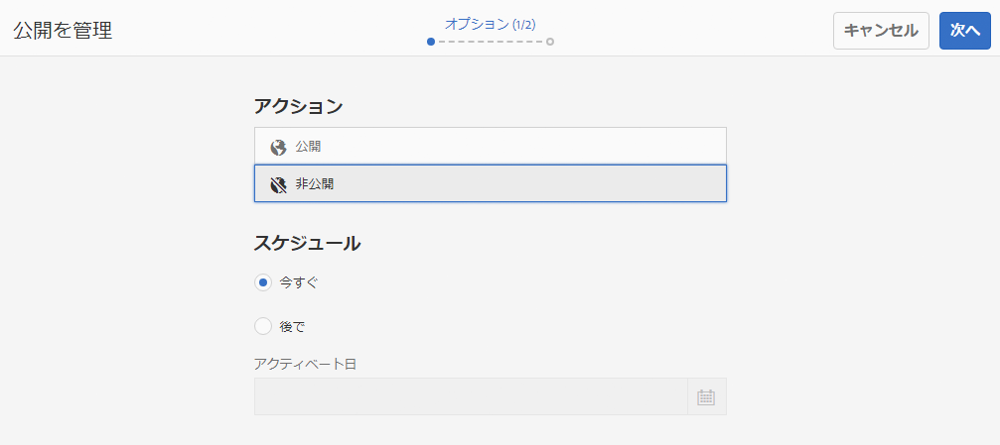

   後で公開することを選択するとこのバージョンのページを公開するワークフローが指定した時間に開始されるのと同じように、後でアクティベートを解除することを選択すると、選択したページを非公開にするワークフローが特定の時間に開始されます。

   公開／非公開を後からキャンセルする場合は、[ワークフローコンソール](/help/sites-administering/workflows.md)に移動して、対応するワークフローを終了します。

1. 非公開の操作を完了するには、[ページを公開する](/help/sites-authoring/publishing-pages.md#manage-publication)場合と同様にウィザードを続行します。

## ツリーの公開と非公開 {#publishing-and-unpublishing-a-tree}

多数のコンテンツページを入力または更新した場合、これらのページがすべて同じルートページの下にあれば、ツリー全体を 1 回の操作で簡単に公開できます。

サイトコンソールにある「[公開を管理](/help/sites-authoring/publishing-pages.md#manage-publication)」オプションを使用すると、これをおこなうことができます。

1. サイトコンソールで、公開または非公開するツリーのルートページを選択し、「**公開を管理**」を選択します。
1. **公開を管理**&#x200B;ウィザードが起動します。公開または非公開と実行するタイミングを選択して、「**次へ**」を選択して続行します。
1. **範囲**&#x200B;の手順で、ルートページを選択して、「**子を含める**」を選択します。

   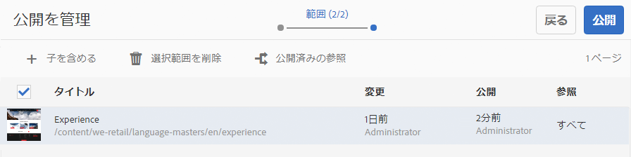

1. **子を含める**&#x200B;ダイアログで、次のオプションのチェックボックスをオフにします。

   * 直近の子のみを含める
   * 既に公開済みのページのみを含める

   これらのオプションは、デフォルトで選択されているので、忘れずに選択解除する必要があります。「**追加**」をクリックして、コンテンツを公開／非公開に追加します。

   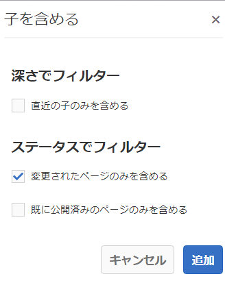

1. **公開を管理**&#x200B;ウィザードにツリーのコンテンツがリストされていることを確認します。ページを追加したりそれらの選択を削除したりすることで、選択をさらにカスタマイズできます。

   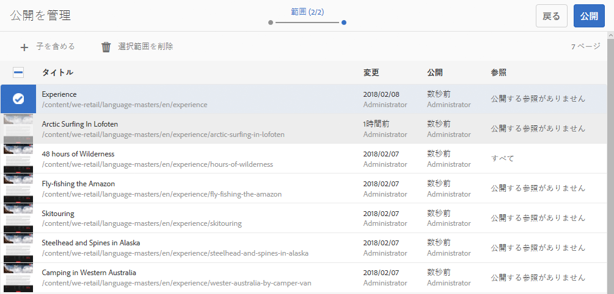

   「**公開済みの参照**」オプションを使用して、公開する参照を確認することもできます。

1. [ツリーのパブリケーションまたは非パブリケーションを完了するには、](#manage-publication) 通常どおり[パブリケーションの管理]ウィザードを続行します。

## 公開ステータスの判別 {#determining-publication-status}

ページの公開ステータスを判別できます。

* [サイトコンソールのリソースの概要情報](/help/sites-authoring/basic-handling.md#viewing-and-selecting-resources)

   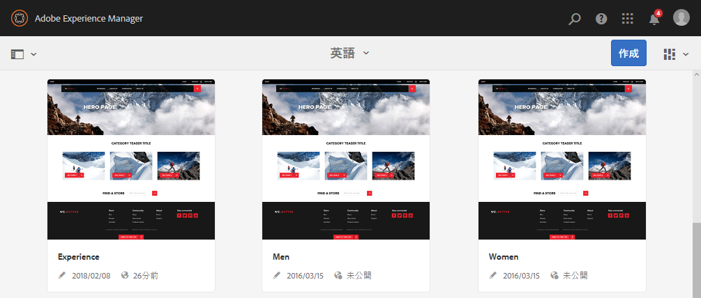

   公開ステータスは、サイトコンソールの[カード](/help/sites-authoring/basic-handling.md#card-view)、[列](/help/sites-authoring/basic-handling.md#column-view)および[リスト](/help/sites-authoring/basic-handling.md#list-view)表示に表示されます。

* [タイムライン](/help/sites-authoring/basic-handling.md#timeline)

   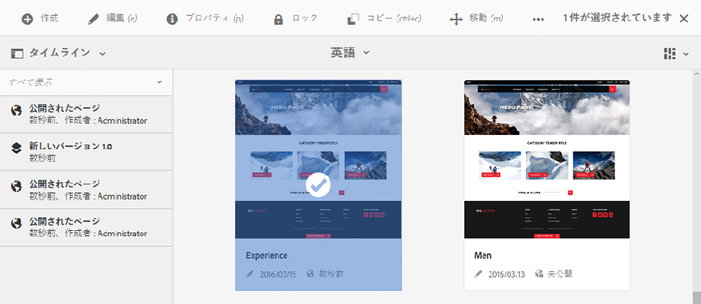

* （ページ編集時の）[ページ情報メニュー](/help/sites-authoring/author-environment-tools.md#page-information)

   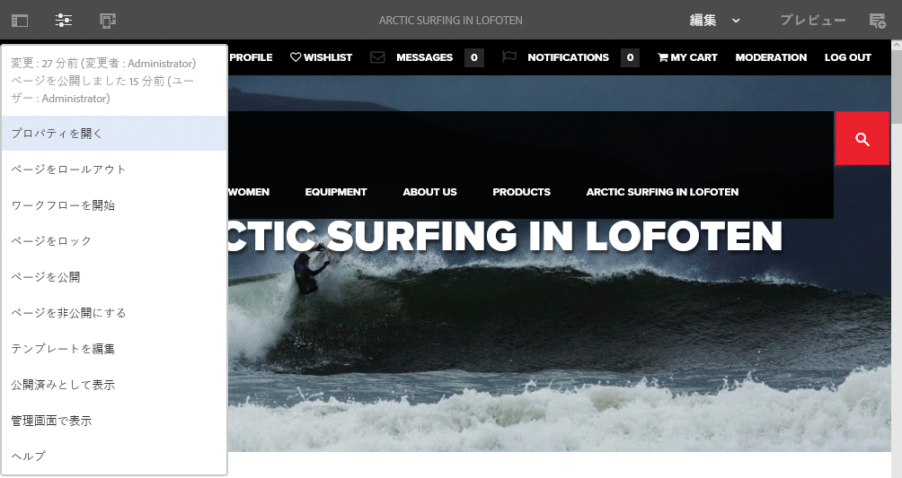

