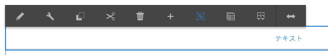
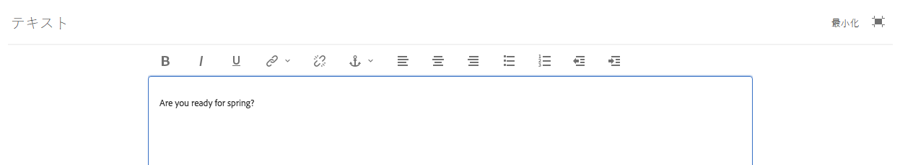
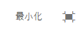

# リッチテキストエディターを使用したコンテンツのオーサリング{#using-the-rich-text-editor-to-author-content}

リッチテキストエディター(RTE)は、AEMページでテキストをオーサリングするための基本的な構成要素です。 テキスト、テキストと画像、表などの多くのコンポーネントは、RTEに基づいています。

>[!NOTE]
>
>ネストされたリストを RTE にコピーしても、期待どおりに機能しません。ネストされたリストを Microsoft Word からコピーする場合、RTE. にテキストを貼り付けた後でリストを手動でクリーンアップする必要があります。

## インプレース編集 {#in-place-editing}

1回タップまたはクリックしてテキストベースのコンポーネントを選択すると、[コンポーネントツールバー](../sites-authoring/editing-content.md#edit-configure-copy-cut-delete-paste)が表示されます。

もう一度タップまたはクリックするか、最初にコンポーネントをゆっくりダブルタップまたはクリックして選択すると、独自のツールバーを持つインプレース編集が開きます。 ここで、コンテンツの編集や、基本的な書式変更ができます。

このツールバーには、次のオプションがあります。

* **形式**:太字、斜体および下線の書式を設定します。

* **リスト**:箇条書きリストまたは番号付きリストを作成するか、インデントを設定します。

* **ハイパーリンク**

* **リンク解除**

* **フルスクリーン**

* **閉じる**

* **保存**

## 全画面編集{#full-screen-editing}

テキストベースのコンポーネントの場合、ツールバーからフルスクリーンモードを選択すると、リッチテキストエディターが開き、残りのページコンテンツが非表示になります。

全画面表示モードには、管理者が設定したリッチテキストエディターのすべてのオプションが表示されます。 これらは、管理者またはAEM開発者が提供する設定](../sites-administering/rich-text-editor.md)に応じて、AEMインスタンス[間で異なる場合があります。 オプションが見つからない場合は、管理者に問い合わせて使用可能にしてください。

その他のリッチテキストエディターオプションを次に示します。

* **アンカー**：テキストにアンカーを作成し、後でそのアンカーへのリンクや参照を設定できます。
* **テキストを左揃え**
* **テキストを中央揃え**
* **テキストを右揃え**

全画面表示モードを閉じるには、最小化アイコンをクリックします。

