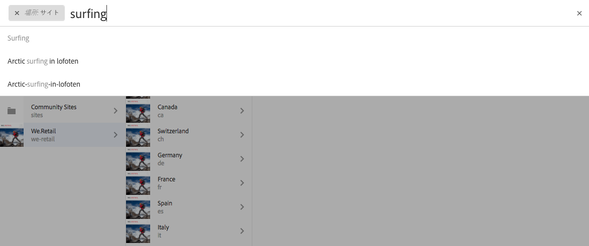
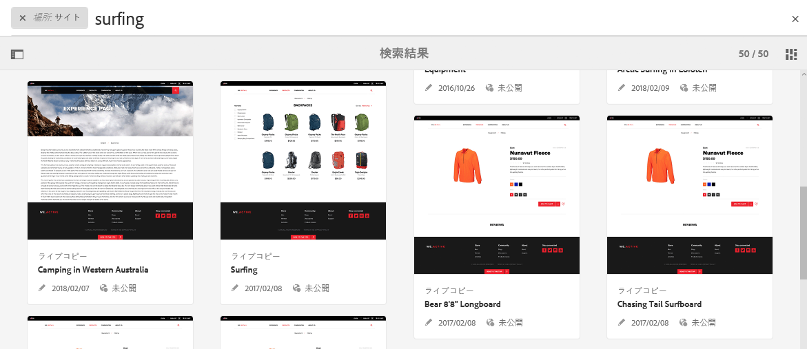
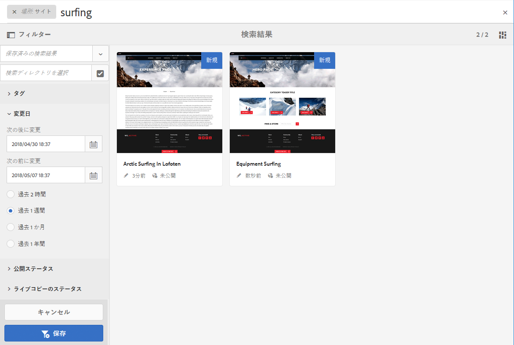
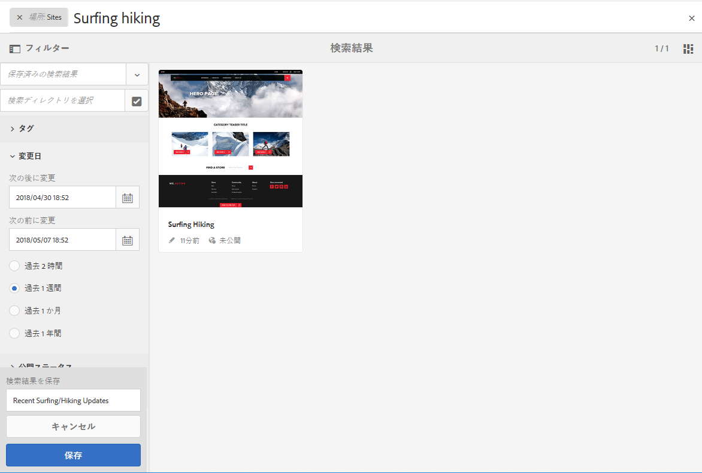
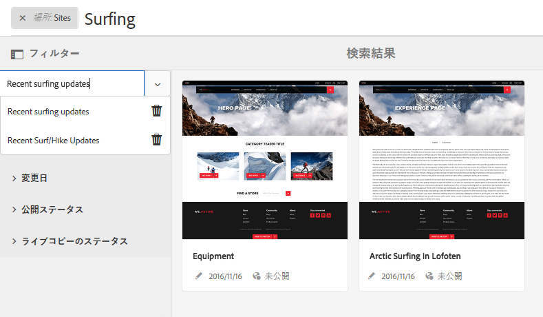
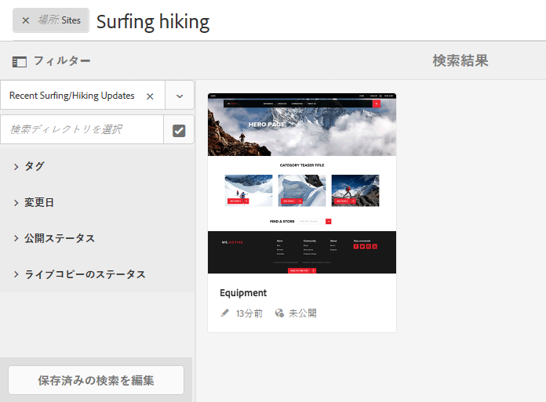

# 検索 {#search-features}

AEM のオーサー環境は、リソースタイプに応じて、コンテンツを検索するための様々なメカニズムを提供します。

>[!NOTE]
>
>オーサー環境の外部では、検索用のメカニズム ( [Query Builder](/help/sites-developing/querybuilder-api.md) および [CRXDE Lite](/help/sites-developing/developing-with-crxde-lite.md).

## 検索の基本 {#search-basics}

検索は上部のツールバーから使用できます。

検索レールでは、次の操作を実行できます。

* 特定のキーワード、パス、タグを検索する。
* リソース固有の条件（変更日、ページのステータス、ファイルサイズなど）に基づいてフィルターする
* 上記の条件に基づいて、[保存済みの検索結果](#saved-searches)を定義して使用する。

>[!NOTE]
>
>検索レールが表示されていれば、ホットキー `/`（スラッシュ）を使用して検索を呼び出すこともできます。

## 検索とフィルター {#search-and-filter}

リソースを検索およびフィルターするには、次のようにします。

1. 開く **検索** （ツールバーの虫眼鏡アイコンを使用）をクリックし、検索語句を入力します。 候補が作成され、次の項目を選択できます。

   

   デフォルトでは、検索結果は現在の場所（コンソールと関連するリソースタイプ）に限定されます。

   

1. 必要に応じて、ロケーションフィルターを削除できます (「 **X** （削除するフィルター）を使用して、すべてのコンソール/リソースタイプを検索できます。
1. 結果は、コンソールおよび関連するリソースタイプに従ってグループ化されて表示されます。

   特定のリソースを選択してアクションをさらに実行するか、必要なリソースタイプ（「**すべてのサイトを表示**」など）を選択してドリルダウンできます。

   

1. さらにドリルダウンするには、レール記号（左上）を選択して&#x200B;**フィルターおよびオプション**&#x200B;のサイドパネルを開きます。

   

   検索には、リソースタイプに応じて、検索/フィルター条件の事前定義済みの選択が表示されます。

   サイドパネルでは、次の要素を選択できます。

   * 保存済みの検索結果
   * 検索ディレクトリ
   * タグ
   * 検索基準（更新日、公開ステータス、LiveCopy ステータスなど）。

   >[!NOTE]
   >
   >検索条件は、次の場合に変わる可能性があります。
   >
   >* 選択したリソースタイプによって。例えば、アセットとコミュニティの条件はわかりやすく細分化されています。
   >* インスタンスを [検索Forms](/help/sites-administering/search-forms.md) (AEM内の場所に適した ) カスタマイズが可能です。

   

1. 検索用語を追加することもできます。

   

1. **検索**&#x200B;を閉じるには **X**（右上）を使用します。

>[!NOTE]
>
>検索結果内の項目を選択する際に、検索条件が保持されます。
>
>検索結果ページの項目を選択する際に、ブラウザーの戻るボタンを使用した後で検索ページに戻ると、検索条件が保持されます。

## 保存済みの検索結果 {#saved-searches}

様々なファセットによる検索に加えて、取得用に特定の検索設定を保存し、後で使用することもできます。

1. 検索条件を定義し、「 」を選択します。 **保存**.

   

1. 名前を割り当ててから、「**保存**」を使用して確認します。

   

1. 保存済みの検索は、次回検索パネルにアクセスするときにセレクターで選択できます。

   

1. 保存すると、次の操作を実行できます。

   * （保存済みの検索結果の名前に対して）**x** を使用して、新しいクエリを開始する（保存済みの検索結果自体は削除されません）。
   * **保存済みの検索を編集**&#x200B;し、検索条件を変更して、もう一度&#x200B;**保存**&#x200B;する。

保存済みの検索結果を変更するには、保存済みの検索結果を選択して、検索パネルの下部にある「**保存済みの検索を編集**」をクリックします。

