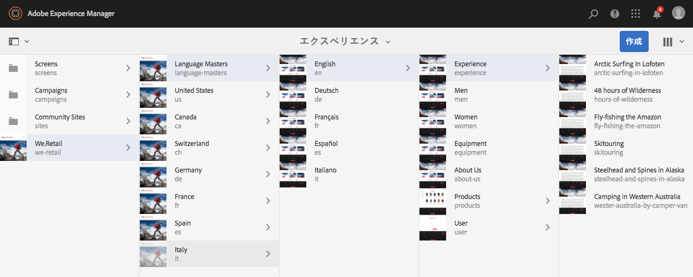
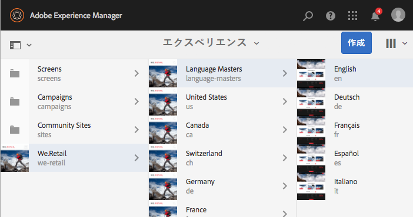
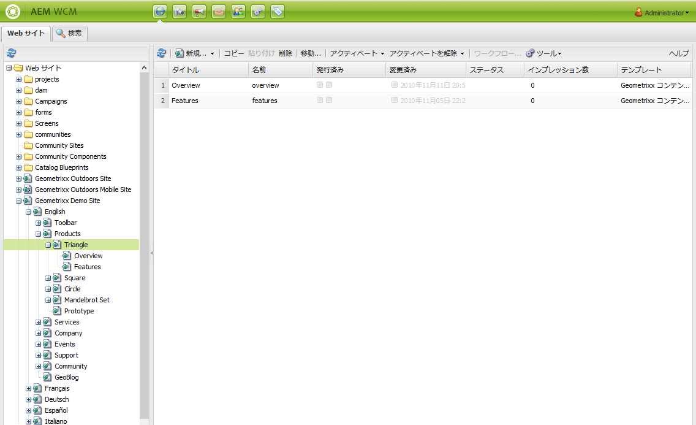
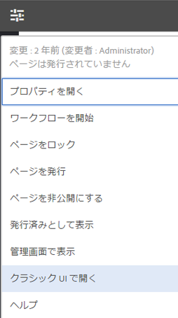

# UI の選択 {#selecting-your-ui}

>[!CAUTION]
>
>AEM 6.4 の拡張サポートは終了し、このドキュメントは更新されなくなりました。 詳細は、 [技術サポート期間](https://helpx.adobe.com/jp/support/programs/eol-matrix.html). サポートされているバージョンを見つける [ここ](https://experienceleague.adobe.com/docs/?lang=ja).

## UI について

オーサー環境では、次のことが可能です。

* [オーサリング](/help/sites-authoring/author.md) ( [ページオーサリング](/help/sites-authoring/author-environment-tools.md), [アセットの管理](/help/assets/home.md), [コミュニティ](/help/communities/author-communities.md))

* web サイトでのコンテンツの生成および管理の際に必要になる[管理](/help/sites-administering/home.md)タスク

これを実現するために、2 つのグラフィカルユーザーインターフェイスが提供されます。これらは、最新のブラウザーからアクセスできます。

1. タッチ操作対応 UI

   * これは、最新のデフォルトのAEM UI です。
   * 主にグレーで、クリーンでフラットなインターフェースを備えています。
   * タッチデバイスとデスクトップデバイスの両方で使用できるように設計されていますが、ルックアンドフィールはすべてのデバイスで同じです [リソースの表示と選択](/help/sites-authoring/basic-handling.md#viewing-and-selecting-resources) が若干異なります（タップとクリック）。

      * デスクトップ：

   

   * タブレットデバイス（または幅 1024 ピクセル未満のデスクトップ）。

   

1. クラシック UI

   * これは従来の UI で、AEMで長年使用されてきました。
   * 緑色が多い。
   * これはデスクトップデバイスで使用するように設計されています。
   * 次のドキュメントでは、最新の UI に焦点を当てています。 クラシック UI でのオーサリングについて詳しくは、 [クラシック UI 用のオーサリングドキュメント](/help/sites-classic-ui-authoring/classicui.md).

   

## UI の切り替え

タッチ操作対応 UI が標準の UI になり、 [特徴パリティ](../release-notes/touch-ui-features-status.md) は、サイトの管理および編集にほぼ到達しているので、ユーザーが [クラシック UI](/help/sites-classic-ui-authoring/classicui.md). これをおこなうには、いくつかのオプションがあります。

>[!NOTE]
>
>クラシック UI の機能の同一性の状況について詳しくは、[タッチ UI 機能の同一性](../release-notes/touch-ui-features-status.md)のドキュメントを参照してください。

使用する UI を様々な場所で定義できます。

* [インスタンスのデフォルト UI の設定](#configuring-the-default-ui-for-your-instance)  — これにより、ユーザーのログイン時にデフォルトの UI が表示されるように設定されますが、ユーザーは、これを上書きして、自分のアカウントまたは現在のセッション用に別の UI を選択できます。

* [お使いのアカウント用のクラシック UI オーサリングの設定](/help/sites-authoring/select-ui.md#setting-classic-ui-authoring-for-your-account)  — これにより、ユーザーはこれを上書きして、自分のアカウントまたは現在のセッション用に別の UI を選択できますが、ページの編集時にデフォルトとして使用される UI が設定されます。

* [現在のセッションのクラシック UI への切り替え](#switching-to-classic-ui-for-the-current-session)  — 現在のセッションのクラシック UI に切り替わります。

* の場合 [ページオーサリングシステムが UI に関連して特定の上書きをおこなう](#ui-overrides-for-the-editor).

>[!CAUTION]
>
>クラシック UI に切り替える様々なオプションをすぐに使用することはできません。その場では、インスタンスに合わせて特別に設定する必要があります。
>
>詳しくは、[クラシック UI へのアクセスの有効化](/help/sites-administering/enable-classic-ui.md)を参照してください。

>[!NOTE]
>
>以前のバージョンからアップグレードされたインスタンスでは、ページオーサリング用にクラシック UI が保持されます。
>
>アップグレード後、ページオーサリングが自動的にタッチ対応 UI に切り替わることはありませんが、**WCM オーサリング UI モードサービス**（`AuthoringUIMode` サービス）の [OSGi 設定](/help/sites-deploying/configuring-osgi.md)を使用すると、その切り替えを設定できます。[エディターの UI 上書き](#ui-overrides-for-the-editor)を参照してください。

## インスタンスのデフォルト UI の設定 {#configuring-the-default-ui-for-your-instance}

システム管理者は、起動時とログイン時に表示される UI を、 [ルートマッピング](/help/sites-deploying/osgi-configuration-settings.md).

この設定は、ユーザーの既定値またはセッション設定で上書きできます。

## アカウントのクラシック UI オーサリングの設定 {#setting-classic-ui-authoring-for-your-account}

各ユーザーは、 [ユーザーの環境設定](/help/sites-authoring/user-properties.md) ページオーサリングにクラシック UI を（デフォルトの UI の代わりに）使用するかどうかを定義します。

この設定は、セッション設定で上書きできます。

## 現在のセッションのクラシック UI への切り替え {#switching-to-classic-ui-for-the-current-session}

タッチ操作対応 UI を使用している場合、デスクトップユーザーはクラシック（デスクトップのみ）UI に戻すことができます。 現在のセッションでクラシック UI に切り替える方法はいくつかあります。

* **ナビゲーションリンク**

   >[!CAUTION]
   >
   >クラシック UI に切り替えるためのこのオプションは、すぐには使用できません。インスタンスに対して特に設定する必要があります。
   >
   >
   >詳しくは、[クラシック UI へのアクセスの有効化](/help/sites-administering/enable-classic-ui.md)を参照してください。

   この設定を有効にすると、該当するコンソールの上にマウスポインターを置くたびに、アイコン（モニターのシンボル）が表示され、これをタップ／クリックすると、適切な場所がクラシック UI で開きます。

   例えば、**Sites** から **siteadmin** へのリンクなどです。

   

* **URL**

   クラシック UI には、`welcome.html` のようこそ画面の URL を使用してアクセスできます。例は次のとおりです。

   `http://localhost:4502/welcome.html`

   >[!NOTE]
   >
   >タッチ対応 UI には、`sites.html` 経由でアクセスできます。次に例を示します。
   >
   >
   >`http://localhost:4502/sites.html`

### ページ編集時のクラシック UI への切り替え {#switching-to-classic-ui-when-editing-a-page}

>[!CAUTION]
>
>クラシック UI に切り替えるためのこのオプションは、すぐには使用できません。インスタンスに対して特に設定する必要があります。
>
>詳しくは、[クラシック UI へのアクセスの有効化](/help/sites-administering/enable-classic-ui.md)を参照してください。

有効な場合は、**ページ情報**&#x200B;ダイアログで&#x200B;**クラシック UI を開く**&#x200B;が使用可能です。

### エディターの UI の上書き {#ui-overrides-for-the-editor}

ユーザーまたはシステム管理者が定義した設定は、ページのオーサリング時にシステムによって上書きできます。

* ページのオーサリング時：

   * URL で `cf#` を使用してページにアクセスする場合、クラシックエディターが強制的に使用されます。次に例を示します。

      `http://localhost:4502/cf#/content/geometrixx/en/products/triangle.html`

   * URL で `/editor.html` を使用しているか、タッチデバイスを使用している場合、タッチ対応エディターが強制的に使用されます。次に例を示します。

      `http://localhost:4502/editor.html/content/geometrixx/en/products/triangle.html`

* 強制は一時的なものであり、ブラウザーセッションでのみ有効です。

   * Cookie は、タッチ対応（`editor.html`）とクラシック（`cf#`）のどちらが使用されているかに応じて設定されます。

* `siteadmin` を使用してページを開くと、以下が存在するかがチェックされます。

   * Cookie
   * ユーザーの環境設定
   * どちらも存在しない場合は、**WCM オーサリング UI モードサービス**（`AuthoringUIMode` サービス）の [OSGi 設定](/help/sites-deploying/configuring-osgi.md)で指定された定義がデフォルトで使用されます。

>[!NOTE]
>
>If [ユーザーが既にページオーサリングの環境設定を定義しています](#setting-classic-ui-authoring-for-your-account)の場合、OSGi プロパティを変更して上書きされることはありません。

>[!CAUTION]
>
>既に説明したように、cookie の使用により、次の操作はお勧めしません。
>
>* URL を手動で編集 — 非標準の URL を使用すると、不明な状況が発生し、機能が不足する場合があります。
>* 両方のエディターを同時に開くこと - 例えば、別のウィンドウで開くなど。
>

