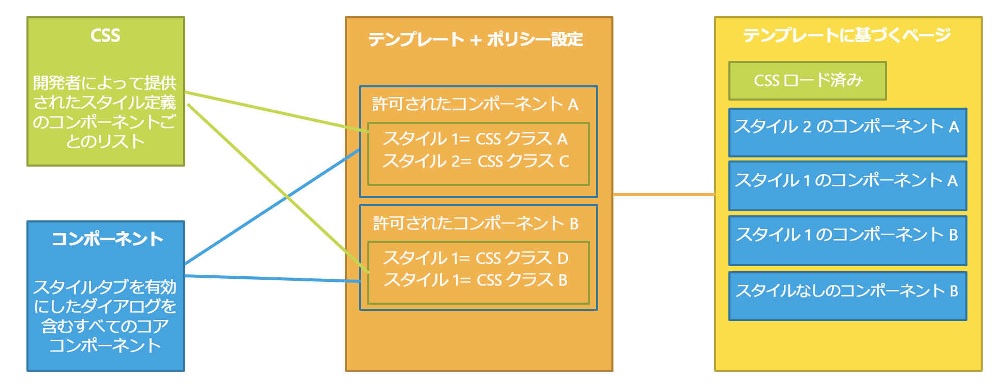

# スタイルシステム {#style-system}

スタイルシステムを使用すると、テンプレート作成者がコンポーネントのコンテンツポリシーのスタイルクラスを定義し、コンテンツ作成者がページでのコンポーネントの編集時にそのスタイルクラスを選択できます。これらのスタイルは、1 つのコンポーネントの別の視覚的バリエーションとして使用することができるので、コンポーネントがより柔軟で扱いやすいものになります。

このため、スタイルごとにカスタムコンポーネントを開発したり、スタイル機能を有効化するためにコンポーネントのダイアログをカスタマイズする必要がなくなりました。これにより、AEM のバックエンド開発をしなくてもそのまま再利用可能な、コンテンツ作成者のニーズにすばやく簡単に応えることができるコンポーネントの数が増加します。

## ユースケース {#use-case}

テンプレート作成者には、コンテンツ作成者がコンポーネントを操作するときの動作を設定する能力だけでなく、1 つのコンポーネントに複数の別の視覚的バリエーションを設定するための能力も必要です。

同様に、コンテンツ作成者には、コンテンツを構築して調整する能力だけでなく、コンテンツの視覚的な表示方法を選択する能力も必要です。

スタイルシステムでは、テンプレート作成者とコンテンツ作成者の両方の要件に対応する統一ソリューションを提供します。

* テンプレート作成者は、コンポーネントのコンテンツポリシーのスタイルクラスを定義できます。
* 次にコンテンツ作成者は、ページでのコンポーネント編集時にドロップダウンからこれらのクラスを選択し、対応するスタイルを適用できます。

その後、スタイルクラスはコンポーネントの装飾ラッパー要素に挿入されるので、コンポーネント開発者は CSS ルールを作成する以外にスタイルを処理する必要はありません。

## 概要 {#overview}

スタイルシステムの使用は通常、次のように行われます。

1. Web デザイナーは 1 つのコンポーネントに対し様々な視覚的バリエーションを作成します。

1. HTML 開発者にはコンポーネントの HTML 出力と、実装する必要な視覚的バリエーションが提供されます。

1. HTML 開発者は各視覚的バリエーションに対応する CSS クラスを定義します。その CSS クラスが、コンポーネントをラップする要素に挿入されます。

1. HTML 開発者は視覚的バリエーションごとに対応する CSS コードを（オプションで JS コードも）実装し、それらは定義済みとなります。

1. AEM デベロッパーは、提供された CSS を（オプションで JS も）[クライアントライブラリ](/help/sites-developing/clientlibs.md)に配置し、デプロイします。

1. AEM 開発者またはテンプレート作成者は、ページテンプレートを設定し、スタイル設定された各コンポーネントのポリシーを編集します。また、定義済みの CSS クラスを追加し、スタイルごとにわかりやすい名前を付け、組み合わせが可能なスタイルを示します。

1. 次に AEM ページ作成者は、ページエディターでコンポーネントのツールバーのスタイルメニューからデザイン済みのスタイルを選択できます。

最後の 3 つの手順のみが AEM で実際に実行されます。つまり、必要な CSS と Javascript のすべての開発は AEM なしで行うことができます。

実際にスタイルの実装で必要となるのは、AEM へのデプロイメント、および必要なテンプレートのコンポーネント内で選択することのみです。

次の図は、スタイルシステムのアーキテクチャを示しています。

## 使用方法 {#use}

この機能のデモを行うために、コアコンポーネントの[タイトルコンポーネント](https://www.adobe.com/go/aem_cmp_title_v2_jp)の [WKND](https://docs.adobe.com/content/help/ja-JP/experience-manager-learn/getting-started-wknd-tutorial-develop/overview.html) による実装を例として使用します。

次の[コンテンツ作成者として](#as-a-content-author)節と[テンプレート作成者として](#as-a-template-author)節では、WKND のスタイルシステムを使用してスタイルシステムの機能をテストする方法について説明します。

スタイルシステムを独自のコンポーネントに使用する場合は、次の手順に従います。

1. [概要](#overview)の節の説明に従って、CSS をクライアントライブラリとしてインストールします。
1. [テンプレート作成者として](#as-a-template-author)の節の説明に従って、コンテンツ作成者が使用できるようにする CSS クラスを設定します。
1. この後、コンテンツ作成者は[コンテンツ作成者として](#as-a-content-author)の節の説明に従ってスタイルを使用できます。

### コンテンツ作成者として {#as-a-content-author}

1. WKND プロジェクトをインストールした後、WKND の英語のマスターホームページ（`http://<host>:<port>/sites.html/content/wknd/language-masters/en`）に移動し、ページを編集します。
1. ページの下方の&#x200B;**タイトル**&#x200B;コンポーネントを選択します。

   

1. **リスト**&#x200B;コンポーネントのツールバーで「**スタイル**」ボタンをタップまたはクリックしてスタイルメニューを開き、コンポーネントの外観を変更します。

   

   >[!NOTE]
   >
   >この例では、**カラー**&#x200B;スタイル（**黒**、**白**、**グレー**）は相互排他的ですが、**スタイル**&#x200B;オプション（**アンダーライン**、**右揃え**、**最小間隔**）は組み合わせることができます。これは、[テンプレート作成者としてテンプレートで設定可能](#as-a-template-author)です。

### テンプレート作成者として {#as-a-template-author}

1. WKND の英語のマスターホームページ（`http://<host>:<port>/sites.html/content/wknd/language-masters/en`）の編集時に、**ページ情報／テンプレートの編集**&#x200B;でページのテンプレートを編集します。

   

1. コンポーネントの「**ポリシー**」ボタンをタップまたはクリックして、**タイトル**&#x200B;コンポーネントのポリシーを編集します。

   

1. プロパティの「スタイル」タブで、スタイルがどのように設定されているかを確認できます。

   

   * **グループ名：**&#x200B;スタイルは、コンポーネントのスタイルの設定時にコンテンツ作成者に表示されるスタイルメニュー内にまとめてグループ化できます。
   * **スタイルは結合できません：**&#x200B;そのグループ内の複数のスタイルを一度に選択できます。
   * **スタイル名：**&#x200B;コンポーネントのスタイルの設定時にコンテンツ作成者に表示されるスタイルの説明。
   * **CSS クラス：**&#x200B;スタイルと関連付けられている CSS クラスの実際の名前。

   ドラッグハンドルを使用して、グループの順序やグループ内のスタイルを調整します。追加アイコンや削除アイコンを使用して、グループやグループ内のスタイルを追加したり削除したりします。

>[!CAUTION]
>
>コンポーネントポリシーのスタイルプロパティとして設定されている CSS クラス（および必要な JavaScript）を動作可能にするには、[クライアントライブラリ](/help/sites-developing/clientlibs.md)としてデプロイする必要があります。

## セットアップ {#setup}

コアコンポーネントのバージョン 2 以降はスタイルシステムの活用に完全に対応しているので、追加の設定は不要です。

以下の手順は、独自のカスタムコンポーネントに対してスタイルシステムを有効にする場合、または[編集ダイアログのオプションの「スタイル」タブを有効にする](#enable-styles-tab-edit)場合にのみ必要です。

### デザインダイアログの「スタイル」タブを有効にする {#enable-styles-tab-design}

コンポーネントが AEM のスタイルシステムと連動し、デザインダイアログに「スタイル」タブが表示されるようにするには、コンポーネント開発者がコンポーネントに次の設定をおこなって「スタイル」タブを組み込む必要があります。

* `path = "/mnt/overlay/cq/gui/components/authoring/dialog/style/tab_design/styletab"`
* `sling:resourceType = "granite/ui/components/coral/foundation/include"`

コンポーネントが設定されると、すべての編集可能なコンポーネントを自動的にラップする装飾要素に、ページ作成者が設定したスタイルが自動的に挿入されます。この他にコンポーネント自体で行う必要があることはありません。

### 編集ダイアログの「スタイル」タブを有効にする {#enable-styles-tab-edit}

AEM バージョン 6.4.7.0 で、編集ダイアログのオプションとして「スタイル」タブが利用できるようになりました。「デザインダイアログ」タブとは異なり、編集ダイアログのタブは、スタイルシステムが機能するのに必須ではなく、コンテンツ作成者がスタイルを設定するためのオプションの代替インターフェイスです。

編集ダイアログのタブは、デザインダイアログのタブと同様の方法で組み込むことができます。

* `path = "/mnt/overlay/cq/gui/components/authoring/dialog/style/tab_edit/styletab"`
* `sling:resourceType = "granite/ui/components/coral/foundation/include"`

>[!NOTE]
>
>編集ダイアログの「スタイル」タブは、デフォルトでは有効になっていません。

### 要素名を持つスタイル {#styles-with-element-names}

開発者は `cq:styleElements` 文字列配列プロパティを使用して、コンポーネントのスタイルに使用できる要素名のリストを設定することもできます。その後、テンプレート作成者はデザインダイアログのポリシーの「スタイル」タブで各スタイルに設定する要素名を選択することもできます。これにより、ラッパー要素の要素名が設定されます。

このプロパティは `cq:Component` ノードに設定されます。次に例を示します。

* `/apps/<yoursite>/components/content/list@cq:styleElements=[div,section,span]`

>[!CAUTION]
>
>組み合わせ可能なスタイルに要素名は定義しないでください。複数の要素名を定義した場合、優先順位は次のようになります。
>
>1. HTL（`data-sly-resource="${'path/to/resource' @ decorationTagName='span'}`）が他のすべての要素よりも優先されます。
>1. 次に、複数のアクティブなスタイルの中で、コンポーネントのポリシーで設定されたスタイルのリストの最初のスタイルが優先されます。
>1. 最後に、コンポーネントの `cq:htmlTag` または `cq:tagName` がフォールバック値と見なされます。

>

スタイル名を定義するこの機能は、レイアウトコンテナやコンテンツフラグメントコンポーネントなどの非常に一般的なコンポーネントに意味を追加できます。

例えば、レイアウトコンテナに `<main>`、`<aside>`、`<nav>` のようなセマンティクスを指定できます。
