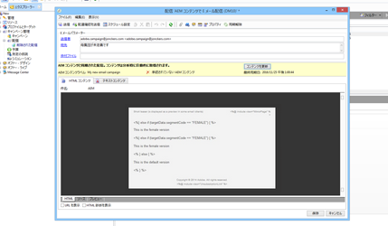

# Adobe Campaign のターゲット設定{#targeting-your-adobe-campaign}

Adobe Campaign のニュースレターのターゲット設定をおこなうには、まずセグメント化を設定する必要があります（セグメント化の設定は、クラシック UI でのみ使用可能です）（ClientContext）。その後、Adobe Campaign 用のターゲット設定されたエクスペリエンスを作成できます。ここでは、この両方について説明します。

## AEM でのセグメント化の設定 {#setting-up-segmentation-in-aem}

セグメント化を設定するには、クラシック UI を使用してセグメントを設定する必要があります。残りの手順は、標準 UI で実行できます。

セグメント化の設定には、セグメント、ブランド、キャンペーンおよびエクスペリエンスの作成が含まれます。

>[!NOTE]
>
>セグメント ID は、Adobe Campaign 側のセグメント ID にマップする必要があります。

### セグメントの作成 {#creating-segments}

セグメントを作成するには：

1. を開きます。 [セグメントコンソール](http://localhost:4502/miscadmin#/etc/segmentation) 時刻 **&lt;host>:&lt;port>/miscadmin#/etc/segmentation**.
1. 新しいページを作成し、タイトルを入力します（例： ）。 **AC セグメント** — を選択し、 **セグメント (Adobe Campaign)** テンプレート。
1. 左側のツリー表示で、作成したページを選択します。
1. セグメントを作成し（例えば、男性ユーザーをターゲットにするセグメントを作成するには、「Male」というセグメントの下に新しいページを作成します）、**セグメント（Adobe Campaign）**&#x200B;テンプレートを選択します。
1. 作成したセグメントページを開き、サイドキックからそのページに&#x200B;**セグメント ID** をドラッグ＆ドロップします。
1. 特性をダブルクリックし、この例ではAdobe Campaignで定義されている男性セグメントを表す ID を入力します（例： ）。 **男性**  — をクリックします。 **OK**. 次のメッセージが表示されます。 *`targetData.segmentCode == "MALE"`*
1. 同じステップを繰り返して、別のセグメント（例えば女性ユーザーをターゲットにするセグメント）を作成します。

### ブランドの作成 {#creating-a-brand}

ブランドを作成するには：

1. In **サイト**&#x200B;をクリックし、 **キャンペーン** フォルダー（例えば、We.Retail 内）に保存されます。
1. 「**ページを作成**」をクリックし、ページのタイトル（「We.Retail Brand」など）を入力して、**ブランド**&#x200B;テンプレートを選択します。

### キャンペーンの作成 {#creating-a-campaign}

キャンペーンを作成するには：

1. 作成した&#x200B;**ブランド**&#x200B;ページを開きます。
1. 「**ページを作成**」をクリックし、ページのタイトル（「We.Retail Campaign」など）を入力し、**キャンペーン**&#x200B;テンプレートを選択して、「**作成**」をクリックします。

### エクスペリエンスの作成 {#creating-experiences}

セグメント用のエクスペリエンスを作成するには：

1. を開きます。 **Campaign** 作成したページ。
1. 「 **ページを作成** ページのタイトルを入力し、例えば、「男性」セグメントのエクスペリエンスを作成する場合は「男性」を選択し、 **エクスペリエンス** テンプレート。
1. 作成したエクスペリエンスページを開きます。
1. 「**編集**」をクリックして、「セグメント」の下の「**項目を追加**」をクリックします。
1. 男性セグメントへのパスを入力します（例： ）。 **/etc/segmentation/ac-segments/male** をクリックし、 **OK**. 次のメッセージが表示されます。 *エクスペリエンスのターゲットは次のとおりです。男性*
1. ここまでのステップを繰り返して、すべてのセグメント（女性をターゲットにするセグメントなど）用のエクスペリエンスを作成します。

## ターゲットコンテンツを使用したニュースレターの作成 {#creating-a-newsletter-with-targeted-content}

セグメント、ブランド、キャンペーンおよびエクスペリエンスを作成したら、ターゲットコンテンツを使用してニュースレターを作成できます。作成したエクスペリエンスを、セグメントにリンクします。

>[!NOTE]
>
>[電子メールのサンプルは、Geometrixx でのみ使用できます](/help/sites-developing/we-retail.md)。サンプルGeometrixxコンテンツをパッケージ共有からダウンロードしてください。

ターゲットコンテンツを使用してニュースレターを作成するには：

1. ターゲットコンテンツを含むニュースレターを作成します。「メールキャンペーン」の下の「Geometrixx Outdoors」で、 **作成** > **ページ**&#x200B;をクリックし、いずれかのAdobe Campaign Mail テンプレートを選択します。

   

1. ニュースレター内で、テキストおよびパーソナライゼーションコンポーネントを追加します。
1. テキストおよびパーソナライゼーションコンポーネントに「これはデフォルトです」などのテキストを追加します。
1. の横の矢印をクリックします。 **編集** を選択し、 **ターゲット設定**.
1. ブランドのドロップダウンメニューからブランドを選択し、キャンペーンを選択します（前に作成したブランドとキャンペーンです）。
1. 「**ターゲティングを開始**」をクリックします。セグメントが「オーディエンス」領域に表示されます。定義したセグメントに一致するものがない場合は、デフォルトのエクスペリエンスが使用されます。

   >[!NOTE]
   >
   >AEM に付属している電子メールサンプルでは、デフォルトで、Adobe Campaign がターゲティングエンジンとして使用されます。カスタムニュースレターでは、Adobe Campaign をターゲティングエンジンとして明示的に選択しなければならないことがあります。その場合は、ターゲット設定時にツールバーの「+」をタップまたはクリックし、新しいアクティビティのタイトルを入力して、ターゲティングエンジンとして「**Adobe Campaign**」を選択します。

1. 「**デフォルト**」をクリックし、追加したテキストおよびパーソナライゼーションコンポーネントをクリックすると、矢が刺さった的のアイコンが表示されます。コンポーネントのターゲットを設定するには、このアイコンをクリックします。

   

1. 別のセグメント（Male）に移動し、「**オファーを追加**」をクリックして、プラス（+）アイコンをクリックします。次に、オファーを編集します。
1. 別のセグメント（Feale）に移動し、「**オファーを追加**」をクリックして、プラス（+）アイコンをクリックします。次に、このオファーを編集します。
1. クリック **次へ** マッピングを表示するには、 **次へ** をクリックして、Adobe Campaignには適用されない設定を表示し、 **保存**.

   Adobe Campaign 内でこのコンテンツが配信に使用されると、Adobe Campaign 用の正しいターゲット設定コードが自動的に生成されます。

1. Adobe Campaign で配信を作成します（「**AEM コンテンツで E メール配信**」を選択し、必要に応じてローカル AEM アカウントを選択して、変更を確認します）。

   HTML 表示では、ターゲットコンポーネントの様々なエクスペリエンスが、Adobe Campaign ターゲット設定コード内に含まれています。

   

   >[!NOTE]
   >
   >Adobe Campaign でもセグメントを設定している場合は、「**プレビュー**」をクリックすると、各セグメントのエクスペリエンスが表示されます。
