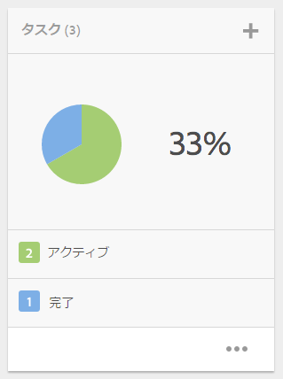
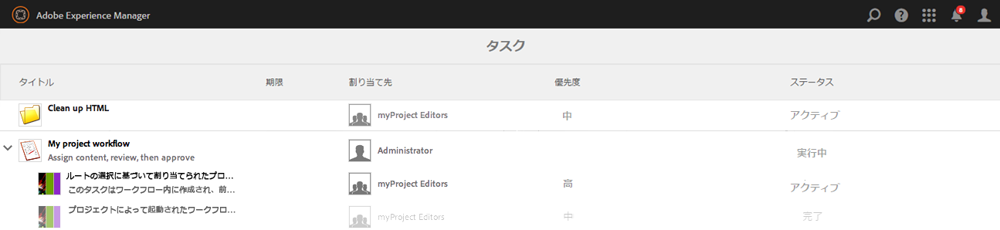
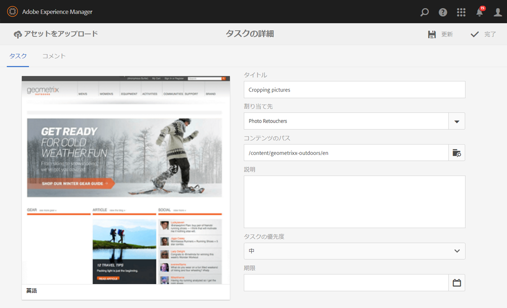
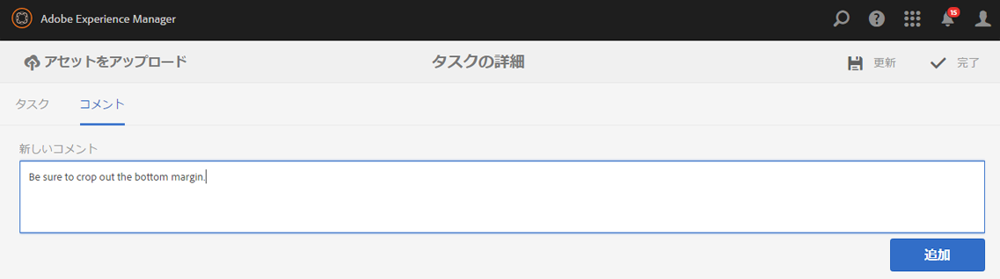
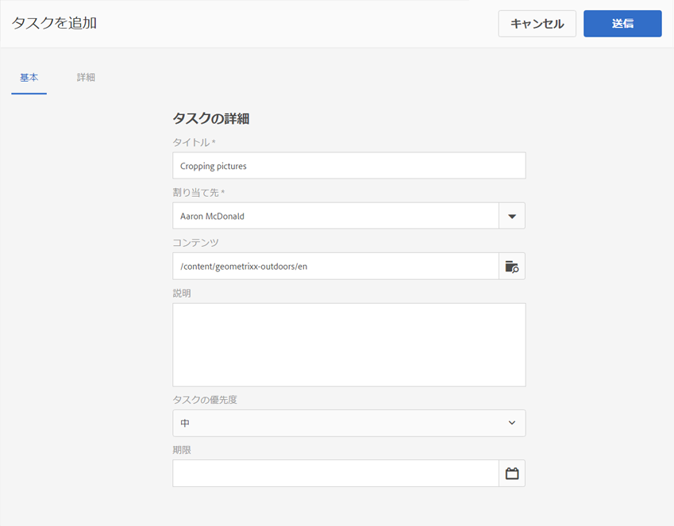
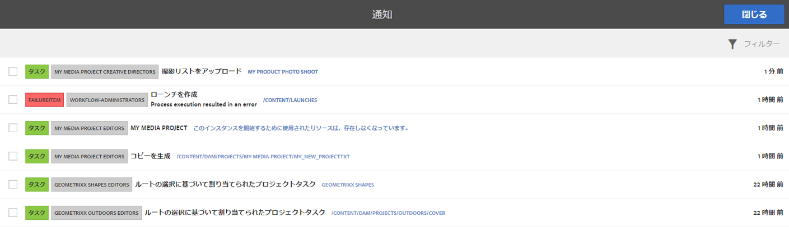
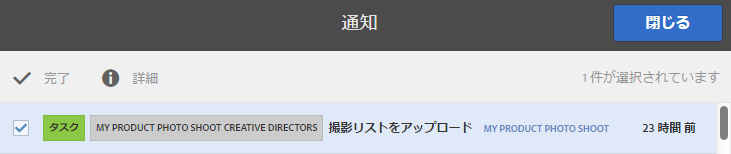

# タスクの操作{#working-with-tasks}

タスクは、コンテンツ上で行う作業の項目を表します。タスクが割り当てられると、ワークフローインボックスに表示されます。タスク項目のタイプ列には task の値が含まれます。

タスクは、プロジェクトでも使用され、ワークフロータスクを含む現在のタスクの完了レベルを決定します。

## プロジェクトの進行状況の追跡 {#tracking-project-progress}

プロジェクトの進行状況は、 **タスク** タイル。 プロジェクトの進行状況は、次の方法で決定できます。

* **タスクタイル：**&#x200B;プロジェクトの全体的な進行状況は、プロジェクトの詳細ページに表示されるタスクタイルに表示されます。

* **タスクリスト：**&#x200B;タスクタイルをクリックすると、タスクのリストが表示されます。このリストには、プロジェクトに関連するすべてのタスクの詳細情報が含まれます。

ワークフロータスクと、 **タスク** タイル。

### タスクタイル {#task-tile}

プロジェクトに関連タスクがある場合は、プロジェクト内にタスクタイルが表示されます。 タスクタイルには、プロジェクトの現在のステータスが表示されます。 これは、ワークフロー内の既存のタスクに基づいており、ワークフローの進行に伴って将来生成されるタスクは含まれていません。 次の情報がタスクタイルに表示されます。

* 完了したタスクの割合
* アクティブなタスクの割合
* 期限切れタスクの割合

### プロジェクト内のタスクの表示または変更 {#viewing-or-modifying-the-tasks-in-a-project}

進行状況の追跡に加えて、プロジェクトに関する詳細情報を表示したり、変更したりすることもできます。

#### タスクリスト {#task-list}

タスクタイルの省略記号 (...) をクリックして、プロジェクトに関連するタスクのリストを表示します。 タスクは親ワークフローで分割されます。 期限、担当者、優先度、ステータスなどのメタデータと共に、タスクの詳細が表示されます。

#### タスクの詳細 {#task-details}

特定のタスクの詳細を表示するには、タスクリストでタスクをタップまたはクリックして、タスクの詳細を開きます。

### タスクのコメントの表示および変更 {#viewing-and-modifying-task-comments}

タスクの詳細では、コメントを編集または追加できます。 また、プロジェクト内のすべてのコメントは、「コメント」領域に表示されます。

### タスクの追加 {#adding-tasks}

プロジェクトに新しいタスクを追加できます。 これらのタスクはタスクタイルに表示され、通知インボックスでアクションを実行できます。

タスクを追加するには：

1. プロジェクトの&#x200B;**タスク**&#x200B;タイルで、「+」アイコンをタップまたはクリックします。**タスクを追加**&#x200B;ウィンドウが開きます。
1. タスクに関する情報を入力します。 タスクのタイトルと、タスクを割り当てるグループは必須です。 コンテンツのパス、説明、タスクの優先度、期限などの追加情報はオプションです。 また、 **詳細** タブを使用して、URL の名前を付けるために使用されるタスクの名前を入力します。

   

1. 「**作成**」をタップまたはクリックします。

## インボックス内でのタスクの使用 {#working-with-tasks-in-the-inbox}

タスクにアクセスする別の方法は、インボックスからアクセスする方法です。 インボックスからコンテンツを開き、必要な変更を実装できます。 完了したら、タスクのステータスを「完了」に設定します。 タスクが所属するユーザーグループに割り当てられると、タスクがインボックスに表示されます。 この場合、グループの任意のメンバーが作業を実行し、タスクを完了できます。

タスクを完了するには、タスクを選択し、 **完了**. タスクに情報を追加し、 **完了**. 詳しくは、 [インボックス](/help/sites-authoring/inbox.md) を参照してください。

