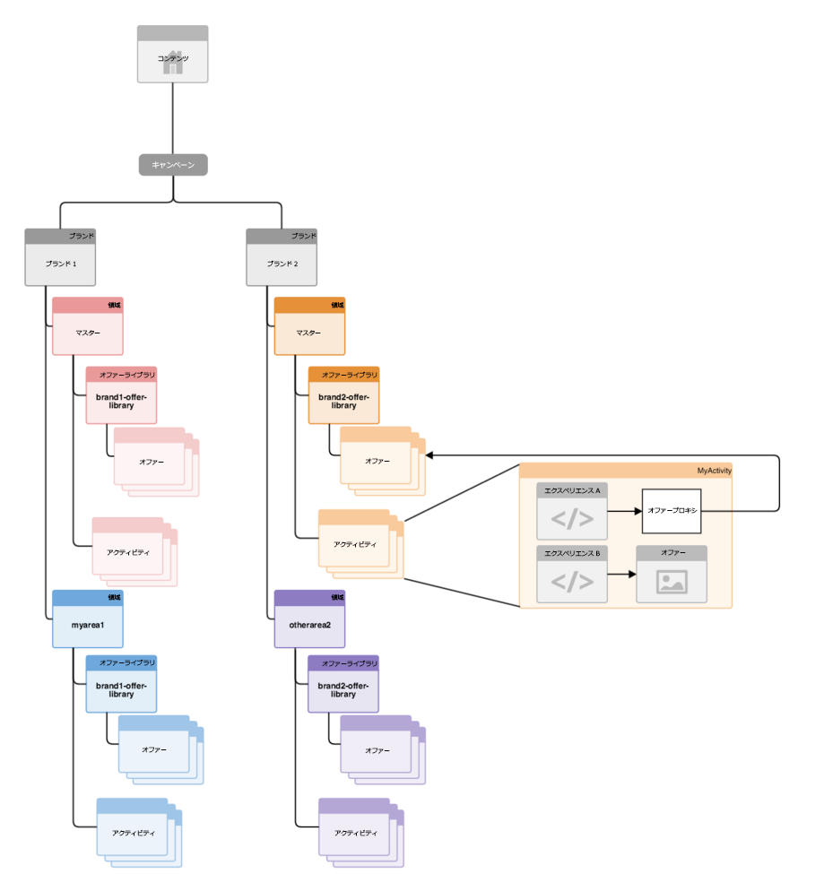
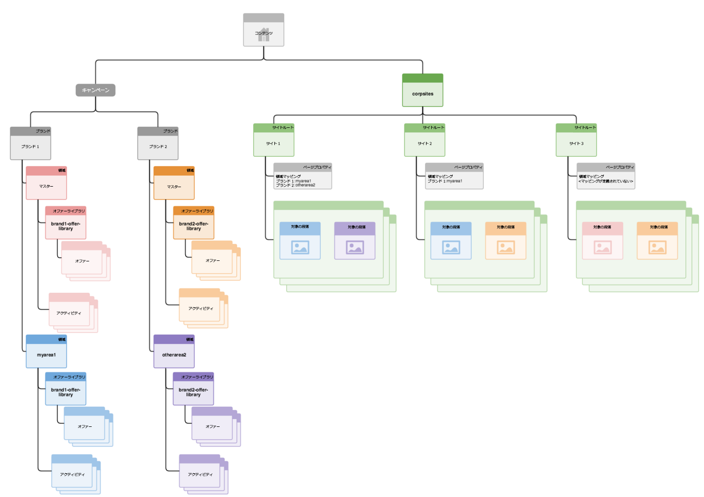

# ターゲットコンテンツ用マルチサイト管理の構造 {#how-multisite-management-for-targeted-content-is-structured}

>[!CAUTION]
>
>AEM 6.4 の拡張サポートは終了し、このドキュメントは更新されなくなりました。 詳細は、 [技術サポート期間](https://helpx.adobe.com/jp/support/programs/eol-matrix.html). サポートされているバージョンを見つける [ここ](https://experienceleague.adobe.com/docs/?lang=ja).

以下の図は、ターゲットコンテンツ用マルチサイト管理の構造を示しています。

領域は **/content/campaigns/&lt;brand>** の下に表示され、デフォルトでは、ブランドごとに自動作成されるマスター領域が 1 つあります。各領域には、独自のアクティビティ、エクスペリエンスおよびオファーのセットが含まれます。

ターゲットコンテンツを検索するために、ページまたはサイトを特定の領域にマッピングできます。 領域が設定されていない場合、AEMはこの特定のブランドのマスター領域にフォールバックします。

以下の図は、site1、site2、site3 という 3 つのサイトに対してロジックがどのように機能するかを示したものです。

* site1 は領域マッピングに基づいて、brand1 の myarea1 を検索し、brand2 の otherarea2 を検索します。
* site2 は、brand1 の領域マッピングのみが定義されているので、brand1 の myarea1 と brand2 の master 領域を検索します。
* site3 では、このサイトの他の領域マッピングが定義されていないので、brand1 と brand2 のマスター領域を検索します。
