# プロジェクトの管理 {#managing-projects}

>[!CAUTION]
>
>AEM 6.4 の拡張サポートは終了し、このドキュメントは更新されなくなりました。 詳細は、 [技術サポート期間](https://helpx.adobe.com/jp/support/programs/eol-matrix.html). サポートされているバージョンを見つける [ここ](https://experienceleague.adobe.com/docs/?lang=ja).

プロジェクトを使用すると、リソースを 1 つのエンティティにグループ化して整理できます。

内 **プロジェクト** コンソールで、プロジェクトにアクセスし、次の操作を実行します。

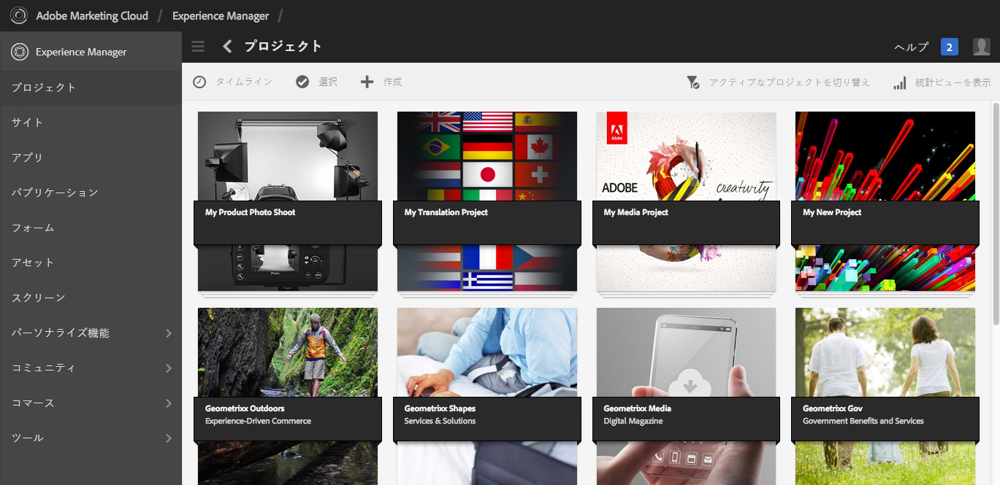

プロジェクトでは、プロジェクトを作成したり、プロジェクトにリソースを関連付けたり、プロジェクトまたはリソースリンクを削除したりできます。 タイルを開いてその内容を表示したり、タイルに項目を追加したりできます。 このトピックでは、これらの手順について説明します。

>[!NOTE]
>
>6.2 では、プロジェクトをフォルダーに整理する機能が導入されました。 「プロジェクト」ページでは、プロジェクトまたはフォルダーを作成できます。
>
>フォルダーが作成されると、ユーザーはそのフォルダーに移動し、別のフォルダーまたはプロジェクトを作成できます。 製品キャンペーン、場所、翻訳言語などのカテゴリに基づいて、プロジェクトをフォルダーに整理するのに役立ちます。
>
>プロジェクトとフォルダーは、リスト表示で表示したり、検索したりすることができます。

>[!CAUTION]
>
>プロジェクト内のユーザーが、プロジェクトの作成、タスクまたはワークフローの作成、チームの表示と管理などのプロジェクト機能を使用中に他のユーザーまたはグループを表示するには、**/home/users** および **/home/groups** に対する読み取りアクセス権が必要です。これを実現する最も簡単な方法は、**projects-users** グループに **/home/users** および **/home/groups** に対する読み取りアクセス権を付与することです。

## プロジェクトの作成 {#creating-a-project}

デフォルトでは、AEMには、プロジェクトを作成する際に、次のテンプレートから選択できるものが用意されています。

* シンプルなプロジェクト
* メディアプロジェクト
* 製品撮影プロジェクト
* 翻訳プロジェクト

プロジェクトの作成手順は、どのプロジェクトでも同じです。プロジェクトのタイプによって異なるものとしては、使用可能な[ユーザーの役割](/help/sites-authoring/projects.md)と[ワークフロー](/help/sites-authoring/projects-with-workflows.md)があります。新しいプロジェクトを作成するには、次の手順を実行します。

1. **プロジェクト**&#x200B;で「**作成**」をタップまたはクリックして「**プロジェクトを作成**」ウィザードを開きます。
1. テンプレートを選択します。シンプルなプロジェクト、メディアプロジェクト、[翻訳プロジェクト](/help/sites-administering/tc-manage.md)および[撮影した製品写真プロジェクト](/help/sites-authoring/managing-product-information.md)がすぐに使用可能です。「**次へ**」をクリックします。

   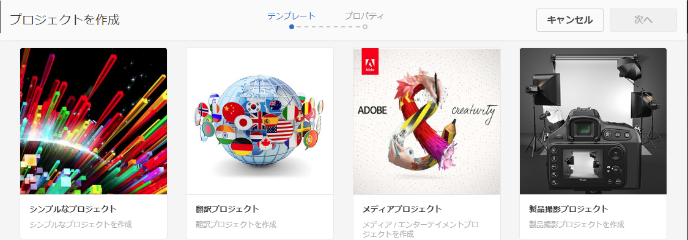

1. 「**タイトル**」と「**説明**」を定義し、必要に応じて「**サムネール**」画像を追加します。ユーザーおよびユーザーが属するグループを追加または削除することもできます。さらに、 **詳細** をクリックして、URL で使用される名前を追加します。

   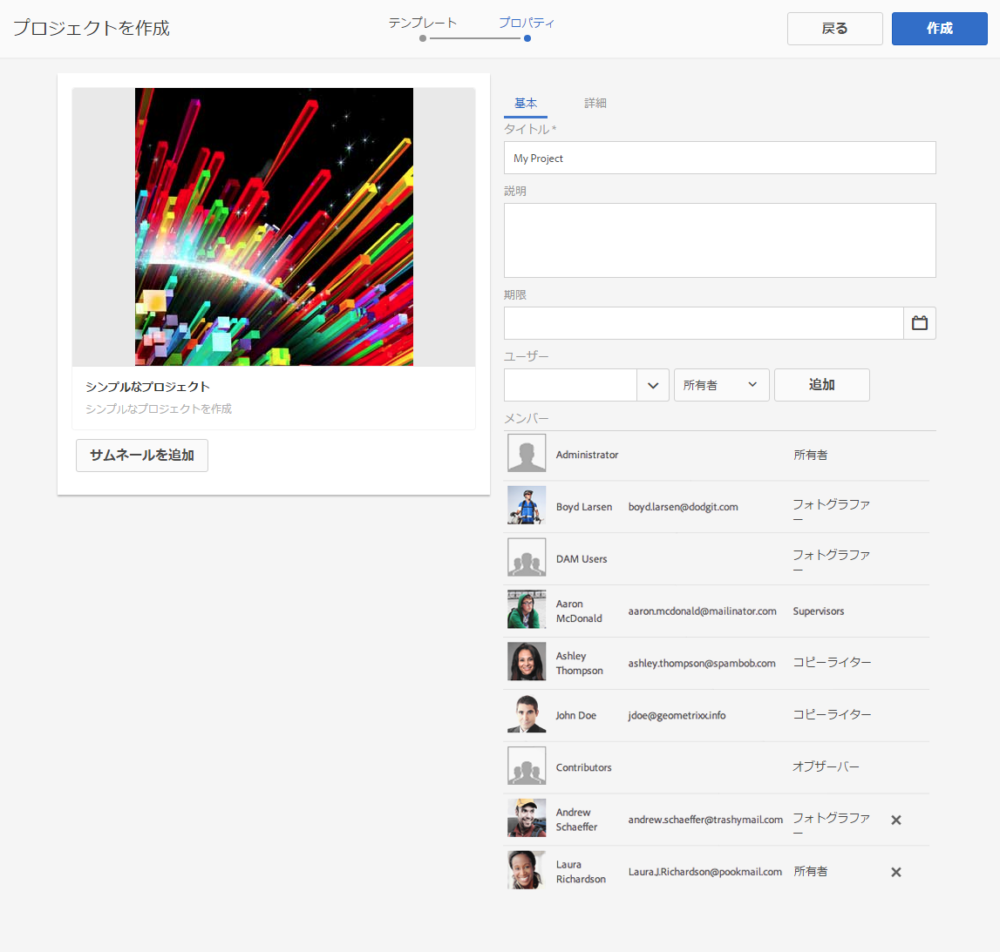

1. 「**作成**」をタップまたはクリックします。新しいプロジェクトを開くか、コンソールに戻るかを確認するメッセージが表示されます。

### プロジェクトへのリソースの関連付け {#associating-resources-with-your-project}

プロジェクトを使用すると、リソースを 1 つのエンティティにグループ化できるので、リソースをプロジェクトに関連付ける必要があります。 これらのリソースは、 **タイル**. 追加できるリソースのタイプについては、 [プロジェクトタイル](/help/sites-authoring/projects.md#project-tiles).

リソースをプロジェクトに関連付けるには：

1. プロジェクトを **プロジェクト** コンソール。
1. タップまたはクリック **タイルを追加** プロジェクトにリンクするタイルを選択します。 複数のタイプのタイルを選択できます。

   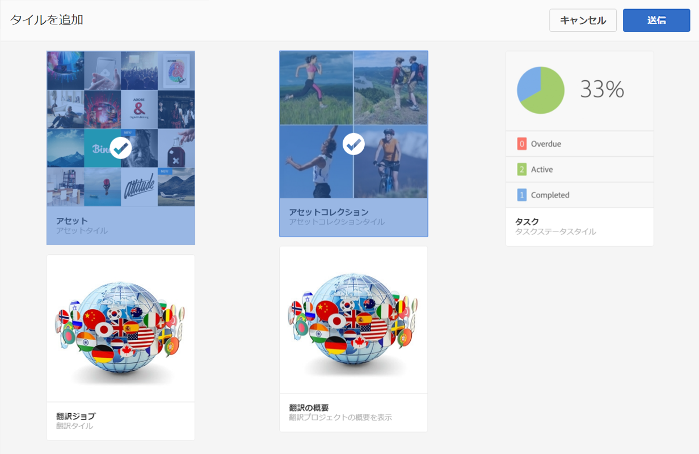

   >[!NOTE]
   >
   >プロジェクトに関連付けることができるプロジェクトタイルの詳細については、[プロジェクトタイル](/help/sites-authoring/projects.md#project-tiles)で説明します。

1. 「**作成**」をタップまたはクリックします。リソースがプロジェクトにリンクされ、今後はそのプロジェクトからアクセスできるようになります。

### プロジェクトまたはリソースリンクの削除 {#deleting-a-project-or-resource-link}

コンソールからプロジェクトを削除する場合も、リンクされたリソースをプロジェクトから削除する場合も、同じ方法を使用します。

1. 適切な場所に移動します。

   * プロジェクトを削除するには、 **プロジェクト** コンソール。
   * プロジェクト内のリソースリンクを削除するには、**プロジェクト**&#x200B;コンソールでプロジェクトを開きます。

1. 「**選択**」をクリックし、プロジェクトまたはリソースリンクを選択して、選択モードに入ります。
1. 「**削除**」をタップまたはクリックします。

1. ダイアログで削除を確定する必要があります。 確認すると、プロジェクトまたはリソースリンクが削除されます。 「**選択を解除**」をタップまたはクリックし、選択モードを終了します。

>[!NOTE]
>
>プロジェクトを作成してユーザーを様々な役割に追加すると、関連する権限を管理するため、プロジェクトに関連付けられたグループが自動的に作成されます。例えば、「Myproject」というプロジェクトには **Myproject Owners**、**Myproject Editors**、**Myproject Observers** という 3 つのグループがあります。ただし、プロジェクトを削除しても、これらのグループは自動的には削除されません。管理者は、**ツール**／**セキュリティ**／**グループ**&#x200B;から、手動でグループを削除する必要があります。

### タイルへの項目の追加 {#adding-items-to-a-tile}

一部のタイルでは、複数の項目を追加できます。 例えば、一度に複数のワークフローを実行する場合や、複数のエクスペリエンスを実行する場合があります。

タイルに項目を追加するには：

1. **プロジェクト**&#x200B;で、プロジェクトに移動し、項目を追加するタイル上の追加（+）アイコンをクリックします。

   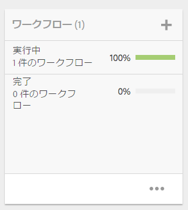

1. 新しいタイルを作成する際と同様に、タイルに項目を追加します。 プロジェクトタイルについて説明します [ここ](/help/sites-authoring/projects.md#project-tiles). この例では、別のワークフローが追加されています。

   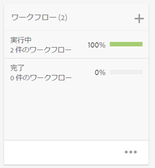

### タイルを開く {#opening-a-tile}

現在のタイルに含まれる項目を表示したり、タイル内の項目を変更または削除したりできます。

タイルを開いて項目を表示または変更するには、次の手順を実行します。

1. プロジェクトコンソールで、省略記号 (...) をタップまたはクリックします。

   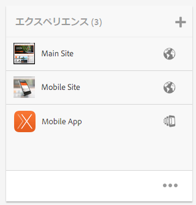

1. AEMは、そのタイル内の項目を一覧表示します。 選択モードに入ると、項目を変更または削除できます。

   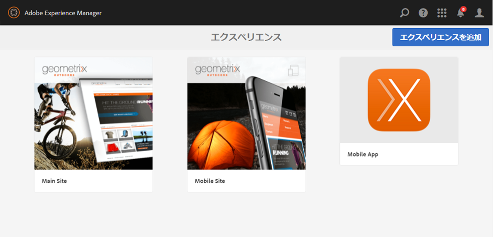

## プロジェクト統計の表示 {#viewing-project-statistics}

プロジェクトの統計を表示するには、 **プロジェクト** コンソールで、 **統計ビューを表示**. 各プロジェクトの完了レベルが表示されます。 「**統計ビューを表示**」を再度クリックして、**プロジェクト**&#x200B;コンソールに移動します。

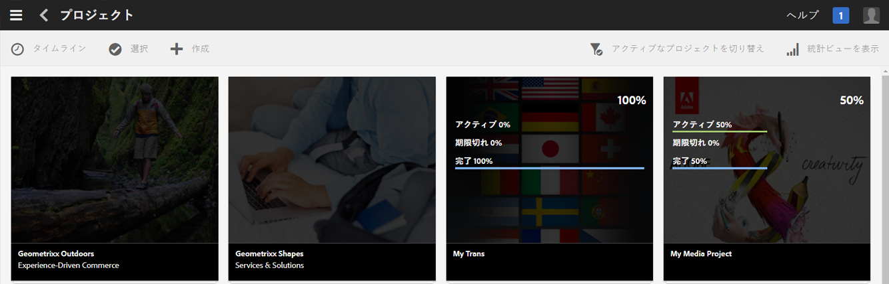

### プロジェクトタイムラインの表示 {#viewing-a-project-timeline}

プロジェクトタイムラインは、プロジェクト内のアセットが最後にいつ使用されたかを示します。プロジェクトタイムラインを表示するには、「**タイムライン**」をクリックまたはタップしてから、選択モードに入ってプロジェクトを選択します。アセットが左パネルに表示されます。「**タイムライン**」をクリックまたはタップして、**プロジェクト**&#x200B;コンソールに戻ります。

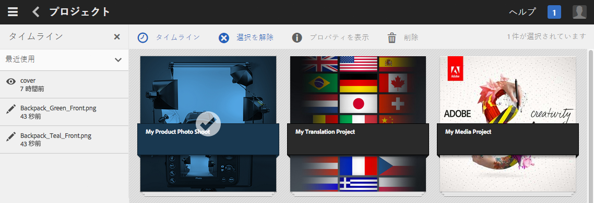

### アクティブ／非アクティブなプロジェクトの表示 {#viewing-active-inactive-projects}

アクティブなプロジェクトと非アクティブなプロジェクトを切り替えるには、**プロジェクト**&#x200B;コンソールで「**アクティブなプロジェクトを切り替え**」をクリックします。アイコンの横にチェックマークがある場合は、アクティブなプロジェクトが表示されています。

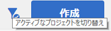

アイコンの横に「x」がある場合は、非アクティブなプロジェクトが表示されています。

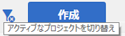

## プロジェクトの非アクティブ化またはアクティブ化 {#making-projects-inactive-or-active}

プロジェクトを完了しても、その情報をプロジェクト上に保持したい場合は、プロジェクトを非アクティブにすることができます。

プロジェクトを非アクティブ（またはアクティブ）にするには：

1. 内 **プロジェクト** コンソールで、プロジェクトを開き、 **プロジェクト情報** タイル。

   >[!NOTE]
   このタイルがまだプロジェクトにない場合は、追加が必要になる場合があります。 詳しくは、 [タイルの追加](#adding-items-to-a-tile).

1. 「**編集**」をタップまたはクリックします。
1. セレクターを「**アクティブ**」から「**非アクティブ**」（またはその逆）に変更します。

   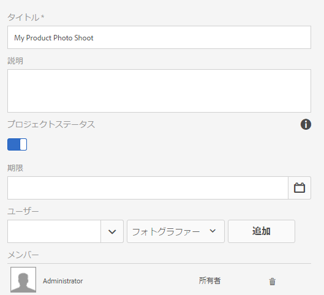

1. 「**完了**」をタップまたはクリックして、変更内容を保存します。
