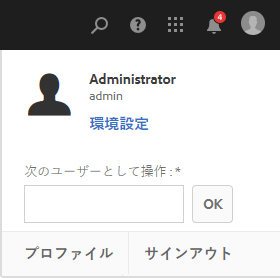
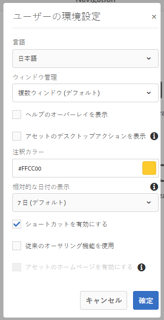

# アカウント環境の設定 {#configuring-your-account-environment}

>[!CAUTION]
>
>AEM 6.4 の拡張サポートは終了し、このドキュメントは更新されなくなりました。 詳細は、 [技術サポート期間](https://helpx.adobe.com/jp/support/programs/eol-matrix.html). サポートされているバージョンを見つける [ここ](https://experienceleague.adobe.com/docs/?lang=ja).

AEM では、アカウントおよびオーサー環境の特定項目を設定できます。

の使用 [ユーザー](/help/sites-authoring/user-properties.md#user-settings) オプション [ヘッダー](/help/sites-authoring/basic-handling.md#the-header) そして関連する [環境設定](#my-preferences) ダイアログで、ユーザオプションを変更できます。

## ユーザー設定 {#user-settings}

この **ユーザー** 設定ダイアログでは、次の設定を実行できます。

* 次のユーザーとして操作

   * を使用 [次のユーザーとして動作](/help/sites-administering/security.md#impersonating-another-user) 機能は、ユーザーが別のユーザーに代わって作業できる機能です。

* プロファイル

   * [ユーザー設定](/help/sites-administering/security.md)への便利なリンクを提供します。

* [環境設定](/help/sites-authoring/user-properties.md#my-preferences)

   * ユーザー独自の様々な環境設定を指定します。

## 環境設定 {#my-preferences}

**環境設定**&#x200B;ダイアログには、ヘッダーの「[ユーザー](/help/sites-authoring/user-properties.md#user-settings)」オプションを使用してアクセスできます。

各ユーザーは、自分の特定のプロパティを設定できます。

* **言語**

   これにより、オーサリング環境の UI で使用する言語が定義されます。 使用可能なリストから必要な言語を選択します。

   この設定は、クラシック UI にも使用されます。

* **ウィンドウ管理**

   これにより、動作またはウィンドウを開くことが定義されます。 次のいずれかを選択します。

   * **複数のウィンドウ** （デフォルト）

      * 新しいウィンドウでページが開きます。
   * **単一ウィンドウ**

      * 現在のウィンドウでページが開きます。

* **アセットのデスクトップアクションを表示**

   このオプションを使用するには、AEM デスクトップアプリケーションが必要です。

* **注釈カラー**

   これは、注釈を作成する際に使用されるデフォルトの色を定義します。

   * カラーブロックをクリックして、スウォッチセレクターを開き、カラーを選択します。
   * または、フィールドに目的のカラーの 16 進コードを入力します。

* **相対的な日付の表示**

   読みやすくするために、AEMでは、過去 7 日以内の日付を相対日付（3 日前など）で表示し、古い日付を正確な日付（2017 年 3 月 20 日など）で表示します。

   このオプションは、システムの日付の表示方法を定義します。以下のオプションが利用できます。

   * **常に正確な日付を表示**：常に正確な日付が表示されます（相対日付は表示されません）。
   * **1 日**：1 日以内の日付に相対日付が表示され、それ以外は正確な日付が表示されます。
   * **7 日（デフォルト）**：7 日以内の日付に相対日付が表示され、それ以外は正確な日付が表示されます。
   * **1 ヶ月**：1 ヶ月以内の日付に相対日付が表示され、それ以外は正確な日付が表示されます。
   * **1 年**：1 年以内の日付に相対日付が表示され、それ以外は正確な日付が表示されます。
   * **常に相対日付を表示**：正確な日付は表示されず、相対日付のみが表示されます。

* **ショートカットを有効にする**

   AEM には、オーサリングの効率性を高める多くのキーボードショートカットがあります。

   * [ページ編集時のキーボードショートカット](/help/sites-authoring/page-authoring-keyboard-shortcuts.md)
   * [コンソールのキーボードショートカット](/help/sites-authoring/keyboard-shortcuts.md)

   このオプションは、キーボードショートカットを有効にします。 デフォルトでは有効になっていますが、ユーザーに特定のアクセシビリティ要件がある場合などに無効にすることができます。

* **従来のオーサリング機能を使用**

   このオプションは、[クラシック UI](/help/sites-classic-ui-authoring/home.md) ベースのページオーサリングを有効にします。デフォルトでは、標準 UI が使用されます。

* **アセットのホームページを有効にする**

   このオプションは、システム管理者がアセットホームページの使用を組織全体で有効にしている場合にのみ使用できます。
