# ワークフローへの参加 {#participating-in-workflows}

ワークフローには通常、ページまたはアセットでユーザーがアクティビティを実行する必要があるステップが含まれています。ワークフローは、アクティビティを実行するユーザーまたはグループを選択し、作業項目をそのユーザーまたはグループに割り当てます。 ユーザーは通知を受け取り、次に適切なアクションを実行できます。

* [通知の表示](#notifications-of-available-workflow-actions)
* [参加者ステップの完了](#completing-a-participant-step)
* [参加者ステップの委任](#delegating-a-participant-step)
* [参加者ステップでの前のステップの実行](#performing-step-back-on-a-participant-step)
* [ワークフロー項目を開いて、詳細を表示（またはアクションを実行）](#opening-a-workflow-item-to-view-details-and-take-actions)
* [ワークロードペイロード（複数のリソース）を表示](#viewing-the-workflow-payload-multiple-resources)

## 使用可能なワークフローアクションの通知 {#notifications-of-available-workflow-actions}

作業項目（**コンテンツを承認**&#x200B;など）が割り当てられると、様々なアラートや通知が表示されます。

* お使いの [通知](/help/sites-authoring/inbox.md) インジケーター（ツールバー）は、次のように増分されます。

   

* 通知[インボックス](/help/sites-authoring/inbox.md)に項目がリストされます

   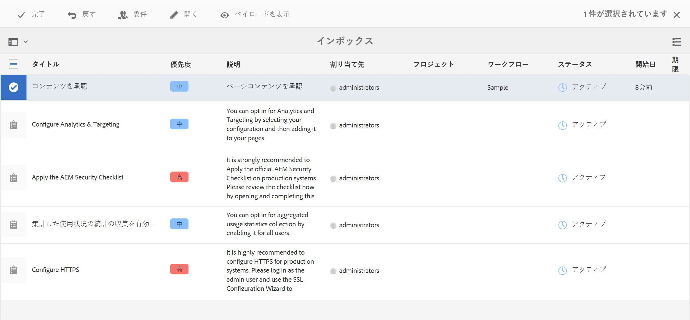

* ページエディターを使用している場合、ステータスバーには次の情報が表示されます。

   * アクティベーションのリクエストなど、ページに適用されるワークフローの名前。
   * 完了、委任、詳細表示など、ワークフローの現在のステップで現在のユーザーが使用できる何らかのアクション。
   * ページが影響を受けるワークフローの数。 以下の操作を実行できます。

      * 左右の矢印を使用して、様々なワークフローのステータス情報間を移動します。
      * 実際の数をクリックまたはタップして、該当するすべてのワークフローのドロップダウンリストを開き、ステータスバーに表示するワークフローを選択します。

   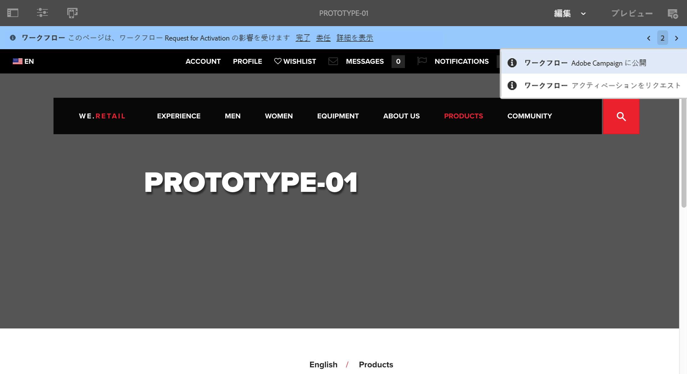

   >[!NOTE]
   >
   >ステータスバーは、例えば `workflow-users` グループのメンバーなど、ワークフロー特権のあるユーザーだけに表示されます。
   >
   >
   >現在のユーザーがワークフローの現在のステップに直接関与している場合、アクションが表示されます。

* 条件 **タイムライン** がリソースに対して開いている場合は、ワークフローステップが表示されます。 アラートバナーをクリックまたはタップすると、使用可能なアクションも表示されます。

   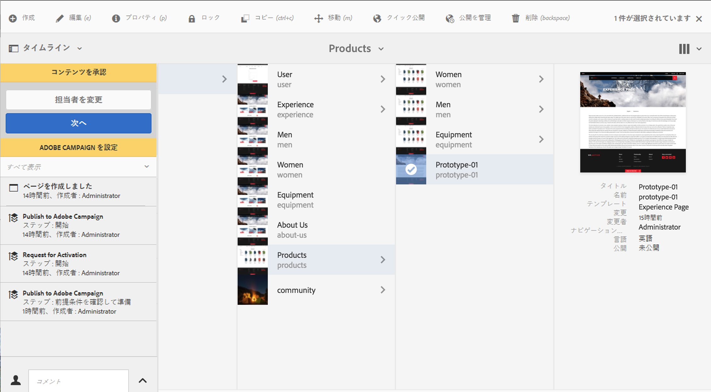

### 参加者ステップの完了 {#completing-a-participant-step}

項目を完了して、ワークフローが次のステップに進むようにすることができます。

このアクションでは、次の内容を指定できます。

* **次のステップ**:次にとるべきステップ提供されたリストから選択できます
* **コメント**:必要に応じて

参加者ステップは、次のいずれかから完了できます。

* [インボックス ](#completing-a-participant-step-inbox)
* [ページエディター](#completing-a-participant-step-page-editor)
* [タイムライン](#completing-a-participant-step-timeline)
* when [ワークフロー項目を開いて詳細を表示する](#opening-a-workflow-item-to-view-details-and-take-actions).

#### 参加者ステップの完了 - インボックス {#completing-a-participant-step-inbox}

作業項目を完了するには、次の手順を実行します。

1. を開きます。 **[AEM Inbox](/help/sites-authoring/inbox.md)**.
1. アクションを実行するワークフロー項目を選択します（サムネールをタップまたはクリック）。
1. ツールバーの「**完了**」を選択します。
1. 「**作業項目を完了**」ダイアログボックスが開きます。ドロップダウンセレクターで「**次のステップ**」を選択し、必要に応じて&#x200B;**コメント**&#x200B;を追加します。
1. 「**OK**」を使用してステップを完了します（または「**キャンセル**」を使用してアクションを中止します）。

#### 参加者ステップの完了 - ページエディター {#completing-a-participant-step-page-editor}

作業項目を完了するには、次の手順を実行します。

1. を開きます。 [編集用ページ](/help/sites-authoring/managing-pages.md#opening-a-page-for-editing).
1. 上部のステータスバーの「**完了**」を選択します。
1. 「**作業項目を完了**」ダイアログボックスが開きます。ドロップダウンセレクターで「**次のステップ**」を選択し、必要に応じて&#x200B;**コメント**&#x200B;を追加します。
1. 「**OK**」を使用してステップを完了します（または「**キャンセル**」を使用してアクションを中止します）。

#### 参加者ステップの完了 - タイムライン {#completing-a-participant-step-timeline}

タイムラインを使用してステップを完了または進めることもできます。

1. 必要なページを選択して&#x200B;**タイムライン**&#x200B;を開きます（または&#x200B;**タイムライン**&#x200B;を開いてからページを選択します）。

   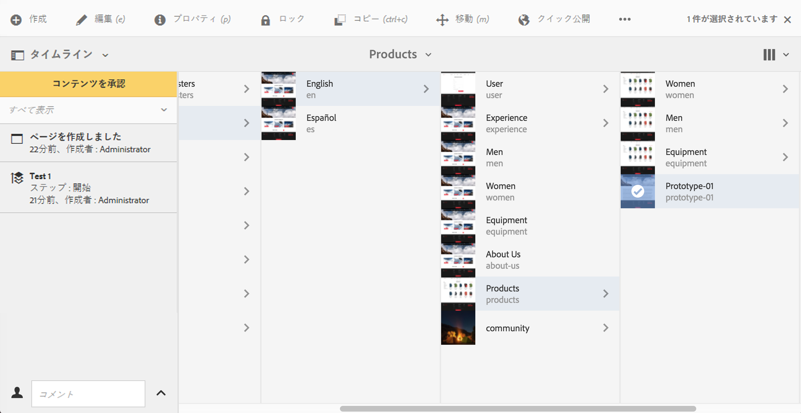

1. 使用可能なアクションを表示するには、アラートバナーをクリックまたはタップします。 選択 **進む**:

   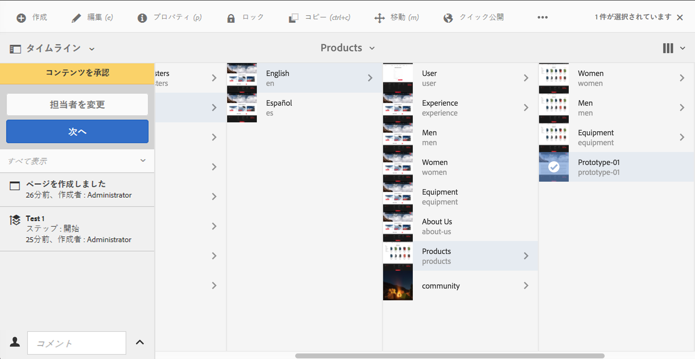

1. ワークフローによっては、次のステップを選択できます。

   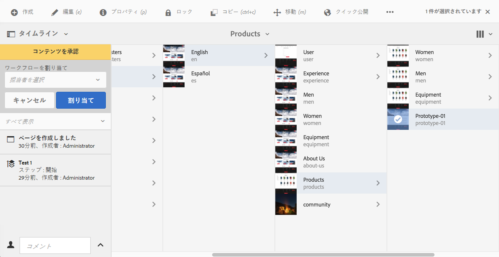

1. 「**次へ**」を選択して、アクションを確定します。

### 参加者ステップの委任 {#delegating-a-participant-step}

ステップが割り当てられているが、何らかの理由でアクションを実行できない場合は、そのステップを別のユーザーまたはグループに委任できます。

委任できるユーザーは、作業項目を割り当てられたユーザーによって異なります。

* 作業項目がグループに割り当てられた場合、グループメンバーを使用できます。
* 作業項目がグループに割り当てられ、ユーザーに委任された場合、グループメンバーおよびグループに委任できます。
* 作業項目が 1 人のユーザーに割り当てられた場合、作業項目を委任することはできません。

このアクションでは、次の内容を指定できます。

* **ユーザー**:委任先のユーザー提供されたリストから選択できます
* **コメント**:必要に応じて

参加者ステップは次のいずれかから委任できます。

* [インボックス ](#delegating-a-participant-step-inbox)
* [ページエディター](#delegating-a-participant-step-page-editor)
* [タイムライン](#delegating-a-participant-step-timeline)
* when [ワークフロー項目を開いて詳細を表示する](#opening-a-workflow-item-to-view-details-and-take-actions).

#### 参加者ステップの委任 - インボックス {#delegating-a-participant-step-inbox}

作業項目を委任するには、次の手順を実行します。

1. を開きます。 **[AEM Inbox](/help/sites-authoring/inbox.md)**.
1. アクションを実行するワークフロー項目を選択します（サムネールをタップまたはクリック）。
1. ツールバーの「**委任**」を選択します。
1. ダイアログが開きます。ドロップダウンセレクターから「**ユーザー**」（グループも可）を指定し、必要に応じて&#x200B;**コメント**&#x200B;を追加します。
1. 「**OK**」を使用してステップを完了します（または「**キャンセル**」を使用してアクションを中止します）。

#### 参加者ステップの委任 - ページエディター {#delegating-a-participant-step-page-editor}

作業項目を委任するには、次の手順を実行します。

1. を開きます。 [編集用ページ](/help/sites-authoring/managing-pages.md#opening-a-page-for-editing).
1. 上部のステータスバーの「**委任**」を選択します。
1. ダイアログが開きます。ドロップダウンセレクターから「**ユーザー**」（グループも可）を指定し、必要に応じて&#x200B;**コメント**&#x200B;を追加します。
1. 「**OK**」を使用してステップを完了します（または「**キャンセル**」を使用してアクションを中止します）。

#### 参加者ステップの委任 - タイムライン {#delegating-a-participant-step-timeline}

タイムラインを使用してステップを委任または割り当てることもできます。

1. 必要なページを選択して&#x200B;**タイムライン**&#x200B;を開きます（または&#x200B;**タイムライン**&#x200B;を開いてからページを選択します）。
1. 使用可能なアクションを表示するには、アラートバナーをクリックまたはタップします。 選択 **担当者の変更**:

   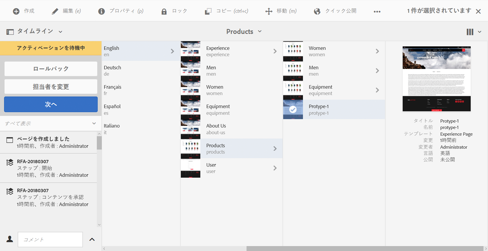

1. 新しい割り当て先を指定します。

   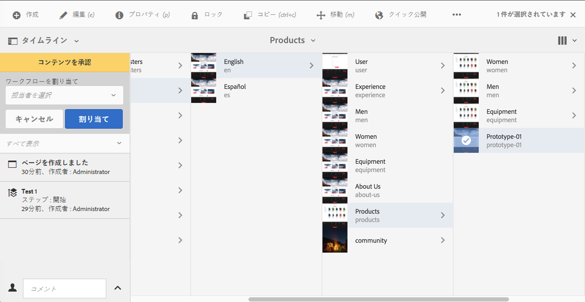

1. 「**割り当て**」を選択して、アクションを確定します。

### 参加者ステップでの前のステップの実行 {#performing-step-back-on-a-participant-step}

1 つまたは複数のステップを繰り返す必要がある場合は、前のステップに戻すことができます。 これにより、ワークフロー内で前に発生した再処理のステップを選択できます。 ワークフローは指定したステップに戻り、そこから進みます。

このアクションでは、次の内容を指定できます。

* **前のステップ**:戻すステップ提供されたリストから選択できます
* **コメント**:必要に応じて

参加者ステップで前のステップを次のいずれかから実行できます。

* [インボックス ](#performing-step-back-on-a-participant-step-inbox)
* [ページエディター](#performing-step-back-on-a-participant-step-page-editor)
* [タイムライン](#performing-step-back-on-a-participant-step-timeline)
* when [ワークフロー項目を開いて詳細を表示する](#opening-a-workflow-item-to-view-details-and-take-actions).

#### 参加者ステップでの前のステップの実行 - インボックス {#performing-step-back-on-a-participant-step-inbox}

次の手順を使用して、戻します。

1. を開きます。 **[AEM Inbox](/help/sites-authoring/inbox.md)**.
1. アクションを実行するワークフロー項目を選択します（サムネールをタップまたはクリック）。
1. 「**ステップバック**」を選択して、ダイアログを開きます。

1. 「**前のステップ**」を指定し、必要に応じて&#x200B;**コメント**&#x200B;を追加します。
1. 「**OK**」を使用してステップを完了します（または「**キャンセル**」を使用してアクションを中止します）。

#### 参加者ステップでの前のステップの実行 - ページエディター {#performing-step-back-on-a-participant-step-page-editor}

次の手順を使用して、戻します。

1. を開きます。 [編集用ページ](/help/sites-authoring/managing-pages.md#opening-a-page-for-editing).
1. 上部のステータスバーの「**前のステップ**」を選択します。
1. 「**前のステップ**」を指定し、必要に応じて&#x200B;**コメント**&#x200B;を追加します。
1. 「**OK**」を使用してステップを完了します（または「**キャンセル**」を使用してアクションを中止します）。

#### 参加者ステップでの前のステップの実行 - タイムライン {#performing-step-back-on-a-participant-step-timeline}

タイムラインを使用して前のステップにロール（ステップ）バックすることもできます。

1. 必要なページを選択して&#x200B;**タイムライン**&#x200B;を開きます（または&#x200B;**タイムライン**&#x200B;を開いてからページを選択します）。
1. 使用可能なアクションを表示するには、アラートバナーをクリックまたはタップします。 選択 **ロールバック**:

   

1. ワークフローの戻し先のステップを指定します。

   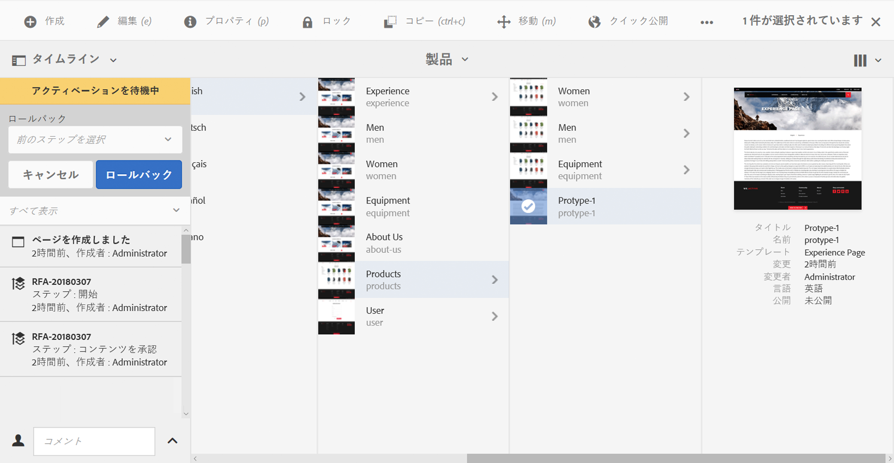

1. 「**ロールバック**」を選択して、アクションを確定します。

### ワークフロー項目を開いて詳細を表示（およびアクションを実行） {#opening-a-workflow-item-to-view-details-and-take-actions}

ワークフローの作業項目の詳細を表示し、適切なアクションを実行します。

ワークフローの詳細はタブに表示され、適切なアクションがツールバーで使用できます。

* 「**作業項目**」タブ

   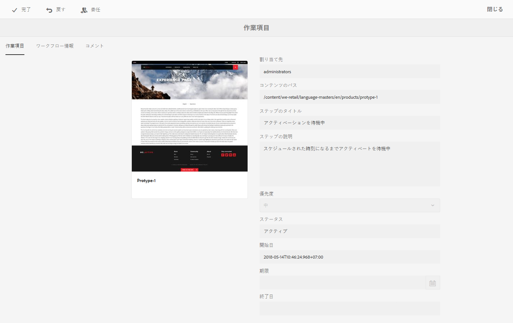

* **ワークフロー情報**

   

   [ワークフローステージ](/help/sites-developing/workflows.md#workflow-stages)がモデルに設定されている場合は、これらに従って進行状況を表示できます。

   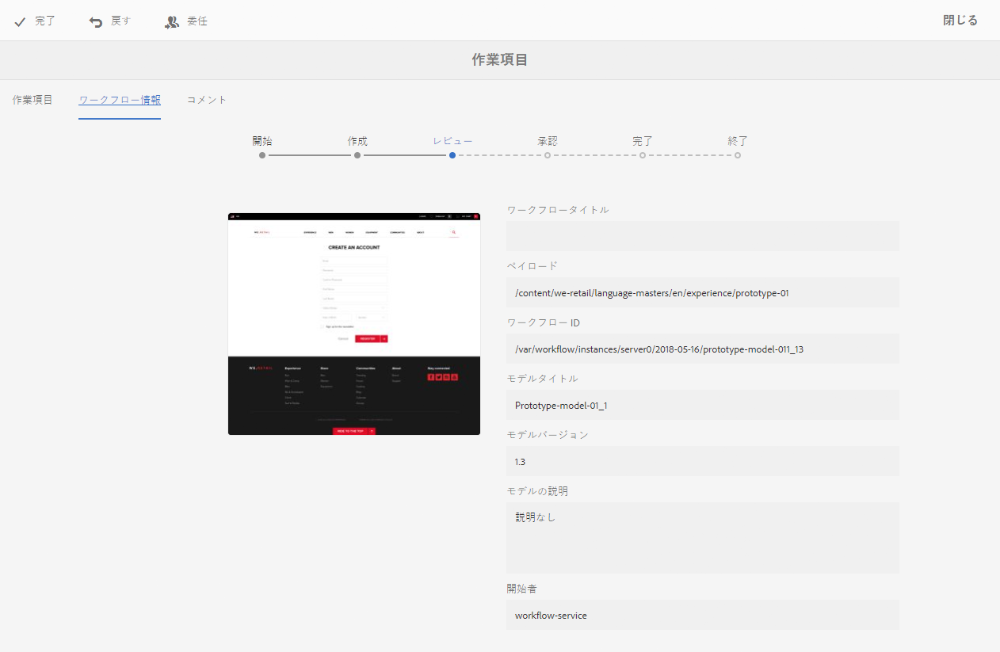

* **コメント**

   

以下のいずれかから作業項目の詳細を開くことができます。

* [インボックス ](#performing-step-back-on-a-participant-step-inbox)
* [ページエディター](#performing-step-back-on-a-participant-step-page-editor)

#### ワークフロー詳細を開く - インボックス {#opening-workflow-details-inbox}

ワークフロー項目を開いて詳細を表示するには：

1. を開きます。 **[AEM Inbox](/help/sites-authoring/inbox.md)**.
1. アクションを実行するワークフロー項目を選択します（サムネールをタップまたはクリック）。
1. 「**開く**」を選択して、「情報」タブを開きます。

1. 必要に応じて、適切なアクションを選択し、詳細を入力して「**OK**」（または「**キャンセル**」）で確認します。
1. 「**保存**」または「**キャンセル**」を使用して終了します。

#### ワークフロー詳細を開く - ページエディター {#opening-workflow-details-page-editor}

ワークフロー項目を開いて詳細を表示するには：

1. を開きます。 [編集用ページ](/help/sites-authoring/managing-pages.md#opening-a-page-for-editing).
1. ステータスバーの「**詳細の表示**」を選択して、「情報」タブを開きます。

1. 必要に応じて、適切なアクションを選択し、詳細を入力して「**OK**」（または「**キャンセル**」）で確認します。
1. 「**保存**」または「**キャンセル**」を使用して終了します。

### ワークフローペイロード（複数リソース）の表示  {#viewing-the-workflow-payload-multiple-resources}

ワークフローインスタンスに関連付けられたペイロードの詳細を表示できます。 最初にパッケージ内のリソースが表示されたら、ドリルダウンして個々のページを表示できます。

ワークフローインスタンスのペイロードとリソースを表示するには：

1. を開きます。 **[AEM Inbox](/help/sites-authoring/inbox.md)**.
1. アクションを実行するワークフロー項目を選択します（サムネールをタップまたはクリック）。
1. ツールバーの「**ペイロードを表示**」を選択して、ダイアログを開きます。

   ワークフローパッケージは単にリポジトリー内のパスへのポインターのコレクションなので、ここでエントリを追加／削除／変更して、ワークフローパッケージから参照されるものを調整できます。以下を使用： **リソース定義** 新しいエントリを追加するコンポーネント。

   

1. リンクは、個別のページを開くために使用できます。
