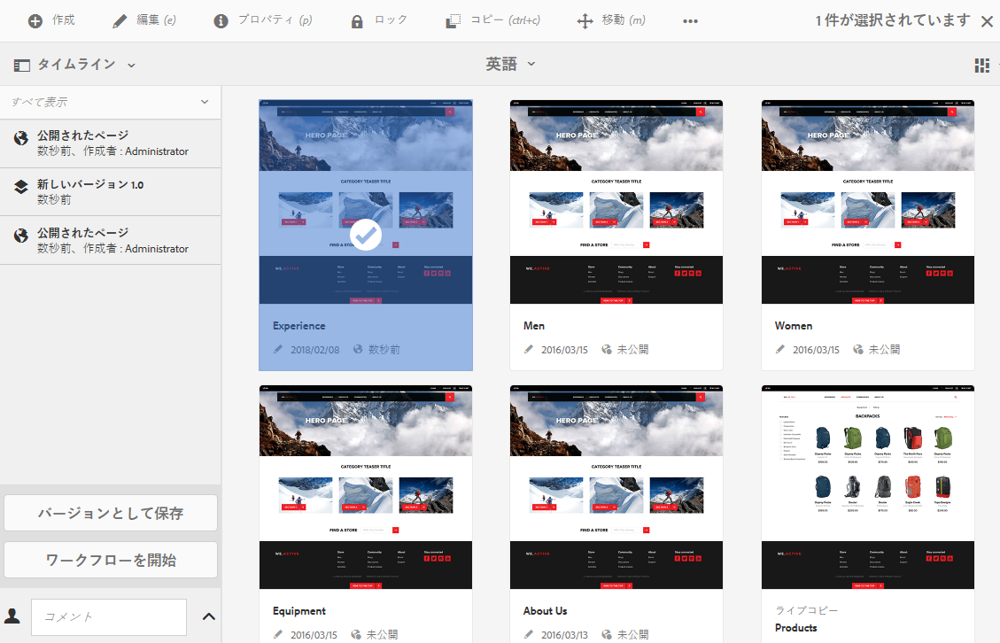
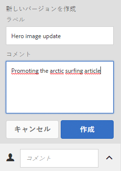
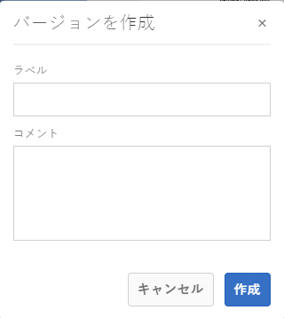
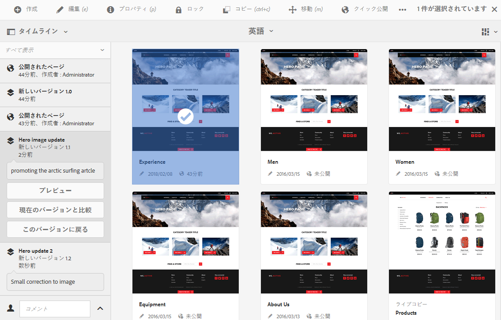
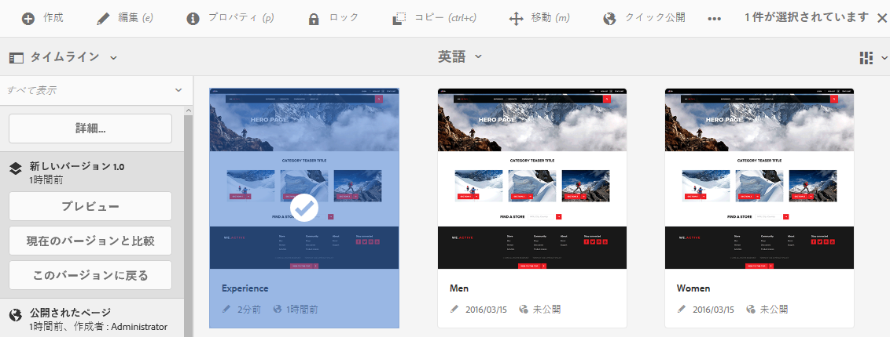
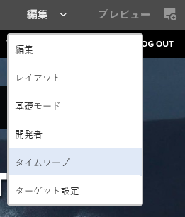
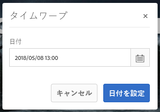
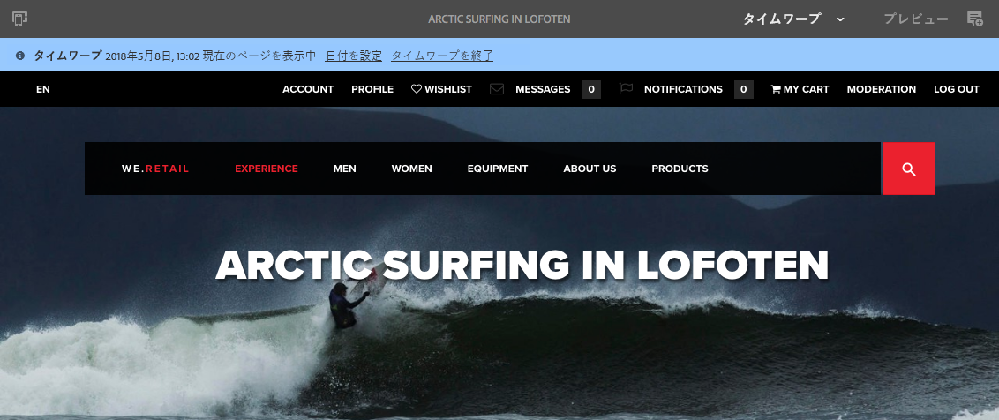

# ページバージョンの使用{#working-with-page-versions}

バージョン管理では、特定の時点でのページの「スナップショット」が作成されます。 バージョン管理を使用して、次の操作を実行できます。

* ページのバージョンを作成します。
* ページに対して行った変更を取り消すには、例えば、ページを以前のバージョンに戻します。
* ページの現在のバージョンと以前のバージョンを比較し、強調表示されたテキストと画像の違いを比較します。

## 新しいバージョンの作成 {#creating-a-new-version}

リソースのバージョンは、次の場所から作成できます。

* の [タイムラインパネル](#creating-a-new-version-timeline)
* の [作成](#creating-a-new-version-create-with-a-selected-resource) オプション（リソースが選択されている場合）

### 新しいバージョンの作成 - タイムライン {#creating-a-new-version-timeline}

1. バージョンを作成するページに移動して、そのページを表示します。
1. [選択モード](/help/sites-authoring/basic-handling.md#viewing-and-selecting-resources)でページを選択します。
1. を開きます。 **タイムライン** 列。
1. コメントフィールドの横にある矢印をクリックまたはタップして、オプションを表示します。

   

1. 選択 **バージョンとして保存**.
1. を入力します。 **ラベル** および **コメント** （必要に応じて）

   

1. 「**作成**」で新しいバージョンを確定します。

   タイムラインの情報が、新しいバージョンを示すように更新されます。

### 新しいバージョンの作成 - 選択したリソースで作成 {#creating-a-new-version-create-with-a-selected-resource}

1. バージョンを作成するページに移動して、そのページを表示します。
1. [選択モード](/help/sites-authoring/basic-handling.md#viewing-and-selecting-resources)でページを選択します。
1. を選択します。 **作成** 」オプションを使用します。
1. ダイアログが開きます。次の項目を入力できます。 **ラベル** および **コメント** 必要に応じて、次の手順に従います。

   

1. 「**作成**」で新しいバージョンを確定します。

   タイムラインが開き、新しいバージョンを示すように情報が更新されます。

## ページのバージョンを元に戻す {#reverting-to-a-page-version}

バージョンが作成された後は、必要な場合にそのバージョンに戻すことができます。

>[!NOTE]
>
>ページを復元すると、作成されたバージョンが新しいブランチの一部になります。
>
>この処理は次のようになります。
>
>* 任意のページのバージョンを作成します。
>* 最初のラベルおよびバージョンノードの名前は 1.0、1.1、1.2 などです。
>* 最初のバージョンを復元する。例： 1.0。
>* 新しいバージョンを再度作成します。
>* 生成されるラベルおよびノード名は、1.0.0、1.0.1、1.0.2 などになります。
>

以前のバージョンに戻すには：

1. 以前のバージョンに戻すページに移動して、そのページを表示します。
1. [選択モード](/help/sites-authoring/basic-handling.md#viewing-and-selecting-resources)でページを選択します。
1. 「**タイムライン**」列を開き、「**すべて表示**」または「**バージョン**」を選択します。選択したページのページバージョンが表示されます。
1. 元に戻すバージョンを選択します。 選択可能なオプションが表示されます。

   

1. 選択 **このバージョンに戻る**. 選択したバージョンが復元され、タイムラインの情報が更新されます。

## バージョンのプレビュー {#previewing-a-version}

特定のバージョンをプレビューできます。

1. 比較するページに移動して、そのページを表示します。
1. [選択モード](/help/sites-authoring/basic-handling.md#viewing-and-selecting-resources)でページを選択します。
1. 「**タイムライン**」列を開き、「**すべて表示**」または「**バージョン**」を選択します。
1. ページのバージョンが表示されます。 プレビューするバージョンを選択します。

   

1. **プレビュー**&#x200B;を選択します。ページが新しいタブに表示されます。

   >[!CAUTION]
   >
   >ページが移動されている場合は、移動前に行われたバージョンのプレビューを実行できなくなりました。
   >
   >プレビューで問題が発生した場合は、 [タイムライン](/help/sites-authoring/basic-handling.md#timeline) ページが移動されたかどうかを確認するために使用します。

## 特定のバージョンと現在のページとの比較 {#comparing-a-version-with-current-page}

以前のバージョンと現在のページを比較するには：

1. 比較するページに移動して、そのページを表示します。
1. [選択モード](/help/sites-authoring/basic-handling.md#viewing-and-selecting-resources)でページを選択します。
1. 「**タイムライン**」列を開き、「**すべて表示**」または「**バージョン**」を選択します。
1. ページのバージョンが表示されます。 比較するバージョンを選択します。

   

1. 選択 **現在と比較**. この [ページの差分](/help/sites-authoring/page-diff.md) が開き、違いが表示されます。

## タイムワープ {#timewarp}

タイムワープは、過去の特定の時間にページが&#x200B;*公開された*&#x200B;状態をシミュレートするために設計された機能です。

この目的は、選択した時点で公開済みの Web サイトを追跡できるようにすることです。 パブリッシュ環境の状態は、ページのバージョンを使用して判断されます。

次の手順を実行します。

* 選択した時刻にアクティブだったページのバージョンを検索します。
* つまり、タイムワープで選択した時点より前に作成またはアクティベートされたバージョンが表示されます&#x200B;*。*
* 削除されたページに移動する場合も、そのページの古いバージョンがリポジトリ内で引き続き使用できる限り、このページがレンダリングされます。
* 公開されたバージョンが見つからない場合、オーサー環境の現在のページの状態に戻ります（これは、閲覧を妨げるエラー（404）ページが表示されないようにするためです）。

### タイムワープの使用 {#using-timewarp}

タイムワープは [mode](/help/sites-authoring/author-environment-tools.md#page-modes) 」をクリックします。 他のモードと同じように切り替えて開始します。

1. タイムワープを開始するページのエディターを起動し、「 **タイムワープ** を選択します。

   

1. ダイアログで、目的の日時を設定して、「**日付を設定**」をクリックまたはタップします。時間を選択しない場合は、現在の時間がデフォルトになります。

   

1. 日付セットに基づいてページが表示されます。 タイムワープモードは、ウィンドウ上部の青いステータスバーで示されます。 ステータスバーのリンクを使用して、新しいターゲット日付を選択するか、タイムワープモードを終了します。

   

### タイムワープの制限事項

タイムワープでは、選択した時点のページを再現するために最大限の努力をします。ただし、AEM でのコンテンツの継続的なオーサリングは複雑な作業なので、これが常に可能とは限りません。タイムワープを使用する際は、以下の制限事項に留意してください。

* **タイムワープは、公開されたページに基づいて機能する** - タイムワープは対象のページが既に公開されている場合にのみ完全に機能します。まだ公開されていない場合は、オーサー環境の現在のページが表示されます。
* **タイムワープではページのバージョンを使用する** - リポジトリーから削除されたページに移動する場合、このページの古いバージョンがリポジトリー内でまだ有効であれば正しくレンダリングされます。
* **削除されたバージョンがタイムワープに影響を及ぼす** - バージョンがリポジトリーから削除された場合、タイムワープで正しい表示を行うことができません。
* **タイムワープは読み取り専用** - ページの古いバージョンを編集することはできません。古いバージョンは表示のみ可能です。古いバージョンを復元する場合は、復元を使用して手動で行う必要があります。
* **タイムワープはページのコンテンツにのみ基づく** - Web サイトのレンダリングに使用する要素（コード、CSS、アセット／画像など）を変更した場合、これらのアイテムはリポジトリー内でバージョン化されないので、元の表示と異なる表示になります。

>[!CAUTION]
>
>タイムワープは、作成者によるコンテンツの把握と作成を支援するツールとして設計されています。監査ログや法的な目的のためのものではありません。
