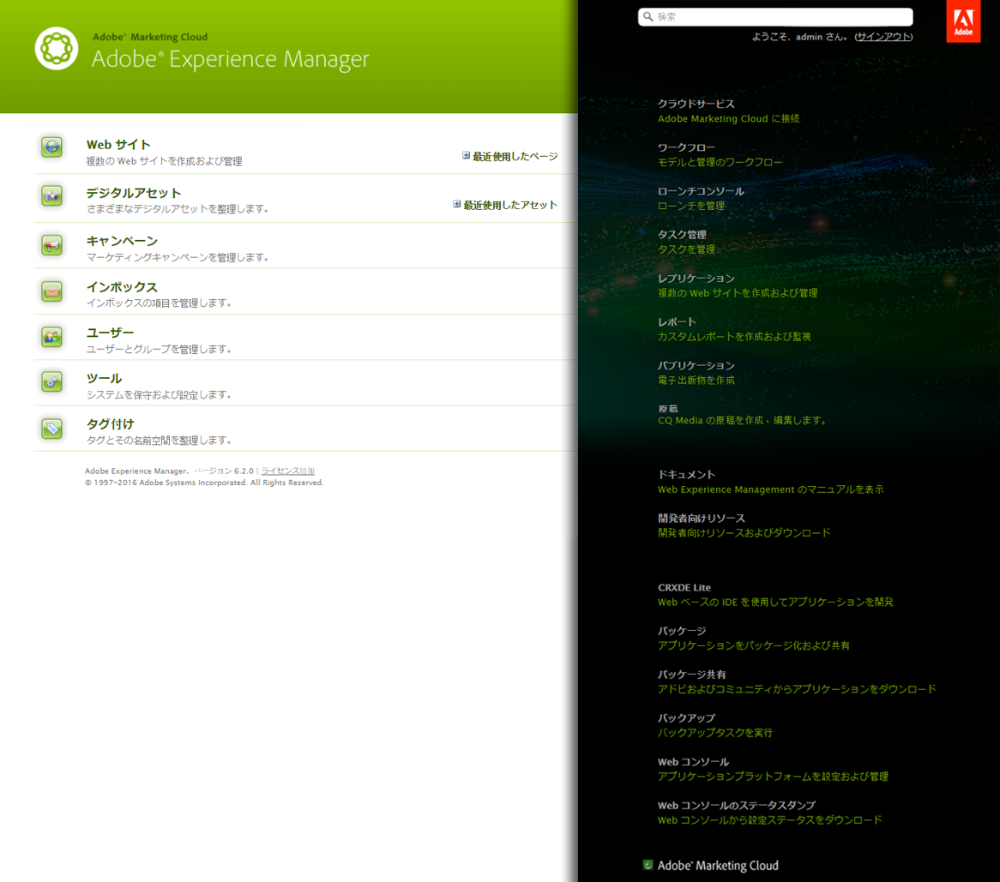
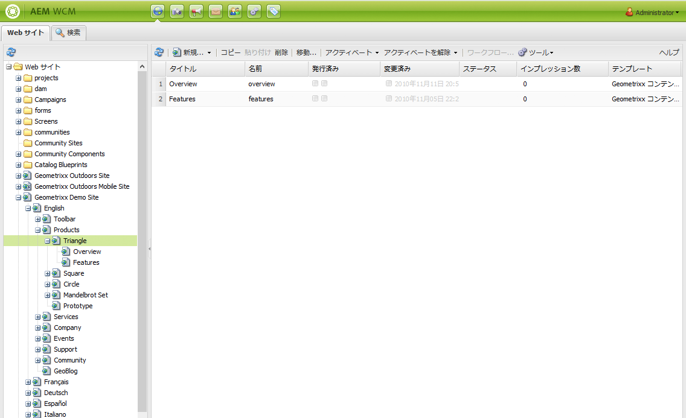
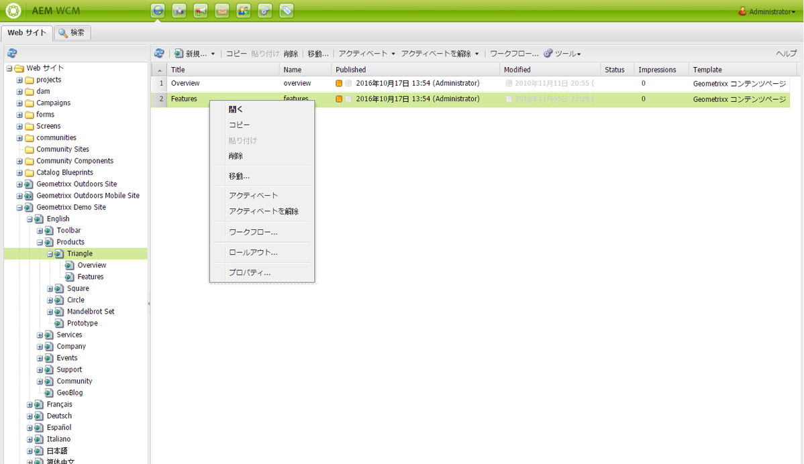

# 基本操作 {#basic-handling}

>[!NOTE]
>
>* このページでは、AEMオーサー環境を使用する際の基本操作の概要を説明します。 これは **Sites** コンソールを基礎として使用します。
>
>* 一部の機能は、すべてのコンソールでは使用できません。また、一部のコンソールでは追加機能を使用できます。 個々のコンソールとその関連機能に関する具体的な情報については、他のページで詳しく説明します。
>* AEM 全体で（特に、[コンソールを使用する](/help/sites-classic-ui-authoring/author-env-keyboard-shortcuts.md)場合と[ページを編集する](/help/sites-classic-ui-authoring/classic-page-author-keyboard-shortcuts.md)場合に）、キーボードショートカットを利用できます。
>

## ようこそ画面 {#the-welcome-screen}

クラシック UI には、クリック、ダブルクリック、 [コンテキストメニュー](#context-menus).

ログイン時にようこそ画面が表示され、コンソールおよびサービスへのリンクの一覧が表示されます。

## コンソール {#consoles}

主なコンソールは次のとおりです。

<table> 
 <tbody> 
  <tr> 
   <td><strong>コンソール</strong></td> 
   <td><strong>目的</strong></td> 
  </tr> 
  <tr> 
   <td><strong>ようこそ</strong></td> 
   <td>概要を示し、AEM の主要機能に（リンク経由で）直接アクセスできます。</td> 
  </tr> 
  <tr> 
   <td><strong>デジタルアセット</strong>  </td> 
   <td>これらのコンソールでは、画像、ビデオ、ドキュメント、オーディオファイルなどのデジタルアセットを読み込んで、それらの<a href="/help/sites-classic-ui-authoring/classicui-assets.md">デジタルアセットを管理</a>できます。これにより、これらのアセットは、同じ AEM インスタンス上で実行されているすべての web サイトで使用できます。 </td> 
  </tr> 
  <tr> 
   <td><strong>ローンチ</strong></td> 
   <td>このコンソールでは、<a href="/help/sites-classic-ui-authoring/classic-launches.md">ローンチ</a>を管理できます。ローンチを使用すると、アクティベートされた 1 つまたは複数の web ページの今後のリリース用にコンテンツを開発できます。  <i>注：タッチ操作対応 UI では、多くの同じ機能が参照レールと共にサイトコンソールで使用できます。</i> <i>必要に応じて、このコンソールはツールコンソール（操作／ローンチの順に選択）から使用できます。</i></td> 
  </tr> 
  <tr> 
   <td><strong>インボックス  </strong></td> 
   <td>多くの場合、多数のユーザーがワークフローのサブタスクに関与し、各ユーザーは作業を次のユーザーに引き渡す前に手順を完了する必要があります。 インボックスを使用すると、このようなタスクに関連する通知を表示できます。 詳しくは、<a href="/help/sites-administering/workflows.md">ワークフローの操作</a>を参照してください。  </td> 
  </tr> 
  <tr> 
   <td><strong>タグ付け</strong></td> 
   <td>タグ付けコンソールでは、タグを管理できます。 タグは、コンテンツを分類し、注釈を付けるのに使用できる短い名前またはフレーズで、コンテンツを見つけて整理しやすくします。 詳しくは、 <a href="/help/sites-classic-ui-authoring/classic-feature-tags.md">タグの使用と管理</a>.</td> 
  </tr> 
  <tr> 
   <td><strong>ツール</strong></td> 
   <td><a href="/help/sites-administering/tools-consoles.md">ツールコンソール</a>を使用して、web サイト、デジタルアセット、およびコンテンツリポジトリのその他の要素の管理に役立つ、数多くの専用ツールおよびコンソールにアクセスできます。</td> 
  </tr> 
  <tr> 
   <td><strong>ユーザー</strong></td> 
   <td>これらのコンソールを使用して、ユーザーおよびグループのアクセス権を管理できます。 詳しくは、 <a href="/help/sites-administering/security.md">ユーザー管理とセキュリティ</a>.  </td> 
  </tr> 
  <tr> 
   <td><strong>web サイト</strong></td> 
   <td>サイト/Web サイトコンソールでは、次の操作を実行できます <a href="/help/sites-classic-ui-authoring/classic-page-author.md">Web サイトの作成、表示、管理</a> をAEMインスタンスで実行している。 これらのコンソールを通じて、Web サイトページの作成、コピー、移動および削除、ワークフローの開始、ページのアクティベート（公開）をおこなうことができます。 ページを開いて編集することもできます。  </td> 
  </tr> 
  <tr> 
   <td><strong>ワークフロー</strong></td> 
   <td>ワークフローとは、一部のタスクを完了するプロセスを説明する、定義された一連の手順です。 多くの場合、多くの人がタスクに関与し、各人は作業を次の人に引き渡す前に手順を完了する必要があります。 ワークフローコンソールを使用すると、ワークフローモデルを作成し、実行中のワークフローインスタンスを管理できます。 詳しくは、<a href="/help/sites-administering/workflows.md">ワークフローの操作</a>を参照してください。  </td> 
  </tr> 
 </tbody> 
</table>

この **Web サイト** コンソールには、ページを移動および管理するための 2 つのパネルが用意されています。

* 左側のウィンドウ

   web サイトおよび web サイト内のページがツリー構造で表示されます。

   また、プロジェクト、ブループリント、アセットなど、AEM の他の側面に関する情報も表示されます。

* 右側のウィンドウ

   ページ（左側のウィンドウで選択した場所にあるもの）が表示され、アクションを実行するために使用できます。

ここから、次の操作が可能です。 [ページの管理](/help/sites-authoring/managing-pages.md) ツールバー、コンテキストメニューを使用するか、ページを開いて追加のアクションを実行します。

>[!NOTE]
>
>基本操作は、すべてのコンソールで同じです。 ここでは、 **Web サイト** コンソール。オーサリング時に使用されるプライマリコンソールです。

## ヘルプへのアクセス {#accessing-help}

様々なコンソール（Web サイトなど）でも、 **ヘルプ** ボタンが使用可能な場合は、パッケージ共有またはドキュメントサイトが開きます。

ページの編集時に、 [サイドキックにはヘルプにアクセスするためのボタンもあります](/help/sites-classic-ui-authoring/classic-page-author-env-tools.md#accessing-help).

## Web サイトコンソールを使用した移動 {#navigating-with-the-websites-console}

この **Web サイト** コンソールは、コンテンツのページをツリー構造（左側のウィンドウ）で表示します。 操作しやすくするために、ツリー構造のセクションは、必要に応じて展開 (+) または折りたたむ (-) できます。

* （左側のウィンドウで）ページ名を 1 回クリックすると、次のようになります。

   * 右側のウィンドウに子ページをリストします
   * また、左側のペインで構造を展開します。

      パフォーマンス上の理由から、このアクションは子ノードの数に依存します。 標準インストールでは、この展開方式は子ノードが `30` 個以下の場合に機能します。

* ページ名（左側のウィンドウ）をダブルクリックした場合もツリーが展開されますが、同時にページが開くので、ツリーの展開がはっきりとは見えません。

>[!NOTE]
>
>次のように、アプリケーション特有の siteadmin ウィジェットの設定で、使用するコンソールごとにデフォルト値（`30`）を変更できます。
>
>siteadmin ノードで、以下の手順を実行します。
>
>プロパティの値を設定します。\
>`treeAutoExpandMax`\
>次の場所にあります。\
>`/apps/wcm/core/content/siteadmin`
>
>または、テーマ内でグローバルに次の操作を実行します。\
>次の値を設定します。\
>`TREE_AUTOEXPAND_MAX`\
>次の場所にあります。\
>`/apps/cq/ui/widgets/themes/default/widgets/wcm/SiteAdmin.js`
>
>詳しくは、 [CQ Widget API の SiteAdmin](https://helpx.adobe.com/experience-manager/6-4/sites/developing/using/reference-materials/widgets-api/index.html?class=CQ.wcm.SiteAdmin) を参照してください。

## Web サイトコンソールのページ情報 {#page-information-on-the-websites-console}

右側のウィンドウ **Web サイト** コンソールには、ページに関する情報がリスト表示に表示されます。

利用可能なフィールドは次のとおりです。これらのフィールドの一部がデフォルトとして表示されます。

<table> 
 <tbody> 
  <tr> 
   <td><strong>列</strong></td> 
   <td><strong>説明</strong></td> 
  </tr> 
  <tr> 
   <td>サムネール</td> 
   <td>ページのサムネールを表示します。</td> 
  </tr> 
  <tr> 
   <td>タイトル</td> 
   <td>ページに表示されるタイトル</td> 
  </tr> 
  <tr> 
   <td>名前</td> 
   <td>ページを参照するAEM名</td> 
  </tr> 
  <tr> 
   <td>公開済み</td> 
   <td>ページが公開されたかどうかを示し、公開の日時を示します。</td> 
  </tr> 
  <tr> 
   <td>変更</td> 
   <td>ページが変更されたかどうかを示し、変更日時を示します。 変更を保存するには、ページをアクティベートする必要があります。</td> 
  </tr> 
  <tr> 
   <td>Scene7 Publish</td> 
   <td>ページがScene7に公開されたかどうかを示します。  </td> 
  </tr> 
  <tr> 
   <td>ステータス</td> 
   <td>ページの現在のステータスを示します。例えば、ページがワークフローやライブコピーの一部であるか、ページが現在ロックされているかなどです。</td> 
  </tr> 
  <tr> 
   <td>インプレッション</td> 
   <td>ページ上のアクティビティをヒット数で表示します。</td> 
  </tr> 
  <tr> 
   <td>テンプレート</td> 
   <td>ページの基になっているテンプレートを示します。</td> 
  </tr> 
  <tr> 
   <td>ワークフロー内</td> 
   <td>ページがいつワークフロー内にあるかを示します。</td> 
  </tr> 
  <tr> 
   <td>ロック元</td> 
   <td>ページがロックされた日時と、ページをロックしたユーザーアカウントを表示します。</td> 
  </tr> 
  <tr> 
   <td>ライブコピー</td> 
   <td>ページがライブコピーの一部である場合に示します。</td> 
  </tr> 
 </tbody> 
</table>

>[!NOTE]
>
>表示される列を選択するには、列タイトルの上にマウスを置きます。 ドロップダウンメニューが表示されます。ここから、 **列** オプション。

ページの隣の色 **公開済み** および **変更済み** 列は、公開ステータスを示します。

| **列** | **カラー** | **説明** |
|---|---|---|
| 公開済み | グリーン | 公開に成功しました。 コンテンツが公開されました。 |
| 公開済み | イエロー | 公開は保留中です。 公開の確認は、システムでまだ受け取っていません。 |
| 公開済み | レッド | パブリケーションに失敗しました. パブリッシュインスタンスとの接続はありません。 また、コンテンツが非アクティブ化されたことを意味する場合もあります。 |
| 公開済み | *空白* | このページは公開されたことがありません。 |
| 変更 | ブルー | 前回の公開以降にページが変更されています。 |
| 変更 | *空白* | このページは変更されたことがないか、最後の公開以降に変更されていません。 |

## コンテキストメニュー {#context-menus}

クラシック UI は、クリックやダブルクリックなど、アクションの移動や開始のための既知のメカニズムを使用しています。 現在の状況に応じて、様々なコンテキストメニュー（通常はマウスの右ボタンで開く）も使用できます。

