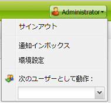
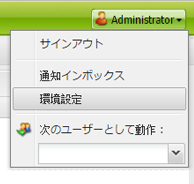
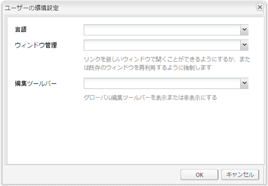

# アカウント環境の設定 {#configuring-your-account-environment}

AEM では、アカウントおよびオーサー環境の特定項目を設定できます。

[アカウント設定](#account-settings)と[ユーザーの環境設定](#user-preferences)を使用して、次のオプションと環境設定を定義できます。

* **ツールバーの編集**
グローバル編集ツールバーが必要かどうかを選択します。このツールバーはブラウザーウィンドウの上部に表示され、 
そのページの段落コンポーネントで使用するための「**コピー**」、「**切り取り**」、「**貼り付け**」、「**削除**」の各ボタンを提供します。

   * 必要な場合に表示（デフォルト）
   * 常に表示する
   * 非表示の状態を保持

* **次のユーザーとして実行**
[次のユーザーとして実行](/help/sites-administering/security.md#impersonating-another-user)機能では、ユーザーは別のユーザーに成り代わって作業を行うことができます。

* **言語**
オーサリング環境の UI に使用する言語です。使用可能なリストから必要な言語を選択します。

* **ウィンドウ管理**
次のいずれかを選択します。

   * 複数ウィンドウ（デフォルト）:新しいウィンドウでページが開きます。
   * 単一ウィンドウ：現在のウィンドウでページが開きます。

## アカウント設定 {#account-settings}

ユーザーアイコンからは、次の様々なオプションにアクセスできます。

* サインアウト
* [次のユーザーとして実行](/help/sites-administering/security.md#impersonating-another-user)
* [ユーザーの環境設定](#user-preferences)
* [通知インボックス](/help/sites-classic-ui-authoring/author-env-inbox.md)

## ユーザーの環境設定 {#user-preferences}

各ユーザーは、自分の特定のプロパティを設定できます。これは、コンソールの右上隅にある&#x200B;**環境設定**&#x200B;ダイアログでおこなうことができます。

このダイアログには次のオプションがあります。

