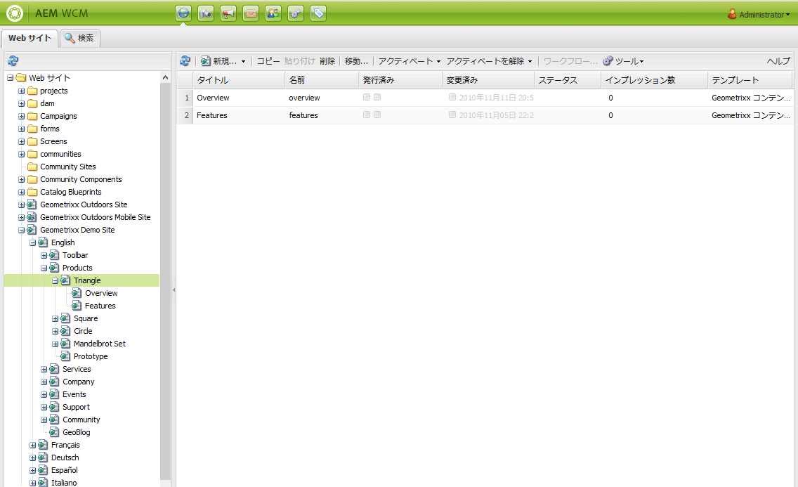
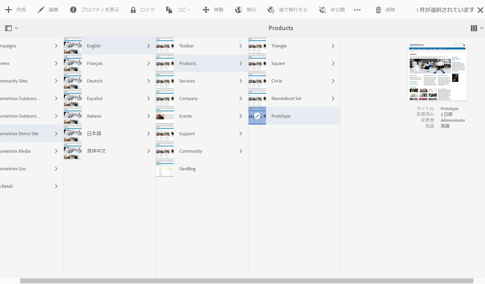
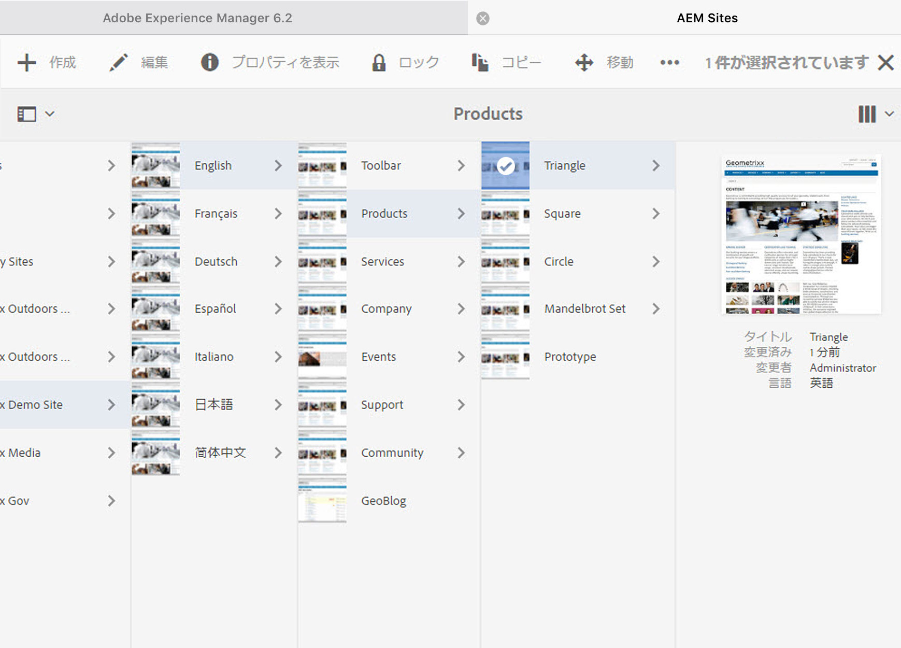

# オーサー環境の操作 {#working-with-the-author-environment}

>[!CAUTION]
>
>AEM 6.4 の拡張サポートは終了し、このドキュメントは更新されなくなりました。 詳細は、 [技術サポート期間](https://helpx.adobe.com/jp/support/programs/eol-matrix.html). サポートされているバージョンを見つける [ここ](https://experienceleague.adobe.com/docs/?lang=ja).

>[!NOTE]
>
>以下のドキュメントでは、クラシック UI に焦点を当てています。最新のタッチ操作対応 UI でのオーサリングについて詳しくは、[標準オーサリングのドキュメント](/help/assets/assets.md)を参照してください。

オーサー環境では、以下に関連するタスクを実行できます。

* [オーサリング](/help/sites-authoring/author.md)（[ページオーサリング](/help/sites-authoring/qg-page-authoring.md)と[アセットの管理](/help/assets/assets.md)を含みます）

* web サイトでのコンテンツの生成および管理の際に必要になる[管理](/help/sites-administering/administer-best-practices.md)タスク

これらの操作のために次の 2 つのグラフィカルユーザーインターフェイスが提供されており、最新のすべてのブラウザーからアクセスできます。

1. クラシック UI

   * この UI は、長年にわたってAEMで使用されてきました。
   * 緑色が多い。
   * これはデスクトップデバイスで使用するように設計されています。
   * メンテナンスは終了しました。
   * 次のドキュメントでは、このクラシック UI に焦点を当てています。 最新のタッチベース UI でのオーサリングについて詳しくは、 [標準オーサリングドキュメント](/help/sites-authoring/author.md).
   

1. タッチ操作対応 UI

   * これは、最新の標準AEM UI です。
   * 主にグレーで、クリーンでフラットなインターフェースを備えています。
   * タッチデバイスとデスクトップデバイスの両方で使用できるように設計されています（タッチ操作向けに最適化）。 ルックアンドフィールはすべてのデバイスで同じですが、[リソースの表示と選択](/help/sites-authoring/basic-handling.md)の操作がやや異なります（タップとクリックの違い）。
   * タッチベースの UI を使用したオーサリング方法について詳しくは、[標準オーサリングのドキュメント](/help/sites-authoring/author.md)を参照してください。以下のドキュメントでは、クラシック UI に焦点を当てています。

   * デスクトップ：
   

   * タブレットデバイス（または幅 1024 ピクセル未満のデスクトップ）。
   
