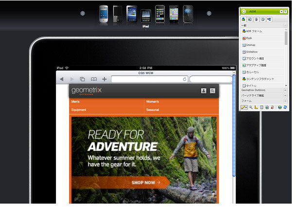

# モバイルデバイス用のページのオーサリング {#authoring-a-page-for-mobile-devices}

>[!CAUTION]
>
>AEM 6.4 の拡張サポートは終了し、このドキュメントは更新されなくなりました。 詳細は、 [技術サポート期間](https://helpx.adobe.com/jp/support/programs/eol-matrix.html). サポートされているバージョンを見つける [ここ](https://experienceleague.adobe.com/docs/?lang=ja).

モバイルページをオーサリングする場合、ページはモバイルデバイスをエミュレートする方法で表示されます。 ページの作成時に、複数のエミュレーターを切り替えて、ページにアクセスする際にエンドユーザーに表示される内容を確認できます。

デバイスは、ページをレンダリングするデバイスの機能に応じて、カテゴリ機能、スマート、タッチにグループ化されます。 エンドユーザーがモバイルページにアクセスすると、AEMはデバイスを検出し、そのデバイスグループに対応する表現を送信します。

>[!NOTE]
>
>既存の標準サイトに基づいたモバイルサイトを作成するには、標準サイトのライブコピーを作成します。（[様々なチャネル用のライブコピーを作成する](/help/sites-administering/msm-livecopy.md)を参照）。
>
>AEM 開発者は、新しいデバイスグループを作成できます（[デバイスグループフィルターの作成](/help/sites-developing/groupfilters.md)を参照してください）。

次の手順を使用して、モバイルページをオーサリングします。

1. ブラウザーで、 **Siteadmin** コンソール。
1. **Web サイト**／**Geometrixx モバイルデモサイト**／**日本語**&#x200B;の下の&#x200B;**製品**&#x200B;ページを開きます。

1. 別のエミュレーターに切り替えます。 これをおこなうには、次のいずれかを実行します。

   * ページ上部にあるデバイスアイコンをクリックします。
   * 次をクリック： **編集** ボタン **サイドキック** をクリックし、ドロップダウンメニューでデバイスを選択します。

1. 次をドラッグ&amp;ドロップ： **テキストと画像** コンポーネントをサイドキックの「モバイル」タブからページに移動します。
1. コンポーネントを編集し、テキストを追加します。 「**OK**」をクリックして、変更を保存します。

ページは次のようになります。

>[!NOTE]
>
>オーサーインスタンスのページがモバイルデバイスから要求されると、エミュレーターは無効になります。その後、タッチ操作向け UI を使用してオーサリングを行うことができます。
