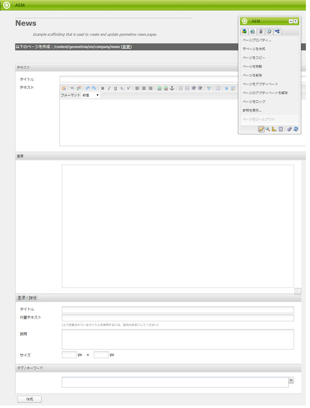
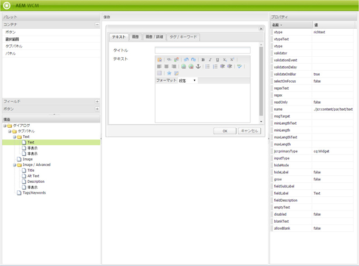
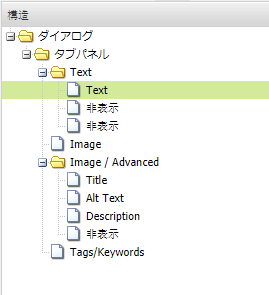
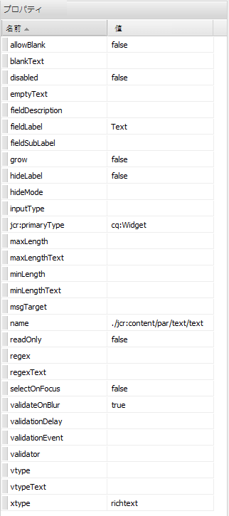
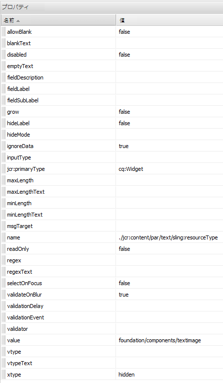
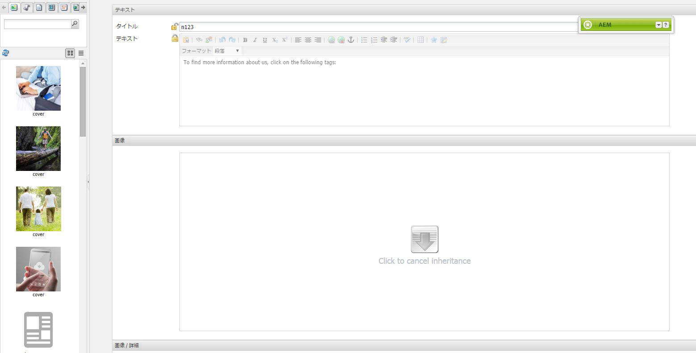
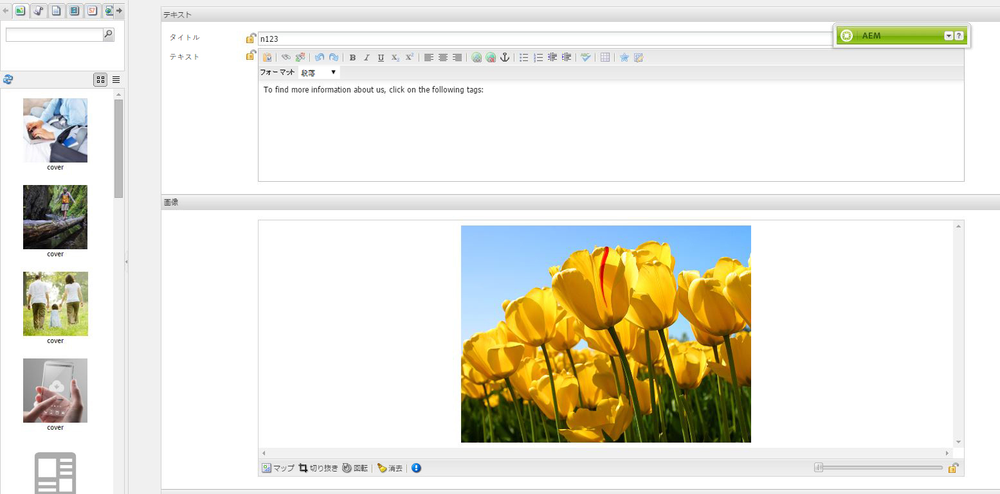

# 基礎モード{#scaffolding}

同じ構造を共有し、コンテンツが異なるページを大量に作成する必要が生じる場合があります。 標準のAEMインターフェイスでは、各ページを作成し、適切なコンポーネントをページ上にドラッグして、それぞれに個別に入力する必要があります。

基礎モードを使用すると、ページに必要な構造を反映したフィールドを持つフォーム（スキャフォールド）を作成し、このフォームを使用して、この構造に基づくページを簡単に作成できます。

>[!NOTE]
>
>基礎モード（クラシック UI）では、[MSM の継承が考慮](#scaffolding-with-msm-inheritance)されます。

## 基礎モードの機能 {#how-scaffolding-works}

基礎モードは、サイト管理の「**ツール**」コンソールタブに格納されています。

* を開きます。 **ツール** コンソールをクリックし、 **デフォルトのページ基礎モード**.

* この下で、 **geometrixx**.
* 「**geometrixx**」で、「**ニュース**」という名前の基礎モードページを探し&#x200B;*、*&#x200B;ダブルクリックしてこのページを開きます。

基礎モードは、作成するページを構成するコンテンツの各部品用のフィールドを持つフォームと、基礎モードページの「**ページプロパティ**」で設定できる 4 つの重要なパラメーターで構成されます。

基礎モードページのプロパティは次のとおりです。

* **タイトルテキスト**:これは、この基礎モードページ自体の名前です。 この例では、「News」と呼ばれます。
* **説明**:これは、基礎モードページのタイトルの下に表示されます。
* **ターゲットテンプレート**:これは、この基礎モードが新しいページを作成する際に使用するテンプレートです。 この例では、*Geometrixx* コンテンツページテンプレートが使用されます。

* **ターゲットパス**:これは、この基礎モードが新しいページを作成する親ページのパスです。 この例では、パスは */content/geometrixx/en/news* です。

基礎モードの本文はフォームに入力します。ユーザーが基礎モードを使用してページを作成する場合、ユーザーは、フォームに入力して、下部にある「*作成*」をクリックします。前述の&#x200B;**ニュース**&#x200B;の例では、フォームに以下のフィールドがあります。

* **タイトル**:作成するページの名前です。 このフィールドは、すべての基礎モードに常に表示されます。
* **テキスト**:このフィールドは、生成されるページのテキストコンポーネントに対応します。
* **Image**：このフィールドは、生成されるページの画像コンポーネントに対応します。
* **画像/詳細**: **タイトル**:画像のタイトル。

* **画像/詳細**: **代替テキスト**:画像の代替テキスト。

* **画像／詳細**：**説明**：画像の説明です。

* **画像/詳細**: **サイズ**:画像のサイズ。

* **タグ/キーワード**:このページに割り当てるメタデータ。 このフィールドは、すべての基礎モードに常に表示されます。

## 基礎モードの作成 {#creating-a-scaffold}

新しい基礎モードを作成するには、**ツール**&#x200B;コンソールの「**デフォルトのページの基礎モード**」に移動して、新しいページを作成します。使用できるテンプレートの種類は、*基礎モードテンプレート*&#x200B;だけです。

*新しいページの「**ページプロパティ**」に移動し、前述の説明に従って、「*&#x200B;タイトルテキスト&#x200B;*」、「*&#x200B;説明&#x200B;*」、「*&#x200B;ターゲットテンプレート&#x200B;*」および「*&#x200B;ターゲットパス&#x200B;*」を設定します。*

*次に、この基礎モードで作成するページの構造を定義する必要があります。 定義を行うには、基礎モードページで「デザインモード」に切り替えます。リンクが表示され、**ダイアログエディター**&#x200B;で基礎モードを編集できます。

ダイアログエディターを使用して、この基礎モードを使用して新しいページを作成するたびに作成されるプロパティを指定します。

基礎モードのダイアログ定義は、コンポーネントのダイアログ定義と同様に機能します ( [コンポーネント](/help/sites-developing/components.md)) をクリックします。 ただし、次のような重要な違いがあります。

* コンポーネントダイアログ定義は、（ダイアログエディターの中央のウィンドウに表示されるように）通常のダイアログボックスとしてレンダリングされ、基礎モードダイアログ定義は、ダイアログエディターで通常のダイアログボックスとして表示されます ( **ニュース** 基礎モードを使用 )。
* コンポーネントダイアログには、1 つの特定のコンポーネントのコンテンツを定義するために必要な値用のフィールドのみが表示されます。 基礎モードダイアログでは、作成するページの各段落のすべてのプロパティに対してフィールドを指定する必要があります。
* コンポーネントダイアログの場合、特定のコンテンツのレンダリングに使用されるコンポーネントは暗黙的に指定されるので、この段落の `sling:resourceType` プロパティは段落の作成時に自動的に指定されます。基礎モードを使用する場合、特定の段落に対してコンテンツと割り当てられたコンポーネントの両方を定義するすべての情報は、ダイアログ自体で提供される必要があります。 基礎モードダイアログでは、非表示フィールドを使用してこの内容を指定し、ページの作成時にこの内容が送信されるようにする必要があります&#x200B;*。*

例を見てみましょう **ニュース** ダイアログエディターの基礎モードダイアログを使用すると、この仕組みを説明できます。 基礎モードページでデザインモードに切り替え、ダイアログエディターリンクをクリックします。

ダイアログフィールドで、以下のように&#x200B;**ダイアログ／タブパネル／テキスト／テキスト**&#x200B;をクリックします。

このフィールドのプロパティリストが、以下のようにダイアログエディターの右側に表示されます。

このフィールドの name プロパティに注意してください。 値が

。/jcr:content/par/text/text

これは、基礎モードを使用してページを作成する際に、このフィールドのコンテンツが書き込まれるプロパティの名前です。 プロパティは、作成するページを表すノードからの相対パスとして指定します。 これは、ノード text の下にプロパティ text を指定します。ノード text は、ノード par の下にあります。これは、ページノードの下の jcr:content ノードの子です。

これにより、このフィールドに入力されるテキストのコンテンツストレージの場所が定義されます。 ただし、このコンテンツに対して、さらに 2 つの特性を指定する必要があります。

* ここに格納された文字列は「*リッチテキスト*」として解釈される必要があるということ、および
* このコンテンツを結果ページにレンダリングするために使用するコンポーネント。

通常のコンポーネントダイアログでは、ダイアログが既に特定のコンポーネントにバインドされていることが暗黙的に示されるので、この情報を指定する必要はありません。

これら 2 つの情報を指定するには、非表示フィールドを使用します。 以下のように、**ダイアログ／タブパネル／テキスト／非表示**&#x200B;をクリックして、最初の非表示フィールドを選択します。

この非表示フィールドのプロパティを以下に示します。

この非表示フィールドの name プロパティには以下の値が指定されています。

`./jcr:content/par/text/textIsRich`

これは、 `./jcr:content/par/text/text.`

テキストはリッチテキストとして解釈する必要があるので、このフィールドの `value` プロパティを `true` に指定します。

>[!CAUTION]
>
>ダイアログエディターを使用すると、ユーザーがダイアログ定義の&#x200B;*既存の*&#x200B;プロパティの値を変更できます。新しいプロパティを追加するには、 [CRXDE Lite](/help/sites-developing/developing-with-crxde-lite.md). 例えば、新しい非表示フィールドがダイアログエディターを使用してダイアログ定義に追加された場合、 *値* プロパティ（例：「value」という名前のプロパティ） 問題の非表示フィールドにデフォルトが必要な場合 *値* プロパティを設定する場合は、いずれかの CRX ツールを使用して、このプロパティを手動で追加する必要があります。 この値は、ダイアログエディター自体と共に追加することはできません。 ただし、プロパティが存在する場合は、その値をダイアログエディターで編集できます。

2 つ目の非表示フィールドは、次のようにクリックすると表示されます。

この非表示フィールドのプロパティを以下に示します。

この非表示フィールドの name プロパティには以下の値が指定されています。

`./jcr:content/par/text/sling:resourceType`

また、このプロパティには以下の固定値が指定されています。

`foundation/components/textimage`

&quot;これは、この段落のテキストコンテンツをレンダリングするために使用されるコンポーネントが *テキスト画像* コンポーネント。 他の非表示フィールドで指定されている `isRichText` ブール値を使用すると、`./jcr:content/par/text/text` に格納された実際のテキスト文字列を希望の方法でコンポーネントがレンダリングできます。

## MSM の継承による基礎モード {#scaffolding-with-msm-inheritance}

クラシック UI では、基礎モードは MSM 継承が完全に統合されています（該当する場合）。

（サイドキックの下部にあるアイコンを使用して）ページを&#x200B;**基礎モード**&#x200B;モードで開くと、継承の対象となるすべてのコンポーネントは次のように示されます。

* 鍵マーク（テキストやタイトルなどのほとんどのコンポーネントの場合）
* 「**クリックして継承をキャンセル**」と記載されたマスク（画像コンポーネントの場合）

これらは、継承がキャンセルされるまで、コンポーネントを編集できないことを示します。

>[!NOTE]
>
>これはと同等です。 [ページコンテンツの編集時に継承されるコンポーネント](/help/sites-authoring/editing-content.md#inheritedcomponentsclassicui).

ロック記号または画像アイコンをクリックすると、継承を解除できます。

* 記号が開かれた南京錠に変わります。
* ロックを解除したら、コンテンツを編集できます。

ロックを解除した後は、ロックが解除された南京錠の記号をクリックすることで継承を復元できます。これにより、加えた変更がすべて破棄されます。

>[!NOTE]
>
>（「ページプロパティ」の「Livecopy」タブで）継承がページレベルでキャンセルされると、すべてのコンポーネントが&#x200B;**基礎モード**&#x200B;で編集できるようになります（ロックが解除された状態で表示されます）。
