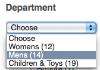
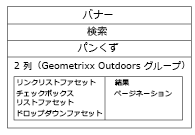

# ページ{#adding-search-promote-features-to-your-page}へのSearch&amp;Promote機能の追加

WebサイトにSearch&amp;Promote機能を統合するには、[!UICONTROL Search&amp;Promote]コンポーネントを使用して、ページに次の機能を追加します。

* キーワード検索
* 検索結果のページ
* 検索の絞り込み
* バナー

Search&amp;Promote 機能は、AEM の管理者が有効にしている場合にのみ使用できます。[Adobe Search&amp;Promote との統合](/help/sites-administering/search-and-promote.md)を参照してください。

Search&amp;Promote サーバーでは、ファセットや各コンポーネントが提供する情報が設定されています。次の表で、各コンポーネントの概要について説明します。後続のセクションではそれらの用途の詳細情報を提供します。

<table> 
 <tbody> 
  <tr> 
   <th>Search&amp;Promote のコンポーネント</th> 
   <th>説明</th> 
  </tr> 
  <tr> 
   <td>バナー</td> 
   <td>バナー広告を表示します。バナーは Search&amp;Promote を通じて収集されたデータに基づいて選択されます。  </td> 
  </tr> 
  <tr> 
   <td>パンくずリスト</td> 
   <td>検索キーワードとユーザーが検索結果に適用したフィルターの結果が表示されます。</td> 
  </tr> 
  <tr> 
   <td>チェックボックスリストファセット</td> 
   <td>検索結果をフィルタリングするためのファセットを選択するチェックボックスのリスト。</td> 
  </tr> 
  <tr> 
   <td>ドロップダウンファセット</td> 
   <td>検索結果をフィルタリングするためのファセットのドロップダウンリスト。</td> 
  </tr> 
  <tr> 
   <td>リンクリストファセット</td> 
   <td>検索結果をフィルタリングするためのファセットリンクのリスト。</td> 
  </tr> 
  <tr> 
   <td>ページネーション</td> 
   <td>検索結果のページを検索するためのコントロール。</td> 
  </tr> 
  <tr> 
   <td>結果</td> 
   <td>キーワード検索の結果を表示します。</td> 
  </tr> 
  <tr> 
   <td>検索</td> 
   <td>ページに検索フィールドを追加します。</td> 
  </tr> 
 </tbody> 
</table>

## 検索結果ページの作成  {#creating-the-search-results-page}

WCM Web サイトコンソールを使用して、検索結果を表示するページを作成します。同じ Search&amp;Promote サービスを使用している場合、すべての検索コンポーネントからの検索結果をこのページに表示することができます。

ユーザーは結果コンポーネントとページネーションコンポーネントで検索結果をレビューできます。**[!UICONTROL 結果]**&#x200B;コンポーネントには、編集モードやデザインモードで構成可能なプロパティがありません。結果コンポーネントには検索結果の一覧と、他のページへのリンク、指定の検索キーワードによる検索結果の数が表示されます。

**[!UICONTROL ページネーション]**&#x200B;コンポーネントでは、複数ページの検索結果を移動できます。ユーザーはページ数を確認し、次のページや前のページに移動したり、ページを選択して開いたり、すべての結果を 1 つのページに表示したりできます。

[!UICONTROL 編集]モードで次のコンポーネントプロパティを設定して、ランタイム動作を制御できます。

* **[!UICONTROL 単一の結果ページを非表示にする]**  — 検索で単一ページの結果が返された場合に、ページナビゲーションコントロールを非表示にするには、このオプションを選択します。
* **[!UICONTROL 最初/最後を非表示にする]**  — ユーザーが結果の最初または最後のページにジャンプしないようにするには、このオプションを選択します。
* **[!UICONTROL 前へ/次へを非表示にする]**  — ユーザーが現在のページを基準に結果ページを移動できるかどうかを指定します。
* **[!UICONTROL すべての検索結果を表示しない]**  — すべての検索結果を1つのページに統合できるかどうかを指定します。通常、ページ分割されたデータを提供するとサーバーのリソースをより効率的に使用できます。サイズの大きなデータセットを 1 つの応答メッセージで転送されないようにするには、このオプションを選択します。

## ファセットによる結果のフィルタリングの有効化  {#enabling-the-filtering-of-results-by-facets}

ユーザーが検索結果をファセットでフィルタリングできるように設定できます。**[!UICONTROL チェックボックスリストファセット]**、**[!UICONTROL ドロップダウンファセット]**、**[!UICONTROL リンクリストファセット]**&#x200B;の各コンポーネントを使用して、フィルタリング用のファセットを1つ以上選択できます。 これらのコンポーネントを使用する際には、**[!UICONTROL パンくず]**&#x200B;コンポーネントも指定することをお勧めします。パンくずは、現在使用されているフィルターを示します。

**[!UICONTROL チェックボックスリストファセット]**、**[!UICONTROL ドロップダウンファセット]**、**[!UICONTROL リンクリストファセット]**&#x200B;の各コンポーネントには、**[!UICONTROL 編集]**&#x200B;モードで設定する次のプロパティがあります。

* **[!UICONTROL ファセット名]**  — フィルターに使用されるファセットの名前。

**[!UICONTROL チェックボックスリストファセット]**&#x200B;コンポーネントにファセットのリストと関連するチェックボックスが表示されます。**[!UICONTROL チェックボックスリストファセット]**&#x200B;を使用して、ユーザーが複数のファセットからの項目が含まれる結果のサブセットを表示できるようにします。例えば、複数のブランドが同じ種類の製品を供給する場合は、ブランドファセットが適切です。

検索結果に関連付けられている各ファセットにチェックボックスが表示されます。ユーザーがチェックボックスをオンにすると、ページが再度読み込まれ、結果セットが更新されます。すべてのチェックボックスはページに表示されたままなので、ユーザーはいつでもフィルターに対してファセットを追加または削除できます。

**[!UICONTROL ドロップダウンファセット]**&#x200B;コンポーネントを使用すると、ユーザーがドロップダウンリストからファセット項目を選択できます。このコンポーネントは、一度に 1 つのファセットに絞り込む場合に便利です。例えば、商品検索を性別で絞り込む場合には部門ファセットが適切です。**&#x200B;ジーンズを探しているジョンが部門を「男性」でフィルター。

ドロップダウンリストには、すべての検索結果に関連付けられているファセットが入力されています。ドロップダウンリストで項目を選択すると、ページが再度読み込まれ、結果セットが更新されます。ドロップダウンリストの項目は変わらないので、ユーザーはいつでもファセットを切り替えることができます。

**[!UICONTROL リンクリストファセット]**&#x200B;コンポーネントを使用すると、ユーザーが複数のファセットメンバーまたはファセットで項目を段階的に絞り込むことができます。

ファセットメンバーはリンクのリストとして表示されます。各リンクのテキストは、現在の検索結果に関連付けられているファセットメンバーの名前です。ユーザーがファセットリンクをクリックすると、ページが再度読み込まれ、検索結果のサブセットが表示されます。リンクのリストはクリックに応じて更新され、結果をさらに絞り込むことができます。

また、異なるタイプの[!UICONTROL Search&amp;Promote]コンポーネントからフィルターを適用すると、リスト内のリンクも変更されます。 複数の種類のフィルターコンポーネントを使用することで、フィルターを効果的に組み合わせることができます。

**[!UICONTROL パンくず]**&#x200B;コンポーネントを使用すると、ユーザーが検索結果に現在適用されているフィルターを、適用された順序で確認できます。パンくずの項目をクリックすることで、そのフィルターの組み合わせに戻すことができます。

編集モードで次のパンくずのプロパティを設定して、コンポーネントの外観をカスタマイズできます。

* **[!UICONTROL 区切り文字]**  — 各パンくずの間を区切る文字または文字列を定義します。Delimiterフィールドには、任意の文字列を入力できます。 デフォルトの設定は、&quot;>&quot;（引用符なし）です。
* **[!UICONTROL 末尾の区切り文字]**  — パンくずリストの末尾に表示する文字または文字列を定義します。「末尾の区切り文字」フィールドには、任意の文字列を入力できます。 このデフォルト設定は「空白」です（パンくず行の末尾には何も表示されません）。

## 検索ボックスの追加 {#adding-search-boxes}

**[!UICONTROL 検索]**&#x200B;コンポーネントを使用すると、ユーザーはキーワード検索を実行できます。 検索機能にアクセス権限を付与する各ページに検索コンポーネントを追加します。

**[!UICONTROL 編集]**&#x200B;モードで次のプロパティを設定して、ランタイム動作を制御します。

* **[!UICONTROL 結果ページのパス]**  — 検索結果を表示するページへのパス。
* **[!UICONTROL オートコンプリートを有効にする]**  — ユーザーが検索ボックスに入力し始めると、推奨検索キーワードが表示されます。

## バナーの追加 {#adding-banners}

**[!UICONTROL バナー]**&#x200B;コンポーネントは、顧客のSearch&amp;Promote検索に応じてバナー広告を表示します。 Search&amp;Replace サーバーのロジックにより表示されるバナーが決まります。例えば、「ジーンズ」を検索するとファッション関連のバナーが表示されます。「男性」部門でフィルタリングすると、バナーがさらに絞り込まれます。

**[!UICONTROL バナー]**&#x200B;コンポーネントは、**[!UICONTROL バナー領域]**&#x200B;という1つの設定可能なプロパティを提供します。 **[!UICONTROL 編集]**&#x200B;モードで、プロパティ値の1つを選択してバナーの表示方法を指定します。 Search&amp;Promote サービスにより、値のリストの選択元が決まります。

## Search&amp;Promote 検索ページの例 {#example-search-promote-search-page}

この図は、下の完全に機能する Search&amp;Promote 結果ページを作成するためにページに追加されるコンポーネントを示します。

 
