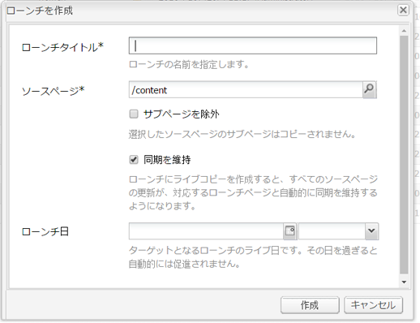
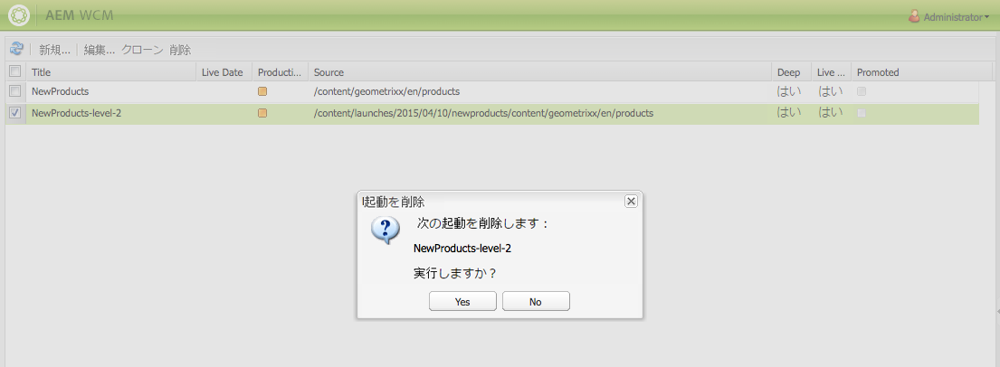

# ローンチの作成 {#creating-launches}

>[!CAUTION]
>
>AEM 6.4 の拡張サポートは終了し、このドキュメントは更新されなくなりました。 詳細は、 [技術サポート期間](https://helpx.adobe.com/jp/support/programs/eol-matrix.html). サポートされているバージョンを見つける [ここ](https://experienceleague.adobe.com/docs/?lang=ja).

ローンチを作成し、今後のアクティベートのために既存の Web ページの新しいバージョンを更新できるようにします。ローンチを作成する際は、タイトルとソースページを指定します。

* タイトルは、**サイドキック**&#x200B;に表示されます。作成者はサイドキックからローンチにアクセスして作業できます。
* デフォルトでは、ソースページの子ページがローンチに含まれます。 必要に応じて、ソースページのみを使用できます。
* デフォルトでは、 [ライブコピー](/help/sites-administering/msm.md) ソースページの変更に応じて、ローンチページを自動的に更新します。 静的なコピーを作成して自動更新をおこなわないように指定できます。

オプションとして、**ローンチ日**（と時間）を指定して、ローンチページを昇格およびアクティベートするタイミングを定義できます。ただし、**ローンチ日**&#x200B;は&#x200B;**実稼動準備完了**&#x200B;フラグと組み合わせた場合のみ機能します（[ローンチ設定の編集](/help/sites-classic-ui-authoring/classic-launches-editing.md#editing-a-launch-configuration)を参照）。アクションが実際に自動的におこなわれるようにするには、両方を設定する必要があります。

## ローンチの作成 {#creating-a-launch}

次の手順では、ローンチを作成します。

1. Web サイトの管理ページ（[http://localhost:4502/siteadmin](http://localhost:4502/siteadmin)）を開きます。
1. クリック **新規…** その後 **新しいローンチ…**.
1. 内 **ローンチを作成** ダイアログで、次のプロパティの値を指定します。

   * **ローンチタイトル**:ローンチの名前。 作成者にとっては、わかりやすい名前にする必要があります。
   * **ソースページ**:ローンチを作成するページへのパス。 デフォルトでは、すべての子ページが含まれます。
   * **サブページを除外**:ローンチを作成するのはソースページのみで、子ページのローンチを作成しない場合は、このオプションを選択します。 デフォルトでは、このオプションは選択されていません。
   * **同期を維持**：ソースページに変更があったときにローンチページのコンテンツを自動的に更新する場合は、このオプションを選択します。これは、ローンチを [ライブコピー](/help/sites-administering/msm.md).
   * **ローンチ日**：ローンチコピーがアクティブ化される日付と時間（「**実稼動準備完了**」フラグによって変わります。[ローンチ - イベントの順序](/help/sites-authoring/launches.md#launches-the-order-of-events)を参照してください）。

   

1. 「**作成**」をクリックします。

## ローンチの削除 {#deleting-a-launch}

ローンチを削除することもできます。

1. [ローンチコンソール](/help/sites-classic-ui-authoring/classic-launches.md)で、必要なローンチを選択します。
1. 「**削除**」をクリックします。このとき、次のように確認を求められます。

   

   >[!CAUTION]
   >
   >ネストされたローンチを削除する場合は、まず下位のローンチを削除する必要があります。
