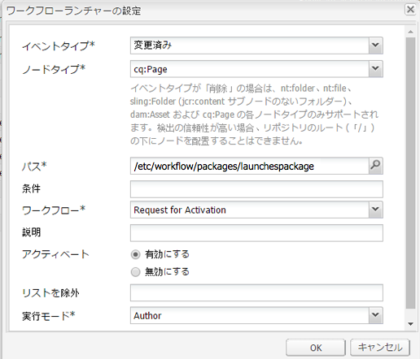

# ローンチの昇格{#promoting-launches}

公開する前に、ローンチページを昇格して、コンテンツをソース（実稼動）に戻す必要があります。 ローンチページが昇格されると、ソースページの対応するページが、昇格されたページのコンテンツに置き換えられます。 ローンチページを昇格させるときには、次のオプションを使用できます。

* 現在のページのみを昇格させるか、ローンチ全体を昇格させるかを指定します。
* 現在のページの子ページを昇格させるかどうか。
* すべてのローンチを昇格させるか、変更されたページのみを昇格させるか。

## ローンチページの昇格 {#promoting-launch-pages}

ページを昇格させるには、昇格させるローンチページの編集中に、次の手順を実行します。

1. の **ページ** サイドキックの「 」タブで、「 **ローンチを昇格**.
1. 昇格するページを指定します。

   * （デフォルト）現在のページのみを昇格させるには、「**ページの変更を実稼動版に昇格**」を選択します。
   * 現在のページの子ページも昇格させるには、 **サブページを含める**.
   * ローンチのすべてのページを昇格させるには、「 」を選択します。 **完全なローンチを実稼動版に昇格**.

1. 実稼動ページをワークフローパッケージに追加するには、 **ワークフローパッケージに追加** ワークフローパッケージを選択します。
1. クリック **昇格**.

## AEM ワークフローを使用した昇格済みページの処理 {#processing-promoted-pages-using-aem-workflow}

ワークフローモデルを使用して、昇格済みローンチページの一括処理を実行します。

1. ワークフローパッケージを作成します。
1. 作成者がローンチページを昇格すると、ローンチはワークフローパッケージに保存されます。
1. パッケージをペイロードとして使用し、ワークフローモデルを開始します。

ページが昇格されたときにワークフローを自動的に開始するには [ワークフローランチャーの設定](/help/sites-administering/workflows-starting.md#workflows-launchers) パッケージノード用。

例えば、作成者がローンチページを昇格したときに、ページアクティベーションリクエストを自動的に生成できます。 パッケージノードが変更されたときにリクエストアクティベーションワークフローを開始するように、ワークフローランチャーを設定します。

