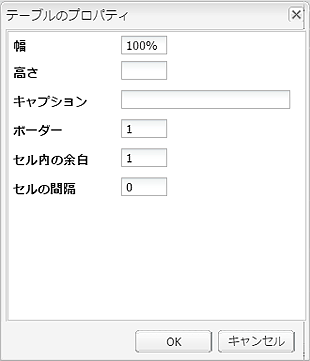
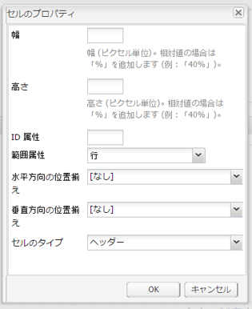
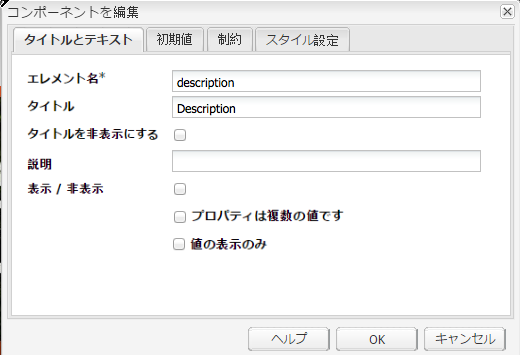
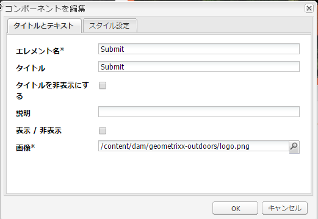
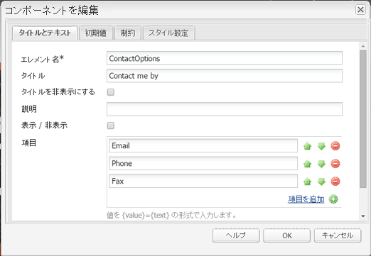
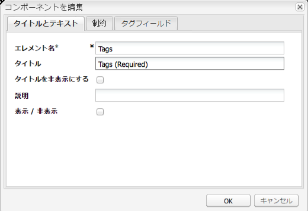

# アクセシブルなコンテンツ（WCAG 2.0 適合）の作成 {#creating-accessible-content-wcag-conformance}

>[!CAUTION]
>
>AEM 6.4 の拡張サポートは終了し、このドキュメントは更新されなくなりました。 詳細は、 [技術サポート期間](https://helpx.adobe.com/jp/support/programs/eol-matrix.html). サポートされているバージョンを見つける [ここ](https://experienceleague.adobe.com/docs/?lang=ja).

WCAG 2.0 は、障碍のあるユーザーが Web コンテンツにアクセスして利用できるようにするための、テクノロジーから独立した一連のガイドラインおよび達成基準で構成されます。

>[!NOTE]
>
>関連トピック：
>
>* ur [WCAG 2.0 クイックガイド](/help/managing/qg-wcag.md) 詳細は
>* [アクセスシブルなコンテンツを生成するためのリッチテキストエディターの設定](/help/sites-administering/rte-accessible-content.md)
>


これらは、次の 3 つの適合レベルに分類されます。レベル A（最低）、レベル AA、レベル AAA（最高）。 各レベルの簡単な定義を次に示します。

* **レベル A：**&#x200B;サイトのアクセシビリティ基本的な最低レベルに達しています。このレベルに達するには、レベル A の達成基準をすべて満たしている必要があります。
* **レベル AA：**&#x200B;理想的なレベルのアクセシビリティです。ほとんどの状況において、ほとんどのテクノロジーを使用して、ほとんどのユーザーがアクセスできるように、サイトのアクセシビリティが強化されています。このレベルに達するには、レベル A とレベル AA の達成基準をすべて満たしている必要があります。
* **レベル AAA：**&#x200B;きわめて高いレベルのアクセシビリティが確保されているサイトです。このレベルに達するには、レベル A、レベル AA、レベル AAA の達成基準をすべて満たしている必要があります。

サイトを作成する際は、サイトの全体的なレベルを特定する必要があります。

次の節では、[WCAG 2.0 のガイドライン](https://www.w3.org/TR/WCAG20/#guidelines)および[適合レベル](https://www.w3.org/TR/UNDERSTANDING-WCAG20/conformance.html) A および AA の関連する達成基準を示します。

>[!NOTE]
>
>特定の種類のコンテンツに対してすべてのレベル AAA 達成基準を満たすことはできないので、このレベルの適合を一般的なポリシーとして必要とすることはお勧めしません。

>[!NOTE]
>
>このドキュメントでは、次の表記を使用しています。
>
>* [WCAG 2.0 のガイドライン](https://www.w3.org/TR/WCAG20/#guidelines)用の省略名。
>* WCAG の Web サイトとの相互参照を目的として [WCAG 2.0 のガイドライン](https://www.w3.org/TR/WCAG20/#guidelines)で使用されている番号。
>


## 原則 1：知覚可能 {#principle-perceivable}

[原則 1：知覚可能 - 情報およびユーザーインターフェイスコンポーネントは、ユーザーが知覚できる方法でユーザーに提示可能でなければならない。](https://www.w3.org/TR/WCAG20/#perceivable)

### 代替テキスト（1.1） {#text-alternatives}

[ガイドライン 1.1 代替テキスト：テキスト以外のコンテンツに代替テキストを提供し、大きな印刷、点字、音声、記号、単純な言語など、必要な他の形式に変更できるようにします。](https://www.w3.org/TR/WCAG20/#text-equiv)

### テキスト以外のコンテンツ (1.1.1) {#non-text-content}

* 達成基準 1.1.1
* レベル A
* テキスト以外のコンテンツ：ユーザーに提示されるすべてのテキスト以外のコンテンツには、同等の目的を果たす代替テキストが提供されます。ただし、次の場合は除きます。

#### 目的 - テキスト以外のコンテンツ（1.1.1） {#purpose-non-text-content}

Web ページ上の情報はテキスト以外の様々な形式（写真、ビデオ、アニメーション、チャート、グラフなど）で指定できます。視覚に障碍のあるユーザーは、テキスト以外のコンテンツを見ることができませんが、スクリーンリーダーによる読み上げや、触覚で感知可能な点字表示デバイスを使用すれば、テキストコンテンツにアクセスできます。そのため、グラフィカルな形式にコンテンツの代替テキストを指定することにより、グラフィカルなコンテンツを見ることができないユーザーも、そのコンテンツが提供するものと同等の情報にアクセスできます。

他の利点として、代替テキストを使用すると、検索エンジン技術によってテキスト以外のコンテンツのインデックスを作成できるという利点もあります。

#### 達成方法 — テキスト以外のコンテンツ (1.1.1) {#how-to-meet-non-text-content}

静的なグラフィックの場合、そのグラフィックと同等の代替テキストを指定することが基本的な要件です。これは、 **代替テキスト** フィールド：

>[!NOTE]
>
>**カルーセル**&#x200B;や&#x200B;**スライドショー**&#x200B;など、あらかじめ用意されている一部のコンポーネントには、代替テキストの説明を画像に追加する手段が用意されていません。AEM インスタンスにこれらのバージョンを実装する場合は、作成者がコンテンツに追加できるように、開発チームは `alt` 属性をサポートするようにこれらのコンポーネントを設定する必要があります（[追加の HTML 要素および属性のサポートの追加](/help/sites-administering/rte-accessible-content.md#adding-support-for-additional-html-elements-and-attributes)を参照）。

「**代替テキスト**」フィールドは、**画像**&#x200B;コンポーネントダイアログの「**詳細**」画像プロパティタブに表示されます。


AEM では、「**代替テキスト**」がデフォルトで画像に追加されます。クラシック UI の場合、デフォルトの属性は次の 2 つのシナリオで作成できます（デフォルト値が代替テキストとして不十分な場合は、「**詳細**&#x200B;画像プロパティ」タブで編集が必要になる場合があります）。

* ファイル：

   ユーザーのハードドライブから画像がアップロードされます。画像コンポーネントをページに追加して、ハードドライブまたは別のソースから画像を選択する場合、「**代替テキスト**」のデフォルト値は `file` です。これは、 **詳細** 「画像のプロパティ」タブ この値は、 **代替テキスト** フィールドに値を入力する必要がありますが、値を変更すると、新しい値がフィールドに表示されます。

* アセット：

   デジタルアセットのリポジトリから画像が追加されます。画像をデジタルアセットリポジトリから Web ページにドラッグすると、 **タイトル** および **代替テキスト** その画像の値は、その画像のメタデータから取得されます。

>[!NOTE]
>
>前述の 2 つのシナリオでは、「**代替テキスト**」のデフォルト値が「**詳細**」画像プロパティタブに表示されません。デフォルト値を変更するには、「**代替テキスト**」フィールドに新しい値を入力します。

>[!NOTE]
>
>画像が単なる装飾画像の場合（[適切な代替テキストの作成](#creating-good-text-alternatives)を参照）、スペースバーを使用すると、**代替テキスト**&#x200B;フィールドにスペースを入力できます。これにより、スクリーンリーダーに対して画像を無視するように求める、空の `alt` 属性が作成されます。

#### 適切な代替テキストの作成 {#creating-good-text-alternatives}

テキスト以外のコンテンツには様々な形式があるので、代替テキストの値は、Web ページにおけるグラフィックの役割に応じて異なります。従う必要のある一般的な手法を次に示します。

* 代替テキストは、簡潔に、テキスト以外のコンテンツが提供する重要な情報を明確に示す必要があります。
* 過度に長い説明（100 文字を超える）は避ける必要があります。 代替テキストの詳細が必要な場合：

   * 代替テキストで短い説明を提示する
   * 同じページの別の場所、または別の web ページに長い説明を表示し、画像をリンクにするか、画像の横にテキストリンクを配置することで、この別の説明にリンクを設定する

* 代替テキストは、同じページの近くにあるテキストフォームで提供されたコンテンツを複製しないでください。 画像の多くは、ページのテキストで既にカバーされているポイントの図なので、詳細な代替テキストが既に存在する場合があります。
* テキスト以外のコンテンツが別のページまたはドキュメントへのリンクで、同じリンクの他のテキストを構成する部分がない場合、画像の代替テキストは画像を説明するのではなく、リンク先を示す必要があります。
* テキスト以外のコンテンツがボタン要素に含まれ、同じボタンのテキスト構成部分がない場合、画像の代替テキストは、画像を説明するのではなく、ボタンの機能を示す必要があります。
* 画像の代替テキストを空（null）にしても何の問題もありませんが、画像に代替テキストがない場合（純粋に装飾用のグラフィックの場合など）や、それに相当するテキストがページテキストに既に存在している場合に限られます。

この [W3C ドラフト：HTML5 有用な代替テキストを提供するためのテクニック](https://dev.w3.org/html5/alt-techniques/) には、異なるタイプの画像に適した代替テキストのプロビジョニングの詳細と例があります。

代替テキストが必要な、テキスト以外のコンテンツには、以下のようなタイプがあります。

* 説明写真：

   人や物や場所の画像。ページ内の写真の役割を考えます。対応する適切なテキストは「*[オブジェクト]*&#x200B;の写真」などになりますが、周囲のテキストによって異なる場合があります。

* アイコン：

   具体的な情報を伝える小さいピクトグラム（グラフィック）です。ページ全体およびサイト全体で一貫して使用する必要があります。 ページまたはサイト上のアイコンのすべてのインスタンスは、短く簡潔な代替テキストを同じにする必要があります。ただし、同じ結果、隣接するテキストが不要に重複してしまう場合を除きます。

* チャートとグラフ：

   通常は数値データを表します。そのため、代替テキストを提供する 1 つのオプションとしては、チャートまたはグラフィックで示されている主なトレンドの簡単な概要を含めることがあります。必要に応じて、「**詳細画像プロパティ**」タブの「**説明**」フィールドを使用して、詳細な説明をテキストで提供します。さらに、ページまたはサイトの別の場所で、ソースデータを表形式で提供することもできます。

   

   このチャート例に代替テキストを提供するには、画像自体に簡略化した `alt` テキストを追加して、画像の後に完全な代替テキストを入力します。

   ```xml
   <p></p>
   <p> Figure 1. Distribution of Articles by Journal Category.
   Pie chart: Language=68%, Education=14% and Science=18%.</p>
   ```

   >[!NOTE]
   >
   >上記のスニペットは、順序を説明するためだけに使用されています。**画像**&#x200B;コンポーネントを、上記で使用している `img src` 参照の代わりに使用することをお勧めします。

   [達成方法 - テキスト以外のコンテンツ（1.1.1）](#how-to-meet-non-text-content)に示すように、AEM では、画像の設定ダイアログの「**代替テキスト**」フィールドと「**説明**」フィールドを組み合わせてこの処理を行うことができます。

* マップ、図、フローチャート：

   空間データを提供するグラフィック（例：オブジェクト間の関係やプロセスを説明する目的など）の場合は、重要メッセージをテキスト形式で指定します。地図の場合、完全に同等なテキストを提供することは困難な場合が多いものの、特定の場所への行き方を見つける手段として地図が提供されている場合は、地図画像の代替テキストで「*X の地図*」と簡単に示し、ページ内の別の場所または&#x200B;**画像**&#x200B;コンポーネントの「**詳細**」タブの「**説明**」フィールドで、目的の場所への道案内を提供します。

* CAPTCHA：

   CAPTCHA は、*Completely Automated Public Turing test to tell Computers and Humans Apart*（コンピューターと人間を区別するための、完全に自動化された公開チューリングテスト）の略です。web ページで人間と悪意のあるソフトウェアを区別するために使用されるセキュリティチェックですが、アクセス障害の原因となる可能性があります。これらの画像をユーザーが見て説明することにより、セキュリティテストに合格します。この画像の代替テキストを提供することは明らかに不可能なので、代わりに代替のグラフィック以外のソリューションを検討する必要があります。

   W3C では、いくつかの提案を行っています。例えば、以下の方法にはそれぞれメリットとデメリットがあるとしています。

   * 論理パズル
   * 画像の代わりにサウンド出力を使用する
   * アカウントおよびスパムフィルターの使用制限

* 背景画像：

   これらは、HTML ではなくカスケーディングスタイルシート（CSS）を使用して表示できます。つまり、代替テキスト値の指定は不可能ということです。したがって、背景画像では重要なテキスト情報を提供しないでください。提供する場合は、同じ情報をページのテキストでも提供する必要があります。

   ただし、画像を表示できないときに代替の背景を表示することは重要です。

   >[!NOTE]
   >
   >背景と前景テキストの間には、適切なレベルのコントラストが必要です。詳しくは、 [コントラスト（最低限）(1.4.3)](#contrast-minimum).

#### 詳細情報 — テキスト以外のコンテンツ (1.1.1) {#more-information-non-text-content}

* [達成基準 1.1.1 について](https://www.w3.org/TR/UNDERSTANDING-WCAG20/text-equiv-all.html)
* [達成基準 1.1.1 の達成方法](https://www.w3.org/WAI/WCAG20/quickref/#text-equiv)
* [W3C：HTML5：有効な代替テキストを提供するためのテクニック（ドラフト）](https://dev.w3.org/html5/alt-techniques/)
* [W3C:CAPTCHA の説明と代替手段](https://www.w3.org/TR/turingtest/)

### 時間依存メディア (1.2) {#time-based-media}

[ガイドライン 1.2 時間依存メディア：時間依存メディアには代替コンテンツを提供すること。](https://www.w3.org/TR/WCAG20/#text-equiv)

ここでは&#x200B;*、*&#x200B;時間依存の Web コンテンツについて扱います。これには、ユーザーが再生可能なコンテンツ（映像、音声、アニメーションなど）や、収録済みのコンテンツ、ライブストリームなどが含まれます。

### 音声のみおよび映像のみ（収録済み）(1.2.1) {#audio-only-and-video-only-pre-recorded}

* 達成基準 1.2.1
* レベル A
* 音声のみおよび映像のみ（収録済み）:収録済みの音声のみおよび収録済みの映像のみのメディアの場合、次の点が当てはまります。ただし、音声または映像がテキストの代替メディアで、次のように明確にラベル付けされている場合を除きます。

   * 収録済み音声のみ：収録済み音声のみのコンテンツに対して同等の情報を提示する時間ベースのメディアの代替手段を提供する。
   * 収録済みビデオのみ：時間ベースのメディアの代替手段、または収録済みの映像専用コンテンツと同等の情報を示すオーディオトラックが提供されます。

#### 目的 — 音声のみおよび映像のみ（収録済み）(1.2.1) {#purpose-audio-only-and-video-only-pre-recorded}

ビデオおよびオーディオのアクセシビリティの問題は、次の方法で発生する場合があります。

* 視覚障碍のあるユーザー（音声がまったくない場合や、映像またはアニメーションの内容が音声で十分に伝えられていない場合）
* 聴覚障碍のある人、または聴覚障碍のある人（音声を聞くことができない人）
* 音声を聞くことはできるが、内容を理解できないユーザー（理解できない言語が使用されている場合など）

また、AdobeFlashなど、特定のメディア形式でのコンテンツの再生をサポートしていないブラウザーやデバイスを使用しているユーザーは、ビデオやオーディオを使用できない場合があります。

この情報を別の形式 ( テキスト（音声なしのビデオの場合は音声）など ) で提供すると、元のコンテンツにアクセスできないユーザーがアクセスできるようになります。

#### 達成方法 — 音声のみおよび映像のみ（収録済み）(1.2.1) {#how-to-meet-audio-only-and-video-only-pre-recorded}

* 映像なしの収録済み音声コンテンツ（ポッドキャストなど）の場合：

   * コンテンツの直前または直後に、オーディオコンテンツの字幕へのリンクを提供します。

      字幕ページは、すべての会話内容や会話以外の重要な内容をはじめ、誰が話しているか、状況の説明、口頭による表現など、重要な音声情報をテキスト情報に置き換えた HTML ページである必要があります。

* コンテンツがアニメーションまたは音声のない収録済みビデオの場合：

   * コンテンツの直前または直後に、ビデオから提供される情報に関する同等のテキスト説明へのリンクを提供します
   * または、MP3 などの一般的に使用されるオーディオ形式の同等のオーディオ説明。

>[!NOTE]
>
>音声または映像のコンテンツが、Web ページ上に既に存在する別の形式のコンテンツの代替として提供されている場合は、上記の要件に従う必要はありません。例えば、テキストによる手順説明を解説している映像の場合は、テキストによる手順説明が既に映像の代替の役割を果たしているので、映像の代替を指定する必要はありません。

マルチメディア、具体的には Flash コンテンツを AEM Web ページに挿入することは、画像の挿入と類似しています。ただし、マルチメディアコンテンツには静止画像より多くの機能が含まれているので、マルチメディアの再生方法を制御するために、様々な設定やオプションがあります。

>[!NOTE]
>
>情報提供のためのコンテンツでマルチメディアを使用する場合は、代替のリンクも作成する必要があります。例えば、字幕を含めるには、字幕を表示するための HTML ページを作成してから、音声コンテンツの横または下にリンクを追加します。

#### 詳細情報 - 音声のみおよび映像のみ（収録済み）（1.2.1） {#more-information-audio-only-and-video-only-pre-recorded}

* [達成基準 1.2.1 について](https://www.w3.org/TR/UNDERSTANDING-WCAG20/media-equiv-av-only-alt.html)
* [達成基準 1.2.1 の達成方法](https://www.w3.org/WAI/WCAG20/quickref/#media-equiv)

### キャプション（収録済み）(1.2.2) {#captions-pre-recorded}

* 達成基準 1.2.2
* レベル A
* キャプション（収録済み）：同期されたメディアに含まれるすべての収録済み音声コンテンツに対してキャプションが提供されます。ただし、そのメディアがテキストの代替メディアであり、その旨の明確なラベルが付けられている場合を除きます。

#### 目的 — キャプション（収録済み）(1.2.2) {#purpose-captions-pre-recorded}

耳が聞こえない人や耳が聞こえない人は、音声コンテンツにアクセスできないか、非常に難しい人です。キャプションは、ビデオの読み上げと読み上げのないオーディオに相当するテキストで、ビデオの適切なタイミングで画面に表示されます。音声を聞くことのできない人々が何が起きているのかを理解できるようにします

>[!NOTE]
>
>適切なテキストまたはテキスト以外の同等の情報（直接同等の情報を提供）がビデオやアニメーションと同じページで使用できる場合、キャプションは不要です。

#### 達成方法 — キャプション（収録済み）(1.2.2) {#how-to-meet-captions-pre-recorded}

キャプションは、次のいずれかの状態に設定できます。

* オープン：映像再生時に常に表示）
* クローズド：ユーザーがキャプションのオン、オフを切り替え可能

可能な場合は、クローズドキャプションを使用して、キャプションの表示、非表示をユーザーが選択できるようにしてください。

クローズドキャプションの場合は、適切な形式（[SMIL](https://www.w3.org/AudioVideo/) など）の同期キャプションファイルを映像ファイルと共に作成して提供する必要があります（この方法の詳細は、このガイドの範囲外ですが、[詳細情報 - キャプション（収録済み）（1.2.2）](#more-information-captions-pre-recorded)に、いくつかのチュートリアルへのリンクを提示しています）。映像にキャプションを設定できることをユーザーに知らせる注意書きを必ず提示してください。

オープンキャプションを使用する必要がある場合は、映像トラック内にテキストを埋め込みます。これを行うには、映像にタイトルをオーバーレイできるビデオ編集アプリケーションを使用します。

#### 詳細情報 — キャプション（収録済み）(1.2.2) {#more-information-captions-pre-recorded}

* [達成基準 1.2.2 について](https://www.w3.org/TR/UNDERSTANDING-WCAG20/media-equiv-captions.html)：
* [達成基準 1.2.2 の達成方法](https://www.w3.org/WAI/WCAG20/quickref/#media-equiv)
* [W3C：Synchronized Multimedia](https://www.w3.org/AudioVideo/)
* [Captions, Transcripts, and Audio Descriptions（WebAIM）](https://webaim.org/techniques/captions/)

### 音声解説または代替メディア（収録済み）(1.2.3) {#audio-description-or-media-alternative-pre-recorded}

* 達成基準 1.2.3
* レベル A
* 音声解説または代替メディア（収録済み）:時間に基づくメディアまたは音声でのビデオコンテンツの説明の代替手段は、同期されたメディアに提供されます。ただし、メディアがテキストの代替メディアであり、明確にラベル付けされる場合を除きます。

#### 目的 — 音声解説または代替メディア（収録済み）(1.2.3) {#purpose-audio-description-or-media-alternative-pre-recorded}

映像やアニメーションの情報のビジュアルのみが提供されている場合や、ビジュアルで起こっていることの内容を理解するのに十分な情報がサウンドトラックに含まれていない場合は、視覚障害のあるユーザーにアクセシビリティの問題が発生します。

#### 達成方法 — 音声解説または代替メディア（収録済み）(1.2.3) {#how-to-meet-audio-description-or-media-alternative-pre-recorded}

この達成基準を満たすには、2 つの方法を採用できます。 次のいずれかを指定できます。

1. ビデオコンテンツの追加の音声解説を含めます。 これを行うには、次の 3 つのうちいずれかの方法を使用します。

   * 既存のボイスの休止部分で、既存の音声トラックでは提示されていないシーンの変化に関する情報を提供します。
   * 元の音声を含み、さらにシーンの変化に関する追加の音声情報も含む新しい追加のオプション音声トラックを提供します。

      * これにより、ユーザーは既存の音声トラック&#x200B;*（*&#x200B;音声解説を含まない&#x200B;*）*&#x200B;と新しい音声トラック（音声解説を含む）を切り替えることができます。
      * これにより、追加の説明を必要としないユーザーの混乱を防ぐことができます。
   * ビデオコンテンツの 2 つ目のバージョンを作成して、拡張オーディオの説明を許可します。 これにより、適切な時点で音声と映像を一時的に休止して既存のボイスの合間に詳細な音声解説を提供することに関連する困難な作業を軽減できます。その結果、アクションが再び開始する前に、より長い音声解説を指定できます。 前の例と同様に、追加の説明を必要としないユーザーの中断を防ぐために、追加のオーディオトラックとしてこれをオプションで提供するのが最適です。


1. ビデオやアニメーションのオーディオやビジュアル要素に相当する適切なテキストのトランスクリプトを提供します。 これには、誰が話しているかに関する指示、設定の説明、声の表現が必要です。 長さに応じて、トランスクリプトをビデオやアニメーションと同じページに配置したり、別のページに配置したりできます。後者のオプションを選択する場合は、ビデオまたはアニメーションの横にあるトランスクリプトへのリンクを指定します。

音声解説付きビデオの作成方法の正確な詳細については、このガイドの範囲外です。 映像および音声解説の作成には長時間を要する可能性がありますが、他のアドビ製品が役に立つ場合があります。Adobe Flash Professional でコンテンツを作成する場合は、適切なプラグインのダウンロードをユーザーに促すスクリプトを作成し、`<noscript>` 要素を使用して代替テキストを指定する必要があります。

#### 詳細情報 - 音声解説または代替メディア（収録済み）（1.2.3） {#more-information-audio-description-or-media-alternative-pre-recorded}

* [達成基準 1.2.3 について](https://www.w3.org/TR/UNDERSTANDING-WCAG20/media-equiv-audio-desc.html)：
* [達成基準 1.2.3 の達成方法](https://www.w3.org/WAI/WCAG20/quickref/#qr-media-equiv-audio-desc)
* [Adobe Encore CS5](https://www.adobe.com/jp/products/premiere/encore/)

### キャプション（ライブ）（1.2.4）    {#captions-live}

* 達成基準 1.2.4
* レベル AA
* キャプション（ライブ）:同期されたメディア内のすべてのライブオーディオコンテンツにキャプションが提供されます。

#### 目的 — キャプション（ライブ）(1.2.4) {#purpose-captions-live}

この達成基準は、聴覚障害のあるユーザーのアクセシビリティに関する問題に対応する点で、[キャプション（収録済み）](#captions-pre-recorded)と同じです。ただし、この達成基準では web キャストなどライブのプレゼンテーションを扱う点が異なります。

#### 達成方法 - キャプション（ライブ）（1.2.4） {#how-to-meet-captions-live}

上記の[キャプション（収録済み）](#captions-pre-recorded)のガイダンスに従ってください。ただし、メディアがライブなので、キャプションは可能な限り短時間で、起こっていることに応じて作成する必要があります。したがって、リアルタイムキャプションツールや音声テキスト変換ツールの使用を検討してください。

詳細な手順説明はこのドキュメントの範囲外ですが、次のリソースで役に立つ情報が提供されています。

* [WebAIM：Real Time Captioning](https://www.webaim.org/techniques/captions/realtime.php)
* [AccessIT (University of Washington):音声認識を使用してキャプションを自動的に生成できますか？](https://www.washington.edu/accessit/articles?1209)

#### 詳細情報 - キャプション（ライブ）（1.2.4） {#more-information-captions-live}

* [達成基準 1.2.4 について](https://www.w3.org/TR/UNDERSTANDING-WCAG20/media-equiv-real-time-captions.html)
* [達成基準 1.2.4 の達成方法](https://www.w3.org/WAI/WCAG20/quickref/#qr-media-equiv-real-time-captions)

### 音声解説（収録済み）（1.2.5）    {#audio-description-pre-recorded}

* 達成基準 1.2.5
* レベル AA
* 音声解説（収録済み）:音声解説は、同期されたメディア内のすべての収録済み映像コンテンツに対して提供されます。

#### 目的 — 音声解説（収録済み）(1.2.5) {#purpose-audio-description-pre-recorded}

この達成基準は、 [音声解説または代替メディア（収録済み）](#audio-description-or-media-alternative-pre-recorded)ただし、作成者はレベル AA に準拠するために、より詳細な音声解説を提供する必要があります。

#### 達成方法 — 音声解説（収録済み）(1.2.5) {#how-to-meet-audio-description-pre-recorded}

次に示すガイダンスに従います。 [音声解説または代替メディア（収録済み）](#audio-description-or-media-alternative-pre-recorded).

#### 詳細情報 — 音声解説（収録済み）(1.2.5) {#more-information-audio-description-pre-recorded}

* [達成基準 1.2.5 について](https://www.w3.org/TR/UNDERSTANDING-WCAG20/media-equiv-audio-desc-only.html)
* [達成基準 1.2.5 の達成方法](https://www.w3.org/WAI/WCAG20/quickref/#qr-media-equiv-audio-desc-only)

### 適応可能 (1.3) {#adaptable}

[ガイドライン 1.3 適応可能：情報や構造を失うことなく、様々な方法（例えば、よりシンプルなレイアウト）で提示できるコンテンツを作成できます。](https://www.w3.org/TR/WCAG20/#content-structure-separation)

このガイドラインでは、以下をおこなうユーザーをサポートするために必要な要件について説明します。

* 作成者が標準的な 2 次元、複数列、カラーの Web ページレイアウトで提示している情報にアクセスできない可能性のあるユーザー

* 音声のみ、または大きいテキストや高いコントラストなど、代替の視覚表示を使用する可能性のあるユーザー

### 情報および関係性（1.3.1）     {#info-and-relationships}

* 達成基準 1.3.1
* レベル A
* 情報と関係：プレゼンテーションを通じて伝達される情報、構造、関係は、プログラムによって決定されるか、テキストで使用できます。

#### 目的 — 情報および関係性 (1.3.1) {#purpose-info-and-relationships}

障害を持つユーザーが使用する多くの支援テクノロジーでは、コンテンツを効果的に表示または出力するために構造情報に基づいています。 この構造情報は、ページ見出し、テーブルの行見出しおよび列見出し、リストタイプの形式を取ることができます。例えば、スクリーンリーダーを使用すれば、ページ内を見出しから見出しへと移動できます。ただし、ページコンテンツの構造が基になる HTML ではなく、視覚的なスタイルでのみ設定されているように見える場合、支援テクノロジーでは構造情報を利用できず、ブラウジングの操作性の向上を十分サポートできなくなります。

この達成基準の目的は、ブラウザーや支援テクノロジーが情報にアクセスして活用できるように、構造情報がHTMLを通じて提供されるようにすることです。

#### 達成方法 - 情報および関係性（1.3.1） {#how-to-meet-info-and-relationships}

AEM では、適切な HTML 要素を使用することにより、web ページを簡単に構築できます。RTE（テキストコンポーネント）でページコンテンツを開き、 **形式** メニューを使用して、適切な構造要素（段落、見出しなど）を指定します。

次の画像は、段落テキストとしてスタイル設定されたテキストを示しています。使用中のソースコードビューは、正しい開始と終了が含まれていることを示しています &lt;p> および &lt;/p> タグ。


Web ページに適切な構造が指定されていることを確認するには、次の方法があります。

* **見出しの使用：**

   RTE のアクセシビリティ機能を有効にしている場合（[AEM とアクセシビリティ](/help/sites-administering/rte-accessible-content.md)を参照）、AEM では 3 つのレベルのページ見出しが提供されます。これらを使用して、コンテンツのセクションおよびサブセクションを識別できます。「見出し 1」は最上位の見出し、「見出し 3」は最下位の見出しです。システム管理者の設定により、使用可能な見出しレベルを増やすこともできます。

   次の図は、様々なタイプの見出しの例を示しています。

   

* **強調テキスト**：

   &lt;strong> 要素または &lt;em> 要素を使用して強調を示します。段落内のテキストをハイライト表示するために見出しを使用しないでください。

   * 強調するテキストをハイライト表示します。
   * 「**B**」アイコン（&lt;strong> に対応）または「**I**」アイコン（&lt;em> に対応）を、**プロパティ**&#x200B;パネルでクリックします（HTML が選択されていることを確認してください）。

   >[!NOTE]
   >
   >AEM の標準的なインストールに含まれる RTE は、次のように設定されています。
   >
   >* &lt;b> 対象 &lt;strong>
   * &lt;i> 対象 &lt;em>

   それぞれ実質的には同じですが、好ましいのは、意味的に正しい HTML です。 開発チームがプロジェクトインスタンスを開発する際に、とではなくとを使用するように RTE を設定することができます。

* **リストの使用**：HTML を使用して、3 つの異なるタイプのリストを指定できます。

   * `<ul>` 要素は、*順序なし*&#x200B;のリスト（箇条書き）に使用します。個々のリスト項目は、`<li>` 要素を使用して識別されます。

      RTE では、「**箇条書きリスト**」アイコンを使用します。

   * `<ol>` 要素は、*番号付き*&#x200B;リストに使用します。個々のリスト項目は、`<li>` 要素を使用して識別されます。

      RTE では、「**番号付きリスト**」アイコンを使用します。
   既存のコンテンツを特定のリストタイプに変更する場合は、適切なテキストをハイライト表示し、適切なリストタイプを選択します。 前の例で、段落テキストの入力方法を示すように、適切なリスト要素がHTMLに自動的に追加されますが、ソース編集ビューで表示できます。

   >[!NOTE]
   `<dl>` は、RTE ではサポートされていません。

* **テーブルを使用**:

   データのテーブルは、次のHTMLテーブル要素を使用して識別する必要があります。

   * 1 つの `<table>` 要素
   * テーブルの行ごとに 1 つの `<tr>` 要素
   * 行および列の見出しごとに 1 つの `<th>` 要素
   * データセルごとに 1 つの `<td>` 要素

   >[!NOTE]
   テーブルは、**テーブル**&#x200B;コンポーネントを使用して作成する必要があります。テーブルはテキストコンポーネントで作成できますが、これはお勧めしません。

   さらに、アクセス可能なテーブルでは、次の要素および属性も使用します。

   * `<caption>` 要素は、テーブルの表示可能なキャプションを提供する際に使用します。キャプションは、デフォルトではテーブルの上に中央配置で表示されますが、CSS を使用して適切に配置できます。キャプションはプログラムによってテーブルに関連付けられるので、コンテンツを紹介する際に役立ちます。
   * `<h3 class="summary">` 要素は、目の見えるユーザーに見えているものの概要を提示することで、視覚障碍のあるユーザーがテーブル内の情報をより簡単に理解できるように支援します。これは、複雑な、型どおりでないテーブルレイアウトが使用されている場合に特に便利です（この属性はブラウザーには表示されません。支援テクノロジーに読み上げられるだけです）。
   * `<th>` 要素の `scope` 属性は、セルが特定の行のヘッダーを表すか、特定の列のヘッダーを表すかを示すために使用します。同様の方法として、データセルが 1 つ以上のヘッダーに関連付けられている複雑なテーブルで、header 属性と id 属性を使用することがあります。

   >[!NOTE]
   デフォルトでは、これらの要素や属性を直接は使用することはできませんが、システム管理者が&#x200B;**テーブルのプロパティ**&#x200B;ダイアログボックスでこれらの値のサポートを追加することは可能です（[追加の HTML 要素および属性のサポートの追加](/help/sites-administering/rte-accessible-content.md#adding-support-for-additional-html-elements-and-attributes)を参照）。

   を追加する場合 **テーブル** 以下を設定できます。 **テーブルのプロパティ** ダイアログを使用します。

   * 適当な **キャプション**.
   * 理想としては、「**幅**」、「**高さ**」、「**ボーダー**」、「**セル内の余白**」、「**セルの間隔**」のデフォルト値をすべて削除します。これらのプロパティはグローバルスタイルシートで設定できるからです。

   

   その後、 **セルのプロパティ** セルがデータかヘッダー・セルかを選択し、ヘッダー・セルの場合は行と列のどちらに関連するか、または両方に関連するかを選択するには、次の手順に従います。

   

* **複雑なデータテーブル：** 

   2 レベル以上のヘッダーを含む複雑なテーブルがある場合など、場合によっては基本的なテーブルのプロパティでは必要な構造情報を十分に指定できないことがあります。このような複雑なテーブルの場合は、**header** 属性と **id** 属性を使用して、ヘッダーと関連セルとの間に直接の関係を作成する必要があります。例えば、以下に示すテーブルでは、支援テクノロジーユーザーのためのプログラムによる関連付けを作成するために、header と id が照合されています。

   >[!NOTE]
   id 属性は、標準のインストールでは使用できません。 有効にするには、RTE でHTMLルールとシリアライザーを設定します。

   >[!NOTE]
   テーブルは、**テーブル**&#x200B;コンポーネントを使用して作成する必要があります。テーブルはテキストコンポーネントで作成できますが、これはお勧めしません。

   ```xml
   <table>
      <tr>
        <th rowspan="2" id="h">Homework</th>
        <th colspan="3" id="e">Exams</th>
        <th colspan="3" id="p">Projects</th>
      </tr>
      <tr>
        <th id="e1" headers="e">1</th>
        <th id="e2" headers="e">2</th>
        <th id="ef" headers="e">Final</th>
        <th id="p1" headers="p">1</th>
        <th id="p2" headers="p">2</th>
        <th id="pf" headers="p">Final</th>
      </tr>
      <tr>
       <td headers="h">15%</td>
       <td headers="e e1">15%</td>
       <td headers="e e2">15%</td>
       <td headers="e ef">20%</td>
       <td headers="p p1">10%</td>
       <td headers="p p2">10%</td>
       <td headers="p pf">15%</td>
      </tr>
     </table>
   ```

   これをAEMで実現するには、ソース編集モードを使用してマークアップを直接追加する必要があります。

   >[!NOTE]
   この機能は、標準インストールではすぐには使用できません。 RTE の設定が必要です。HTMLルールとシリアライザー。

#### 詳細情報 - 情報および関係性（1.3.1） {#more-information-info-and-relationships}

* [達成基準 1.3.1 について](https://www.w3.org/TR/UNDERSTANDING-WCAG20/content-structure-separation-programmatic.html)
* [達成基準 1.3.1 の達成方法](https://www.w3.org/WAI/WCAG20/quickref/#qr-content-structure-separation-programmatic)

### 感覚的な特徴（1.3.3）    {#sensory-characteristics}

* 達成基準 1.3.3
* レベル A
* 感覚的な特徴：内容を理解し、操作するために提供される指示は、形状、サイズ、視覚的な位置、向き、音などのコンポーネントの感覚的な特徴にのみ依存しません。

#### 目的 — 感覚的な特徴 (1.3.3) {#purpose-sensory-characteristics}

デザイナーは多くの場合、情報を提示する際に、色、形状、テキストスタイル、コンテンツの絶対位置または相対位置など、視覚的なデザイン特性に注目します。これらは情報を伝達する上で非常に強力なデザイン技術になり得ますが、視覚障碍のある人は、位置、色、形状などの属性を視覚的に識別する必要がある情報にアクセスできない場合があります。

同様に、話し手が男性か女性かなど、異なる音声を区別する必要のある情報を音声コンテンツの代替テキストに反映しないと、聴覚障碍のあるユーザーにアクセシビリティの問題が発生します。

>[!NOTE]
色の代替に関する要件については、 [色の使用](#use-of-color).

#### 達成方法 — 感覚的な特徴 (1.3.3) {#how-to-meet-sensory-characteristics}

ページコンテンツの視覚的特性に依存する情報も、別の形式で提示されるようにしてください。

* 情報を提供する際に、視覚的な位置に依存しないでください。 例えば、追加情報にアクセスするためにページの右側にあるメニューをユーザーに示す場合は、「右側のメニュー」とは言わずに、見出しを使用するなどしてメニューに名前を付けて、テキストではその名前で説明します&#x200B;*。*
* 情報を伝える唯一の方法は、テキストのスタイル（太字や斜体のテキストなど）に依存しないでください。

>[!NOTE]
視覚的でないコンテキストで意味を持つことが理解される場合は、説明的な用語を使用してかまいません。例えば、*上記*&#x200B;や&#x200B;*下記*&#x200B;という表現を使用することは、通常は許容されます。それぞれ、コンテンツの特定の項目の前後にあるコンテンツを示すからです。これは、コンテンツを声に出して読み上げる場合でも意味をなします。

#### 詳細情報 - 感覚的な特徴（1.3.3） {#more-information-sensory-characteristics}

* [達成基準 1.3.3 について](https://www.w3.org/TR/UNDERSTANDING-WCAG20/content-structure-separation-understanding.html)
* [達成基準 1.3.3 の達成方法](https://www.w3.org/WAI/WCAG20/quickref/#qr-content-structure-separation-understanding)

### 判別可能 (1.4) {#distinguishable}

[ガイドライン 1.4 判別可能：コンテンツを、利用者にとって見やすく、聞きやすいものにします。これには、前景と背景を区別することも含む。](https://www.w3.org/TR/WCAG20/#visual-audio-contrast)

### 色の使用（1.4.1）  {#use-of-color}

* 達成基準 1.4.1
* レベル A
* 色の使用：色は、情報を伝達し、アクションを示し、応答を促す、または視覚要素を区別する唯一の視覚的手段としては使用されません。

>[!NOTE]
この達成基準は、特に色覚に対応しています。 他の知覚の形態は、 [適応可能 (1.3)](#adaptable);色およびその他の視覚的表現コーディングへのプログラム的なアクセスを含む

#### 目的 — 色の使用 (1.4.1) {#purpose-use-of-color}

色は、web ページの美しさを強調するうえで間違いなく効果的な方法であり、情報を伝達するうえでも便利です。ただし、全盲から色覚異常まで、様々な視覚障碍があり、特定の色を区別できない人もいます。このため、情報を提供するうえで、色分けは信頼性の低い方法となります。

例えば、赤 — 緑の色覚障害を持つ人は、緑の色合いと赤の色合いを区別できません。 両方の色を 3 番目の色（例えば、茶色）として見る場合がありますが、その場合、赤、緑、茶を区別できません。

また、テキストのみのブラウザーやモノクロディスプレイデバイスを使用したり、ページの白黒印刷を表示したりしても、色を認識することはできません。

#### 達成方法 - 色の使用（1.4.1） {#how-to-meet-use-of-color}

色を使用して情報を伝達する場合は、色を見なくても情報を利用できるようにしてください。

例えば、色によって提供されている情報を、テキストでも明示的に提供します。次の図は、色とテキストの両方が、パフォーマンスの座席可否を示しています。

<table> 
 <tbody> 
  <tr> 
   <td><p><strong>パフォーマンス</strong></p> </td> 
   <td><p><strong>入手方法</strong></p> </td> 
  </tr> 
  <tr> 
   <td><p>3 月 16 日（火）<sup>th</sup></p> </td> 
   <td><p>利用可能なシート</p> </td> 
  </tr> 
  <tr> 
   <td><p>3 月 17 日（水）</p> </td> 
   <td><p>利用可能なシート</p> </td> 
  </tr> 
  <tr> 
   <td><p>3 月 18 日（木）<sup>th</sup></p> </td> 
   <td><p>売り切れ</p> </td> 
  </tr> 
 </tbody> 
</table>

色を情報提供のキューとして使用する場合は、スタイル（太字、斜体など）やフォントの変更など、追加の視覚的キューを指定する必要があります。これは、視覚障碍を持つ人や色覚障碍を持つ人が情報を特定するのに役立ちます。ただし、ページをまったく見ることのできない人には役に立たないので、完全に依存することはできません。

#### 詳細情報 - 色の使用（1.4.1） {#more-information-use-of-color}

* [達成基準 1.4.1 について](https://www.w3.org/TR/2008/NOTE-WCAG20-TECHS-20081211/working-examples/G183/link-contrast.html)
* [達成基準 1.4.1 の達成方法](https://www.w3.org/TR/2008/NOTE-WCAG20-TECHS-20081211/working-examples/G183/link-contrast.html)
* [3:1 のコントラスト比を満たすためのガイダンス（「Web に安全な」色のリストを含む）](https://www.w3.org/TR/2008/NOTE-WCAG20-TECHS-20081211/working-examples/G183/link-contrast.html)

### コントラスト（最低限）（1.4.3） {#contrast-minimum}

* 達成基準 1.4.3
* レベル AA
* コントラスト（最小）:テキストとテキストの画像の視覚的な表示は、以下の場合を除き、4.5:1 以上のコントラスト比を持ちます。

   * 大きいテキスト：大きなテキストと大きなテキストの画像のコントラスト比は 3:1 以上です。
   * 付随的：テキストまたはテキストの画像が、非アクティブなユーザーインターフェイスコンポーネントの一部である場合、純粋な装飾である場合、誰にも表示されない場合、他の重要な視覚コンテンツが含まれている写真の一部である場合は、コントラストの要件はありません。
   * ロゴタイプ：ロゴまたはブランド名の一部であるテキストには、最低コントラストの要件はありません。

#### 目的 - コントラスト（最低限）（1.4.3） {#purpose-contrast-minimum}

特定の視覚障碍のあるユーザーは、特定の低コントラストの色のペアを区別できない場合があります。次のいずれかの場合に、このようなユーザーにアクセシビリティの問題が発生することがあります。

* テキストと背景色のコントラストが不十分な場合。
* 情報を区別する際には、テキスト（リンクテキスト、非リンクテキストなど）の色分けが重要です。

>[!NOTE]
装飾目的でのみ使用されるテキストは、この達成基準から除外されます。

#### 達成方法 — コントラスト（最低限）(1.4.3) {#how-to-meet-contrast-minimum}

テキストと背景とのコントラストが十分であることを確認します。 コントラスト比は、問題のテキストのサイズとスタイルによって異なります。

* テキストのサイズが 18 ポイント（太字の場合は 14 ポイント）未満の場合、テキストまたはテキストの画像と背景の間のコントラスト比は 4.5:1 以上である必要があります。
* サイズが 18 ポイント（太字の場合は 14 ポイント）以上のテキストの場合、コントラスト比は 3:1 以上である必要があります。
* 背景をパターン化する場合は、4.5:1 または 3:1 の比率を維持するために、任意のテキストの周囲の背景を網掛けにする必要があります。

コントラスト比を確認するには、[Paciello Group の Color Contrast Analyser](https://www.paciellogroup.com/resources/contrast-analyser.html) や [WebAIM の Color Contrast Checker](https://www.webaim.org/resources/contrastchecker/) などの色コントラストツールを使用してください。これらのツールを使用すると、色のペアを確認し、コントラストの問題を報告できます。

また、ページの外観の指定に関心がない場合は、背景と前景のテキストの色を指定しないように選択できます。ユーザーのブラウザーがテキストと背景の色を決定するので、コントラストチェックは必要ありません。

推奨コントラストレベルを満たせない場合は、代替の同等のバージョンのページへのリンクを提供するか（カラーコントラストの問題がない）、ユーザーがページカラースキームのコントラストを独自の要件に合わせて調整できるようにする必要があります。

#### 詳細情報 — コントラスト（最低限）(1.4.3) {#more-information-contrast-minimum}

* [達成基準 1.4.3 について](https://www.w3.org/TR/UNDERSTANDING-WCAG20/visual-audio-contrast-contrast.html)
* [達成基準 1.4.3 の達成方法](https://www.w3.org/WAI/WCAG20/quickref/#qr-visual-audio-contrast-contrast)

### 文字画像（1.4.5） {#images-of-text}

* 達成基準 1.4.5
* レベル AA
* 文字画像：使用しているテクノロジーで視覚的表現を実現できる場合に、文字画像ではなくテキストを使用して情報を伝達している。ただし、次の場合を除く。

   * カスタマイズ可能：テキストの画像は、ユーザーの要件に合わせて視覚的にカスタマイズできます。
   * 基本：伝える情報には、特定のテキストの表示が不可欠です。

>[!NOTE]
ロゴタイプ（ロゴまたはブランド名の一部であるテキスト）は必須と見なされます。

#### 目的 — 文字画像 (1.4.5) {#purpose-images-of-text}

テキストの画像は、特定のスタイルのテキストが望ましい場合によく使用されます。例えば、ロゴタイプや、別のソースからテキストが生成された場合（紙のドキュメントのスキャンなど）。 ただし、HTML で表示され、CSS を使用してスタイル設定されたテキストと比較すると、テキストの画像には、視覚障がいや読み取りが困難な人にとって必要なサイズや外観を変更するという柔軟性がありません。

#### 達成方法 - 文字画像（1.4.5） {#how-to-meet-images-of-text}

テキストの画像を使用する必要がある場合は、CSS を使用して、テキストの画像を同等のテキストに置き換え、HTMLでテキストをカスタマイズ可能にします。 これを行う方法の例は、[C30：CSS を用いて、テキストを画像化された文字に置き換え、変換するユーザーインターフェイスコントロールを提供する](https://www.w3.org/TR/2008/NOTE-WCAG20-TECHS-20081211/C30)を参照してください。

#### 詳細情報 - 文字画像（1.4.5） {#more-information-images-of-text}

* [達成基準 1.4.5 について](https://www.w3.org/TR/UNDERSTANDING-WCAG20/visual-audio-contrast-text-presentation.html)
* [達成基準 1.4.5 の達成方法](https://www.w3.org/WAI/WCAG20/quickref/#qr-visual-audio-contrast-text-presentation)

## 原則 2:操作可能 {#principle-operable}

[原則 2：操作可能 - ユーザーインターフェイスコンポーネントおよびナビゲーションは操作可能でなければならない。](https://www.w3.org/TR/WCAG20/#operable)

### 一時停止、停止、非表示（2.2.2）    {#pause-stop-hide}

* 達成基準 2.2.2
* レベル A
* 一時停止、停止、非表示：情報の移動、点滅、スクロールまたは自動更新について、以下が該当する。

   * 移動、点滅、スクロール：情報の移動、点滅またはスクロールのうち、（a）自動的に開始し、（b）5 秒を超えて継続し、（c）他のコンテンツと並列で提示されるものに関しては、移動、点滅またはスクロールが必須のアクティビティの一部である場合を除き、ユーザーが情報を一時停止、停止または非表示にするメカニズムがある。
   * 自動更新：(a) 自動的に開始し、(b) 他のコンテンツと並行して提示される自動更新情報に対しては、自動更新が必要なアクティビティの一部でない限り、ユーザーが更新を一時停止、停止または非表示にしたり、更新の頻度を制御したりするメカニズムがあります。

注意点は次のとおりです。

1. コンテンツのちらつきや閃光に関連する要件については、[発作の防止：発作を引き起こすようなコンテンツを設計しないこと（2.3）](#seizures)を参照してください。
1. この達成基準を満たさないコンテンツがある場合は、ユーザーがページ全体を使用できない場合があるので、web ページ上のすべてのコンテンツ（他の達成基準を満たすために使用されているかどうかにかかわらず）が、この達成基準を満たす必要があります。[適合要件の「5. 非干渉」](https://www.w3.org/TR/WCAG20/#cc5)を参照してください。
1. ソフトウェアやユーザーエージェントにストリーミングされるコンテンツは、一時停止の開始と再開の間に生成または受け取った情報を保存または表示する必要はありません。これは技術的には不可能で、誤解を招く可能性があります。
1. プリロードフェーズの一部として発生するアニメーションや同様の状況は、すべてのユーザーのフェーズでインタラクションが発生しない場合や、進行状況を示さない場合に、コンテンツが凍結または壊れたと考える原因となる場合は、重要と見なすことができます。

#### 目的 — 一時停止、停止、非表示 (2.2.2) {#purpose-pause-stop-hide}

移動するコンテンツが気が散ってしまい、ページの他の部分に集中するのが難しくなる場合があります。 さらに、動くテキストを目で追うのに苦労するユーザーには、そのようなコンテンツは読みにくいことがわかる場合もあります。

#### 達成方法 - 一時停止、停止、非表示（2.2.2） {#how-to-meet-pause-stop-hide}

移動、閃光、点滅の性質を持つコンテンツを含む web ページを作成する際には、コンテンツの性質に応じて、次のうち 1 つ以上の提案事項を適用できます。

* ユーザーの読む時間を十分にするために、コンテンツのスクロールを一時停止する方法を提供します。例えば、ニュースティッカーや自動更新テキストなどです。
* 点滅するコンテンツが、5 秒後に点滅を停止するようにします。
* 適切なテクノロジーを使用して、ブラウザーによって無効にできる点滅コンテンツを表示します。例えば、GIF（Graphics Interchange Format）ファイルや APNG（Animated Portable Network Graphics）ファイルなどです。
* ユーザーがページ上の点滅コンテンツをすべて無効にできるように、Web ページにフォーム制御を提供します。
* 上記のいずれかが不可能な場合は、すべてのコンテンツを含み、点滅のないページへのリンクを提供します。

#### 詳細情報 - 一時停止、停止、非表示（2.2.2） {#more-information-pause-stop-hide}

* [達成基準 2.2.2 について](https://www.w3.org/TR/UNDERSTANDING-WCAG20/time-limits-pause.html)
* [達成基準 2.2.2 の達成方法](https://www.w3.org/WAI/WCAG20/quickref/#qr-time-limits-pause)

### 発作 (2.3) {#seizures}

[ガイドライン 2.3 発作の防止：発作を引き起こすようなコンテンツを設計しないでください。](https://www.w3.org/TR/WCAG20/#seizure)

### 3 回の閃光、またはしきい値以下（2.3.1） {#three-flashes-or-below-threshold}

* 達成基準 2.3.1
* レベル A
* 3 回の閃光、またはしきい値以下：1 秒間の閃光回数が 3 回を超えるものが web ページに含まれていない。または、閃光が一般閃光しきい値および赤色閃光しきい値を下回っている。

>[!NOTE]
この達成基準を満たさないコンテンツがある場合は、ユーザーがページ全体を使用できない場合があるので、web ページ上のすべてのコンテンツ（他の達成基準を満たすために使用されているかどうかにかかわらず）が、この達成基準を満たす必要があります。[適合要件の「5. 非干渉」](https://www.w3.org/TR/WCAG20/#cc5)を参照してください。

#### 目的 - 3 回の閃光、またはしきい値以下（2.3.1） {#purpose-three-flashes-or-below-threshold}

場合によっては、閃光するコンテンツが感光性発作を引き起こすことがあります。 この達成基準を使用すると、閃光によるコンテンツを気にすることなく、すべてのコンテンツにアクセスして体験することができます。

#### 達成方法 — 3Flash以下 (2.3.1) {#how-to-meet-three-flashes-or-below-threshold}

次の手順を実行して、必ず適用される手順を実行してください。

* 1 秒間の間に 3 回以上コンポーネントが点滅しないようにします。
* 上記の条件を満たすことができない場合は、画面上のピクセル単位の小さい安全な領域内に&#x200B;*、*&#x200B;閃光コンテンツを表示します。この領域は、「[G176: Keeping the flashing area small enough](https://www.w3.org/TR/2008/NOTE-WCAG20-TECHS-20081211/G176)」で説明している複雑な数式を使用して計算されるので、この技法を使用するのは、閃光コンテンツが絶対に必要な場合のみにする必要があります&#x200B;*。*

#### 詳細情報 - 3 回の閃光、またはしきい値以下（2.3.1） {#more-information-three-flashes-or-below-threshold}

* [達成基準 2.3.1 について](https://www.w3.org/TR/UNDERSTANDING-WCAG20/seizure-does-not-violate.html)
* [達成基準 2.3.1 の達成方法](https://www.w3.org/WAI/WCAG20/quickref/#seizure)

### ページタイトル（2.4.2）    {#page-titled}

* 達成基準 2.4.2
* レベル A
* ページタイトル：web ページが、トピックまたは目的を説明するタイトルを持つ。

#### 目的 — ページタイトル (2.4.2) {#purpose-page-titled}

この達成基準を満たすと、特定の障碍があるかどうかにかかわらず誰でも、ページ全体を読まずに web ページの内容を短時間で識別できます。これは、ブラウザーのタブで複数の web ページを開いている場合に特に便利です。ページタイトルがタブに表示されるので、簡単に見つけることができるからです。

#### 達成方法 — ページタイトル (2.4.2) {#how-to-meet-page-titled}

AEM で新しい HTML ページを作成する際に、ページタイトルを指定できます。ページの内容を適切に説明するタイトルを付けて、コンテンツが実際にニーズに合っているかどうかをサイト訪問者が識別できるようにしてください。

ページの編集時にページタイトルを変更することもできます。これを行うには、**サイドキック**／「**ページ**」タブ／**ページプロパティ...** の順にアクセスします。

#### 詳細情報 - ページタイトル（2.4.2） {#more-information-page-titled}

* [達成基準 2.4.2 について](https://www.w3.org/TR/UNDERSTANDING-WCAG20/navigation-mechanisms-title.html)
* [達成基準 2.4.2 の達成方法](https://www.w3.org/WAI/WCAG20/quickref/#qr-navigation-mechanisms-title)

### リンクの目的（コンテキスト内）（2.4.4）    {#link-purpose-in-context}

* 達成基準 2.4.4
* レベル A
* リンクの目的（コンテキスト内）:各リンクの目的は、リンクテキストのみから、またはプログラムで決定されたリンクコンテキストと共に、リンクテキストから決定できます。ただし、リンクの目的が一般的にユーザーにはあいまいな場合を除きます。

#### 目的 — リンクの目的（コンテキスト内）(2.4.4) {#purpose-link-purpose-in-context}

障碍に関係なく、すべてのユーザーにとって、適切なリンクテキストによってリンクの目的を明確に示すことは重要です。これによってユーザーは、実際にリンクをたどるかどうかを判断できます。目の見えるユーザーにとって、ページ上に複数のリンクがある場合（特に、テキストが多いページの場合）、意味のあるリンクテキストは、ターゲットページの機能をより明確に示すので、非常に有用です。支援テクノロジーのユーザーは、単一のページにすべてのリンクのリストを生成できますが、は、コンテキストに関係なくリンクテキストをより簡単に理解できます。

#### 達成方法 - リンクの目的（コンテキスト内）（2.4.4） {#how-to-meet-link-purpose-in-context}

何よりも、リンクの目的がリンクのテキスト内で明確に説明されていることを確認してください。

* 悪い例：

   * テキスト：2010 年秋の夜間クラスについて詳しくは、ここをクリックしてください。
   * 理由：リンク先が不明瞭で、あいまいに示されています。

* 良い例：

   * テキスト：2010 年秋の夜間クラス - 詳細。
   * 理由：テキストとリンク要素の位置をわずかに調整することにより、リンクテキストを改善できます。

リンクは複数ページにわたって一貫した表現にする必要があります。ナビゲーションバーの場合は特にそうです。例えば、特定のページへのリンクの名前を、あるページで「**パブリケーション**」とする場合は、一貫性を保つために、他のページでもそのテキストを使用します。

ただし、執筆時点では、タイトルの使用に関するいくつかの問題が発生しています。

* title 属性内に含まれるテキストは、通常、マウスユーザーに対してツールチップのポップアップとしてのみ表示され、キーボードを使用してアクセスすることはできません。
* スクリーンリーダーはタイトル属性を読み上げることができますが、この機能はデフォルトでは有効になっていない場合があります。したがって、ユーザーは、タイトル属性が存在することに気付かない場合があります。
* タイトルテキストの外観を変更するのは難しいので、読みにくい人や読みにくい人もいます。

そのため、title 属性を使用してリンクに追加のコンテキストを提供できますが、その制限事項に注意して、適切なリンクテキストの代わりに使用しないでください。

リンクが画像で構成されている場合は、画像の代替テキストでリンク先を説明してください。例えば、本棚の画像をある人物のパブリケーションへのリンクとして設定している場合は、代替テキストを「**John Smith のパブリケーション**」のようにします。「**本棚**」とはしないでください。

または、リンクアンカーに、画像要素に加えてリンクの目的を説明するテキストが含まれている場合（したがって、テキストが画像と一緒に表示される場合）、画像に空の alt 属性を使用します。

```xml
<a href="publications.html">

John Smith’s publications
</a>
```

>[!NOTE]
上記のスニペットは図です。 **画像** コンポーネント。

追加のコンテキストを必要とせずにリンクの目的を識別するリンクテキストを提供することが望ましいものの、これが常に可能とは限らないことがわかっています。コンテキストのないリンクは、次の場合に使用できます。HTML の例は、[達成基準 2.4.4 の達成方法](https://www.w3.org/WAI/WCAG20/quickref/#qr-navigation-mechanisms-refs)を参照してください。

* リンクテキストが、密接に関連するリンクのリストの一部であり、リンクを含むリスト項目で十分なコンテンツが提供されている場合。
* リンクの目的が、前の（後ろではない）段落テキストから明確に識別できる場合&#x200B;*。*
* リンクがデータテーブル内に含まれている場合、関連する見出しから目的を明確に識別できます。
* リンクのリストが一連の見出し内に含まれ、見出し自体が適切なコンテキストを提供する場合。
* リンクのリストがネストされたリンク内に含まれ、ネストされたリンクの上にある親リスト項目が適切なコンテキストを提供する場合。

1 つのページ上に複数のリンクがある場合（各リンクで提供される指示が複雑だが必要な詳細である場合）は、代替バージョンの web ページを提供することが妥当と言えます。代替バージョンは、まったく同じコンテンツを表示する一方で、リンクテキストはそれほど詳細ではないものを用意します。

また、スクリプトを使用して、リンク自体では最低限のテキストを使用し、ページの上部に向かって配置されている適切なコントロールをアクティベートするとリンクテキストが展開され&#x200B;*、*&#x200B;詳細が表示されるように指定することもできます。同様に、CSS を使用して、目の見えるユーザーに対しては完全なリンクを非表示にし、スクリーンリーダーユーザーに対しては引き続き完全に画面に出力する方法があります。これはこのドキュメントの範囲外ですが、これを行う方法について詳しくは、[詳細情報 - リンクの目的（コンテキスト内）（2.4.4）](#more-information-link-purpose-in-context)を参照してください&#x200B;*。*

#### 詳細情報 - リンクの目的（コンテキスト内）（2.4.4） {#more-information-link-purpose-in-context}

* [達成基準 2.4.4 について](https://www.w3.org/TR/UNDERSTANDING-WCAG20/navigation-mechanisms-refs.html)
* [達成基準 2.4.4 の達成方法](https://www.w3.org/WAI/WCAG20/quickref/#qr-navigation-mechanisms-refs)
* [C7：CSS を使用して、リンクテキストの一部を非表示にする](https://www.w3.org/TR/2008/NOTE-WCAG20-TECHS-20081211/C7)

## 原則 3：理解可能 {#principle-understandable}

[原則 3:理解可能 — 情報とユーザーインターフェイスの操作は理解可能である必要があります。](https://www.w3.org/TR/WCAG20/#understandable)

### テキストコンテンツを読みやすく理解可能にする (3.1) {#make-text-content-readable-and-understandable}

[ガイドライン 3.1 読み取り可能：テキストコンテンツを読みやすく理解可能にします。](https://www.w3.org/TR/WCAG20/#meaning)

### ページの言語 (3.1.1) {#language-of-page}

* 達成基準 3.1.1
* レベル A
* ページの言語：各 web ページのデフォルトの自然言語がどの言語であるか、プログラムによる特定ができる。

#### 目的 — ページの言語 (3.1.1) {#purpose-language-of-page}

この達成基準の目的は、テキストやその他の言語コンテンツが正しくレンダリングされるようにすることです。 スクリーンリーダーを使用する場合、これにより、コンテンツが正しく発音され、一方、視覚的なブラウザーでは特定の文字セットが正しく表示される可能性が高くなります。

#### 達成方法 — ページの言語 (3.1.1) {#how-to-meet-language-of-page}

この達成基準を満たすために、ページ上部の `lang` 要素内で `<html>` 属性を使用して、web ページのデフォルト言語を識別できます。次に例を示します。

* イギリス英語で書かれているページの場合、`<html>` 要素は次のようになります。

   `<html lang = “en-gb”>`

* 一方で、米国英語でレンダリングされるページの場合は、次の規格を採用します。

   `<html lang = “en-us”>`

AEM では、ページのデフォルト言語は、ページを作成する際に設定されますが、ページを編集する際に変更することも可能です（**サイドキック**／「**ページ**」タブ／**ページプロパティ**／「**詳細**」タブからアクセス可能）。

#### 詳細情報 - ページの言語（3.1.1） {#more-information-language-of-page}

* [達成基準 3.1.1 について](https://www.w3.org/TR/UNDERSTANDING-WCAG20/meaning-doc-lang-id.html)
* [達成基準 3.1.1 の達成方法](https://www.w3.org/WAI/WCAG20/quickref/#qr-meaning-doc-lang-id)
* コードは ISO 639-1 に基づいています。各言語の詳細なコードリストについては、[W3 Schools サイト](https://www.w3schools.com/tags/ref_language_codes.asp)を参照してください。

### 一部分の言語（3.1.2）  {#language-of-parts}

* 達成基準 3.1.2
* レベル AA
* パーツの言語：コンテンツ内の各一節または句の人間言語は、固有名、技術用語、不定言語の単語、および直前のテキストの言語の一部となった単語または語句を除き、プログラムによって決定できます。

#### 目的 — 一部分の言語 (3.1.2) {#purpose-language-of-parts}

この達成基準の目的は、[ページの言語](#language-of-page)の達成基準と類似していますが、単一のページに複数言語のコンテンツ（引用や一般的でない外来語）が含まれる web ページに適用される点が異なります。

この達成基準を適用するページでは、次のことが可能です。

* アクセント付き文字を挿入する点字切り替えソフトウェア。
* スクリーンリーダーで、デフォルト言語以外の単語を正しく発音。
* コンテンツを言語間で正しく翻訳するためのGoogle Translate などの翻訳ツール。

#### 達成方法 — 一部分の言語 (3.1.2) {#how-to-meet-language-of-parts}

`lang` 属性を使用して、コンテンツの言語の変更を識別できます。例えば、ドイツ語（ISO 639-1 コード&quot;de&quot;）の引用は、次のように表示されます。

```xml
<blockquote cite = "John F. Kennedy" lang = "de"> 
     <p>Ich bin ein Berliner</p>
 </blockquote>
```

>[!NOTE]
Blockquote は、標準のインスタンスではサポートされていません。 この機能をサポートするカスタムコンポーネントを開発できます。

同様に、`span` 要素を次のように使用した場合は、一般的でない外来語やフレーズをブラウザーで正しくレンダリングできます。

```xml
<p>The only French phrase I know is <span lang = “fr”>je ne sais quoi</span>.</p>
```

>[!NOTE]
様々な言語の名前や都市名を含める場合や、デフォルトの言語で一般的になった外来語やフレーズ（英語の *schadenfreude* など）を使用する場合は、この達成基準に従う必要はありません。

span 要素を適切な言語で追加するには、RTE のソース編集モードで、上記の内容になるように HTML マークアップを手動で編集します。または、システム管理者が `lang` 属性を RTE に含めることもできます（[追加の HTML 要素および属性のサポートの追加](/help/sites-administering/rte-accessible-content.md#adding-support-for-additional-html-elements-and-attributes)を参照）。

#### 詳細情報 - 一部分の言語（3.1.2） {#more-information-language-of-parts}

* [達成基準 3.1.2 について](https://www.w3.org/TR/UNDERSTANDING-WCAG20/meaning-other-lang-id.html)
* [達成基準 3.1.2 の達成方法](https://www.w3.org/WAI/WCAG20/quickref/#qr-meaning-other-lang-id)

### ユーザーによるミスの回避と修正の支援 (3.3) {#help-users-avoid-and-correct-mistakes}

[ガイドライン 3.3 入力支援：利用者のミスを防ぎ、修正を支援すること。](https://www.w3.org/TR/WCAG20/#minimize-error)

### ラベルまたは説明（3.3.2） {#labels-or-instructions}

* 達成基準 3.3.2
* レベル A
* ラベルまたは説明：コンテンツにユーザー入力が必要な場合は、ラベルまたは指示が提供されます。

#### 目的 — ラベルまたは説明 (3.3.2) {#purpose-labels-or-instructions}

フォームへの入力を支援する説明を提供することは、インターフェイスを使いやすくするための基本です。このような説明は、視覚や認知機能に障害のあるユーザーがフォームのレイアウトや、フォームの特定のフィールドで提供されているデータの種類を理解する特に役立ちます。

AEMでは、フォームコンポーネント ( **テキストフィールド**&#x200B;をページに追加します。 このデフォルトのタイトルはコンポーネントの種類に応じて異なります。独自のタイトルを **タイトルとテキスト** 」タブをクリックします。 ラベルを使用すると、各フォームコンポーネントに関連付けられているデータを理解しやすくなります。



この **タイトル** フィールドは、支援テクノロジーで使用できるラベルを提供するので、フィールド要素に使用する必要があります。 フィールドの横のテキストにラベルを書くだけでは不十分です。

一部のフォームコンポーネントでは、「**タイトルを非表示にする**」チェックボックスを使用してラベルを非表示にすることもできます。この方法で非表示にしたラベルは、支援テクノロジーでは引き続き使用できますが、画面には表示されません。状況によっては、この方法で十分ですが、通常は、可能な限り目に見えるラベルを含めることをお勧めします。画面の非常に狭い部分（フィールド 1 つずつ）を見ていて、ラベルによってフィールドを正確に識別できることを必要としているユーザーがいる可能性もあるからです。

#### 画像ボタン {#image-buttons}

画像ボタンが使用されている場合（**画像ボタン**&#x200B;コンポーネントなど）、編集ダイアログの「**タイトルとテキスト**」タブの「**タイトル**」フィールドには、ラベルではなく、画像の代替テキストが実際に表示されます。以下の例では、`Submit` というテキストを持つ画像に、`Submit` という代替テキストが、編集ダイアログの「**タイトル**」フィールドを使用して追加されています。



#### フォームフィールドのグループ {#groups-of-form-fields}

**ラジオグループ**&#x200B;など、関連するコントロールのグループがある場合は、個々のコントロールだけでなく、グループにもタイトルが必要な場合があります。AEM で一連のラジオボタンを追加する際には、「**タイトル**」フィールドでこのグループタイトルを指定し、個々のタイトルはラジオボタン（「**項目**」）を作成する際に指定します。



ただし、グループタイトルとラジオボタン自体との間には、プログラム的な関連付けはありません。テンプレートエディターでは、必要な `fieldset` タグと `legend` タグでタイトルを囲んで、この関連付けを作成する必要があります。この処理は、ページのソースコードを編集することによってのみ可能です。また、システム管理者がこれらの要素のサポートを追加して、**フィールドのプロパティ**&#x200B;ダイアログに表示させることもできます（[追加の HTML 要素および属性のサポートの追加](/help/sites-administering/rte-accessible-content.md#adding-support-for-additional-html-elements-and-attributes)を参照）。

#### フォームに関するその他の考慮事項 {#additional-considerations-for-forms}

データを特定の形式で入力する必要がある場合は、ラベルテキストでそのことを明確に示します。例えば、日付を `DD-MM-YYYY` という形式で入力する場合は、ラベルの一部としてこのことを具体的に示します。つまり、スクリーンリーダーユーザーがフィールドに遭遇したとき、形式に関する追加情報も含めて、ラベルが自動的に読み上げられるということです。

入力が必須のフォームフィールドがある場合は、「必須」という単語をラベルの一部として使用して、このことを明確に示します。AEM では、必須のフィールドにはアスタリスクが追加されますが、「`required`」（必須）という単語をラベル自体に含めることが理想的です（編集ダイアログの「**タイトル**」フィールドを使用）。



ラベルの配置も、適切なフィールドを見つけるうえで役立つので（複雑なフォームの場合に特に）重要です。次の規則に従います。

* チェックボックスまたはラジオボタン：

   ラベルをフィールドのすぐ右に配置します。

* その他すべてのフォームコンポーネント（テキストボックス、コンボボックスなど）：

   ラベルをフィールドのすぐ上またはすぐ左に配置します。

機能がごく限られている簡単なフォームでは、「`Submit`」ボタンに適切にラベルを付けると、隣のフィールド（「`Search`」など）のラベルとしての役割を果たすことができます。これは、ラベルテキストのスペースを見つけるのが難しい場合に便利です。

#### 詳細情報 — ラベルまたは説明 (3.3.2) {#more-information-labels-or-instructions}

* [達成基準 3.3.2 について](https://www.w3.org/TR/UNDERSTANDING-WCAG20/minimize-error-cues.html)
* [達成基準 3.3.2 の達成方法](https://www.w3.org/WAI/WCAG20/quickref/#qr-minimize-error-cues)
