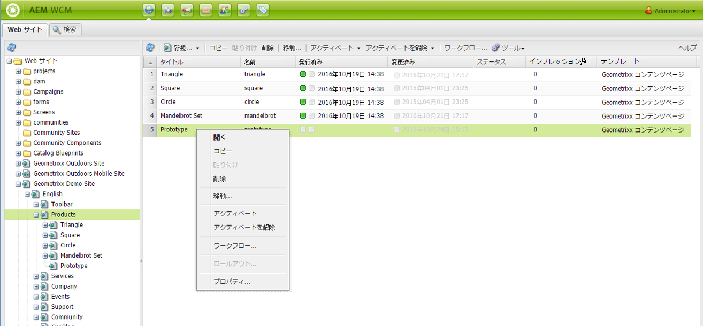
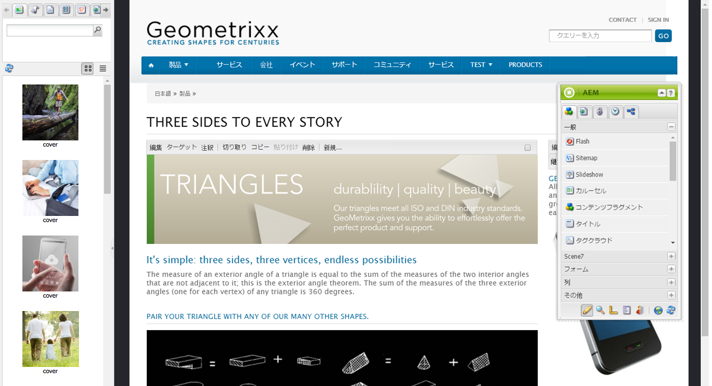
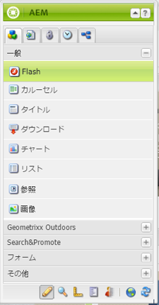
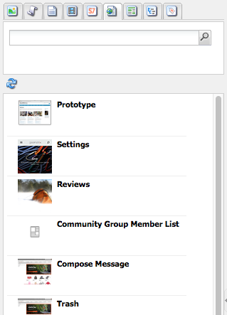
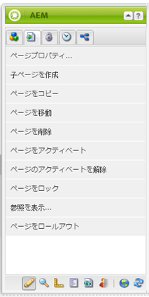
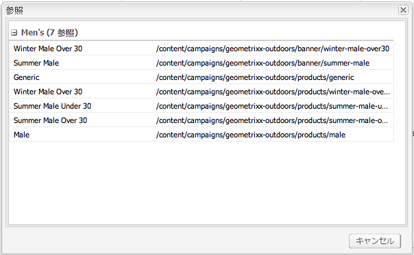
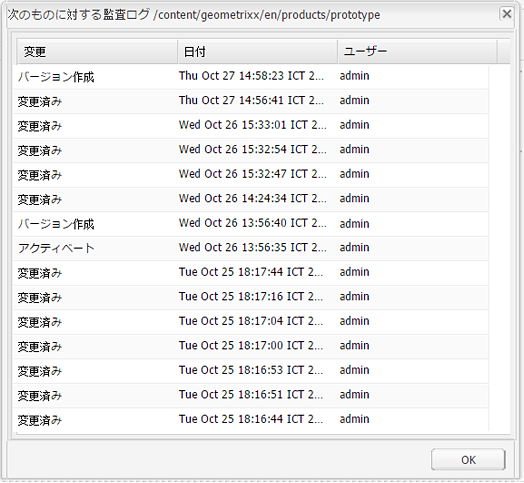

# オーサリング - 環境とツール {#authoring-the-environment-and-tools}

>[!CAUTION]
>
>AEM 6.4 の拡張サポートは終了し、このドキュメントは更新されなくなりました。 詳細は、 [技術サポート期間](https://helpx.adobe.com/jp/support/programs/eol-matrix.html). サポートされているバージョンを見つける [ここ](https://experienceleague.adobe.com/docs/?lang=ja).

AEM のオーサリング環境は、コンテンツを編成および編集するための様々なメカニズムを提供しています. 提供されるツールには、様々なコンソールおよびページエディターからアクセスします。

## サイト管理 {#site-administration}

この **Web サイト** コンソールを使用すると、Web サイトを管理および移動できます。 2 つのパネルを使用して、Web サイトの構造を展開し、必要な要素に対して実行するアクションを指定できます。

## ページコンテンツの編集 {#editing-your-page-content}

クラシック UI には、コンテンツファインダーとサイドキックを利用する個別のページエディターがあります。

`http://localhost:4502/cf#/content/geometrixx/en/products/triangle.html`

## ヘルプへのアクセス {#accessing-help}

各種 **ヘルプ** リソースには、AEM内から直接アクセスできます。

アクセス [コンソールツールバーからのヘルプ](/help/sites-classic-ui-authoring/author-env-basic-handling.md#accessing-help)を使用すると、サイドキックからヘルプにアクセスすることもできます ( アイコン ) を使用して、以下の操作を実行できます。

または、 **ヘルプ** 特定のコンポーネントの編集ダイアログのボタンコンテキスト依存のヘルプが表示されます。

## サイドキック {#sidekick}

この **コンポーネント** サイドキックの「 」タブでは、現在のページに追加できるコンポーネントを参照できます。 必要なグループを展開し、コンポーネントをページ上の必要な場所にドラッグできます。

## コンテンツファインダー {#the-content-finder}

コンテンツファインダーを使用すると、ページ編集時にリポジトリ内のアセットやコンテンツをすばやく簡単に見つけることができます。

コンテンツファインダーを使用して、様々なリソースを検索できます。 必要に応じて、項目をドラッグしてページ上の段落にドロップできます。

* [画像](#finding-images)
* [ドキュメント](#finding-documents)
* [ムービー](#finding-movies)
* [Dynamic Media Browser](/help/sites-administering/scene7.md#scene7contentbrowser)
* [ページ](/help/sites-classic-ui-authoring/classic-page-author-env-tools.md#finding-pages)
* [段落](#referencing-paragraphs-from-other-pages)
* [製品](/help/sites-classic-ui-authoring/classic-page-author-env-tools.md#products)
* または、[リポジトリ構造から web サイトを参照](#the-content-finder)できます

すべてのオプションを使用して、次の操作を実行できます。 [特定の項目を検索](#the-content-finder).

### 画像の検索 {#finding-images}

このタブには、リポジトリ内の画像が一覧表示されます。

ページ上に画像段落を作成した後、項目をドラッグして段落にドロップできます。

### ドキュメントの検索 {#finding-documents}

このタブには、リポジトリ内のドキュメントが一覧表示されます。

ページ上にダウンロード段落を作成したら、項目をドラッグして段落にドロップできます。

### 映画の検索 {#finding-movies}

このタブには、リポジトリ内のムービー (Flash項目など ) が一覧表示されます。

ページ上に適切な段落 (Flashなど ) を作成したら、項目をドラッグして段落にドロップできます。

### 製品 {#products}

このタブには、すべての製品が一覧表示されます。 ページ上に適切な段落（「製品」など）を作成したら、項目をドラッグして段落にドロップできます。

### ページの検索 {#finding-pages}

このタブには、すべてのページが表示されます。任意のページをダブルクリックし、編集用に開きます。

### 他のページから段落を参照する {#referencing-paragraphs-from-other-pages}

このタブでは、別のページを検索できます。 そのページのすべての段落がリスト表示されます。 段落を現在のページにドラッグすると、元の段落への参照が作成されます。

### フルリポジトリ表示の使用 {#using-the-full-repository-view}

このタブには、リポジトリ内のすべてのリソースが表示されます。

### コンテンツブラウザーでの検索の使用 {#using-search-with-the-content-browser}

すべてのオプションで、特定の項目を検索できます。 検索パターンに一致するタグとリソースが一覧表示されます。

検索にワイルドカードを使用することもできます。 次のワイルドカードがサポートされます。

* `*` - 0 文字以上のシーケンスに一致します。

* `?` - 1 文字に一致します。

>[!NOTE]
>
>ワイルドカード検索を実行するには、擬似プロパティの「name」を使用する必要があります。

例えば、という名前の画像がある場合、次のようになります。

`ad-nmvtis.jpg`

以下の検索パターンで、この画像（およびこのパターンに一致するそれ以外の画像）が見つかります。

* `name:*nmv*`
* `name:AD*`  — 文字のマッチングは *not* 大文字と小文字を区別します。
* `name:ad?nm??is.*` :1 つのクエリで任意の数のワイルドカードを使用できます。

>[!NOTE]
>
>[SQL2](https://helpx.adobe.com/experience-manager/6-4/sites/developing/using/reference-materials/javadoc/org/apache/jackrabbit/commons/query/sql2/package-summary.html) 検索を使用することもできます。

## 参照の表示 {#showing-references}

AEMを使用すると、現在作業中のページにリンクされているページを表示できます。

直接ページ参照を表示するには：

1. サイドキックで、 **ページ** タブアイコン

   

1. AEM で「**参照を表示**」を選択すると、参照ウィンドウが開き、選択したページを参照するページとそのパスが表示されます。

   

状況によっては、サイドキックから次のようなアクションを追加で実行できます。

* [ローンチ](/help/sites-classic-ui-authoring/classic-launches.md)
* [ライブコピー](/help/sites-administering/msm.md)

* [ブループリント](/help/sites-administering/msm-best-practices.md)

その他 [ページ間の関係は、Web サイトコンソールで確認できます。](/help/sites-classic-ui-authoring/author-env-basic-handling.md#page-information-on-the-websites-console).

## 監査ログ {#audit-log}

**監査ログ**&#x200B;には、サイドキックの「**情報**」タブからアクセスできます。ここには、現在のページで実行された最近のアクションが一覧表示されます。次に例を示します。

## ページ情報 {#page-information}

Web サイトコンソールには、[ページの現在のステータスに関する情報も表示されます](/help/sites-classic-ui-authoring/author-env-basic-handling.md#page-information-on-the-websites-console)（公開、変更、ロック、ライブコピーなど）。

## ページモード {#page-modes}

クラシック UI でページを編集中に、サイドキックの下部のアイコンを使用して次のモードにアクセスできます。

サイドキックの下部に並ぶ 1 行のアイコンは、ページを操作するモードの切り替えに使用します。

* [編集](/help/sites-classic-ui-authoring/classic-page-author-edit-mode.md)

   これはデフォルトのモードで、ページの編集、コンポーネントの追加や削除、その他の変更をおこなうことができます。

* [プレビュー](/help/sites-classic-ui-authoring/classic-page-author-edit-content.md#previewing-pages)

   このモードでは、ページが Web サイト上で最終的に表示される場合と同じようにプレビューできます。

* [Design](/help/sites-classic-ui-authoring/classic-page-author-design-mode.md#main-pars-procedure-0)

   このモードでは、アクセス可能なコンポーネントを設定して、ページのデザインを編集できます。

>[!NOTE]
>
>それ以外に次のオプションも利用できます。
>
>* [基礎モード](/help/sites-classic-ui-authoring/classic-feature-scaffolding.md)
>* [ClientContext](/help/sites-administering/client-context.md)
>* Web サイト — Web サイトコンソールを開きます。
>* 再読み込み - ページを更新します。

## キーボードショートカット {#keyboard-shortcuts}

様々な[キーボードショートカット](/help/sites-classic-ui-authoring/classic-page-author-keyboard-shortcuts.md)を利用できます。
